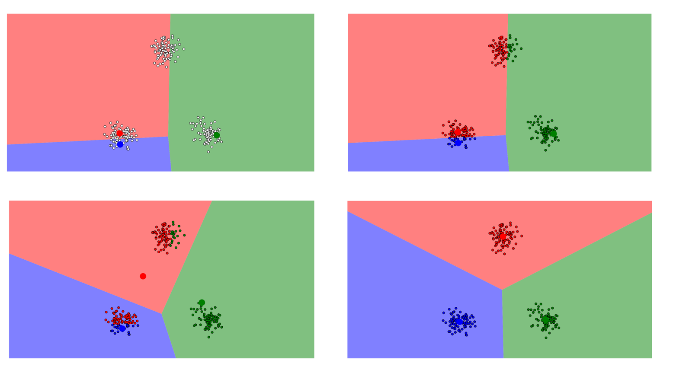
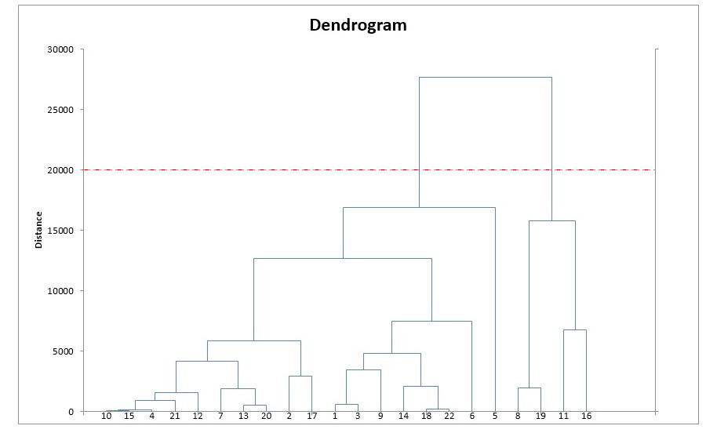
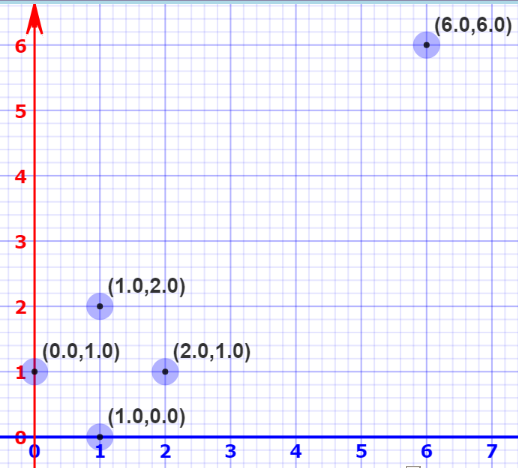
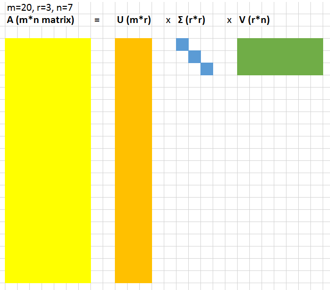
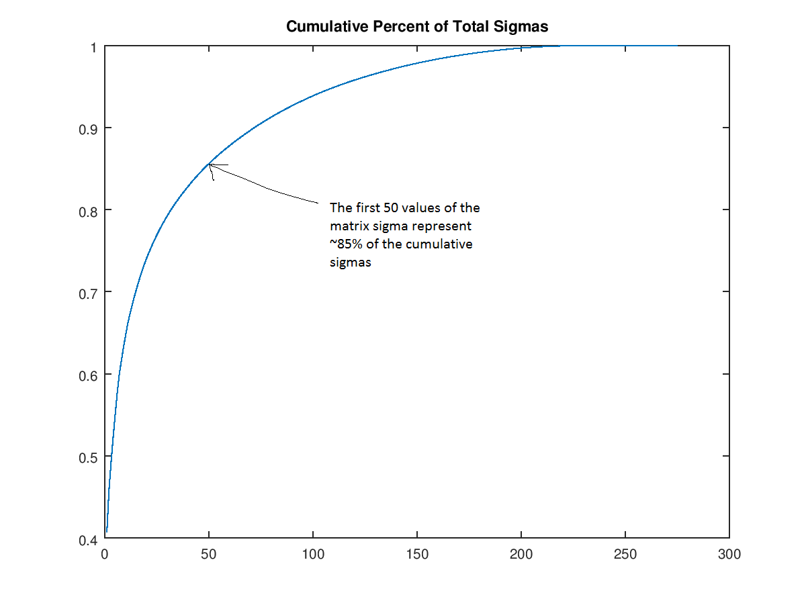
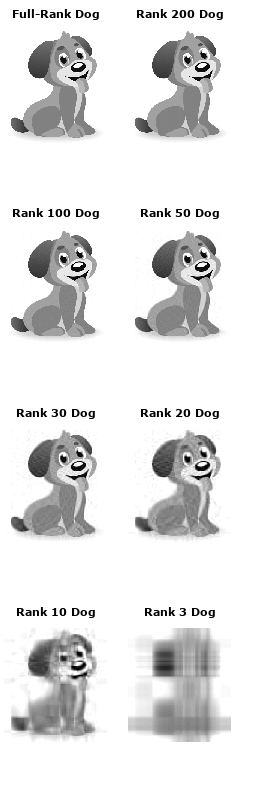

# 三、无监督学习

> 原文：[
Machine_Learning_for_Humans, Part 3: Unsupervised Learning](https://medium.com/machine-learning-for-humans/unsupervised-learning-f45587588294)

> 作者：[Vishal Maini](mailto:ml4humans@gmail.com)

> 译者：[机器之心](https://www.jiqizhixin.com/articles/2017-08-31-2)

> 聚类和降维：K-Means 聚类，层次聚类，主成分分析（PCA），奇异值分解（SVD）。

我们可以怎样发现一个数据集的底层结构？我们可以怎样最有用地对其进行归纳和分组？我们可以怎样以一种压缩格式有效地表征数据？这都是无监督学习的目标，之所以称之为「无监督」，是因为这是从无标签的数据开始学习的。

我们将在这里探索的两种无监督学习任务是：1）将数据按相似度聚类（clustering）成不同的分组；2）降维（reducing dimensionality），以便在保留数据结构和有用性的同时对数据进行压缩。

> 无监督学习方法可能有用的案例：

> *   一家广告平台需要根据相似的人口学特征和购买习惯将美国人口分成不同的小组，以便广告客户可以通过有关联的广告接触到他们的目标客户。

> *   Airbnb 需要将自己的房屋清单分组成不同的社区，以便用户能更轻松地查阅这些清单。

> *   一个数据科学团队需要降低一个大型数据集的维度的数量，以便简化建模和降低文件大小。

和监督学习不同，要找到评价无监督学习算法优劣的指标可并不轻松。「表现水平」往往是主观的，而且因领域不同而各不相同。

## 聚类

聚类的一个有趣的真实应用案例是营销数据提供商 Acxiom 的人生阶段聚类系统 Personicx。这项服务将美国家庭分成了 70 个不同的聚类，它们分属于 21 个人生阶段分组，可以被广告主用于投放定向 Facebook 广告、陈列式广告和直邮广告等。

> Personix 人口学特征聚类的一部分

他们的白皮书表明他们使用了重心聚类（centroid clustering）和主成分分析，这两种技术在这一节都有覆盖。

你可以想象，如果广告主想（1）理解他们已有的客户群，（2）通过相关的人口学特征、兴趣和生活习惯向潜在新客户投放定向广告以便高效利用广告开支，那么这些聚类将对他们非常有用。

> 实际上，你只需要在 Acxiom 的「[我属于哪个聚类？](https://isapps.acxiom.com/personicx/personicx.aspx)」工具中回答几个简单问题，你就能知道你个人属于哪个聚类。

让我们了解几种聚类方法，看看这样的任务是如何完成的。

## K 均值聚类

> 「重心之赛有 k 个魔戒，在那之上，是希望的力量。」

聚类的目标是为数据点分组，使得不同聚类中的数据点是不相似的，同一聚类中的数据点则是类似的。

使用 K 均值聚类，我们希望将我们的数据点聚类为 K 组。K 更大时，创造的分组就更小，就有更多粒度；K 更小时，则分组就更大，粒度更少。

该算法的输出是一组「标签」，这些标签将每个数据点都分配到了 K 组中的一组。在 K 均值聚类中，这些组的定义方式是为每个组创造一个重心（centroid）。这些重心就像是聚类的心脏，它们可以「捕获」离自己最近的点并将其加入到自己的聚类中。

你可以把这些重心看作是派对上成为关注焦点的人，他们就像是有磁性一样。如果只有一个这样的人，每个人都会围绕在他周围；如果有很多这样的人，就会形成很多更小一点的活动中心。

> K 均值聚类的步骤如下：

> 1.  定义 K 个重心。一开始这些重心是随机的（也有一些更加有效的用于初始化重心的算法）

> 2.  寻找最近的重心并且更新聚类分配。将每个数据点都分配给这 K 个聚类中的一个。每个数据点都被分配给离它们最近的重心的聚类。这里的「接近程度」的度量是一个超参数——通常是欧几里得距离（Euclidean distance）。

> 3.  将重心移动到它们的聚类的中心。每个聚类的重心的新位置是通过计算该聚类中所有数据点的平均位置得到的。

重复第 2 和 3 步，直到每次迭代时重心的位置不再显著变化（即直到该算法收敛）。

这就是 K 均值聚类工作方式的精简版！该算法的可视化演示可在[这里](https://www.naftaliharris.com/blog/visualizing-k-means-clustering/)查看，你可以像读漫画一样理解。平面上的每个数据点都根据离自己最近的重心加了颜色。你可以看到这些重心（更大一点的蓝点、红点和绿点）一开始是随机的，然后很快进行了调整，得到了它们各自的聚类。

K 均值聚类的另一个真实应用是分类手写数字。假设我们有用像素亮度的长向量表示的数字的图像。假设这些图像是黑白两色的，大小为`64×64`像素。每个像素代表一个维度。那么这些图像就生活在一个有`64×64=4096`个维度的世界里。在这个 4096 维的世界里，K 均值聚类让我们可以按接近程度对这些图像分组，并且假设这些靠得很近的图像都是同一个数字。这种算法可以在数字识别上得到[相当好的结果](http://ieeexplore.ieee.org/document/6755106/?reload=true)。
## 层次聚类

「让我们把 100 万个选项变成 7 个选项。或者 5 个。或者 20 个？呃，我们可以过会儿决定。」

层次聚类类似于常规的聚类，只是你的目标是构建一个聚类的层次。如果你最终的聚类数量不确定，那这种方法会非常有用。比如说，假设要给 Etsy 或亚马逊等网络市场上的项目分组。在主页上，你只需要少量大组方便导航，但随着你的分类越来越特定，你需要的粒度水平也越来越大，即区别更加明显的项聚类。

在算法的输出方面，除了聚类分配，你也需要构建一个很好的树结构，以帮助你了解这些聚类之间的层次结构。然后你可以从这个树中选择你希望得到的聚类数量。

> 层次聚类的步骤如下：

> 1.  首先从`N`个聚类开始，每个数据点一个聚类。

> 2.  将彼此靠得最近的两个聚类融合为一个。现在你有`N-1`个聚类。

> 3.  重新计算这些聚类之间的距离。有很多可以办到这件事的方法（参见[这个教程](https://home.deib.polimi.it/matteucc/Clustering/tutorial_html/hierarchical.html)了解更多细节）。其中一种方法（平均连接聚类，average-linkage clustering）是将两个聚类之间的距离看作是它们各自元素之间所有距离的平均。

> 4.  重复第 2 和 3 步，直到你得到包含 N 个数据点的一个聚类。你就会得到如下图所示的树（也被称为树状图））。

> 5.  选择一个聚类数量，然后在这个树状图中划一条水平线。比如说，如果你想要`K=2`个聚类，你应该在距离大约为 20000 的位置画一条水平线，你会得到一个包含数据点 8、9、11、16 的聚类和包含其它数据点的另一个聚类。一般而言，你得到的聚类的数量就是水平线与树状图中的竖直线的交叉点的数量。

> 来源：[Solver.com](https://www.solver.com/hierarchical-clustering-example)。更多有关层次聚类的详细信息，可参阅[这个视频](https://www.youtube.com/watch?v=OcoE7JlbXvY)。

### 降维

「对于那些该砍去的非精髓部分的态度，并不是每天增加吸收，而是每日尽量排减。」——李小龙

降维看上去很像压缩。这是为了在尽可能保存相关的结构的同时降低数据的复杂度。如果你有一张简单的`128×128×3`像素的图像（长×宽×RGB 值），那么数据就有 49152 维。如果你可以给这个图像空间降维，同时又不毁掉图像中太多有意义的内容，那么你就很好地执行了降维。

我们将了解两种实际中很常用的降维技术：主成分分析和奇异值分解。

## 主成分分析（PCA）

首先，了解一点线性代数知识——看看空间（space）和基（base）。

你应该知道由原点`O(0,0)`和基向量`i(1,0)`与`j(0,1)`定义的坐标平面。事实上，你也可以选择一个完全不同的基础，其中的数学仍然有效。比如说，你可以保持原点仍然为 O，但选择`i'=(2,1)`和`j'=(1,2)`作为基向量。如果你有耐心计算一下，你会发现在`i', j'`坐标系统中标记为`(2,2)`的点在`i, j`系统标记为`(6, 6)`。

> 使用 Mathisfun 的「[交互式笛卡尔坐标](https://www.mathsisfun.com/data/cartesian-coordinates-interactive.html)」绘制

这意味着我们可以修改空间的基础。现在想象有更高维度的空间，比如有 5 万维。你可以为这个空间选择一个基础，然后根据这个基础仅选择 200 个最重要的向量。这些基向量被称为主成分，而且你可以选择其中一个子集构成一个新空间，它的维度比原来的空间少，但又保留了尽可能多的数据复杂度。

要选择出最重要的主成分，我们需要检查这些数据的方差，并按这个指标给它们排序。

理解 PCA 的另一个思路是 PCA 将我们数据中存在的空间重映射成了一个更加紧凑的空间。这种变换后的维度比原来的维度更小。

仅需使用重映射空间的前几个维度，我们就可以开始理解这个数据集的组织结构。这就是降维的目的：减少复杂度（即这里的维度），同时保留结构（方差）。这里有篇 [Samer 写的论文](http://mou3amalet.com/cargocollective/675_xuesabri-final.pdf)，介绍了使用 PCA（以及扩散映射等技术）试图理解维基解密披露的电报。

## 奇异值分解（SVD）

假设我们将我们的数据表示成一个`A=m×n`的大型矩阵。SVD 让我们可以将这个大型矩阵分解成 3 个较小的矩阵的乘积；这 3 个矩阵分别是`U=m x r`、对角矩阵`Σ=r x r`、`V=r x n`，其中`r`是一个很小的值。

在这个`r×r`的对角矩阵`Σ`中的值被称为奇异值。这些值的奇妙之处是可以被用于压缩原来的矩阵，如果你丢弃奇异值中最小的 20% 以及矩阵`U`和`V`中相关的列，你就可以节省大量空间，同时仍然能很好地表征原来的矩阵。

为了更准确地了解其中的含义，我们来看看一张小狗的图片：

我们将使用 Andrew Gibiansky 写的关于 SVD 的文章中的[代码](http://andrew.gibiansky.com/blog/mathematics/cool-linear-algebra-singular-value-decomposition/)。首先，我们发现如果我们根据大小排序这些奇异值（矩阵`Σ`的值），那么前 50 个奇异值将包含整个矩阵`Σ`的大小的 85％。

根据这个事实，我们可以丢弃后面的 250 个值（即将它们设为 0），仅保留这张小狗图像的「rank（秩）50」版本。这里，我们创建了秩为 200、100、50、30、20、10 和 3 的小狗照片。显然，照片变小了。但假设我们认为秩为 30 的小狗仍然很好，现在让我们看看我们实现了多少压缩。原先的图像矩阵有`305*275 = 83,875`个值，秩为 30 的图像则有`305*30+30+30*275=17,430`个值。值的数量差不多少了 5 倍，但质量却下降很少。上述计算的原因是当我们执行`UΣ'V `运算时，`U`和`V`矩阵中的一部分因为乘 0 也被丢弃（其中`Σ'`是`Σ`的修改后版本，其中仅包含了前面的 30 个值）。

无监督学习常常被用于数据预处理。一般而言，这意味着以某种平均-保留的方式压缩数据，比如 PCA 或 SVD；之后，这些数据可被用于深度神经网络或其它监督式学习算法。

## 请继续！

既然你完成了这一章，你已经得到了一个糟糕的、永远不会再次提及的无监督学习的笑话。这就是：

> Person-in-joke-#1: Y would u ever need to use unsupervised tho?

> Person-in-joke-#2: Y? there’s no Y.

下面是第四章：神经网络和深度学习。

## 实践材料和扩展阅读

### 3a K-Means 聚类

玩一玩这个[聚类的演示](https://www.naftaliharris.com/blog/visualizing-k-means-clustering/)，来构建算法工作原理的直觉。之后，看一看这个[手写数字的 K-Means 聚类](https://github.com/Datamine/MNIST-K-Means-Clustering)的实现，以及相关教程。

### 3b SVD

对于 SVD 的不错的参考，没有东西比 Andrew Gibiansky 的[文章](http://andrew.gibiansky.com/blog/mathematics/cool-linear-algebra-singular-value-decomposition/)更好了。
