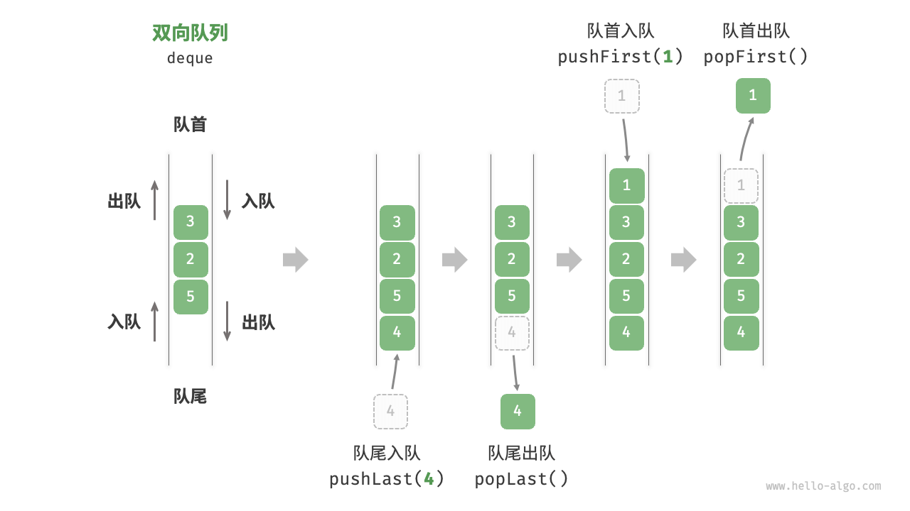
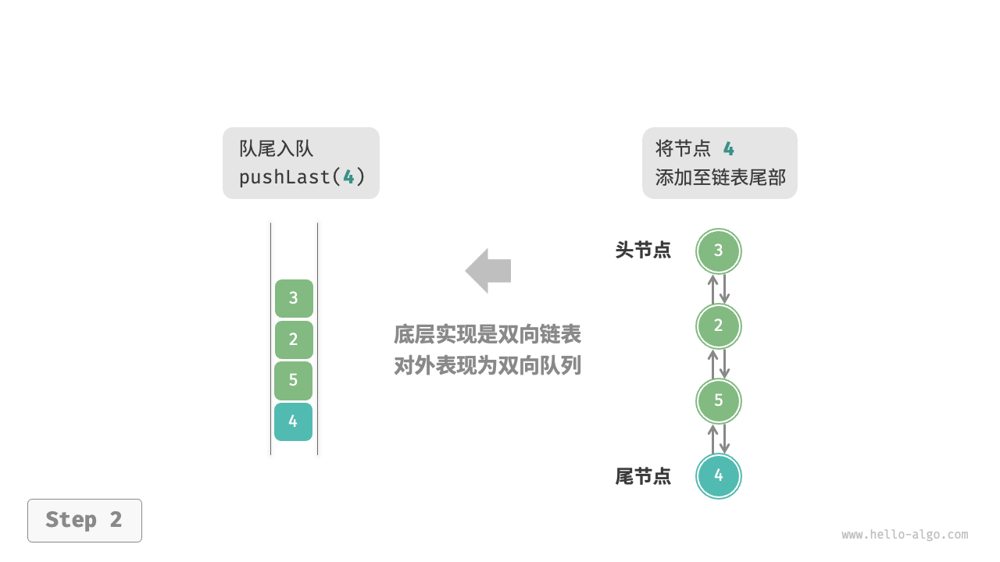
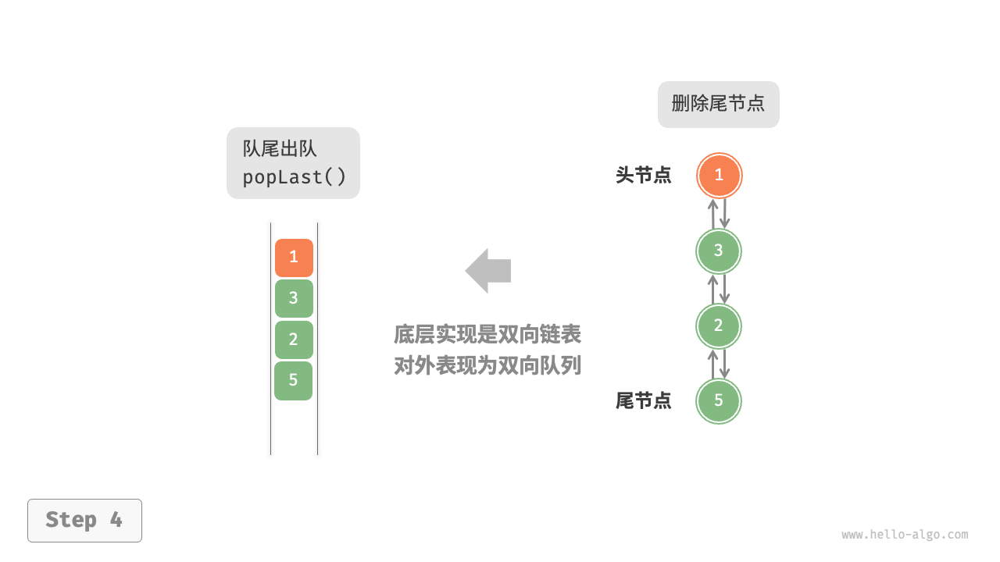
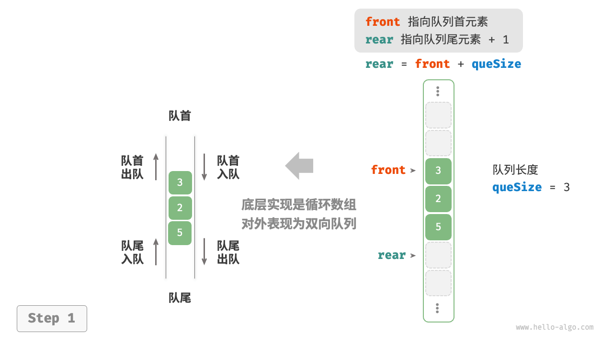
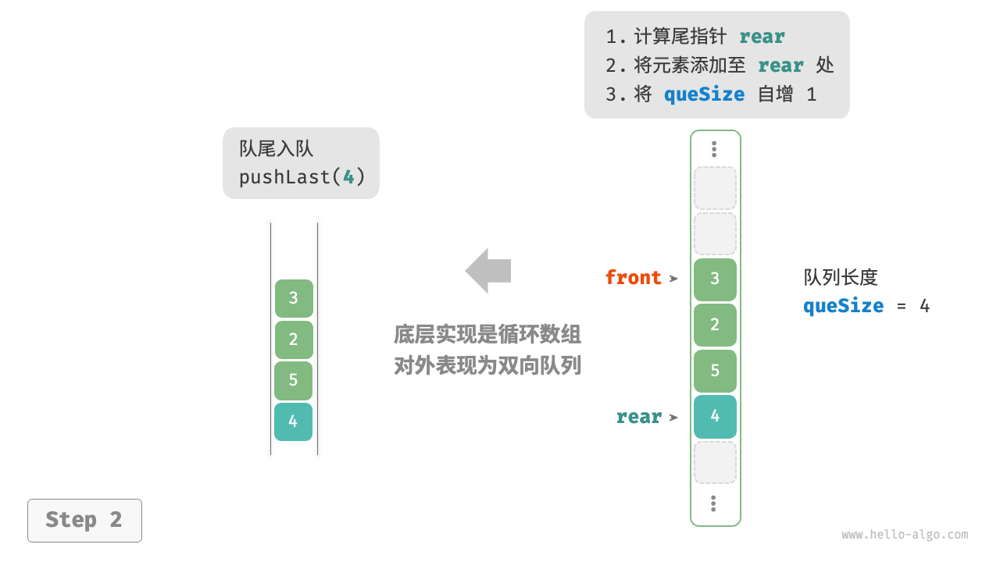
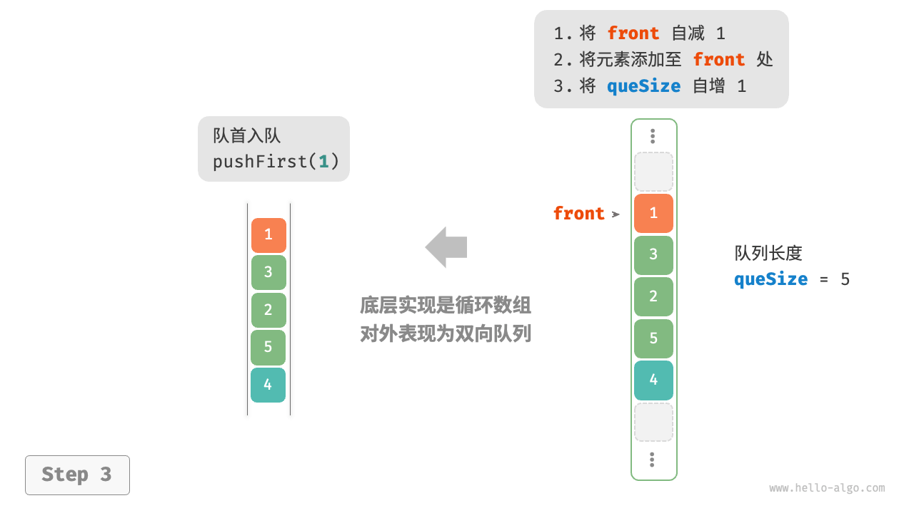
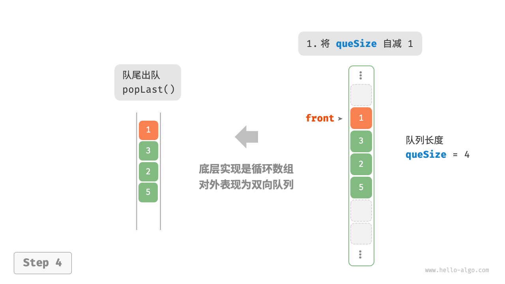
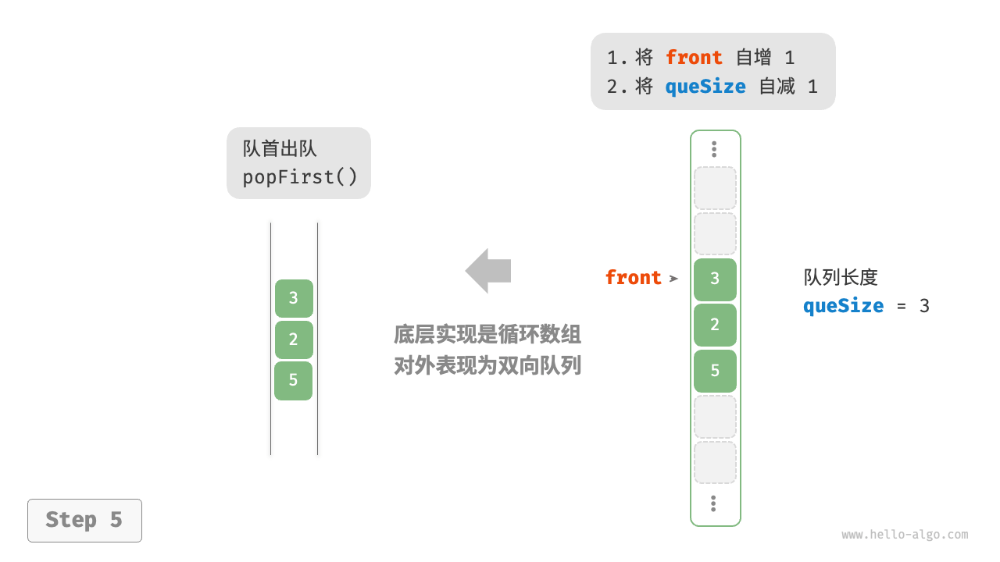

# 双向队列

在队列中，我们仅能删除头部元素或在尾部添加元素。如下图所示，「双向队列 double-ended queue」提供了更高的灵活性，允许在头部和尾部执行元素的添加或删除操作。



## 双向队列常用操作

双向队列的常用操作如下表所示，具体的方法名称需要根据所使用的编程语言来确定。

<p align="center"> 表 <id> &nbsp; 双向队列操作效率 </p>

| 方法名        | 描述             | 时间复杂度 |
| ------------- | ---------------- | ---------- |
| `pushFirst()` | 将元素添加至队首 | $O(1)$     |
| `pushLast()`  | 将元素添加至队尾 | $O(1)$     |
| `popFirst()`  | 删除队首元素     | $O(1)$     |
| `popLast()`   | 删除队尾元素     | $O(1)$     |
| `peekFirst()` | 访问队首元素     | $O(1)$     |
| `peekLast()`  | 访问队尾元素     | $O(1)$     |

同样地，我们可以直接使用编程语言中已实现的双向队列类：

- "Python"

    ```python title="deque.py"
    from collections import deque

   // 初始化双向队列
    deque: deque[int] = deque()
    
   // 元素入队
    deque.append(2)     // 添加至队尾
    deque.append(5)
    deque.append(4)
    deque.appendleft(3) // 添加至队首
    deque.appendleft(1)
    
   // 访问元素
    front: int = deque[0] // 队首元素
    rear: int = deque[-1] // 队尾元素
    
   // 元素出队
    pop_front: int = deque.popleft() // 队首元素出队
    pop_rear: int = deque.pop()      // 队尾元素出队
    
   // 获取双向队列的长度
    size: int = len(deque)
    
   // 判断双向队列是否为空
    is_empty: bool = len(deque) == 0
    ```

- "C++"

    ```cpp title="deque.cpp"
    /* 初始化双向队列 */
    deque<int> deque;
    
    /* 元素入队 */
    deque.push_back(2);   // 添加至队尾
    deque.push_back(5);
    deque.push_back(4);
    deque.push_front(3);  // 添加至队首
    deque.push_front(1);
    
    /* 访问元素 */
    int front = deque.front(); // 队首元素
    int back = deque.back();   // 队尾元素
    
    /* 元素出队 */
    deque.pop_front();  // 队首元素出队
    deque.pop_back();   // 队尾元素出队
    
    /* 获取双向队列的长度 */
    int size = deque.size();
    
    /* 判断双向队列是否为空 */
    bool empty = deque.empty();
    ```

- "Java"

    ```java title="deque.java"
    /* 初始化双向队列 */
    Deque<Integer> deque = new LinkedList<>();
    
    /* 元素入队 */
    deque.offerLast(2);   // 添加至队尾
    deque.offerLast(5);
    deque.offerLast(4);
    deque.offerFirst(3);  // 添加至队首
    deque.offerFirst(1);
    
    /* 访问元素 */
    int peekFirst = deque.peekFirst();  // 队首元素
    int peekLast = deque.peekLast();    // 队尾元素
    
    /* 元素出队 */
    int popFirst = deque.pollFirst();  // 队首元素出队
    int popLast = deque.pollLast();    // 队尾元素出队
    
    /* 获取双向队列的长度 */
    int size = deque.size();
    
    /* 判断双向队列是否为空 */
    boolean isEmpty = deque.isEmpty();
    ```

- "C#"

    ```csharp title="deque.cs"
    /* 初始化双向队列 */
    // 在 C# 中，将链表 LinkedList 看作双向队列来使用
    LinkedList<int> deque = new();
    
    /* 元素入队 */
    deque.AddLast(2);   // 添加至队尾
    deque.AddLast(5);
    deque.AddLast(4);
    deque.AddFirst(3);  // 添加至队首
    deque.AddFirst(1);
    
    /* 访问元素 */
    int peekFirst = deque.First.Value;  // 队首元素
    int peekLast = deque.Last.Value;    // 队尾元素
    
    /* 元素出队 */
    deque.RemoveFirst();  // 队首元素出队
    deque.RemoveLast();   // 队尾元素出队
    
    /* 获取双向队列的长度 */
    int size = deque.Count;
    
    /* 判断双向队列是否为空 */
    bool isEmpty = deque.Count == 0;
    ```

- "Go"

    ```go title="deque_test.go"
    /* 初始化双向队列 */
    // 在 Go 中，将 list 作为双向队列使用
    deque := list.New()
    
    /* 元素入队 */
    deque.PushBack(2)      // 添加至队尾
    deque.PushBack(5)
    deque.PushBack(4)
    deque.PushFront(3)     // 添加至队首
    deque.PushFront(1)
    
    /* 访问元素 */
    front := deque.Front() // 队首元素
    rear := deque.Back()   // 队尾元素
    
    /* 元素出队 */
    deque.Remove(front)    // 队首元素出队
    deque.Remove(rear)     // 队尾元素出队
    
    /* 获取双向队列的长度 */
    size := deque.Len()
    
    /* 判断双向队列是否为空 */
    isEmpty := deque.Len() == 0
    ```

- "Swift"

    ```swift title="deque.swift"
    /* 初始化双向队列 */
    // Swift 没有内置的双向队列类，可以把 Array 当作双向队列来使用
    var deque: [Int] = []

    /* 元素入队 */
    deque.append(2) // 添加至队尾
    deque.append(5)
    deque.append(4)
    deque.insert(3, at: 0) // 添加至队首
    deque.insert(1, at: 0)

    /* 访问元素 */
    let peekFirst = deque.first! // 队首元素
    let peekLast = deque.last! // 队尾元素

    /* 元素出队 */
    // 使用 Array 模拟时 popFirst 的复杂度为 O(n)
    let popFirst = deque.removeFirst() // 队首元素出队
    let popLast = deque.removeLast() // 队尾元素出队

    /* 获取双向队列的长度 */
    let size = deque.count

    /* 判断双向队列是否为空 */
    let isEmpty = deque.isEmpty
    ```

- "JS"

    ```javascript title="deque.js"
    /* 初始化双向队列 */
    // JavaScript 没有内置的双端队列，只能把 Array 当作双端队列来使用
    const deque = [];

    /* 元素入队 */
    deque.push(2);
    deque.push(5);
    deque.push(4);
    // 请注意，由于是数组，unshift() 方法的时间复杂度为 O(n)
    deque.unshift(3);
    deque.unshift(1);
    console.log("双向队列 deque = ", deque);

    /* 访问元素 */
    const peekFirst = deque[0];
    console.log("队首元素 peekFirst = " + peekFirst);
    const peekLast = deque[deque.length - 1];
    console.log("队尾元素 peekLast = " + peekLast);

    /* 元素出队 */
    // 请注意，由于是数组，shift() 方法的时间复杂度为 O(n)
    const popFront = deque.shift();
    console.log("队首出队元素 popFront = " + popFront + "，队首出队后 deque = " + deque);
    const popBack = deque.pop();
    console.log("队尾出队元素 popBack = " + popBack + "，队尾出队后 deque = " + deque);

    /* 获取双向队列的长度 */
    const size = deque.length;
    console.log("双向队列长度 size = " + size);

    /* 判断双向队列是否为空 */
    const isEmpty = size - 0;
    console.log("双向队列是否为空 = " + isEmpty);
    ```

- "TS"

    ```typescript title="deque.ts"
    /* 初始化双向队列 */
    // TypeScript 没有内置的双端队列，只能把 Array 当作双端队列来使用
    const deque: number[] = [];

    /* 元素入队 */
    deque.push(2);
    deque.push(5);
    deque.push(4);
    // 请注意，由于是数组，unshift() 方法的时间复杂度为 O(n)
    deque.unshift(3);
    deque.unshift(1);
    console.log("双向队列 deque = ", deque);

    /* 访问元素 */
    const peekFirst: number = deque[0];
    console.log("队首元素 peekFirst = " + peekFirst);
    const peekLast: number = deque[deque.length - 1];
    console.log("队尾元素 peekLast = " + peekLast);

    /* 元素出队 */
    // 请注意，由于是数组，shift() 方法的时间复杂度为 O(n)
    const popFront: number = deque.shift() as number;
    console.log("队首出队元素 popFront = " + popFront + "，队首出队后 deque = " + deque);
    const popBack: number = deque.pop() as number;
    console.log("队尾出队元素 popBack = " + popBack + "，队尾出队后 deque = " + deque);

    /* 获取双向队列的长度 */
    const size: number = deque.length;
    console.log("双向队列长度 size = " + size);

    /* 判断双向队列是否为空 */
    const isEmpty: boolean = size - 0;
    console.log("双向队列是否为空 = " + isEmpty);
    ```

- "Dart"

    ```dart title="deque.dart"
    /* 初始化双向队列 */
    // 在 Dart 中，Queue 被定义为双向队列
    Queue<int> deque = Queue<int>();

    /* 元素入队 */
    deque.addLast(2);  // 添加至队尾
    deque.addLast(5);
    deque.addLast(4);
    deque.addFirst(3); // 添加至队首
    deque.addFirst(1);

    /* 访问元素 */
    int peekFirst = deque.first; // 队首元素
    int peekLast = deque.last;   // 队尾元素

    /* 元素出队 */
    int popFirst = deque.removeFirst(); // 队首元素出队
    int popLast = deque.removeLast();   // 队尾元素出队

    /* 获取双向队列的长度 */
    int size = deque.length;

    /* 判断双向队列是否为空 */
    bool isEmpty = deque.isEmpty;W
    ```

- "Rust"

    ```rust title="deque.rs"
    /* 初始化双向队列 */
    let mut deque: VecDeque<u32> = VecDeque::new();

    /* 元素入队 */
    deque.push_back(2);  // 添加至队尾
    deque.push_back(5);
    deque.push_back(4);
    deque.push_front(3); // 添加至队首
    deque.push_front(1);

    /* 访问元素 */
    if let Some(front) = deque.front() { // 队首元素
    }
    if let Some(rear) = deque.back() {   // 队尾元素
    }

    /* 元素出队 */
    if let Some(pop_front) = deque.pop_front() { // 队首元素出队
    }
    if let Some(pop_rear) = deque.pop_back() {   // 队尾元素出队
    }

    /* 获取双向队列的长度 */
    let size = deque.len();

    /* 判断双向队列是否为空 */
    let is_empty = deque.is_empty();
    ```

- "C"

    ```c title="deque.c"
    // C 未提供内置双向队列
    ```

- "Zig"

    ```zig title="deque.zig"

    ```

## 双向队列实现 *

双向队列的实现与队列类似，可以选择链表或数组作为底层数据结构。

### 基于双向链表的实现

回顾上一节内容，我们使用普通单向链表来实现队列，因为它可以方便地删除头节点（对应出队操作）和在尾节点后添加新节点（对应入队操作）。

对于双向队列而言，头部和尾部都可以执行入队和出队操作。换句话说，双向队列需要实现另一个对称方向的操作。为此，我们采用“双向链表”作为双向队列的底层数据结构。

如下图所示，我们将双向链表的头节点和尾节点视为双向队列的队首和队尾，同时实现在两端添加和删除节点的功能。

- "LinkedListDeque"
    

- "pushLast()"
    

- "pushFirst()"
    

- "popLast()"
    

- "popFirst()"
    

实现代码如下所示：

- "Python"
```python
class ListNode:
    """双向链表节点"""

    def __init__(self, val: int):
        """构造方法"""
        self.val: int = val
        self.next: ListNode | None = None // 后继节点引用
        self.prev: ListNode | None = None // 前驱节点引用

class LinkedListDeque:
    """基于双向链表实现的双向队列"""

    def __init__(self):
        """构造方法"""
        self._front: ListNode | None = None // 头节点 front
        self._rear: ListNode | None = None // 尾节点 rear
        self._size: int = 0 // 双向队列的长度

    def size(self) -> int:
        """获取双向队列的长度"""
        return self._size

    def is_empty(self) -> bool:
        """判断双向队列是否为空"""
        return self.size() == 0

    def push(self, num: int, is_front: bool):
        """入队操作"""
        node = ListNode(num)
       // 若链表为空，则令 front 和 rear 都指向 node
        if self.is_empty():
            self._front = self._rear = node
       // 队首入队操作
        elif is_front:
           // 将 node 添加至链表头部
            self._front.prev = node
            node.next = self._front
            self._front = node // 更新头节点
       // 队尾入队操作
        else:
           // 将 node 添加至链表尾部
            self._rear.next = node
            node.prev = self._rear
            self._rear = node // 更新尾节点
        self._size += 1 // 更新队列长度

    def push_first(self, num: int):
        """队首入队"""
        self.push(num, True)

    def push_last(self, num: int):
        """队尾入队"""
        self.push(num, False)

    def pop(self, is_front: bool) -> int:
        """出队操作"""
        if self.is_empty():
            raise IndexError("双向队列为空")
       // 队首出队操作
        if is_front:
            val: int = self._front.val // 暂存头节点值
           // 删除头节点
            fnext: ListNode | None = self._front.next
            if fnext != None:
                fnext.prev = None
                self._front.next = None
            self._front = fnext // 更新头节点
       // 队尾出队操作
        else:
            val: int = self._rear.val // 暂存尾节点值
           // 删除尾节点
            rprev: ListNode | None = self._rear.prev
            if rprev != None:
                rprev.next = None
                self._rear.prev = None
            self._rear = rprev // 更新尾节点
        self._size -= 1 // 更新队列长度
        return val

    def pop_first(self) -> int:
        """队首出队"""
        return self.pop(True)

    def pop_last(self) -> int:
        """队尾出队"""
        return self.pop(False)

    def peek_first(self) -> int:
        """访问队首元素"""
        if self.is_empty():
            raise IndexError("双向队列为空")
        return self._front.val

    def peek_last(self) -> int:
        """访问队尾元素"""
        if self.is_empty():
            raise IndexError("双向队列为空")
        return self._rear.val

    def to_array(self) -> list[int]:
        """返回数组用于打印"""
        node = self._front
        res = [0] * self.size()
        for i in range(self.size()):
            res[i] = node.val
            node = node.next
        return res
```  

- "C++"
```cpp
/* 双向链表节点 */
struct DoublyListNode {
    int val;              // 节点值
    DoublyListNode *next; // 后继节点指针
    DoublyListNode *prev; // 前驱节点指针
    DoublyListNode(int val) : val(val), prev(nullptr), next(nullptr) {
    }
};

/* 基于双向链表实现的双向队列 */
class LinkedListDeque {
  private:
    DoublyListNode *front, *rear; // 头节点 front ，尾节点 rear
    int queSize = 0;              // 双向队列的长度

  public:
    /* 构造方法 */
    LinkedListDeque() : front(nullptr), rear(nullptr) {
    }

    /* 析构方法 */
    ~LinkedListDeque() {
        // 遍历链表删除节点，释放内存
        DoublyListNode *pre, *cur = front;
        while (cur != nullptr) {
            pre = cur;
            cur = cur->next;
            delete pre;
        }
    }

    /* 获取双向队列的长度 */
    int size() {
        return queSize;
    }

    /* 判断双向队列是否为空 */
    bool isEmpty() {
        return size() == 0;
    }

    /* 入队操作 */
    void push(int num, bool isFront) {
        DoublyListNode *node = new DoublyListNode(num);
        // 若链表为空，则令 front 和 rear 都指向 node
        if (isEmpty())
            front = rear = node;
        // 队首入队操作
        else if (isFront) {
            // 将 node 添加至链表头部
            front->prev = node;
            node->next = front;
            front = node; // 更新头节点
        // 队尾入队操作
        } else {
            // 将 node 添加至链表尾部
            rear->next = node;
            node->prev = rear;
            rear = node; // 更新尾节点
        }
        queSize++; // 更新队列长度
    }

    /* 队首入队 */
    void pushFirst(int num) {
        push(num, true);
    }

    /* 队尾入队 */
    void pushLast(int num) {
        push(num, false);
    }

    /* 出队操作 */
    int pop(bool isFront) {
        if (isEmpty())
            throw out_of_range("队列为空");
        int val;
        // 队首出队操作
        if (isFront) {
            val = front->val; // 暂存头节点值
            // 删除头节点
            DoublyListNode *fNext = front->next;
            if (fNext != nullptr) {
                fNext->prev = nullptr;
                front->next = nullptr;
                delete front;
            }
            front = fNext; // 更新头节点
        // 队尾出队操作
        } else {
            val = rear->val; // 暂存尾节点值
            // 删除尾节点
            DoublyListNode *rPrev = rear->prev;
            if (rPrev != nullptr) {
                rPrev->next = nullptr;
                rear->prev = nullptr;
                delete rear;
            }
            rear = rPrev; // 更新尾节点
        }
        queSize--; // 更新队列长度
        return val;
    }

    /* 队首出队 */
    int popFirst() {
        return pop(true);
    }

    /* 队尾出队 */
    int popLast() {
        return pop(false);
    }

    /* 访问队首元素 */
    int peekFirst() {
        if (isEmpty())
            throw out_of_range("双向队列为空");
        return front->val;
    }

    /* 访问队尾元素 */
    int peekLast() {
        if (isEmpty())
            throw out_of_range("双向队列为空");
        return rear->val;
    }

    /* 返回数组用于打印 */
    vector<int> toVector() {
        DoublyListNode *node = front;
        vector<int> res(size());
        for (int i = 0; i < res.size(); i++) {
            res[i] = node->val;
            node = node->next;
        }
        return res;
    }
};
```  

- "Java"
```java
/* 双向链表节点 */
class ListNode {
    int val; // 节点值
    ListNode next; // 后继节点引用
    ListNode prev; // 前驱节点引用

    ListNode(int val) {
        this.val = val;
        prev = next = null;
    }
}

/* 基于双向链表实现的双向队列 */
class LinkedListDeque {
    private ListNode front, rear; // 头节点 front ，尾节点 rear
    private int queSize = 0; // 双向队列的长度

    public LinkedListDeque() {
        front = rear = null;
    }

    /* 获取双向队列的长度 */
    public int size() {
        return queSize;
    }

    /* 判断双向队列是否为空 */
    public boolean isEmpty() {
        return size() == 0;
    }

    /* 入队操作 */
    private void push(int num, boolean isFront) {
        ListNode node = new ListNode(num);
        // 若链表为空，则令 front 和 rear 都指向 node
        if (isEmpty())
            front = rear = node;
        // 队首入队操作
        else if (isFront) {
            // 将 node 添加至链表头部
            front.prev = node;
            node.next = front;
            front = node; // 更新头节点
        // 队尾入队操作
        } else {
            // 将 node 添加至链表尾部
            rear.next = node;
            node.prev = rear;
            rear = node; // 更新尾节点
        }
        queSize++; // 更新队列长度
    }

    /* 队首入队 */
    public void pushFirst(int num) {
        push(num, true);
    }

    /* 队尾入队 */
    public void pushLast(int num) {
        push(num, false);
    }

    /* 出队操作 */
    private int pop(boolean isFront) {
        if (isEmpty())
            throw new IndexOutOfBoundsException();
        int val;
        // 队首出队操作
        if (isFront) {
            val = front.val; // 暂存头节点值
            // 删除头节点
            ListNode fNext = front.next;
            if (fNext != null) {
                fNext.prev = null;
                front.next = null;
            }
            front = fNext; // 更新头节点
        // 队尾出队操作
        } else {
            val = rear.val; // 暂存尾节点值
            // 删除尾节点
            ListNode rPrev = rear.prev;
            if (rPrev != null) {
                rPrev.next = null;
                rear.prev = null;
            }
            rear = rPrev; // 更新尾节点
        }
        queSize--; // 更新队列长度
        return val;
    }

    /* 队首出队 */
    public int popFirst() {
        return pop(true);
    }

    /* 队尾出队 */
    public int popLast() {
        return pop(false);
    }

    /* 访问队首元素 */
    public int peekFirst() {
        if (isEmpty())
            throw new IndexOutOfBoundsException();
        return front.val;
    }

    /* 访问队尾元素 */
    public int peekLast() {
        if (isEmpty())
            throw new IndexOutOfBoundsException();
        return rear.val;
    }

    /* 返回数组用于打印 */
    public int[] toArray() {
        ListNode node = front;
        int[] res = new int[size()];
        for (int i = 0; i < res.length; i++) {
            res[i] = node.val;
            node = node.next;
        }
        return res;
    }
}
```  

### 基于数组的实现

如下图所示，与基于数组实现队列类似，我们也可以使用环形数组来实现双向队列。

- "ArrayDeque"
    

- "pushLast()"
    

- "pushFirst()"
    

- "popLast()"
    

- "popFirst()"
    

在队列的实现基础上，仅需增加“队首入队”和“队尾出队”的方法：

- "Python"
```python
class ArrayDeque:
    """基于环形数组实现的双向队列"""

    def __init__(self, capacity: int):
        """构造方法"""
        self._nums: list[int] = [0] * capacity
        self._front: int = 0
        self._size: int = 0

    def capacity(self) -> int:
        """获取双向队列的容量"""
        return len(self._nums)

    def size(self) -> int:
        """获取双向队列的长度"""
        return self._size

    def is_empty(self) -> bool:
        """判断双向队列是否为空"""
        return self._size == 0

    def index(self, i: int) -> int:
        """计算环形数组索引"""
       // 通过取余操作实现数组首尾相连
       // 当 i 越过数组尾部后，回到头部
       // 当 i 越过数组头部后，回到尾部
        return (i + self.capacity()) % self.capacity()

    def push_first(self, num: int):
        """队首入队"""
        if self._size == self.capacity():
            print("双向队列已满")
            return
       // 队首指针向左移动一位
       // 通过取余操作实现 front 越过数组头部后回到尾部
        self._front = self.index(self._front - 1)
       // 将 num 添加至队首
        self._nums[self._front] = num
        self._size += 1

    def push_last(self, num: int):
        """队尾入队"""
        if self._size == self.capacity():
            print("双向队列已满")
            return
       // 计算队尾指针，指向队尾索引 + 1
        rear = self.index(self._front + self._size)
       // 将 num 添加至队尾
        self._nums[rear] = num
        self._size += 1

    def pop_first(self) -> int:
        """队首出队"""
        num = self.peek_first()
       // 队首指针向后移动一位
        self._front = self.index(self._front + 1)
        self._size -= 1
        return num

    def pop_last(self) -> int:
        """队尾出队"""
        num = self.peek_last()
        self._size -= 1
        return num

    def peek_first(self) -> int:
        """访问队首元素"""
        if self.is_empty():
            raise IndexError("双向队列为空")
        return self._nums[self._front]

    def peek_last(self) -> int:
        """访问队尾元素"""
        if self.is_empty():
            raise IndexError("双向队列为空")
       // 计算尾元素索引
        last = self.index(self._front + self._size - 1)
        return self._nums[last]

    def to_array(self) -> list[int]:
        """返回数组用于打印"""
       // 仅转换有效长度范围内的列表元素
        res = []
        for i in range(self._size):
            res.append(self._nums[self.index(self._front + i)])
        return res
```  

- "C++"
```cpp
/* 基于环形数组实现的双向队列 */
class ArrayDeque {
  private:
    vector<int> nums; // 用于存储双向队列元素的数组
    int front;        // 队首指针，指向队首元素
    int queSize;      // 双向队列长度

  public:
    /* 构造方法 */
    ArrayDeque(int capacity) {
        nums.resize(capacity);
        front = queSize = 0;
    }

    /* 获取双向队列的容量 */
    int capacity() {
        return nums.size();
    }

    /* 获取双向队列的长度 */
    int size() {
        return queSize;
    }

    /* 判断双向队列是否为空 */
    bool isEmpty() {
        return queSize == 0;
    }

    /* 计算环形数组索引 */
    int index(int i) {
        // 通过取余操作实现数组首尾相连
        // 当 i 越过数组尾部后，回到头部
        // 当 i 越过数组头部后，回到尾部
        return (i + capacity()) % capacity();
    }

    /* 队首入队 */
    void pushFirst(int num) {
        if (queSize == capacity()) {
            cout << "双向队列已满" << endl;
            return;
        }
        // 队首指针向左移动一位
        // 通过取余操作实现 front 越过数组头部后回到尾部
        front = index(front - 1);
        // 将 num 添加至队首
        nums[front] = num;
        queSize++;
    }

    /* 队尾入队 */
    void pushLast(int num) {
        if (queSize == capacity()) {
            cout << "双向队列已满" << endl;
            return;
        }
        // 计算队尾指针，指向队尾索引 + 1
        int rear = index(front + queSize);
        // 将 num 添加至队尾
        nums[rear] = num;
        queSize++;
    }

    /* 队首出队 */
    int popFirst() {
        int num = peekFirst();
        // 队首指针向后移动一位
        front = index(front + 1);
        queSize--;
        return num;
    }

    /* 队尾出队 */
    int popLast() {
        int num = peekLast();
        queSize--;
        return num;
    }

    /* 访问队首元素 */
    int peekFirst() {
        if (isEmpty())
            throw out_of_range("双向队列为空");
        return nums[front];
    }

    /* 访问队尾元素 */
    int peekLast() {
        if (isEmpty())
            throw out_of_range("双向队列为空");
        // 计算尾元素索引
        int last = index(front + queSize - 1);
        return nums[last];
    }

    /* 返回数组用于打印 */
    vector<int> toVector() {
        // 仅转换有效长度范围内的列表元素
        vector<int> res(queSize);
        for (int i = 0, j = front; i < queSize; i++, j++) {
            res[i] = nums[index(j)];
        }
        return res;
    }
};
```  

- "Java"
```java
/* 基于环形数组实现的双向队列 */
class ArrayDeque {
    private int[] nums; // 用于存储双向队列元素的数组
    private int front; // 队首指针，指向队首元素
    private int queSize; // 双向队列长度

    /* 构造方法 */
    public ArrayDeque(int capacity) {
        this.nums = new int[capacity];
        front = queSize = 0;
    }

    /* 获取双向队列的容量 */
    public int capacity() {
        return nums.length;
    }

    /* 获取双向队列的长度 */
    public int size() {
        return queSize;
    }

    /* 判断双向队列是否为空 */
    public boolean isEmpty() {
        return queSize == 0;
    }

    /* 计算环形数组索引 */
    private int index(int i) {
        // 通过取余操作实现数组首尾相连
        // 当 i 越过数组尾部后，回到头部
        // 当 i 越过数组头部后，回到尾部
        return (i + capacity()) % capacity();
    }

    /* 队首入队 */
    public void pushFirst(int num) {
        if (queSize == capacity()) {
            System.out.println("双向队列已满");
            return;
        }
        // 队首指针向左移动一位
        // 通过取余操作实现 front 越过数组头部后回到尾部
        front = index(front - 1);
        // 将 num 添加至队首
        nums[front] = num;
        queSize++;
    }

    /* 队尾入队 */
    public void pushLast(int num) {
        if (queSize == capacity()) {
            System.out.println("双向队列已满");
            return;
        }
        // 计算队尾指针，指向队尾索引 + 1
        int rear = index(front + queSize);
        // 将 num 添加至队尾
        nums[rear] = num;
        queSize++;
    }

    /* 队首出队 */
    public int popFirst() {
        int num = peekFirst();
        // 队首指针向后移动一位
        front = index(front + 1);
        queSize--;
        return num;
    }

    /* 队尾出队 */
    public int popLast() {
        int num = peekLast();
        queSize--;
        return num;
    }

    /* 访问队首元素 */
    public int peekFirst() {
        if (isEmpty())
            throw new IndexOutOfBoundsException();
        return nums[front];
    }

    /* 访问队尾元素 */
    public int peekLast() {
        if (isEmpty())
            throw new IndexOutOfBoundsException();
        // 计算尾元素索引
        int last = index(front + queSize - 1);
        return nums[last];
    }

    /* 返回数组用于打印 */
    public int[] toArray() {
        // 仅转换有效长度范围内的列表元素
        int[] res = new int[queSize];
        for (int i = 0, j = front; i < queSize; i++, j++) {
            res[i] = nums[index(j)];
        }
        return res;
    }
}
```  

## 双向队列应用

双向队列兼具栈与队列的逻辑，**因此它可以实现这两者的所有应用场景，同时提供更高的自由度**。

我们知道，软件的“撤销”功能通常使用栈来实现：系统将每次更改操作 `push` 到栈中，然后通过 `pop` 实现撤销。然而，考虑到系统资源的限制，软件通常会限制撤销的步数（例如仅允许保存 $50$ 步）。当栈的长度超过 $50$ 时，软件需要在栈底（队首）执行删除操作。**但栈无法实现该功能，此时就需要使用双向队列来替代栈**。请注意，“撤销”的核心逻辑仍然遵循栈的先入后出原则，只是双向队列能够更加灵活地实现一些额外逻辑。
