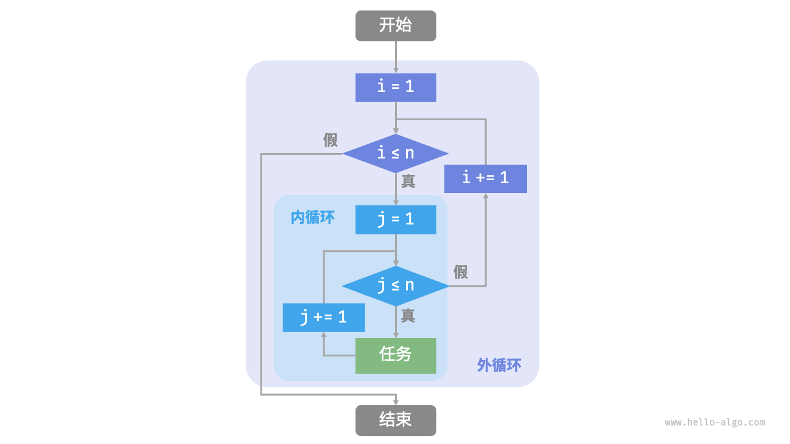
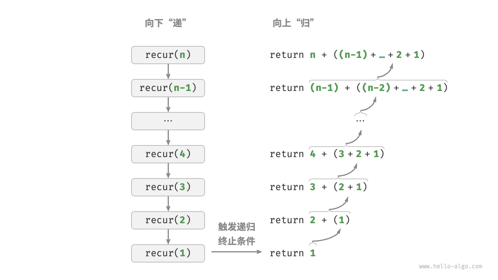

# 迭代与递归

在算法中，重复执行某个任务是很常见的，它与复杂度分析息息相关。因此，在介绍时间复杂度和空间复杂度之前，我们先来了解如何在程序中实现重复执行任务，即两种基本的程序控制结构：迭代、递归。

## 迭代

「迭代 iteration」是一种重复执行某个任务的控制结构。在迭代中，程序会在满足一定的条件下重复执行某段代码，直到这个条件不再满足。

### for 循环

`for` 循环是最常见的迭代形式之一，**适合在预先知道迭代次数时使用**。

以下函数基于 `for` 循环实现了求和 $1 + 2 + \dots + n$ ，求和结果使用变量 `res` 记录。需要注意的是，Python 中 `range(a, b)` 对应的区间是“左闭右开”的，对应的遍历范围为 $a, a + 1, \dots, b-1$ ：

- "Python"
```python
def for_loop(n: int) -> int:
    """for 循环"""
    res = 0
    # 循环求和 1, 2, ..., n-1, n
    for i in range(1, n + 1):
        res += i
    return res
```  

- "C++"
```cpp
/* for 循环 */
int forLoop(int n) {
    int res = 0;
    // 循环求和 1, 2, ..., n-1, n
    for (int i = 1; i <= n; ++i) {
        res += i;
    }
    return res;
}
```  

- "Java"
```java
/* for 循环 */
int forLoop(int n) {
    int res = 0;
    // 循环求和 1, 2, ..., n-1, n
    for (int i = 1; i <= n; i++) {
        res += i;
    }
    return res;
}
```  

下图是该求和函数的流程框图。


此求和函数的操作数量与输入数据大小 $n$ 成正比，或者说成“线性关系”。实际上，**时间复杂度描述的就是这个“线性关系”**。相关内容将会在下一节中详细介绍。

### while 循环

与 `for` 循环类似，`while` 循环也是一种实现迭代的方法。在 `while` 循环中，程序每轮都会先检查条件，如果条件为真，则继续执行，否则就结束循环。

下面我们用 `while` 循环来实现求和 $1 + 2 + \dots + n$ ：

- "Python"
```python
def while_loop(n: int) -> int:
    """while 循环"""
    res = 0
    i = 1  # 初始化条件变量
    # 循环求和 1, 2, ..., n-1, n
    while i <= n:
        res += i
        i += 1  # 更新条件变量
    return res
```  

- "C++"
```cpp
/* while 循环 */
int whileLoop(int n) {
    int res = 0;
    int i = 1; // 初始化条件变量
    // 循环求和 1, 2, ..., n-1, n
    while (i <= n) {
        res += i;
        i++; // 更新条件变量
    }
    return res;
}
```  

- "Java"
```java
/* while 循环 */
int whileLoop(int n) {
    int res = 0;
    int i = 1; // 初始化条件变量
    // 循环求和 1, 2, ..., n-1, n
    while (i <= n) {
        res += i;
        i++; // 更新条件变量
    }
    return res;
}
```  

**`while` 循环比 `for` 循环的自由度更高**。在 `while` 循环中，我们可以自由地设计条件变量的初始化和更新步骤。

例如在以下代码中，条件变量 $i$ 每轮进行两次更新，这种情况就不太方便用 `for` 循环实现：

- "Python"
```python
def while_loop_ii(n: int) -> int:
    """while 循环（两次更新）"""
    res = 0
    i = 1  # 初始化条件变量
    # 循环求和 1, 4, 10, ...
    while i <= n:
        res += i
        # 更新条件变量
        i += 1
        i *= 2
    return res
```  

- "C++"
```cpp
/* while 循环（两次更新） */
int whileLoopII(int n) {
    int res = 0;
    int i = 1; // 初始化条件变量
    // 循环求和 1, 4, 10, ...
    while (i <= n) {
        res += i;
        // 更新条件变量
        i++;
        i *= 2;
    }
    return res;
}
```  

- "Java"
```java
/* while 循环（两次更新） */
int whileLoopII(int n) {
    int res = 0;
    int i = 1; // 初始化条件变量
    // 循环求和 1, 4, 10, ...
    while (i <= n) {
        res += i;
        // 更新条件变量
        i++;
        i *= 2;
    }
    return res;
}
```  

总的来说，**`for` 循环的代码更加紧凑，`while` 循环更加灵活**，两者都可以实现迭代结构。选择使用哪一个应该根据特定问题的需求来决定。

### 嵌套循环

我们可以在一个循环结构内嵌套另一个循环结构，下面以 `for` 循环为例：

- "Python"
```python
def nested_for_loop(n: int) -> str:
    """双层 for 循环"""
    res = ""
    # 循环 i = 1, 2, ..., n-1, n
    for i in range(1, n + 1):
        # 循环 j = 1, 2, ..., n-1, n
        for j in range(1, n + 1):
            res += f"({i}, {j}), "
    return res
```  

- "C++"
```cpp
/* 双层 for 循环 */
string nestedForLoop(int n) {
    ostringstream res;
    // 循环 i = 1, 2, ..., n-1, n
    for (int i = 1; i <= n; ++i) {
        // 循环 j = 1, 2, ..., n-1, n
        for (int j = 1; j <= n; ++j) {
            res << "(" << i << ", " << j << "), ";
        }
    }
    return res.str();
}
```  

- "Java"
```java
/* 双层 for 循环 */
String nestedForLoop(int n) {
    StringBuilder res = new StringBuilder();
    // 循环 i = 1, 2, ..., n-1, n
    for (int i = 1; i <= n; i++) {
        // 循环 j = 1, 2, ..., n-1, n
        for (int j = 1; j <= n; j++) {
            res.append("(" + i + ", " + j + "), ");
        }
    }
    return res.toString();
}
```  


下图是该嵌套循环的流程框图。



在这种情况下，函数的操作数量与 $n^2$ 成正比，或者说算法运行时间和输入数据大小 $n$ 成“平方关系”。

我们可以继续添加嵌套循环，每一次嵌套都是一次“升维”，将会使时间复杂度提高至“立方关系”“四次方关系”，以此类推。

## 递归

 「递归 recursion」是一种算法策略，通过函数调用自身来解决问题。它主要包含两个阶段。

1. **递**：程序不断深入地调用自身，通常传入更小或更简化的参数，直到达到“终止条件”。
2. **归**：触发“终止条件”后，程序从最深层的递归函数开始逐层返回，汇聚每一层的结果。

而从实现的角度看，递归代码主要包含三个要素。

1. **终止条件**：用于决定什么时候由“递”转“归”。
2. **递归调用**：对应“递”，函数调用自身，通常输入更小或更简化的参数。
3. **返回结果**：对应“归”，将当前递归层级的结果返回至上一层。

观察以下代码，我们只需调用函数 `recur(n)`  ，就可以完成 $1 + 2 + \dots + n$ 的计算：

- "Python"
```python
def recur(n: int) -> int:
    """递归"""
    # 终止条件
    if n == 1:
        return 1
    # 递：递归调用
    res = recur(n - 1)
    # 归：返回结果
    return n + res
```  

- "C++"
```cpp
/* 递归 */
int recur(int n) {
    // 终止条件
    if (n == 1)
        return 1;
    // 递：递归调用
    int res = recur(n - 1);
    // 归：返回结果
    return n + res;
}
```  

- "Java"
```java
/* 递归 */
int recur(int n) {
    // 终止条件
    if (n == 1)
        return 1;
    // 递：递归调用
    int res = recur(n - 1);
    // 归：返回结果
    return n + res;
}
```  

下图展示了该函数的递归过程。



虽然从计算角度看，迭代与递归可以得到相同的结果，**但它们代表了两种完全不同的思考和解决问题的范式**。

- **迭代**：“自下而上”地解决问题。从最基础的步骤开始，然后不断重复或累加这些步骤，直到任务完成。
- **递归**：“自上而下”地解决问题。将原问题分解为更小的子问题，这些子问题和原问题具有相同的形式。接下来将子问题继续分解为更小的子问题，直到基本情况时停止（基本情况的解是已知的）。

以上述求和函数为例，设问题 $f(n) = 1 + 2 + \dots + n$ 。

- **迭代**：在循环中模拟求和过程，从 $1$ 遍历到 $n$ ，每轮执行求和操作，即可求得 $f(n)$ 。
- **递归**：将问题分解为子问题 $f(n) = n + f(n-1)$ ，不断（递归地）分解下去，直至基本情况 $f(1) = 1$ 时终止。

### 调用栈

递归函数每次调用自身时，系统都会为新开启的函数分配内存，以存储局部变量、调用地址和其他信息等。这将导致两方面的结果。

- 函数的上下文数据都存储在称为“栈帧空间”的内存区域中，直至函数返回后才会被释放。因此，**递归通常比迭代更加耗费内存空间**。
- 递归调用函数会产生额外的开销。**因此递归通常比循环的时间效率更低**。

如下图所示，在触发终止条件前，同时存在 $n$ 个未返回的递归函数，**递归深度为 $n$** 。


在实际中，编程语言允许的递归深度通常是有限的，过深的递归可能导致栈溢出错误。

### 尾递归

有趣的是，**如果函数在返回前的最后一步才进行递归调用**，则该函数可以被编译器或解释器优化，使其在空间效率上与迭代相当。这种情况被称为「尾递归 tail recursion」。

- **普通递归**：当函数返回到上一层级的函数后，需要继续执行代码，因此系统需要保存上一层调用的上下文。
- **尾递归**：递归调用是函数返回前的最后一个操作，这意味着函数返回到上一层级后，无须继续执行其他操作，因此系统无须保存上一层函数的上下文。

以计算 $1 + 2 + \dots + n$ 为例，我们可以将结果变量 `res` 设为函数参数，从而实现尾递归：

- "Python"
```python
def tail_recur(n, res):
    """尾递归"""
    # 终止条件
    if n == 0:
        return res
    # 尾递归调用
    return tail_recur(n - 1, res + n)
```  

- "C++"
```cpp
/* 尾递归 */
int tailRecur(int n, int res) {
    // 终止条件
    if (n == 0)
        return res;
    // 尾递归调用
    return tailRecur(n - 1, res + n);
}
```  

- "Java"
```java
/* 尾递归 */
int tailRecur(int n, int res) {
    // 终止条件
    if (n == 0)
        return res;
    // 尾递归调用
    return tailRecur(n - 1, res + n);
}
```  

尾递归的执行过程如下图所示。对比普通递归和尾递归，两者的求和操作的执行点是不同的。

- **普通递归**：求和操作是在“归”的过程中执行的，每层返回后都要再执行一次求和操作。
- **尾递归**：求和操作是在“递”的过程中执行的，“归”的过程只需层层返回。


!!! tip

    请注意，许多编译器或解释器并不支持尾递归优化。例如，Python 默认不支持尾递归优化，因此即使函数是尾递归形式，仍然可能会遇到栈溢出问题。

### 递归树

当处理与“分治”相关的算法问题时，递归往往比迭代的思路更加直观、代码更加易读。以“斐波那契数列”为例。

!!! question

    给定一个斐波那契数列 $0, 1, 1, 2, 3, 5, 8, 13, \dots$ ，求该数列的第 $n$ 个数字。

设斐波那契数列的第 $n$ 个数字为 $f(n)$ ，易得两个结论。

- 数列的前两个数字为 $f(1) = 0$ 和 $f(2) = 1$ 。
- 数列中的每个数字是前两个数字的和，即 $f(n) = f(n - 1) + f(n - 2)$ 。

按照递推关系进行递归调用，将前两个数字作为终止条件，便可写出递归代码。调用 `fib(n)` 即可得到斐波那契数列的第 $n$ 个数字：

- "Python"
```python
def fib(n: int) -> int:
    """斐波那契数列：递归"""
    # 终止条件 f(1) = 0, f(2) = 1
    if n == 1 or n == 2:
        return n - 1
    # 递归调用 f(n) = f(n-1) + f(n-2)
    res = fib(n - 1) + fib(n - 2)
    # 返回结果 f(n)
    return res
```  

- "C++"
```cpp
/* 斐波那契数列：递归 */
int fib(int n) {
    // 终止条件 f(1) = 0, f(2) = 1
    if (n == 1 || n == 2)
        return n - 1;
    // 递归调用 f(n) = f(n-1) + f(n-2)
    int res = fib(n - 1) + fib(n - 2);
    // 返回结果 f(n)
    return res;
}
```  

- "Java"
```java
/* 斐波那契数列：递归 */
int fib(int n) {
    // 终止条件 f(1) = 0, f(2) = 1
    if (n == 1 || n == 2)
        return n - 1;
    // 递归调用 f(n) = f(n-1) + f(n-2)
    int res = fib(n - 1) + fib(n - 2);
    // 返回结果 f(n)
    return res;
}
```  

观察以上代码，我们在函数内递归调用了两个函数，**这意味着从一个调用产生了两个调用分支**。如下图所示，这样不断递归调用下去，最终将产生一棵层数为 $n$ 的「递归树 recursion tree」。


从本质上看，递归体现了“将问题分解为更小子问题”的思维范式，这种分治策略至关重要。

- 从算法角度看，搜索、排序、回溯、分治、动态规划等许多重要算法策略直接或间接地应用了这种思维方式。
- 从数据结构角度看，递归天然适合处理链表、树和图的相关问题，因为它们非常适合用分治思想进行分析。

## 两者对比

总结以上内容，如下表所示，迭代和递归在实现、性能和适用性上有所不同。

<p align="center"> 表 <id> &nbsp; 迭代与递归特点对比 </p>

|          | 迭代                                   | 递归                                                         |
| -------- | -------------------------------------- | ------------------------------------------------------------ |
| 实现方式 | 循环结构                               | 函数调用自身                                                 |
| 时间效率 | 效率通常较高，无函数调用开销           | 每次函数调用都会产生开销                                     |
| 内存使用 | 通常使用固定大小的内存空间             | 累积函数调用可能使用大量的栈帧空间                           |
| 适用问题 | 适用于简单循环任务，代码直观、可读性好 | 适用于子问题分解，如树、图、分治、回溯等，代码结构简洁、清晰 |

!!! tip

    如果感觉以下内容理解困难，可以在读完“栈”章节后再来复习。

那么，迭代和递归具有什么内在联系呢？以上述递归函数为例，求和操作在递归的“归”阶段进行。这意味着最初被调用的函数实际上是最后完成其求和操作的，**这种工作机制与栈的“先入后出”原则异曲同工**。

事实上，“调用栈”和“栈帧空间”这类递归术语已经暗示了递归与栈之间的密切关系。

1. **递**：当函数被调用时，系统会在“调用栈”上为该函数分配新的栈帧，用于存储函数的局部变量、参数、返回地址等数据。
2. **归**：当函数完成执行并返回时，对应的栈帧会被从“调用栈”上移除，恢复之前函数的执行环境。

因此，**我们可以使用一个显式的栈来模拟调用栈的行为**，从而将递归转化为迭代形式：

- "Python"
```python
def for_loop_recur(n: int) -> int:
    """使用迭代模拟递归"""
    # 使用一个显式的栈来模拟系统调用栈
    stack = []
    res = 0
    # 递：递归调用
    for i in range(n, 0, -1):
        # 通过“入栈操作”模拟“递”
        stack.append(i)
    # 归：返回结果
    while stack:
        # 通过“出栈操作”模拟“归”
        res += stack.pop()
    # res = 1+2+3+...+n
    return res
```  

- "C++"
```cpp
/* 使用迭代模拟递归 */
int forLoopRecur(int n) {
    // 使用一个显式的栈来模拟系统调用栈
    stack<int> stack;
    int res = 0;
    // 递：递归调用
    for (int i = n; i > 0; i--) {
        // 通过“入栈操作”模拟“递”
        stack.push(i);
    }
    // 归：返回结果
    while (!stack.empty()) {
        // 通过“出栈操作”模拟“归”
        res += stack.top();
        stack.pop();
    }
    // res = 1+2+3+...+n
    return res;
}
```  

- "Java"
```java
/* 使用迭代模拟递归 */
int forLoopRecur(int n) {
    // 使用一个显式的栈来模拟系统调用栈
    Stack<Integer> stack = new Stack<>();
    int res = 0;
    // 递：递归调用
    for (int i = n; i > 0; i--) {
        // 通过“入栈操作”模拟“递”
        stack.push(i);
    }
    // 归：返回结果
    while (!stack.isEmpty()) {
        // 通过“出栈操作”模拟“归”
        res += stack.pop();
    }
    // res = 1+2+3+...+n
    return res;
}
```  

观察以上代码，当递归转化为迭代后，代码变得更加复杂了。尽管迭代和递归在很多情况下可以互相转化，但不一定值得这样做，有以下两点原因。

- 转化后的代码可能更加难以理解，可读性更差。
- 对于某些复杂问题，模拟系统调用栈的行为可能非常困难。

总之，**选择迭代还是递归取决于特定问题的性质**。在编程实践中，权衡两者的优劣并根据情境选择合适的方法至关重要。
