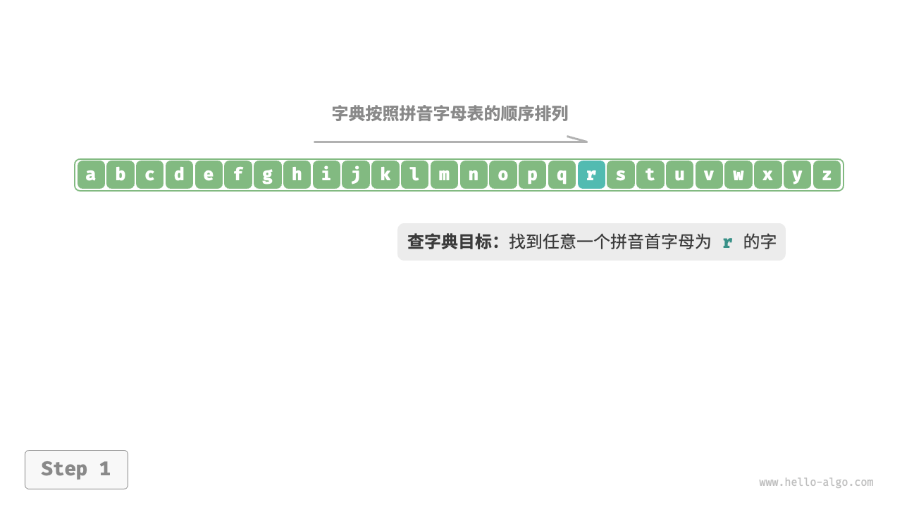
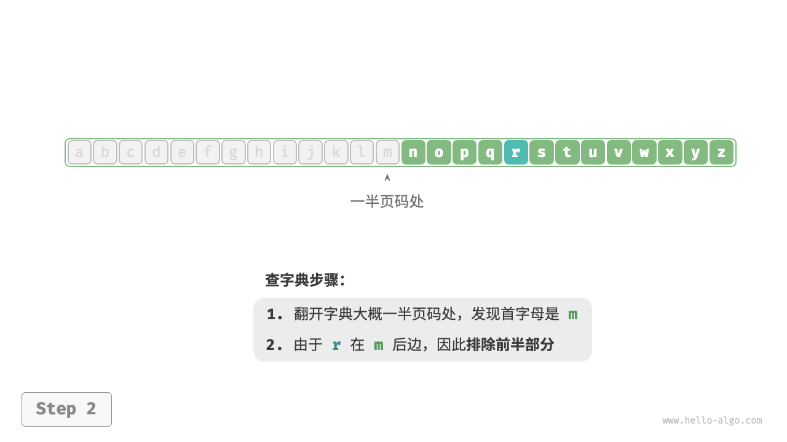
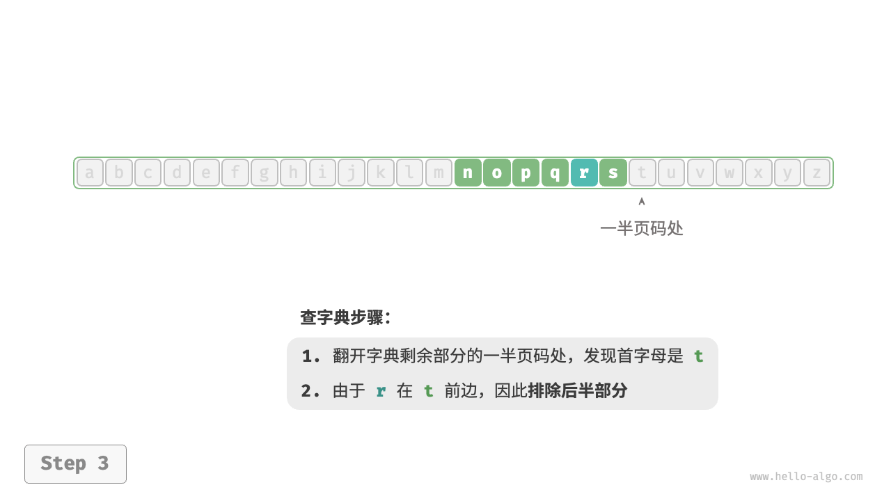
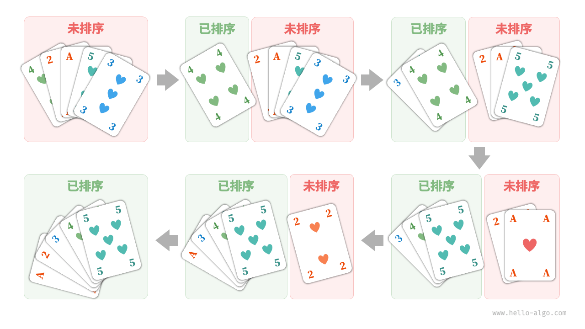
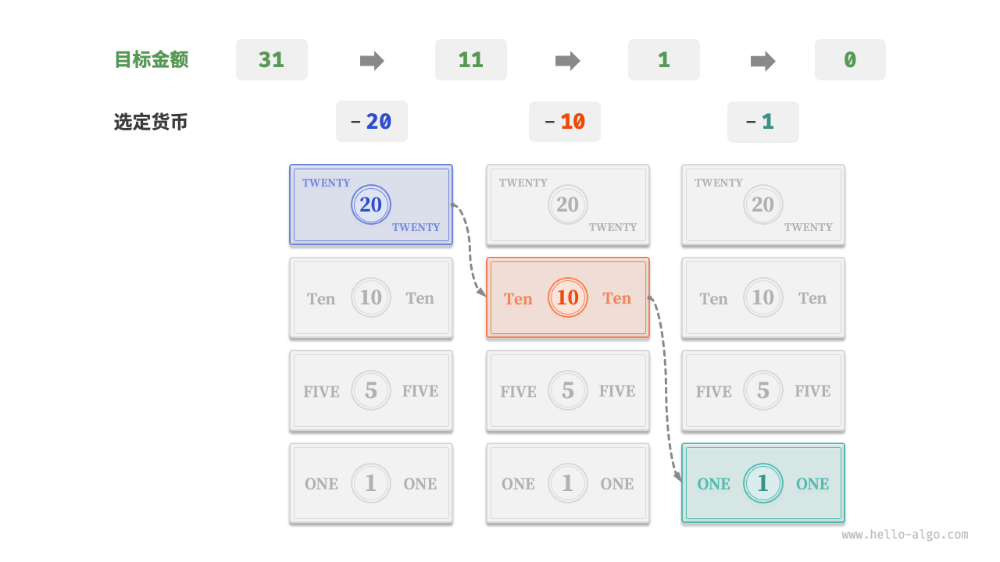

# 算法无处不在

当我们听到“算法”这个词时，很自然地会想到数学。然而实际上，许多算法并不涉及复杂数学，而是更多地依赖基本逻辑，这些逻辑在我们的日常生活中处处可见。

在正式探讨算法之前，有一个有趣的事实值得分享：**你已经在不知不觉中学会了许多算法，并习惯将它们应用到日常生活中了**。下面我将举几个具体的例子来证实这一点。

**例一：查字典**。在字典里，每个汉字都对应一个拼音，而字典是按照拼音字母顺序排列的。假设我们需要查找一个拼音首字母为 $r$ 的字，通常会按照下图所示的方式实现。

1. 翻开字典约一半的页数，查看该页的首字母是什么，假设首字母为 $m$ 。
2. 由于在拼音字母表中 $r$ 位于 $m$ 之后，所以排除字典前半部分，查找范围缩小到后半部分。
3. 不断重复步骤 `1.` 和 步骤 `2.` ，直至找到拼音首字母为 $r$ 的页码为止。

- "<1>"
    

- "<2>"
    

- "<3>"
    

- "<4>"
    

- "<5>"
    

查字典这个小学生必备技能，实际上就是著名的“二分查找”算法。从数据结构的角度，我们可以把字典视为一个已排序的“数组”；从算法的角度，我们可以将上述查字典的一系列操作看作“二分查找”。

**例二：整理扑克**。我们在打牌时，每局都需要整理手中的扑克牌，使其从小到大排列，实现流程如下图所示。

1. 将扑克牌划分为“有序”和“无序”两部分，并假设初始状态下最左 1 张扑克牌已经有序。
2. 在无序部分抽出一张扑克牌，插入至有序部分的正确位置；完成后最左 2 张扑克已经有序。
3. 不断循环步骤 `2.` ，每一轮将一张扑克牌从无序部分插入至有序部分，直至所有扑克牌都有序。

上述整理扑克牌的方法本质上是“插入排序”算法，它在处理小型数据集时非常高效。许多编程语言的排序库函数中都有插入排序的身影。

**例三：货币找零**。假设我们在超市购买了 $69$ 元的商品，给了收银员 $100$ 元，则收银员需要找我们 $31$ 元。他会很自然地完成如下图所示的思考。

1. 可选项是比 $31$ 元面值更小的货币，包括 $1$ 元、$5$ 元、$10$ 元、$20$ 元。
2. 从可选项中拿出最大的 $20$ 元，剩余 $31 - 20 = 11$ 元。
3. 从剩余可选项中拿出最大的 $10$ 元，剩余 $11 - 10 = 1$ 元。
4. 从剩余可选项中拿出最大的 $1$ 元，剩余 $1 - 1 = 0$ 元。
5. 完成找零，方案为 $20 + 10 + 1 = 31$ 元。

在以上步骤中，我们每一步都采取当前看来最好的选择（尽可能用大面额的货币），最终得到了可行的找零方案。从数据结构与算法的角度看，这种方法本质上是“贪心”算法。

小到烹饪一道菜，大到星际航行，几乎所有问题的解决都离不开算法。计算机的出现使得我们能够通过编程将数据结构存储在内存中，同时编写代码调用 CPU 和 GPU 执行算法。这样一来，我们就能把生活中的问题转移到计算机上，以更高效的方式解决各种复杂问题。

!!! tip

    如果你对数据结构、算法、数组和二分查找等概念仍感到一知半解，请继续往下阅读，本书将引导你迈入数据结构与算法的知识殿堂。
