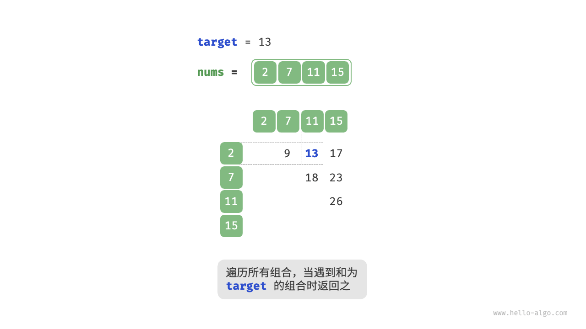
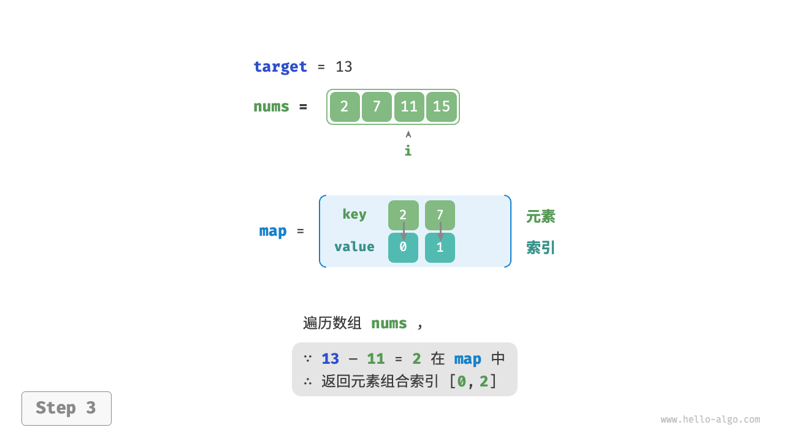

# 哈希优化策略

在算法题中，**我们常通过将线性查找替换为哈希查找来降低算法的时间复杂度**。我们借助一个算法题来加深理解。

!!! question

    给定一个整数数组 `nums` 和一个目标元素 `target` ，请在数组中搜索“和”为 `target` 的两个元素，并返回它们的数组索引。返回任意一个解即可。

## 线性查找：以时间换空间

考虑直接遍历所有可能的组合。如下图所示，我们开启一个两层循环，在每轮中判断两个整数的和是否为 `target` ，若是，则返回它们的索引。



代码如下所示：

- "Python"
```python
def two_sum_brute_force(nums: list[int], target: int) -> list[int]:
    """方法一：暴力枚举"""
    # 两层循环，时间复杂度为 O(n^2)
    for i in range(len(nums) - 1):
        for j in range(i + 1, len(nums)):
            if nums[i] + nums[j] == target:
                return [i, j]
    return []
```  

- "C++"
```cpp
/* 方法一：暴力枚举 */
vector<int> twoSumBruteForce(vector<int> &nums, int target) {
    int size = nums.size();
    // 两层循环，时间复杂度为 O(n^2)
    for (int i = 0; i < size - 1; i++) {
        for (int j = i + 1; j < size; j++) {
            if (nums[i] + nums[j] == target)
                return {i, j};
        }
    }
    return {};
}
```  

- "Java"
```java
/* 方法一：暴力枚举 */
int[] twoSumBruteForce(int[] nums, int target) {
    int size = nums.length;
    // 两层循环，时间复杂度为 O(n^2)
    for (int i = 0; i < size - 1; i++) {
        for (int j = i + 1; j < size; j++) {
            if (nums[i] + nums[j] == target)
                return new int[] { i, j };
        }
    }
    return new int[0];
}
```  

此方法的时间复杂度为 $O(n^2)$ ，空间复杂度为 $O(1)$ ，在大数据量下非常耗时。

## 哈希查找：以空间换时间

考虑借助一个哈希表，键值对分别为数组元素和元素索引。循环遍历数组，每轮执行下图所示的步骤。

1. 判断数字 `target - nums[i]` 是否在哈希表中，若是，则直接返回这两个元素的索引。
2. 将键值对 `nums[i]` 和索引 `i` 添加进哈希表。

- "<1>"
    

- "<2>"
    

- "<3>"
    

实现代码如下所示，仅需单层循环即可：

- "Python"
```python
def two_sum_hash_table(nums: list[int], target: int) -> list[int]:
    """方法二：辅助哈希表"""
    # 辅助哈希表，空间复杂度为 O(n)
    dic = {}
    # 单层循环，时间复杂度为 O(n)
    for i in range(len(nums)):
        if target - nums[i] in dic:
            return [dic[target - nums[i]], i]
        dic[nums[i]] = i
    return []
```  

- "C++"
```cpp
/* 方法二：辅助哈希表 */
vector<int> twoSumHashTable(vector<int> &nums, int target) {
    int size = nums.size();
    // 辅助哈希表，空间复杂度为 O(n)
    unordered_map<int, int> dic;
    // 单层循环，时间复杂度为 O(n)
    for (int i = 0; i < size; i++) {
        if (dic.find(target - nums[i]) != dic.end()) {
            return {dic[target - nums[i]], i};
        }
        dic.emplace(nums[i], i);
    }
    return {};
}
```  

- "Java"
```java
/* 方法二：辅助哈希表 */
int[] twoSumHashTable(int[] nums, int target) {
    int size = nums.length;
    // 辅助哈希表，空间复杂度为 O(n)
    Map<Integer, Integer> dic = new HashMap<>();
    // 单层循环，时间复杂度为 O(n)
    for (int i = 0; i < size; i++) {
        if (dic.containsKey(target - nums[i])) {
            return new int[] { dic.get(target - nums[i]), i };
        }
        dic.put(nums[i], i);
    }
    return new int[0];
}
```  

此方法通过哈希查找将时间复杂度从 $O(n^2)$ 降至 $O(n)$ ，大幅提升运行效率。

由于需要维护一个额外的哈希表，因此空间复杂度为 $O(n)$ 。**尽管如此，该方法的整体时空效率更为均衡，因此它是本题的最优解法**。
