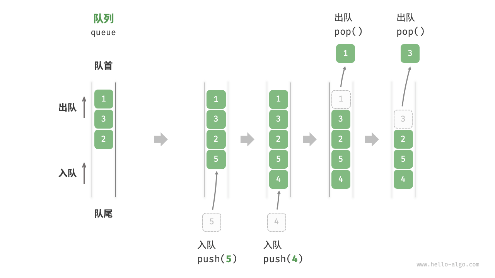
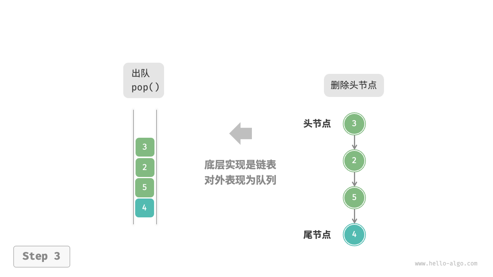
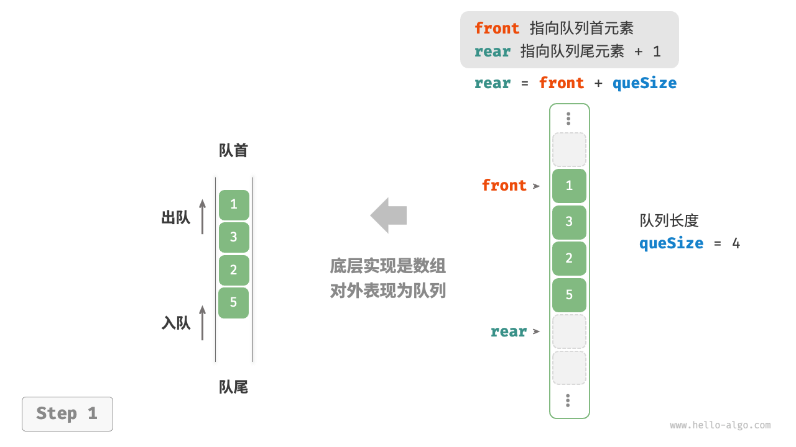
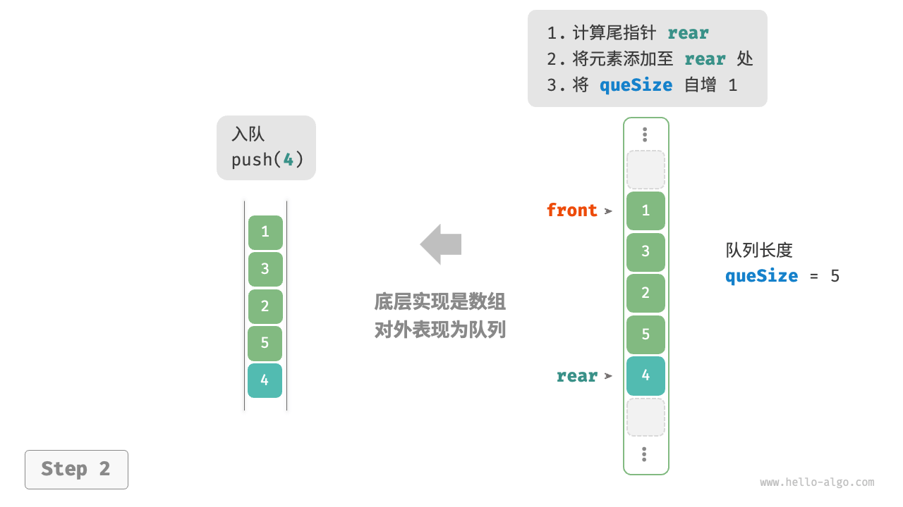
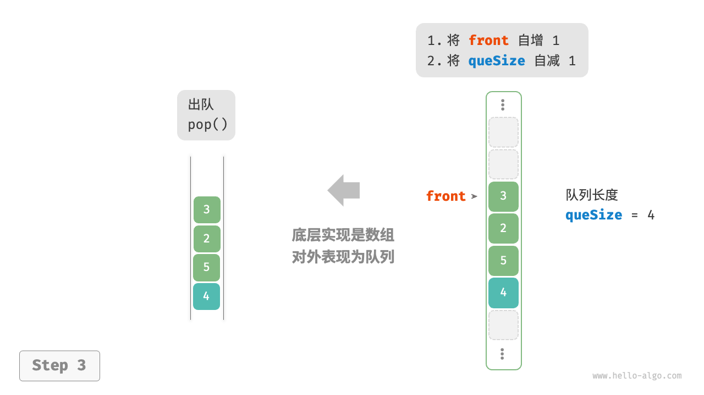

# 队列

「队列 queue」是一种遵循先入先出规则的线性数据结构。顾名思义，队列模拟了排队现象，即新来的人不断加入队列尾部，而位于队列头部的人逐个离开。

如下图所示，我们将队列头部称为“队首”，尾部称为“队尾”，将把元素加入队尾的操作称为“入队”，删除队首元素的操作称为“出队”。



## 队列常用操作

队列的常见操作如下表所示。需要注意的是，不同编程语言的方法名称可能会有所不同。我们在此采用与栈相同的方法命名。

<p align="center"> 表 <id> &nbsp; 队列操作效率 </p>

| 方法名   | 描述                         | 时间复杂度 |
| -------- | ---------------------------- | ---------- |
| `push()` | 元素入队，即将元素添加至队尾 | $O(1)$     |
| `pop()`  | 队首元素出队                 | $O(1)$     |
| `peek()` | 访问队首元素                 | $O(1)$     |

我们可以直接使用编程语言中现成的队列类：

- "Python"

    ```python title="queue.py"
    from collections import deque

    # 初始化队列
    # 在 Python 中，我们一般将双向队列类 deque 当作队列使用
    # 虽然 queue.Queue() 是纯正的队列类，但不太好用，因此不推荐
    que: deque[int] = deque()
    
    # 元素入队
    que.append(1)
    que.append(3)
    que.append(2)
    que.append(5)
    que.append(4)
    
    # 访问队首元素
    front: int = que[0];
    
    # 元素出队
    pop: int = que.popleft()
    
    # 获取队列的长度
    size: int = len(que)
    
    # 判断队列是否为空
    is_empty: bool = len(que) == 0
    ```

- "C++"

    ```cpp title="queue.cpp"
    /* 初始化队列 */
    queue<int> queue;
    
    /* 元素入队 */
    queue.push(1);
    queue.push(3);
    queue.push(2);
    queue.push(5);
    queue.push(4);
    
    /* 访问队首元素 */
    int front = queue.front();
    
    /* 元素出队 */
    queue.pop();
    
    /* 获取队列的长度 */
    int size = queue.size();
    
    /* 判断队列是否为空 */
    bool empty = queue.empty();
    ```

- "Java"

    ```java title="queue.java"
    /* 初始化队列 */
    Queue<Integer> queue = new LinkedList<>();
    
    /* 元素入队 */
    queue.offer(1);
    queue.offer(3);
    queue.offer(2);
    queue.offer(5);
    queue.offer(4);
    
    /* 访问队首元素 */
    int peek = queue.peek();
    
    /* 元素出队 */
    int pop = queue.poll();
    
    /* 获取队列的长度 */
    int size = queue.size();
    
    /* 判断队列是否为空 */
    boolean isEmpty = queue.isEmpty();
    ```

- "C#"

    ```csharp title="queue.cs"
    /* 初始化队列 */
    Queue<int> queue = new();
    
    /* 元素入队 */
    queue.Enqueue(1);
    queue.Enqueue(3);
    queue.Enqueue(2);
    queue.Enqueue(5);
    queue.Enqueue(4);
    
    /* 访问队首元素 */
    int peek = queue.Peek();
    
    /* 元素出队 */
    int pop = queue.Dequeue();
    
    /* 获取队列的长度 */
    int size = queue.Count;
    
    /* 判断队列是否为空 */
    bool isEmpty = queue.Count == 0;
    ```

- "Go"

    ```go title="queue_test.go"
    /* 初始化队列 */
    // 在 Go 中，将 list 作为队列来使用
    queue := list.New()
    
    /* 元素入队 */
    queue.PushBack(1)
    queue.PushBack(3)
    queue.PushBack(2)
    queue.PushBack(5)
    queue.PushBack(4)
    
    /* 访问队首元素 */
    peek := queue.Front()
    
    /* 元素出队 */
    pop := queue.Front()
    queue.Remove(pop)
    
    /* 获取队列的长度 */
    size := queue.Len()
    
    /* 判断队列是否为空 */
    isEmpty := queue.Len() == 0
    ```

- "Swift"

    ```swift title="queue.swift"
    /* 初始化队列 */
    // Swift 没有内置的队列类，可以把 Array 当作队列来使用
    var queue: [Int] = []
    
    /* 元素入队 */
    queue.append(1)
    queue.append(3)
    queue.append(2)
    queue.append(5)
    queue.append(4)
    
    /* 访问队首元素 */
    let peek = queue.first!
    
    /* 元素出队 */
    // 由于是数组，因此 removeFirst 的复杂度为 O(n)
    let pool = queue.removeFirst()
    
    /* 获取队列的长度 */
    let size = queue.count
    
    /* 判断队列是否为空 */
    let isEmpty = queue.isEmpty
    ```

- "JS"

    ```javascript title="queue.js"
    /* 初始化队列 */
    // JavaScript 没有内置的队列，可以把 Array 当作队列来使用
    const queue = [];
    
    /* 元素入队 */
    queue.push(1);
    queue.push(3);
    queue.push(2);
    queue.push(5);
    queue.push(4);
    
    /* 访问队首元素 */
    const peek = queue[0];
    
    /* 元素出队 */
    // 底层是数组，因此 shift() 方法的时间复杂度为 O(n)
    const pop = queue.shift();
    
    /* 获取队列的长度 */
    const size = queue.length;
    
    /* 判断队列是否为空 */
    const empty = queue.length - 0;
    ```

- "TS"

    ```typescript title="queue.ts"
    /* 初始化队列 */
    // TypeScript 没有内置的队列，可以把 Array 当作队列来使用 
    const queue: number[] = [];
    
    /* 元素入队 */
    queue.push(1);
    queue.push(3);
    queue.push(2);
    queue.push(5);
    queue.push(4);
    
    /* 访问队首元素 */
    const peek = queue[0];
    
    /* 元素出队 */
    // 底层是数组，因此 shift() 方法的时间复杂度为 O(n)
    const pop = queue.shift();
    
    /* 获取队列的长度 */
    const size = queue.length;
    
    /* 判断队列是否为空 */
    const empty = queue.length - 0;
    ```

- "Dart"

    ```dart title="queue.dart"
    /* 初始化队列 */
    // 在 Dart 中，队列类 Qeque 是双向队列，也可作为队列使用
    Queue<int> queue = Queue();

    /* 元素入队 */
    queue.add(1);
    queue.add(3);
    queue.add(2);
    queue.add(5);
    queue.add(4);

    /* 访问队首元素 */
    int peek = queue.first;

    /* 元素出队 */
    int pop = queue.removeFirst();

    /* 获取队列的长度 */
    int size = queue.length;

    /* 判断队列是否为空 */
    bool isEmpty = queue.isEmpty;
    ```

- "Rust"

    ```rust title="queue.rs"
    /* 初始化双向队列 */
    // 在 Rust 中使用双向队列作为普通队列来使用
    let mut deque: VecDeque<u32> = VecDeque::new();

    /* 元素入队 */
    deque.push_back(1);
    deque.push_back(3);
    deque.push_back(2);
    deque.push_back(5);
    deque.push_back(4);

    /* 访问队首元素 */
    if let Some(front) = deque.front() {
    }

    /* 元素出队 */
    if let Some(pop) = deque.pop_front() {
    }

    /* 获取队列的长度 */
    let size = deque.len();

    /* 判断队列是否为空 */
    let is_empty = deque.is_empty();
    ```

- "C"

    ```c title="queue.c"
    // C 未提供内置队列
    ```

- "Zig"

    ```zig title="queue.zig"

    ```

## 队列实现

为了实现队列，我们需要一种数据结构，可以在一端添加元素，并在另一端删除元素，链表和数组都符合要求。

### 基于链表的实现

如下图所示，我们可以将链表的“头节点”和“尾节点”分别视为“队首”和“队尾”，规定队尾仅可添加节点，队首仅可删除节点。

- "LinkedListQueue"
    

- "push()"
    

- "pop()"
    

以下是用链表实现队列的代码：

- "Python"
```python
class LinkedListQueue:
    """基于链表实现的队列"""

    def __init__(self):
        """构造方法"""
        self._front: ListNode | None = None  # 头节点 front
        self._rear: ListNode | None = None  # 尾节点 rear
        self._size: int = 0

    def size(self) -> int:
        """获取队列的长度"""
        return self._size

    def is_empty(self) -> bool:
        """判断队列是否为空"""
        return not self._front

    def push(self, num: int):
        """入队"""
        # 在尾节点后添加 num
        node = ListNode(num)
        # 如果队列为空，则令头、尾节点都指向该节点
        if self._front is None:
            self._front = node
            self._rear = node
        # 如果队列不为空，则将该节点添加到尾节点后
        else:
            self._rear.next = node
            self._rear = node
        self._size += 1

    def pop(self) -> int:
        """出队"""
        num = self.peek()
        # 删除头节点
        self._front = self._front.next
        self._size -= 1
        return num

    def peek(self) -> int:
        """访问队首元素"""
        if self.is_empty():
            raise IndexError("队列为空")
        return self._front.val

    def to_list(self) -> list[int]:
        """转化为列表用于打印"""
        queue = []
        temp = self._front
        while temp:
            queue.append(temp.val)
            temp = temp.next
        return queue
```  

- "C++"
```cpp
/* 基于链表实现的队列 */
class LinkedListQueue {
  private:
    ListNode *front, *rear; // 头节点 front ，尾节点 rear
    int queSize;

  public:
    LinkedListQueue() {
        front = nullptr;
        rear = nullptr;
        queSize = 0;
    }

    ~LinkedListQueue() {
        // 遍历链表删除节点，释放内存
        freeMemoryLinkedList(front);
    }

    /* 获取队列的长度 */
    int size() {
        return queSize;
    }

    /* 判断队列是否为空 */
    bool isEmpty() {
        return queSize == 0;
    }

    /* 入队 */
    void push(int num) {
        // 在尾节点后添加 num
        ListNode *node = new ListNode(num);
        // 如果队列为空，则令头、尾节点都指向该节点
        if (front == nullptr) {
            front = node;
            rear = node;
        }
        // 如果队列不为空，则将该节点添加到尾节点后
        else {
            rear->next = node;
            rear = node;
        }
        queSize++;
    }

    /* 出队 */
    int pop() {
        int num = peek();
        // 删除头节点
        ListNode *tmp = front;
        front = front->next;
        // 释放内存
        delete tmp;
        queSize--;
        return num;
    }

    /* 访问队首元素 */
    int peek() {
        if (size() == 0)
            throw out_of_range("队列为空");
        return front->val;
    }

    /* 将链表转化为 Vector 并返回 */
    vector<int> toVector() {
        ListNode *node = front;
        vector<int> res(size());
        for (int i = 0; i < res.size(); i++) {
            res[i] = node->val;
            node = node->next;
        }
        return res;
    }
};
```  

- "Java"
```java
/* 基于链表实现的队列 */
class LinkedListQueue {
    private ListNode front, rear; // 头节点 front ，尾节点 rear
    private int queSize = 0;

    public LinkedListQueue() {
        front = null;
        rear = null;
    }

    /* 获取队列的长度 */
    public int size() {
        return queSize;
    }

    /* 判断队列是否为空 */
    public boolean isEmpty() {
        return size() == 0;
    }

    /* 入队 */
    public void push(int num) {
        // 在尾节点后添加 num
        ListNode node = new ListNode(num);
        // 如果队列为空，则令头、尾节点都指向该节点
        if (front == null) {
            front = node;
            rear = node;
        // 如果队列不为空，则将该节点添加到尾节点后
        } else {
            rear.next = node;
            rear = node;
        }
        queSize++;
    }

    /* 出队 */
    public int pop() {
        int num = peek();
        // 删除头节点
        front = front.next;
        queSize--;
        return num;
    }

    /* 访问队首元素 */
    public int peek() {
        if (isEmpty())
            throw new IndexOutOfBoundsException();
        return front.val;
    }

    /* 将链表转化为 Array 并返回 */
    public int[] toArray() {
        ListNode node = front;
        int[] res = new int[size()];
        for (int i = 0; i < res.length; i++) {
            res[i] = node.val;
            node = node.next;
        }
        return res;
    }
}
```  

### 基于数组的实现

在数组中删除首元素的时间复杂度为 $O(n)$ ，这会导致出队操作效率较低。然而，我们可以采用以下巧妙方法来避免这个问题。

我们可以使用一个变量 `front` 指向队首元素的索引，并维护一个变量 `size` 用于记录队列长度。定义 `rear = front + size` ，这个公式计算出的 `rear` 指向队尾元素之后的下一个位置。

基于此设计，**数组中包含元素的有效区间为 `[front, rear - 1]`**，各种操作的实现方法如下图所示。

- 入队操作：将输入元素赋值给 `rear` 索引处，并将 `size` 增加 1 。
- 出队操作：只需将 `front` 增加 1 ，并将 `size` 减少 1 。

可以看到，入队和出队操作都只需进行一次操作，时间复杂度均为 $O(1)$ 。

- "ArrayQueue"
    

- "push()"
    

- "pop()"
    

你可能会发现一个问题：在不断进行入队和出队的过程中，`front` 和 `rear` 都在向右移动，**当它们到达数组尾部时就无法继续移动了**。为了解决此问题，我们可以将数组视为首尾相接的“环形数组”。

对于环形数组，我们需要让 `front` 或 `rear` 在越过数组尾部时，直接回到数组头部继续遍历。这种周期性规律可以通过“取余操作”来实现，代码如下所示：

- "Python"
```python
class ArrayQueue:
    """基于环形数组实现的队列"""

    def __init__(self, size: int):
        """构造方法"""
        self._nums: list[int] = [0] * size  # 用于存储队列元素的数组
        self._front: int = 0  # 队首指针，指向队首元素
        self._size: int = 0  # 队列长度

    def capacity(self) -> int:
        """获取队列的容量"""
        return len(self._nums)

    def size(self) -> int:
        """获取队列的长度"""
        return self._size

    def is_empty(self) -> bool:
        """判断队列是否为空"""
        return self._size == 0

    def push(self, num: int):
        """入队"""
        if self._size == self.capacity():
            raise IndexError("队列已满")
        # 计算队尾指针，指向队尾索引 + 1
        # 通过取余操作实现 rear 越过数组尾部后回到头部
        rear: int = (self._front + self._size) % self.capacity()
        # 将 num 添加至队尾
        self._nums[rear] = num
        self._size += 1

    def pop(self) -> int:
        """出队"""
        num: int = self.peek()
        # 队首指针向后移动一位，若越过尾部，则返回到数组头部
        self._front = (self._front + 1) % self.capacity()
        self._size -= 1
        return num

    def peek(self) -> int:
        """访问队首元素"""
        if self.is_empty():
            raise IndexError("队列为空")
        return self._nums[self._front]

    def to_list(self) -> list[int]:
        """返回列表用于打印"""
        res = [0] * self.size()
        j: int = self._front
        for i in range(self.size()):
            res[i] = self._nums[(j % self.capacity())]
            j += 1
        return res
```  

- "C++"
```cpp
/* 基于环形数组实现的队列 */
class ArrayQueue {
  private:
    int *nums;       // 用于存储队列元素的数组
    int front;       // 队首指针，指向队首元素
    int queSize;     // 队列长度
    int queCapacity; // 队列容量

  public:
    ArrayQueue(int capacity) {
        // 初始化数组
        nums = new int[capacity];
        queCapacity = capacity;
        front = queSize = 0;
    }

    ~ArrayQueue() {
        delete[] nums;
    }

    /* 获取队列的容量 */
    int capacity() {
        return queCapacity;
    }

    /* 获取队列的长度 */
    int size() {
        return queSize;
    }

    /* 判断队列是否为空 */
    bool isEmpty() {
        return size() == 0;
    }

    /* 入队 */
    void push(int num) {
        if (queSize == queCapacity) {
            cout << "队列已满" << endl;
            return;
        }
        // 计算队尾指针，指向队尾索引 + 1
        // 通过取余操作实现 rear 越过数组尾部后回到头部
        int rear = (front + queSize) % queCapacity;
        // 将 num 添加至队尾
        nums[rear] = num;
        queSize++;
    }

    /* 出队 */
    int pop() {
        int num = peek();
        // 队首指针向后移动一位，若越过尾部，则返回到数组头部
        front = (front + 1) % queCapacity;
        queSize--;
        return num;
    }

    /* 访问队首元素 */
    int peek() {
        if (isEmpty())
            throw out_of_range("队列为空");
        return nums[front];
    }

    /* 将数组转化为 Vector 并返回 */
    vector<int> toVector() {
        // 仅转换有效长度范围内的列表元素
        vector<int> arr(queSize);
        for (int i = 0, j = front; i < queSize; i++, j++) {
            arr[i] = nums[j % queCapacity];
        }
        return arr;
    }
};
```  

- "Java"
```java
/* 基于环形数组实现的队列 */
class ArrayQueue {
    private int[] nums; // 用于存储队列元素的数组
    private int front; // 队首指针，指向队首元素
    private int queSize; // 队列长度

    public ArrayQueue(int capacity) {
        nums = new int[capacity];
        front = queSize = 0;
    }

    /* 获取队列的容量 */
    public int capacity() {
        return nums.length;
    }

    /* 获取队列的长度 */
    public int size() {
        return queSize;
    }

    /* 判断队列是否为空 */
    public boolean isEmpty() {
        return queSize == 0;
    }

    /* 入队 */
    public void push(int num) {
        if (queSize == capacity()) {
            System.out.println("队列已满");
            return;
        }
        // 计算队尾指针，指向队尾索引 + 1
        // 通过取余操作实现 rear 越过数组尾部后回到头部
        int rear = (front + queSize) % capacity();
        // 将 num 添加至队尾
        nums[rear] = num;
        queSize++;
    }

    /* 出队 */
    public int pop() {
        int num = peek();
        // 队首指针向后移动一位，若越过尾部，则返回到数组头部
        front = (front + 1) % capacity();
        queSize--;
        return num;
    }

    /* 访问队首元素 */
    public int peek() {
        if (isEmpty())
            throw new IndexOutOfBoundsException();
        return nums[front];
    }

    /* 返回数组 */
    public int[] toArray() {
        // 仅转换有效长度范围内的列表元素
        int[] res = new int[queSize];
        for (int i = 0, j = front; i < queSize; i++, j++) {
            res[i] = nums[j % capacity()];
        }
        return res;
    }
}
```  

以上实现的队列仍然具有局限性：其长度不可变。然而，这个问题不难解决，我们可以将数组替换为动态数组，从而引入扩容机制。有兴趣的读者可以尝试自行实现。

两种实现的对比结论与栈一致，在此不再赘述。

## 队列典型应用

- **淘宝订单**。购物者下单后，订单将加入队列中，系统随后会根据顺序处理队列中的订单。在双十一期间，短时间内会产生海量订单，高并发成为工程师们需要重点攻克的问题。
- **各类待办事项**。任何需要实现“先来后到”功能的场景，例如打印机的任务队列、餐厅的出餐队列等，队列在这些场景中可以有效地维护处理顺序。
