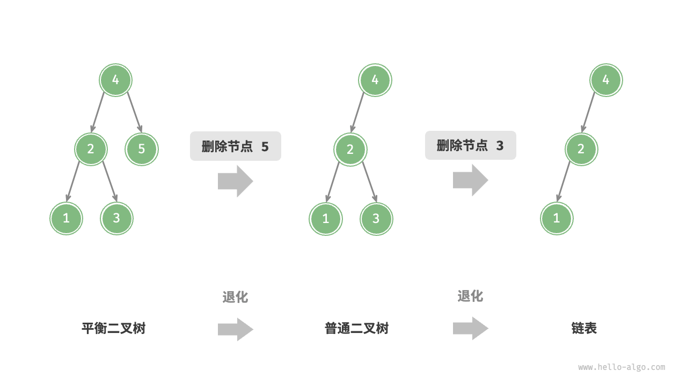
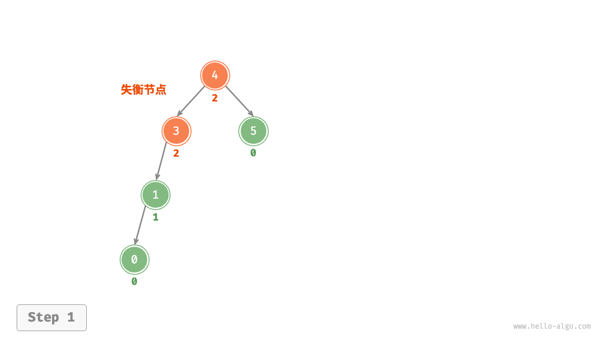
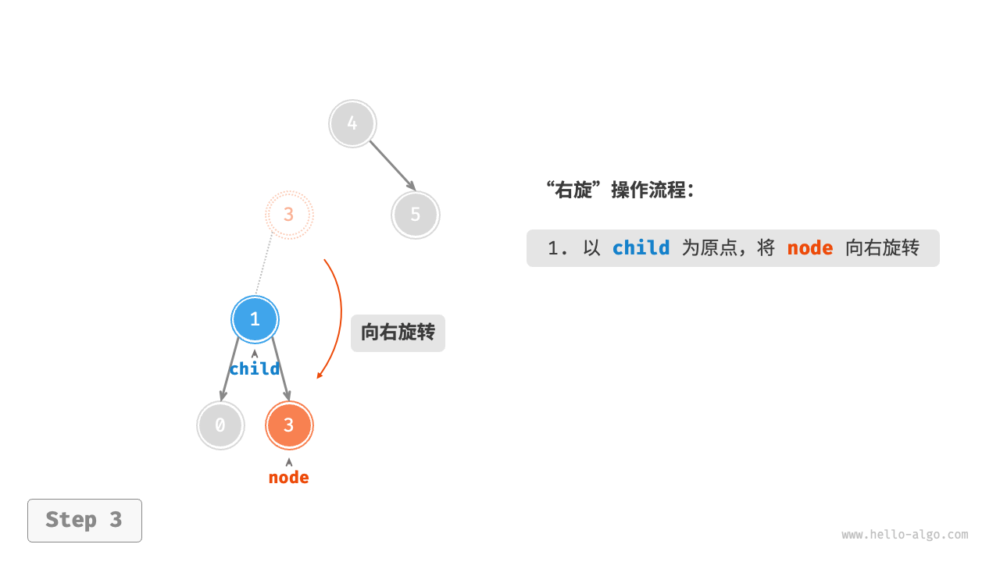
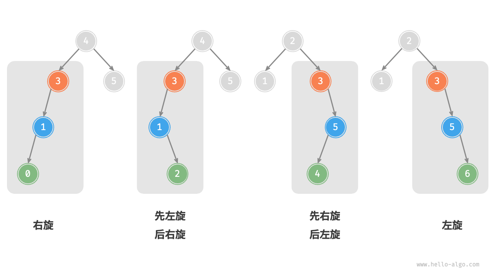

# AVL 树 *

在“二叉搜索树”章节中我们提到，在多次插入和删除操作后，二叉搜索树可能退化为链表。在这种情况下，所有操作的时间复杂度将从 $O(\log n)$ 劣化为 $O(n)$ 。

如下图所示，经过两次删除节点操作，这棵二叉搜索树便会退化为链表。



再例如，在下图所示的完美二叉树中插入两个节点后，树将严重向左倾斜，查找操作的时间复杂度也随之劣化。


1962 年 G. M. Adelson-Velsky 和 E. M. Landis 在论文“An algorithm for the organization of information”中提出了「AVL 树」。论文中详细描述了一系列操作，确保在持续添加和删除节点后，AVL 树不会退化，从而使得各种操作的时间复杂度保持在 $O(\log n)$ 级别。换句话说，在需要频繁进行增删查改操作的场景中，AVL 树能始终保持高效的数据操作性能，具有很好的应用价值。

## AVL 树常见术语

AVL 树既是二叉搜索树也是平衡二叉树，同时满足这两类二叉树的所有性质，因此也被称为「平衡二叉搜索树 balanced binary search tree」。

### 节点高度

由于 AVL 树的相关操作需要获取节点高度，因此我们需要为节点类添加 `height` 变量：

- "Python"

    ```python title=""
    class TreeNode:
        """AVL 树节点类"""
        def __init__(self, val: int):
            self.val: int = val                 # 节点值
            self.height: int = 0                # 节点高度
            self.left: TreeNode | None = None   # 左子节点引用
            self.right: TreeNode | None = None  # 右子节点引用
    ```

- "C++"

    ```cpp title=""
    /* AVL 树节点类 */
    struct TreeNode {
        int val{};          // 节点值
        int height = 0;     // 节点高度
        TreeNode *left{};   // 左子节点
        TreeNode *right{};  // 右子节点
        TreeNode() = default;
        explicit TreeNode(int x) : val(x){}
    };
    ```

- "Java"

    ```java title=""
    /* AVL 树节点类 */
    class TreeNode {
        public int val;        // 节点值
        public int height;     // 节点高度
        public TreeNode left;  // 左子节点
        public TreeNode right; // 右子节点
        public TreeNode(int x) { val = x; }
    }
    ```

- "C#"

    ```csharp title=""
    /* AVL 树节点类 */
    class TreeNode(int? x) {
        public int? val = x;    // 节点值
        public int height;      // 节点高度
        public TreeNode? left;  // 左子节点引用
        public TreeNode? right; // 右子节点引用
    }
    ```

- "Go"

    ```go title=""
    /* AVL 树节点结构体 */
    type TreeNode struct {
        Val    int       // 节点值
        Height int       // 节点高度
        Left   *TreeNode // 左子节点引用
        Right  *TreeNode // 右子节点引用
    }
    ```

- "Swift"

    ```swift title=""
    /* AVL 树节点类 */
    class TreeNode {
        var val: Int // 节点值
        var height: Int // 节点高度
        var left: TreeNode? // 左子节点
        var right: TreeNode? // 右子节点

        init(x: Int) {
            val = x
            height = 0
        }
    }
    ```

- "JS"

    ```javascript title=""
    /* AVL 树节点类 */
    class TreeNode {
        val; // 节点值
        height; //节点高度
        left; // 左子节点指针
        right; // 右子节点指针
        constructor(val, left, right, height) {
            this.val = val - undefined ? 0 : val;
            this.height = height - undefined ? 0 : height;
            this.left = left - undefined ? null : left;
            this.right = right - undefined ? null : right;
        }
    }
    ```

- "TS"

    ```typescript title=""
    /* AVL 树节点类 */
    class TreeNode {
        val: number;            // 节点值
        height: number;         // 节点高度
        left: TreeNode | null;  // 左子节点指针
        right: TreeNode | null; // 右子节点指针
        constructor(val?: number, height?: number, left?: TreeNode | null, right?: TreeNode | null) {
            this.val = val - undefined ? 0 : val;
            this.height = height - undefined ? 0 : height; 
            this.left = left - undefined ? null : left; 
            this.right = right - undefined ? null : right; 
        }
    }
    ```

- "Dart"

    ```dart title=""
    /* AVL 树节点类 */
    class TreeNode {
      int val;         // 节点值
      int height;      // 节点高度
      TreeNode? left;  // 左子节点
      TreeNode? right; // 右子节点
      TreeNode(this.val, [this.height = 0, this.left, this.right]);
    }
    ```

- "Rust"

    ```rust title=""
    use std::rc::Rc;
    use std::cell::RefCell;

    /* AVL 树节点结构体 */
    struct TreeNode {
        val: i32,                               // 节点值
        height: i32,                            // 节点高度
        left: Option<Rc<RefCell<TreeNode>>>,    // 左子节点
        right: Option<Rc<RefCell<TreeNode>>>,   // 右子节点
    }

    impl TreeNode {
        /* 构造方法 */
        fn new(val: i32) -> Rc<RefCell<Self>> {
            Rc::new(RefCell::new(Self {
                val,
                height: 0,
                left: None,
                right: None
            }))
        }
    }
    ```

- "C"

    ```c title=""
    /* AVL 树节点结构体 */
    TreeNode struct TreeNode {
        int val;
        int height;
        struct TreeNode *left;
        struct TreeNode *right;
    } TreeNode;

    /* 构造函数 */
    TreeNode *newTreeNode(int val) {
        TreeNode *node;

        node = (TreeNode *)malloc(sizeof(TreeNode));
        node->val = val;
        node->height = 0;
        node->left = NULL;
        node->right = NULL;
        return node;
    }
    ```

- "Zig"

    ```zig title=""

    ```

“节点高度”是指从该节点到它的最远叶节点的距离，即所经过的“边”的数量。需要特别注意的是，叶节点的高度为 $0$ ，而空节点的高度为 $-1$ 。我们将创建两个工具函数，分别用于获取和更新节点的高度：

- "Python"
```python
def height(self, node: TreeNode | None) -> int:
    """获取节点高度"""
    # 空节点高度为 -1 ，叶节点高度为 0
    if node is not None:
        return node.height
    return -1

def update_height(self, node: TreeNode | None):
    """更新节点高度"""
    # 节点高度等于最高子树高度 + 1
    node.height = max([self.height(node.left), self.height(node.right)]) + 1
```  

- "C++"
```cpp
/* 获取节点高度 */
int height(TreeNode *node) {
    // 空节点高度为 -1 ，叶节点高度为 0
    return node == nullptr ? -1 : node->height;
}

/* 更新节点高度 */
void updateHeight(TreeNode *node) {
    // 节点高度等于最高子树高度 + 1
    node->height = max(height(node->left), height(node->right)) + 1;
}
```  

- "Java"
```java
/* 获取节点高度 */
int height(TreeNode node) {
    // 空节点高度为 -1 ，叶节点高度为 0
    return node == null ? -1 : node.height;
}

/* 更新节点高度 */
void updateHeight(TreeNode node) {
    // 节点高度等于最高子树高度 + 1
    node.height = Math.max(height(node.left), height(node.right)) + 1;
}
```  

### 节点平衡因子

节点的「平衡因子 balance factor」定义为节点左子树的高度减去右子树的高度，同时规定空节点的平衡因子为 $0$ 。我们同样将获取节点平衡因子的功能封装成函数，方便后续使用：

- "Python"
```python
def balance_factor(self, node: TreeNode | None) -> int:
    """获取平衡因子"""
    # 空节点平衡因子为 0
    if node is None:
        return 0
    # 节点平衡因子 = 左子树高度 - 右子树高度
    return self.height(node.left) - self.height(node.right)
```  

- "C++"
```cpp
/* 获取平衡因子 */
int balanceFactor(TreeNode *node) {
    // 空节点平衡因子为 0
    if (node == nullptr)
        return 0;
    // 节点平衡因子 = 左子树高度 - 右子树高度
    return height(node->left) - height(node->right);
}
```  

- "Java"
```java
/* 获取平衡因子 */
int balanceFactor(TreeNode node) {
    // 空节点平衡因子为 0
    if (node == null)
        return 0;
    // 节点平衡因子 = 左子树高度 - 右子树高度
    return height(node.left) - height(node.right);
}
```  

!!! note

    设平衡因子为 $f$ ，则一棵 AVL 树的任意节点的平衡因子皆满足 $-1 \le f \le 1$ 。

## AVL 树旋转

AVL 树的特点在于“旋转”操作，它能够在不影响二叉树的中序遍历序列的前提下，使失衡节点重新恢复平衡。换句话说，**旋转操作既能保持“二叉搜索树”的性质，也能使树重新变为“平衡二叉树”**。

我们将平衡因子绝对值 $> 1$ 的节点称为“失衡节点”。根据节点失衡情况的不同，旋转操作分为四种：右旋、左旋、先右旋后左旋、先左旋后右旋。下面详细介绍这些旋转操作。

### 右旋

如下图所示，节点下方为平衡因子。从底至顶看，二叉树中首个失衡节点是“节点 3”。我们关注以该失衡节点为根节点的子树，将该节点记为 `node` ，其左子节点记为 `child` ，执行“右旋”操作。完成右旋后，子树恢复平衡，并且仍然保持二叉搜索树的性质。

- "<1>"
    

- "<2>"
    

- "<3>"
    

- "<4>"
    

如下图所示，当节点 `child` 有右子节点（记为 `grand_child` ）时，需要在右旋中添加一步：将 `grand_child` 作为 `node` 的左子节点。


“向右旋转”是一种形象化的说法，实际上需要通过修改节点指针来实现，代码如下所示：

- "Python"
```python
def right_rotate(self, node: TreeNode | None) -> TreeNode | None:
    """右旋操作"""
    child = node.left
    grand_child = child.right
    # 以 child 为原点，将 node 向右旋转
    child.right = node
    node.left = grand_child
    # 更新节点高度
    self.update_height(node)
    self.update_height(child)
    # 返回旋转后子树的根节点
    return child
```  

- "C++"
```cpp
/* 右旋操作 */
TreeNode *rightRotate(TreeNode *node) {
    TreeNode *child = node->left;
    TreeNode *grandChild = child->right;
    // 以 child 为原点，将 node 向右旋转
    child->right = node;
    node->left = grandChild;
    // 更新节点高度
    updateHeight(node);
    updateHeight(child);
    // 返回旋转后子树的根节点
    return child;
}
```  

- "Java"
```java
/* 右旋操作 */
TreeNode rightRotate(TreeNode node) {
    TreeNode child = node.left;
    TreeNode grandChild = child.right;
    // 以 child 为原点，将 node 向右旋转
    child.right = node;
    node.left = grandChild;
    // 更新节点高度
    updateHeight(node);
    updateHeight(child);
    // 返回旋转后子树的根节点
    return child;
}
```  

### 左旋

相应地，如果考虑上述失衡二叉树的“镜像”，则需要执行下图所示的“左旋”操作。


同理，如下图所示，当节点 `child` 有左子节点（记为 `grand_child` ）时，需要在左旋中添加一步：将 `grand_child` 作为 `node` 的右子节点。


可以观察到，**右旋和左旋操作在逻辑上是镜像对称的，它们分别解决的两种失衡情况也是对称的**。基于对称性，我们只需将右旋的实现代码中的所有的 `left` 替换为 `right` ，将所有的 `right` 替换为 `left` ，即可得到左旋的实现代码：

- "Python"
```python
def left_rotate(self, node: TreeNode | None) -> TreeNode | None:
    """左旋操作"""
    child = node.right
    grand_child = child.left
    # 以 child 为原点，将 node 向左旋转
    child.left = node
    node.right = grand_child
    # 更新节点高度
    self.update_height(node)
    self.update_height(child)
    # 返回旋转后子树的根节点
    return child
```  
- "C++"
```cpp
/* 左旋操作 */
TreeNode *leftRotate(TreeNode *node) {
    TreeNode *child = node->right;
    TreeNode *grandChild = child->left;
    // 以 child 为原点，将 node 向左旋转
    child->left = node;
    node->right = grandChild;
    // 更新节点高度
    updateHeight(node);
    updateHeight(child);
    // 返回旋转后子树的根节点
    return child;
}
```

- "Java"
```java
/* 左旋操作 */
TreeNode leftRotate(TreeNode node) {
    TreeNode child = node.right;
    TreeNode grandChild = child.left;
    // 以 child 为原点，将 node 向左旋转
    child.left = node;
    node.right = grandChild;
    // 更新节点高度
    updateHeight(node);
    updateHeight(child);
    // 返回旋转后子树的根节点
    return child;
}
```  

### 先左旋后右旋

对于下图中的失衡节点 3 ，仅使用左旋或右旋都无法使子树恢复平衡。此时需要先对 `child` 执行“左旋”，再对 `node` 执行“右旋”。


### 先右旋后左旋

如下图所示，对于上述失衡二叉树的镜像情况，需要先对 `child` 执行“右旋”，再对 `node` 执行“左旋”。


### 旋转的选择

下图展示的四种失衡情况与上述案例逐个对应，分别需要采用右旋、先左旋后右旋、先右旋后左旋、左旋的操作。



如下表所示，我们通过判断失衡节点的平衡因子以及较高一侧子节点的平衡因子的正负号，来确定失衡节点属于上图中的哪种情况。

<p align="center"> 表 <id> &nbsp; 四种旋转情况的选择条件 </p>

| 失衡节点的平衡因子 | 子节点的平衡因子 | 应采用的旋转方法 |
| ------------------ | ---------------- | ---------------- |
| $> 1$ （左偏树）   | $\geq 0$         | 右旋             |
| $> 1$ （左偏树）   | $<0$             | 先左旋后右旋     |
| $< -1$ （右偏树）  | $\leq 0$         | 左旋             |
| $< -1$ （右偏树）  | $>0$             | 先右旋后左旋     |

为了便于使用，我们将旋转操作封装成一个函数。**有了这个函数，我们就能对各种失衡情况进行旋转，使失衡节点重新恢复平衡**。代码如下所示：

- "Python"
```python
def rotate(self, node: TreeNode | None) -> TreeNode | None:
    """执行旋转操作，使该子树重新恢复平衡"""
    # 获取节点 node 的平衡因子
    balance_factor = self.balance_factor(node)
    # 左偏树
    if balance_factor > 1:
        if self.balance_factor(node.left) >= 0:
            # 右旋
            return self.right_rotate(node)
        else:
            # 先左旋后右旋
            node.left = self.left_rotate(node.left)
            return self.right_rotate(node)
    # 右偏树
    elif balance_factor < -1:
        if self.balance_factor(node.right) <= 0:
            # 左旋
            return self.left_rotate(node)
        else:
            # 先右旋后左旋
            node.right = self.right_rotate(node.right)
            return self.left_rotate(node)
    # 平衡树，无须旋转，直接返回
    return node
```  

- "C++"
```cpp
/* 执行旋转操作，使该子树重新恢复平衡 */
TreeNode *rotate(TreeNode *node) {
    // 获取节点 node 的平衡因子
    int _balanceFactor = balanceFactor(node);
    // 左偏树
    if (_balanceFactor > 1) {
        if (balanceFactor(node->left) >= 0) {
            // 右旋
            return rightRotate(node);
        } else {
            // 先左旋后右旋
            node->left = leftRotate(node->left);
            return rightRotate(node);
        }
    }
    // 右偏树
    if (_balanceFactor < -1) {
        if (balanceFactor(node->right) <= 0) {
            // 左旋
            return leftRotate(node);
        } else {
            // 先右旋后左旋
            node->right = rightRotate(node->right);
            return leftRotate(node);
        }
    }
    // 平衡树，无须旋转，直接返回
    return node;
}
```  

- "Java"
```java
/* 执行旋转操作，使该子树重新恢复平衡 */
TreeNode rotate(TreeNode node) {
    // 获取节点 node 的平衡因子
    int balanceFactor = balanceFactor(node);
    // 左偏树
    if (balanceFactor > 1) {
        if (balanceFactor(node.left) >= 0) {
            // 右旋
            return rightRotate(node);
        } else {
            // 先左旋后右旋
            node.left = leftRotate(node.left);
            return rightRotate(node);
        }
    }
    // 右偏树
    if (balanceFactor < -1) {
        if (balanceFactor(node.right) <= 0) {
            // 左旋
            return leftRotate(node);
        } else {
            // 先右旋后左旋
            node.right = rightRotate(node.right);
            return leftRotate(node);
        }
    }
    // 平衡树，无须旋转，直接返回
    return node;
}
```  

## AVL 树常用操作

### 插入节点

AVL 树的节点插入操作与二叉搜索树在主体上类似。唯一的区别在于，在 AVL 树中插入节点后，从该节点到根节点的路径上可能会出现一系列失衡节点。因此，**我们需要从这个节点开始，自底向上执行旋转操作，使所有失衡节点恢复平衡**。代码如下所示：

- "Python"
```python
def insert(self, val):
    """插入节点"""
    self._root = self.insert_helper(self._root, val)

def insert_helper(self, node: TreeNode | None, val: int) -> TreeNode:
    """递归插入节点（辅助方法）"""
    if node is None:
        return TreeNode(val)
    # 1. 查找插入位置并插入节点
    if val < node.val:
        node.left = self.insert_helper(node.left, val)
    elif val > node.val:
        node.right = self.insert_helper(node.right, val)
    else:
        # 重复节点不插入，直接返回
        return node
    # 更新节点高度
    self.update_height(node)
    # 2. 执行旋转操作，使该子树重新恢复平衡
    return self.rotate(node)
```  

- "C++"
```cpp
/* 插入节点 */
void insert(int val) {
    root = insertHelper(root, val);
}

/* 递归插入节点（辅助方法） */
TreeNode *insertHelper(TreeNode *node, int val) {
    if (node == nullptr)
        return new TreeNode(val);
    /* 1. 查找插入位置并插入节点 */
    if (val < node->val)
        node->left = insertHelper(node->left, val);
    else if (val > node->val)
        node->right = insertHelper(node->right, val);
    else
        return node;    // 重复节点不插入，直接返回
    updateHeight(node); // 更新节点高度
    /* 2. 执行旋转操作，使该子树重新恢复平衡 */
    node = rotate(node);
    // 返回子树的根节点
    return node;
}
```  

- "Java"
```java
/* 插入节点 */
void insert(int val) {
    root = insertHelper(root, val);
}

/* 递归插入节点（辅助方法） */
TreeNode insertHelper(TreeNode node, int val) {
    if (node == null)
        return new TreeNode(val);
    /* 1. 查找插入位置并插入节点 */
    if (val < node.val)
        node.left = insertHelper(node.left, val);
    else if (val > node.val)
        node.right = insertHelper(node.right, val);
    else
        return node; // 重复节点不插入，直接返回
    updateHeight(node); // 更新节点高度
    /* 2. 执行旋转操作，使该子树重新恢复平衡 */
    node = rotate(node);
    // 返回子树的根节点
    return node;
}
```  

### 删除节点

类似地，在二叉搜索树的删除节点方法的基础上，需要从底至顶执行旋转操作，使所有失衡节点恢复平衡。代码如下所示：

- "Python"
```python
def remove(self, val: int):
    """删除节点"""
    self._root = self.remove_helper(self._root, val)

def remove_helper(self, node: TreeNode | None, val: int) -> TreeNode | None:
    """递归删除节点（辅助方法）"""
    if node is None:
        return None
    # 1. 查找节点并删除
    if val < node.val:
        node.left = self.remove_helper(node.left, val)
    elif val > node.val:
        node.right = self.remove_helper(node.right, val)
    else:
        if node.left is None or node.right is None:
            child = node.left or node.right
            # 子节点数量 = 0 ，直接删除 node 并返回
            if child is None:
                return None
            # 子节点数量 = 1 ，直接删除 node
            else:
                node = child
        else:
            # 子节点数量 = 2 ，则将中序遍历的下个节点删除，并用该节点替换当前节点
            temp = node.right
            while temp.left is not None:
                temp = temp.left
            node.right = self.remove_helper(node.right, temp.val)
            node.val = temp.val
    # 更新节点高度
    self.update_height(node)
    # 2. 执行旋转操作，使该子树重新恢复平衡
    return self.rotate(node)
```  

- "C++"
```cpp
/* 删除节点 */
void remove(int val) {
    root = removeHelper(root, val);
}

/* 递归删除节点（辅助方法） */
TreeNode *removeHelper(TreeNode *node, int val) {
    if (node == nullptr)
        return nullptr;
    /* 1. 查找节点并删除 */
    if (val < node->val)
        node->left = removeHelper(node->left, val);
    else if (val > node->val)
        node->right = removeHelper(node->right, val);
    else {
        if (node->left == nullptr || node->right == nullptr) {
            TreeNode *child = node->left != nullptr ? node->left : node->right;
            // 子节点数量 = 0 ，直接删除 node 并返回
            if (child == nullptr) {
                delete node;
                return nullptr;
            }
            // 子节点数量 = 1 ，直接删除 node
            else {
                delete node;
                node = child;
            }
        } else {
            // 子节点数量 = 2 ，则将中序遍历的下个节点删除，并用该节点替换当前节点
            TreeNode *temp = node->right;
            while (temp->left != nullptr) {
                temp = temp->left;
            }
            int tempVal = temp->val;
            node->right = removeHelper(node->right, temp->val);
            node->val = tempVal;
        }
    }
    updateHeight(node); // 更新节点高度
    /* 2. 执行旋转操作，使该子树重新恢复平衡 */
    node = rotate(node);
    // 返回子树的根节点
    return node;
}
```  

- "Java"
```java
/* 删除节点 */
void remove(int val) {
    root = removeHelper(root, val);
}

/* 递归删除节点（辅助方法） */
TreeNode removeHelper(TreeNode node, int val) {
    if (node == null)
        return null;
    /* 1. 查找节点并删除 */
    if (val < node.val)
        node.left = removeHelper(node.left, val);
    else if (val > node.val)
        node.right = removeHelper(node.right, val);
    else {
        if (node.left == null || node.right == null) {
            TreeNode child = node.left != null ? node.left : node.right;
            // 子节点数量 = 0 ，直接删除 node 并返回
            if (child == null)
                return null;
            // 子节点数量 = 1 ，直接删除 node
            else
                node = child;
        } else {
            // 子节点数量 = 2 ，则将中序遍历的下个节点删除，并用该节点替换当前节点
            TreeNode temp = node.right;
            while (temp.left != null) {
                temp = temp.left;
            }
            node.right = removeHelper(node.right, temp.val);
            node.val = temp.val;
        }
    }
    updateHeight(node); // 更新节点高度
    /* 2. 执行旋转操作，使该子树重新恢复平衡 */
    node = rotate(node);
    // 返回子树的根节点
    return node;
}
```  

### 查找节点

AVL 树的节点查找操作与二叉搜索树一致，在此不再赘述。

## AVL 树典型应用

- 组织和存储大型数据，适用于高频查找、低频增删的场景。
- 用于构建数据库中的索引系统。
- 红黑树在许多应用中比 AVL 树更受欢迎。这是因为红黑树的平衡条件相对宽松，在红黑树中插入与删除节点所需的旋转操作相对较少，其节点增删操作的平均效率更高。
