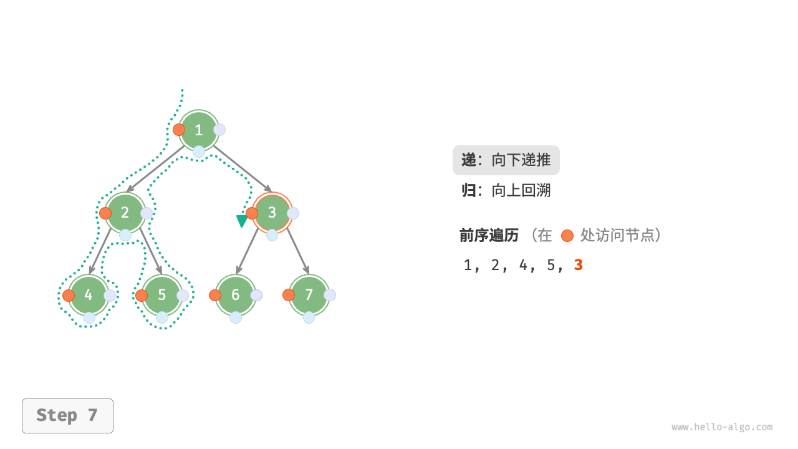
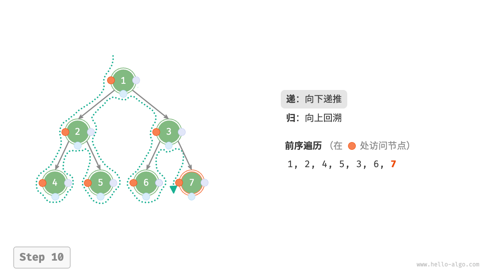

# 二叉树遍历

从物理结构的角度来看，树是一种基于链表的数据结构，因此其遍历方式是通过指针逐个访问节点。然而，树是一种非线性数据结构，这使得遍历树比遍历链表更加复杂，需要借助搜索算法来实现。

二叉树常见的遍历方式包括层序遍历、前序遍历、中序遍历和后序遍历等。

## 层序遍历

如下图所示，「层序遍历 level-order traversal」从顶部到底部逐层遍历二叉树，并在每一层按照从左到右的顺序访问节点。

层序遍历本质上属于「广度优先遍历 breadth-first traversal」，也称「广度优先搜索 breadth-first search, BFS」，它体现了一种“一圈一圈向外扩展”的逐层遍历方式。


### 代码实现

广度优先遍历通常借助“队列”来实现。队列遵循“先进先出”的规则，而广度优先遍历则遵循“逐层推进”的规则，两者背后的思想是一致的。实现代码如下：

- "Python"
```python
def level_order(root: TreeNode | None) -> list[int]:
    """层序遍历"""
    # 初始化队列，加入根节点
    queue: deque[TreeNode] = deque()
    queue.append(root)
    # 初始化一个列表，用于保存遍历序列
    res = []
    while queue:
        node: TreeNode = queue.popleft()  # 队列出队
        res.append(node.val)  # 保存节点值
        if node.left is not None:
            queue.append(node.left)  # 左子节点入队
        if node.right is not None:
            queue.append(node.right)  # 右子节点入队
    return res
```  

- "C++"
```cpp
/* 层序遍历 */
vector<int> levelOrder(TreeNode *root) {
    // 初始化队列，加入根节点
    queue<TreeNode *> queue;
    queue.push(root);
    // 初始化一个列表，用于保存遍历序列
    vector<int> vec;
    while (!queue.empty()) {
        TreeNode *node = queue.front();
        queue.pop();              // 队列出队
        vec.push_back(node->val); // 保存节点值
        if (node->left != nullptr)
            queue.push(node->left); // 左子节点入队
        if (node->right != nullptr)
            queue.push(node->right); // 右子节点入队
    }
    return vec;
}
```  

- "Java"
```java
/* 层序遍历 */
List<Integer> levelOrder(TreeNode root) {
    // 初始化队列，加入根节点
    Queue<TreeNode> queue = new LinkedList<>();
    queue.add(root);
    // 初始化一个列表，用于保存遍历序列
    List<Integer> list = new ArrayList<>();
    while (!queue.isEmpty()) {
        TreeNode node = queue.poll(); // 队列出队
        list.add(node.val);           // 保存节点值
        if (node.left != null)
            queue.offer(node.left);   // 左子节点入队
        if (node.right != null)
            queue.offer(node.right);  // 右子节点入队
    }
    return list;
}
```  

### 复杂度分析

- **时间复杂度为 $O(n)$** ：所有节点被访问一次，使用 $O(n)$ 时间，其中 $n$ 为节点数量。
- **空间复杂度为 $O(n)$** ：在最差情况下，即满二叉树时，遍历到最底层之前，队列中最多同时存在 $(n + 1) / 2$ 个节点，占用 $O(n)$ 空间。

## 前序、中序、后序遍历

相应地，前序、中序和后序遍历都属于「深度优先遍历 depth-first traversal」，也称「深度优先搜索 depth-first search, DFS」，它体现了一种“先走到尽头，再回溯继续”的遍历方式。

下图展示了对二叉树进行深度优先遍历的工作原理。**深度优先遍历就像是绕着整棵二叉树的外围“走”一圈**，在每个节点都会遇到三个位置，分别对应前序遍历、中序遍历和后序遍历。


### 代码实现

深度优先搜索通常基于递归实现：

- "Python"
```python
def pre_order(root: TreeNode | None):
    """前序遍历"""
    if root is None:
        return
    # 访问优先级：根节点 -> 左子树 -> 右子树
    res.append(root.val)
    pre_order(root=root.left)
    pre_order(root=root.right)

def in_order(root: TreeNode | None):
    """中序遍历"""
    if root is None:
        return
    # 访问优先级：左子树 -> 根节点 -> 右子树
    in_order(root=root.left)
    res.append(root.val)
    in_order(root=root.right)

def post_order(root: TreeNode | None):
    """后序遍历"""
    if root is None:
        return
    # 访问优先级：左子树 -> 右子树 -> 根节点
    post_order(root=root.left)
    post_order(root=root.right)
    res.append(root.val)
```  

- "C++"
```cpp
/* 前序遍历 */
void preOrder(TreeNode *root) {
    if (root == nullptr)
        return;
    // 访问优先级：根节点 -> 左子树 -> 右子树
    vec.push_back(root->val);
    preOrder(root->left);
    preOrder(root->right);
}

/* 中序遍历 */
void inOrder(TreeNode *root) {
    if (root == nullptr)
        return;
    // 访问优先级：左子树 -> 根节点 -> 右子树
    inOrder(root->left);
    vec.push_back(root->val);
    inOrder(root->right);
}

/* 后序遍历 */
void postOrder(TreeNode *root) {
    if (root == nullptr)
        return;
    // 访问优先级：左子树 -> 右子树 -> 根节点
    postOrder(root->left);
    postOrder(root->right);
    vec.push_back(root->val);
}
```  

- "Java"
```java
/* 前序遍历 */
void preOrder(TreeNode root) {
    if (root == null)
        return;
    // 访问优先级：根节点 -> 左子树 -> 右子树
    list.add(root.val);
    preOrder(root.left);
    preOrder(root.right);
}

/* 中序遍历 */
void inOrder(TreeNode root) {
    if (root == null)
        return;
    // 访问优先级：左子树 -> 根节点 -> 右子树
    inOrder(root.left);
    list.add(root.val);
    inOrder(root.right);
}

/* 后序遍历 */
void postOrder(TreeNode root) {
    if (root == null)
        return;
    // 访问优先级：左子树 -> 右子树 -> 根节点
    postOrder(root.left);
    postOrder(root.right);
    list.add(root.val);
}
```  

!!! tip

    深度优先搜索也可以基于迭代实现，有兴趣的读者可以自行研究。

下图展示了前序遍历二叉树的递归过程，其可分为“递”和“归”两个逆向的部分。

1. “递”表示开启新方法，程序在此过程中访问下一个节点。
2. “归”表示函数返回，代表当前节点已经访问完毕。

- "<1>"
    

- "<2>"
    

- "<3>"
    

- "<4>"
    

- "<5>"
    

- "<6>"
    

- "<7>"
    

- "<8>"
    

- "<9>"
    

- "<10>"
    

- "<11>"
    

### 复杂度分析

- **时间复杂度为 $O(n)$** ：所有节点被访问一次，使用 $O(n)$ 时间。
- **空间复杂度为 $O(n)$** ：在最差情况下，即树退化为链表时，递归深度达到 $n$ ，系统占用 $O(n)$ 栈帧空间。
