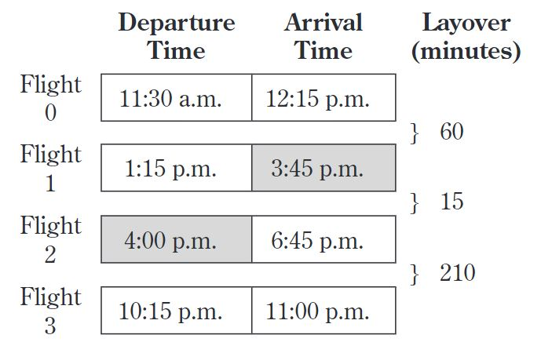
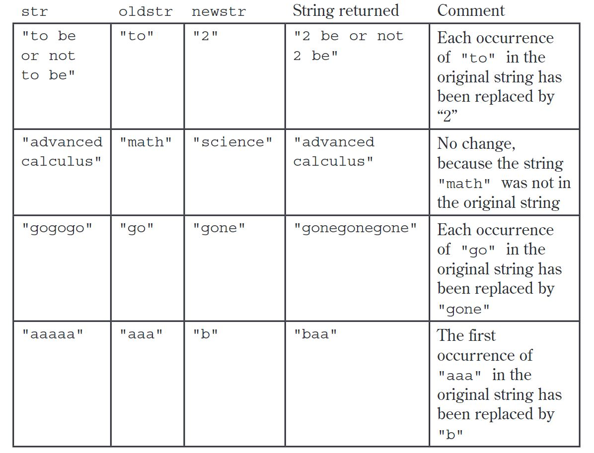
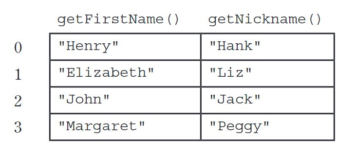
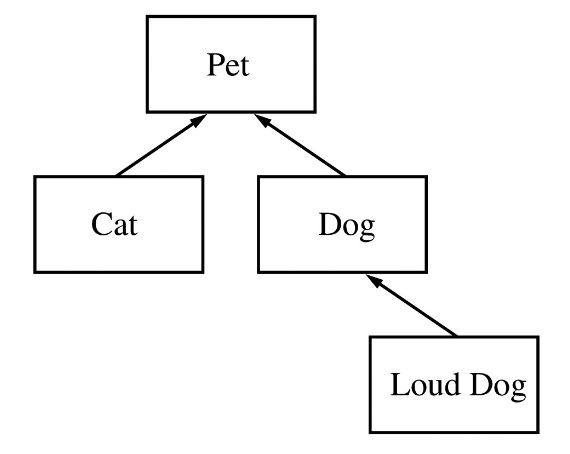

# 5\. AP计算机示例考题：主观题  
I. A travel agency maintains a list of information about airline flights. Flight information includes a departure time and an arrival time. You may assume that the two times occur on the same day. These times are represented by objects of the `Time` class.  
  
The declaration for the `Time` class is shown below. It includes a method `minutesUntil`, which returns the difference (in minutes) between the current `Time` object and another `Time` object.  
  
```Plain Text  
public class Time {  
 /** @return difference, in minutes, between this time and other;  
  *          difference is negative if other is earlier than this time  
  */  
 public int minutesUntil(Time other)  
 { /* implementation not shown */ }  
  // There may be instance variables, constructors, and methods that are not  
  // shown.  
}  
```  
For example, assume that `t1` and `t2` are `Time` objects where `t1` represents 1:00 p.m. and `t2` represents 2:15 p.m. The call `t1.minutesUntil(t2)` will return `75` and the call `t2.minutesUntil(t1)` will return `-75`.  
  
The declaration for the `Flight` class is shown below. It has methods to access the departure time and the arrival time of a flight. You may assume that the departure time of a flight is earlier than its arrival time.  
  
```Plain Text  
public class Flight {  
 /** @return time at which the flight departs  
  */  
 public Time getDepartureTime() { /* implementation not shown */ }  
  /** @return time at which the flight arrives  
   */  
 public Time getArrivalTime() { /* implementation not shown */ }  
  
 // There may be instance variables, constructors, and methods that are not shown.  
}  
```  
A trip consists of a sequence of flights and is represented by the `Trip` class. The `Trip` class contains a `List` of `Flight` objects that are stored in chronological order. You may assume that for each flight after the first flight in the list, the departure time of the flight is later than the arrival time of the preceding flight in the list. A partial declaration of the `Trip` class is shown below. You will write two methods for the `Trip` class.  
  
```Plain Text  
public class Trip {  
 /** The list of flights (if any) that make up this trip, stored in chronological  order  
  */  
 private List<Flight> flights;  
  
 /** @return the number of minutes from the departure of the first flight to the  
  * arrival of the last flight if there are one or more flights in the trip;  
  *    0, if there are no flights in the trip  
  */  
 public int getDuration() { /* to be implemented in part (a) */ }  
  
 /**  Precondition:  the departure time for each flight is later than the arrival  
  *  time of its preceding flight  
  *   @return the smallest number of minutes between the arrival of  
  *   a flight and the departure of the flight immediately after it,  
  *   if there are two or more flights in the trip;  
  *   -1, if there are fewer than two flights in the trip  
  */  
 public int getShortestLayover() { /* to be implemented in part (b) */ }  
  // There may be instance variables, constructors, and methods that are not  
  // shown.  
}  
```  
(a) Complete method `getDuration` below.  
  
```Plain Text  
/**  @return the number of minutes from the departure of the first  
 *   flight to the arrival of the last flight if there are one or  
 *   more flights in the trip;  
 *   0, if there are no flights in the trip  
 */  
public int getDuration()  
```  
(b) Write the `Trip` method `getShortestLayover`. A layover is the number of minutes from the arrival of one flight in a trip to the departure of the flight immediately after it. If there are two or more flights in the trip, the method should return the shortest layover of the trip; other wise, it should return `-1`.  
  
For example, assume that the instance variable `flights` of a `Trip` object `vacation` contains the following flight information.  
  
  
  
  
The call `vacation.getShortestLayover()` should return `15`.  
  
Complete method `getShortestLayover` below.  
  
```Plain Text  
/** Precondition: the departure time for each flight is later than the arrival  
 *             time of its preceding flight  
 *  @return the smallest number of minutes between the arrival of a  
 *         flight and the departure of the flight immediately after it, if  
 *         there are two or more flights in the trip;  
 *         -1, if there are fewer than two flights in the trip   */  
public int getShortestLayover()  
```  
II. Consider the following incomplete `StringUtil` class declaration. You will write implementations for the two methods listed in this class. Information about the `Person` class used in the `replaceNameNickname` method will be presented in part (b).  
  
```Plain Text  
public class StringUtil {  
 /** @param str a String with length> 0  
  *  @param oldstr a String  
  *  @param newstr a String  
  *  @return a new String in which all occurrences of the substring  
  *           oldstr in str are replaced by the substring newstr  
  */  
 public static String apcsReplaceAll(String str,  
   String oldStr,  
   String newStr) { /* to be implemented in part (a) */ }  
  /** @param str a String  
   *  @param people a list of references to Person objects  
   *  @return a copy of str modified so that each occurrence of a first  
   *        name in people is replaced by the corresponding nickname  
   */  
 public static String replaceNameNickname(String str, List<Person> people)  
  
 { /* to be implemented in part (b) */ }  
  
 // There may be methods that are not shown.  
}  
```  
(a) Write the `StringUtil` method `apcsReplaceAll`, which examines a given `String` and replaces all occurrences of a designated substring with another specified substring. In writing your solution, you may NOT use the `replace`, `replaceAll`, or `replaceFirst` methods in the Java `String` class.  
  
The following table shows several examples of the result of calling `StringUtil.apcsReplaceAll(str, oldstr, newstr)`.  
  
  
  
  
Complete method `apcsReplaceAll` below.  
  
```Plain Text  
/** @param str a String with length> 0  
 *  @param oldstr a String  
 *  @param newstr a String  
 *  @ return a new String in which all occurrences of the substring  
 *           oldstr in str are replaced by the substring newstr  
 */  
public static String apcsReplaceAll(String str,  
 String oldStr,  
 String newStr)  
```  
(b) The following `Person` class contains information that includes a first (given) name and a nickname for the person.  
  
```Plain Text  
public class Person {  
 /** @return the first name of this Person */  
 public String getFirstName() { /* implementation not shown */ }  
  
 /** @return the nickname of this Person */  
 public String getNickname() { /* implementation not shown */ }  
  // There may be instance variables, constructors, and methods not shown.  
}  
```  
Write the `StringUtil` method `replaceNameNickname`, which takes a string and a list of `Person` objects that contain first names and a corresponding nicknames. The method is to replace all names by their nicknames in the given string. The list of `Person` objects is processed in order from lowest index to highest index. In writing your solution, you may NOT use the `replace`, `replaceAll`, or `replaceFirst` methods in the Java `String` class.  
  
For example, assume the following table represents the data contained in the list `people`.  
  
  
  
  
Assume also that `String str` represents the following string.  
  
```Plain Text  
"After Henry drove Elizabeth to dinner in Johnson City, Henry paid for an appetizer and Elizabeth paid for dessert."  
```  
The call `StringUtil.replaceNameNickname(str, people)` should return the following string:  
  
```Plain Text  
"After Hank drove Liz to dinner in Jackson City, Hank paid for an appetizer and Liz paid for dessert."  
```  
In writing your solution, you must use the method `apcsReplaceAll` specified in the `StringUtil` class. Assume that `apcsReplaceAll` works as specified, regardless of what you wrote in part (a).  
  
Complete method `replaceNameNickname` below.  
  
```Plain Text  
/** @param str a String  
 *  @param people a list of references to Person objects  
 *  @return a copy of str modified so that each occurrence of a first  
 *          name in people is replaced by the corresponding nickname  
 */  
public static String replaceNameNickname(String str, List<Person> people)  
```  
III. Consider the hierarchy of classes shown in the following diagram.  
  
  
  
  
Note that a `Cat`“is-a”`Pet`, a Dog“is-a”`Pet`, and a `LoudDog`“is-a”`Dog`.  
  
The class `Pet` is specified as an abstract class as shown in the following declaration. Each `Pet` has a name that is specified when it is constructed.  
  
```Plain Text  
public abstract class Pet {  
 private String name;  
  
 public Pet(String petName) {  
  name = petName;  
 }  
  
 public String getName() {  
  return name;  
 }  
  
 public abstract String speak();  
}  
```  
The subclass `Dog` has the partial class declaration shown below.  
  
```Plain Text  
public class Dog extends Pet {  
 public Dog(String petName)  
 { /* implementation not shown */ }  
  
 public String speak()  
 { /* implementation not shown */ }  
}  
```  
(a) Given the class hierarchy shown above, write a complete class declaration for the class `Cat`, including implementations of its constructor and method(s). The `Cat` method `speak` returns `"meow"` when it is invoked.  
  
(b) Assume that class `Dog` has been declared as shown at the beginning of the question. If the `String dog-sound` is returned by the `Dog` method `speak`, then the `LoudDog` method `speak` returns a `String` containing `dog-sound` repeated two times.  
  
Given the class hierarchy shown previously, write a complete class declaration for the class `LoudDog`, including implementations of its constructor and method(s).  
  
(c) Consider the following partial declaration of class `Kennel`.  
  
```Plain Text  
public class Kennel {  
 private List < Pet > petList;  
  
 /** For every Pet in the kennel, prints the name followed by  
  *the result of a call to its speak method, one line per Pet.  
  */  
 public void allSpeak() { /* to be implemented in part (c) */ }  
  // There may be instance variables, constructors, and methods that are  
  // not shown.  
}  
```  
Write the `Kennel` method `allSpeak`. For each `Pet` in the kennel, `allSpeak` prints a line with the name of the `Pet` followed by the result of a call to its `speak` method.  
  
In writing `allSpeak`, you may use any of the methods defined for any of the classes specified for this problem. Assume that these methods work as specified, regardless of what you wrote in parts (a) and (b).  
  
Complete method `allSpeak` below.  
  
```Plain Text  
/** For each Pet in the kennel, prints the name followed by  
 *  the result of a call to its speak method, one line per Pet.  
 */  
public void allSpeak()  
```  
IV. This question involves manipulation of one-dimensional and two-dimensional arrays. In part (a), you will write a method to shift the elements of a one-dimensional array. In parts (b) and (c), you will write methods to shift the elements of a two-dimensional array.  
  
(a) Consider the following incomplete `ArrayUtil` class, which contains a `static shiftArray` method.  
  
```Plain Text  
public class ArrayUtil {  
 /** Shifts each array element to the next higher index, discarding the  
  *  original last element,and inserts the new number at the front.  
  *  @param arr the array to manipulate  
  *         Precondition: arr.length > 0  
  *  @param num the new number to insert at the front of arr  
  *  Postcondition:The original elements of arr have been shifted to  
  *              the next higher index, and arr[0] == num.  
  *              The original element at the highest index has been  
  *              discarded.  
  */  
 public static void shiftArray(int[] arr, int num) { /* to be implemented in part (a) */ }  
  
 // There may be methods that are not shown.  
}  
```  
Write the `ArrayUtil` method `shiftArray`. This method stores the integer `num` at the front of the array `arr` after shifting each of the original elements to the position with the next higher index. The element originally at the highest index is lost.  
  
For example, if `arr` is the array `{11, 12, 13, 14, 15}` and `num` is `27`, the call to `shiftArray` changes `arr` as shown below.  
  
  
  
  
Complete method `shiftArray` below.  
  
```Plain Text  
/** Shifts each array element to the next higher index, discarding the  
 *  original last element, and inserts the new number at the front.  
 *  @param arr the array to manipulate  
 *         Precondition: arr.length > 0  
 *  @Param num the new number to insert at the front of arr  
 *  Postcondition: The original elements of arr have been shifted to  
 *             the next higher index, and arr[0] == num.  
 *             The original element at the highest index has been  
 *             discarded.  
 */  
public static void shiftArray(int[] arr, int num)  
```  
(b) Consider the following incomplete `NumberMatrix` class, which represents a two-dimensional matrix of integers. Assume that the matrix contains at least one integer.  
  
```Plain Text  
public class NumberMatrix {  
 private int[][] matrix;  
 /** Constructs a number matrix. */  
 public NumberMatrix(int[][] m) {  
   matrix = m;  
  }  
  /** Shifts each matrix element to the next position in row-major order  
   *  and inserts the new number at the front. The last element in the last  
   *  row is discarded.  
   *  @param num the new number to insert at the front of matrix  
   *  Postcondition:The original elements of matrix have been shifted to  
   *             the next higher position in row-major order, and  
   *             matrix[0][0] == num.  
   *             The original last element in the last row is discarded.  
   */  
 public void shiftMatrix(int num) { /* to be implemented in part (b) */ }  
  /** Rotates each matrix element to the next higher position in row-major  
   *  order.  
   *  Postcondition:The original elements of matrix have been shifted  
   *             to the next higher position in row-major order, and  
   *             matrix[0][0] ==the original last element.  
   */  
 public void rotateMatrix() { /* to be implemented in part (c) */ }  
  // There may be instance variables, constructors, and methods that are not  
  // shown.  
}  
```  
Write the `NumberMatrix` method `shiftMatrix`. This method stores a new value `num` into the two-dimensional array `matrix` after shifting the elements to the next higher position in row-major order. The element originally at the last position in row-major order is lost.  
  
For example, if `m1` is a reference to a `NumberMatrix` object, then the call `m1.shiftMatrix(48)` will change the values in `matrix` as shown below.  
  
  
  
  
In writing `shiftMatrix`, you must call the`shiftArray` method in part (a). Assume that `shiftArray` works correctly regardless of what you wrote in part (a).  
  
Complete method `shiftMatrix` below.  
  
```Plain Text  
/** Shifts each matrix element to the next position in row-major order  
 *  and inserts the new number at the front. The last element in the last  
 *  row is discarded.  
 *  @param num the new number to insert at the front of matrix  
 *  Postcondition:The original elements of matrix have been shifted  
 *              to the next higher position in row-major order, and  
 *              matrix[0][0] == num.  
 *              The original last element in the last row is discarded.  
 */  
public void shiftMatrix(int num)  
```  
(c) Write the `NumberMatrix` method `rotateMatrix`. This method rotates all the elements to the next position in row-major order. The element originally at the last position is stored in the first position of the matrix.  
  
In writing `rotateMatrix`, you must call the `shiftMatrix` method in part (b). Assume that `shiftMatrix` works correctly regardless of what you wrote in part (b).  
  
Complete method `rotateMatrix` below.  
  
```Plain Text  
/** Rotates each matrix element to the next higher position in row-major  
 *  order.  
 *  Postcondition:The original elements of matrix have been shifted to  
 *             the next higher position in row-major order, and  
 *             matrix[0][0] == the original last element.  
 */  
public void rotateMatrix()  
```  
