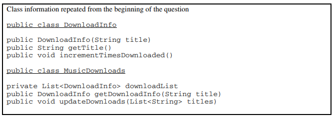
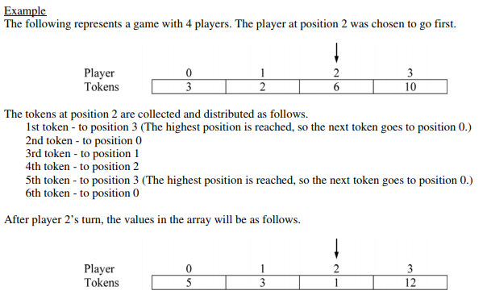
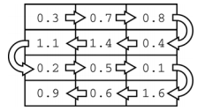
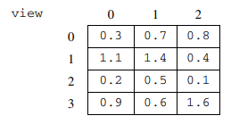
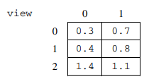
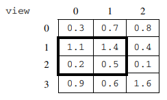

# 12\. AP计算机2013年考试：主观题  
I. A music Web site keeps track of downloaded music. For each download, the site uses a `DownloadInfo` object to store a song’s title and the number of times it has been downloaded. A partial declaration for the `DownloadInfo` class is shown below.  
  
```Plain Text  
public class DownloadInfo  
{  
    /** Creates a new instance with the given unique title and sets the  
     * number of times downloaded to 1.  
     * @param title the unique title of the downloaded song  
     */  
    public DownloadInfo(String title)  
    { /* implementation not shown */ }  
  
    /** @return the title */  
    public String getTitle()  
    { /* implementation not shown */ }  
  
    /** Increment the number times downloaded by 1 */  
    public void incrementTimesDownloaded()  
    { /* implementation not shown */ }  
  
    // There may be instance variables, constructors, and methods that are not shown.  
}   
```  
The list of downloaded information is stored in a `MusicDownloads` object. A partial declaration for the `MusicDownloads` class is shown below.  
  
```Plain Text  
public class MusicDownloads  
{  
    /** The list of downloaded information.  
     * Guaranteed not to be null and not to contain duplicate titles.  
     */  
    private List<DownloadInfo> downloadList;  
  
    /** Creates the list of downloaded information. */  
    public MusicDownloads()  
    { downloadList = new ArrayList<DownloadInfo>(); }  
  
    /** Returns a reference to the DownloadInfo object with the requested title if it exists.  
     * @param title the requested title  
     * @return a reference to the DownloadInfo object with the  
     * title that matches the parameter title if it exists in the list;  
     * null otherwise.  
     * Postcondition:  
     * - no changes were made to downloadList.  
     */  
    public DownloadInfo getDownloadInfo(String title)  
    { /* to be implemented in part (a) */ }  
  
    /** Updates downloadList with information from titles.  
     * @param titles a list of song titles  
     * Postcondition:  
     * - there are no duplicate titles in downloadList.  
     * - no entries were removed from downloadList.  
     * - all songs in titles are represented in downloadList.  
     * - for each existing entry in downloadList, the download count is increased by  
     * the number of times its title appeared in titles.  
     * - the order of the existing entries in downloadList is not changed.  
     * - the first time an object with a title from titles is added to downloadList, it  
     * is added to the end of the list.  
     * - new entries in downloadList appear in the same order  
     * in which they first appear in titles.  
     * - for each new entry in downloadList, the download count is equal to  
     * the number of times its title appeared in titles.  
     */  
    public void updateDownloads(List<String> titles)  
    { /* to be implemented in part (b) */ }  
  
    // There may be instance variables, constructors, and methods that are not shown.  
}   
```  
(a) Write the `MusicDownloads` method `getDownloadInfo`, which returns a reference to a `DownloadInfo` object if an object with a title that matches the parameter `title` exists in the `downloadList`. If no song in `doanloadList` has a title that matches the parameter `title`, the method returns `null`.  
  
For example, suppose variable `webMusicA` refers to an instance of `MusicDownloads` and that the table below represents the contents of `downloadList`. The list contains three `DownloadInfo` objects. The object at position 0 has a title of “Hey Jude” and a download count of 5. The object at position 1 has a title of “Soul Sister” and a download count of 3. The object at position 2 has a title of “Aqualung” and a download count of 10.  
  
  
  
The call `webMusicA.getDownloadInfo("Aqualung")` returns a reference to the object in position 2 of the list.  
  
The call `webMusicA.getDownloadInfo("Happy Birthday")` returns `null` because there are no `DownloadInfo` objects with that title in the list.  
  
  
  
Complete method `getDownloadInfo` below.  
  
```Plain Text  
/** Returns a reference to the DownloadInfo object with the requested title if it exists.  
 * @param title the requested title  
 * @return a reference to the DownloadInfo object with the  
 * title that matches the parameter title if it exists in the list;  
 * null otherwise.  
 * Postcondition:  
 * - no changes were made to downloadList.  
 */  
public DownloadInfo getDownloadInfo(String title)  
```  
(b) Write the `MusicDownloads` method `updateDownloads`, which takes a list of song titles as a parameter. For each title in the list, the method updates `downloadList`, either by incrementing the download count if a `DownloadInfo` object with the same title exists, or by adding a new `DownloadInfo` object with that title and a download count of 1 to the end of the list. When a new `DownloadInfo` object is added to the end of the list, the order of the already existing entries in `downloadList` remains unchanged.  
  
For example, suppose variable `webMusicB` refers to an instance of `MusicDownloads` and that the table below represents the contents of the instance variable `downloadList`.  
  
  
  
Assume that the variable `List<String> songTitles` has been defined and contains the following entries.  
  
```Plain Text  
{"Lights", "Aqualung", "Soul Sister", "Go Now", "Lights", "Soul Sister"}  
```  
The call `webMusicB.updateDownloads(songTitles)` results in the following `downloadList` with incremented download counts for the objects with titles of “Soul Sister” and “Aqualung”. It also has a new `DownloadInfo` object with a title of “Lights” and a download count of 2, and another `DownloadInfo` object with a title of “Go Now” and a download count of 1. Ther order of the already existing entries remains unchanged.  
  
  
  
  
  
In writing your solution, you must use the `getDownloadInfo` method. Assume that `getDownloadInfo` works as specified, regardless of what you wrote for part (a).  
  
Complete method `updateDownloads` below.  
  
```Plain Text  
/** Updates downloadList with information from titles.  
 * @param titles a list of song titles  
 * Postcondition:  
 * - there are no duplicate titles in downloadList.  
 * - no entries were removed from downloadList.  
 * - all songs in titles are represented in downloadList.  
 * - for each existing entry in downloadList, the download count is increased by  
 * the number of times its title appeared in titles.  
 * - the order of the existing entries in downloadList is not changed.  
 * - the first time an object with a title from titles is added to downloadList, it  
 * is added to the end of the list.  
 * - new entries in downloadList appear in the same order  
 * in which they first appear in titles.  
 * - for each new entry in downloadList, the download count is equal to  
 * the number of times its title appeared in titles.  
 */  
public void updateDownloads(List<String> titles)   
```  
II. A multiplayer game called Token Pass has the following rules.  
  
Each player begins with a random number of tokens (at least 1, but no more than 10) that are placed on a linear game board. There is one position on the game board for each player. After the game board has been filled, a player is randomly chosen to begin the game. Each position on the board is numbered, starting with 0.  
  
The following rules apply for a player’s turn.  
  
* The tokens are collected and removed from the game board at that player’s position.  
* The collected tokens are distributed one at a time, to each player, beginning with the next player in order of increasing position.  
* If there are still tokens to distribute after the player at the highest position gets a token, the next token will be distributed to the player at position 0.  
* The distribution of tokens continues until there are no more tokens to distribute.  
  
The Token Pass game board is represented by an array of integers. The indexes of the array represent the player positions on the game board, and the corresponding values in the array represent the number of tokens that each player has. The following example illustrates one player’s turn.  
  
  
  
The Token Pass game is represented by the `TokenPass` class.  
  
```Plain Text  
public class TokenPass  
{  
    private int[] board;  
    private int currentPlayer;  
  
    /** Creates the board array to be of size playerCount and fills it with  
     * random integer values from 1 to 10, inclusive. Initializes currentPlayer to a  
     * random integer value in the range between 0 and playerCount-1, inclusive.  
     * @param playerCount the number of players  
     */  
    public TokenPass(int playerCount)  
    { /* to be implemented in part (a) */ }  
  
    /** Distributes the tokens from the current player's position one at a time to each player in  
     * the game. Distribution begins with the next position and continues until all the tokens  
     * have been distributed. If there are still tokens to distribute when the player at the  
     * highest position is reached, the next token will be distributed to the player at position 0.  
     * Precondition: the current player has at least one token.  
     * Postcondition: the current player has not changed.  
     */  
    public void distributeCurrentPlayerTokens()  
    { /* to be implemented in part (b) */ }  
  
    // There may be instance variables, constructors, and methods that are not shown.  
}   
```  
(a) Write the constructor for the `TokenPass` class. The parameter `playerCount` represents the number of players in the game. The constructor should create the `board` array to contain `playerCount` elements and fill the array with random numbers between 1 and 10, inclusive. The constructor should also initialize the instance variable `currentPlayer` to a random number between 0 and `playerCount - 1`, inclusive.  
  
Complete the `TokenPass` constructor below.  
  
```Plain Text  
/** Creates the board array to be of size playerCount and fills it with  
 * random integer values from 1 to 10, inclusive. Initializes currentPlayer to a  
 * random integer value in the range between 0 and playerCount-1, inclusive.  
 * @param playerCount the number of players  
 */  
public TokenPass(int playerCount)   
```  
(b) Write the `distributeCurrentPlayerTokens` method.  
  
The tokens are collected and removed from the game board at the current player’s position. These tokens are distributed, one at a time, to each player, beginning with the next higher position, until there are no more tokens to distribute.  
  
  
  
Complete method `distributeCurrentPlayerTokens` below.  
  
```Plain Text  
/** Distributes the tokens from the current player's position one at a time to each player in  
 * the game. Distribution begins with the next position and continues until all the tokens  
 * have been distributed. If there are still tokens to distribute when the player at the  
 * highest position is reached, the next token will be distributed to the player at position 0.  
 * Precondition: the current player has at least one token.  
 * Postcondition: the current player has not changed.  
 */  
public void distributeCurrentPlayerTokens()   
```  
**III题涉及当前已被移出考试范围的GridWorld case study。**  
  
IV. A telescope scans a rectangular area of the night sky and collects the data into a 1-dimensional array. Each data value scanned is a number representing the amount of light detected by the telescope. The telescope scans back and forth across the sky (alternating between left to right and right to left) in the pattern indicated below by the arrows. The back-and-forth ordering of the values received from the scan is called *telescope order*.  
  
  
  
The telescope records the data in telescope order into a 1-dimensional array of `double` values. This 1-dimensional array of information received from a single scan will be transferred into a 2-dimensional array, which reconstructs the original view of the rectangular area of the sky. This 2-dimensional array is part of the `SkyView` class, shown below. In this question you will write a constructor and a method for this class.  
  
```Plain Text  
public class SkyView  
{  
    /** A rectangular array that holds the data representing a rectangular area of the sky. */  
    private double[][] view;  
  
    /** Constructs a SkyView object from a 1-dimensional array of scan data.  
     * @param numRows the number of rows represented in the view  
     * Precondition: numRows > 0  
     * @param numCols the number of columns represented in the view  
     * Precondition: numCols > 0  
     * @param scanned the scan data received from the telescope, stored in telescope order  
     * Precondition: scanned.length == numRows * numCols  
     * Postcondition: view has been created as a rectangular 2-dimensional array  
     * with numRows rows and numCols columns and the values in  
     * scanned have been copied to view and are ordered as  
     * in the original rectangular area of sky.  
     */  
    public SkyView(int numRows, int numCols, double[] scanned)  
    { /* to be implemented in part (a) */ }  
  
    /** Returns the average of the values in a rectangular section of view.  
     * @param startRow the first row index of the section  
     * @param endRow the last row index of the section  
     * @param startCol the first column index of the section  
     * @param endCol the last column index of the section  
     * Precondition: 0 <= startRow <= endRow < view.length  
     * Precondition: 0 <= startCol <= endCol < view[0].length  
     * @return the average of the values in the specified section of view  
     */  
    public double getAverage(int startRow, int endRow, int startCol, int endCol)  
    { /* to be implemented in part (b) */ }  
  
    // There may be instance variables, constructors, and methods that are not shown.  
}   
```  
(a) Write the constructor for the `SkyView` class. The constructor initializes the `view` instance variable to a 2-dimensional array with `numRows` rows and `numCols` columns. The information from `scanned`, which is stored in the telescope order, is copied into `view` to reconstruct the sky view as originally seen by the telescope. The information in `scanned` must be rearranged as it is stored into `view` so that the sky view is oriented properly.  
  
For example, suppose `scanned` contains, values, as shown in the following array.  
  
  
  
Using the `scanned` array above, a `SkyView` object created with `new SkyView(4, 3, values)`, would have `view` initialized with the following values.  
  
  
  
For another example, suppose `scanned` contains the following values.  
  
  
  
A `SkyView` object created with `new SkyView(3, 2, values)`, would have `view` initialized with the following values.  
  
  
  
Complete the `SkyView` constructor below.  
  
```Plain Text  
/** Constructs a SkyView object from a 1-dimensional array of scan data.  
 * @param numRows the number of rows represented in the view  
 * Precondition: numRows > 0  
 * @param numCols the number of columns represented in the view  
 * Precondition: numCols > 0  
 * @param scanned the scan data received from the telescope, stored in telescope order  
 * Precondition: scanned.length == numRows * numCols  
 * Postcondition: view has been created as a rectangular 2-dimensional array  
 * with numRows rows and numCols columns and the values in  
 * scanned have been copied to view and are ordered as  
 * in the original rectangular area of sky.  
 */  
public SkyView(int numRows, int numCols, double[] scanned)  
```  
(b) Write the `SkyView` method `getAverage`, which returns the average of the elements of the section of `view` with row indexes from `startRow` through `endRow`, inclusive, and column indexes from `startCol` through `endCol`, inclusive.  
  
For example, if `nightSky` is a `SkyView` object where `view` contains the values shown below, the call `nightSky,getAverage(1, 2, 0, 1)` should return `0.8`. (The average is `(1.1 + 1.4 + 0.2 + 0.5) / 4`, which equals `0.8`). The section being averaged is indicated by the dark outline in the table below.  
  
  
  
  
  
Complete method `getAverage` below.  
  
```Plain Text  
/** Returns the average of the values in a rectangular section of view.  
 * @param startRow the first row index of the section  
 * @param endRow the last row index of the section  
 * @param startCol the first column index of the section  
 * @param endCol the last column index of the section  
 * Precondition: 0 <= startRow <= endRow < view.length  
 * Precondition: 0 <= startCol <= endCol < view[0].length  
 * @return the average of the values in the specified section of view  
 */  
public double getAverage(int startRow, int endRow, int startCol, int endCol)  
```  
