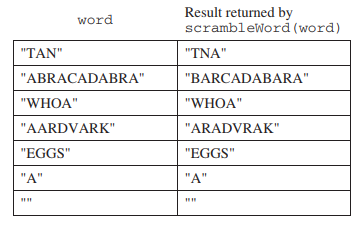
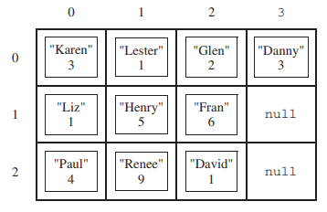
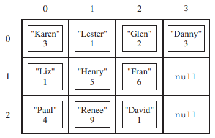
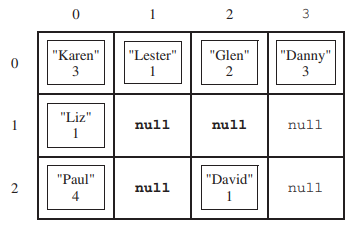
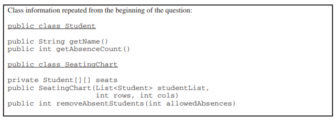
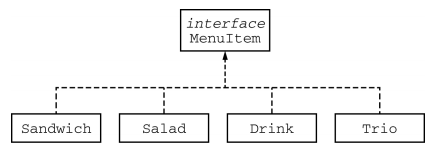

# 11\. AP计算机2014年考试：主观题  
I. This question involves reasoning about strings made up of uppercase letters. You will implement two related methods that appear in the same class (not shown). The first method takes a single parameter and returns a scrambled version of that string. The second method takes a list of strings and modifies the list by scrambling each entry in the list. Any entry that cannot be scrambled is removed from the list.  
  
(a) Write the method `scrambleWord`, which takes a given word and returns a string that contains a scrambled version of the word according to the following rules.  
  
* The scrambling process begins at the first letter of the word and continues from left to right.  
* If two consecutive letters consist of an “A” followed by a letter that is not an “A”, then the two letters are swapped in the resulting string.  
* Once the letters in two adjacent positions have been swapped, neither of those two positions can be involved in a future swap.  
  
The following table shows several examples of words and their scrambled versions.  
  
  
  
Complete method `scrambleWord` below.  
  
```java  
 /** Scrambles a given word.  
  * @param word the word to be scrambled  
  * @return the scrambled word (possibly equal to word)  
  * Precondition: word is either an empty string or contains only uppercase letters.  
  * Postcondition: the string returned was created from word as follows:  
  * - the word was scrambled, beginning at the first letter and continuing from left to right  
  * - two consecutive letters consisting of "A" followed by a letter that was not "A" were swapped  
  * - letters were swapped at most once  
  */  
 public static String scrambleWord(String word)   
```  
(b) Write the method `scrambleOrRemove`, which replaces each word in the parameter `wordList` with its scrambled version and removes any words that are unchanged after scrambling. The relative ordering of the entries in `wordList` remains the same as before the call to `scrambleOrRemove`.  
  
The following example shows how the contents of `wordList` would be modified as a result of calling `scrambleOrRemove`.  
  
Before the call to `scrambleOrRemove`:  
  
  
  
After the call to `scrambleOrRemove`:  
  
  
  
Assume that `scrambleWord` is in the same class as `scrambleOrRemove` and works as specified, regardless of what you wrote in part (a).  
  
Complete method `scrambleOrRemove` below.  
  
```java  
 /** Modifies wordList by replacing each word with its scrambled  
 * version, removing any words that are unchanged as a result of scrambling.  
 * @param wordList the list of words  
 * Precondition: wordList contains only non-null objects  
 * Postcondition:  
 * - all words unchanged by scrambling have been removed from wordList  
 * - each of the remaining words has been replaced by its scrambled version  
 * - the relative ordering of the entries in wordList is the same as it was  
 * before the method was called  
 */  
public static void scrambleOrRemove(List<String> wordList)  
```  
**II题涉及当前已被移出考试范围的GridWorld case study。**  
  
III. A student in a school is represented by the following class.  
  
```java  
public class Student  
{  
    /** Returns the name of this Student. */  
    public String getName()  
    { /* implementation not shown */ }  
  
    /** Returns the number of times this Student has missed class. */  
    public int getAbsenceCount()  
    { /* implementation not shown */ }  
  
    // There may be instance variables, constructors, and methods that are not shown.  
}  
```  
The class `SeatingChart`, shown below, uses a two-dimensional array to represent the seating arrangement of students in a classroom. The seats in the classroom are in a rectangular arrangement of rows and columns.  
  
```java  
public class SeatingChart  
{  
    /** seats[r][c] represents the Student in row r and column c in the classroom. */  
    private Student[][] seats;  
  
    /** Creates a seating chart with the given number of rows and columns from the students in  
     * studentList. Empty seats in the seating chart are represented by null.  
     * @param rows the number of rows of seats in the classroom  
     * @param cols the number of columns of seats in the classroom  
     * Precondition: rows > 0; cols > 0;  
     * rows * cols >= studentList.size()  
     * Postcondition:  
     * - Students appear in the seating chart in the same order as they appear  
     * in studentList, starting at seats[0][0].  
     * - seats is filled column by column from studentList, followed by any  
     * empty seats (represented by null).  
     * - studentList is unchanged.  
     */  
    public SeatingChart(List<Student> studentList, int rows, int cols)  
    { /* to be implemented in part (a) */ }  
  
    /** Removes students who have more than a given number of absences from the  
     * seating chart, replacing those entries in the seating chart with null  
     * and returns the number of students removed.  
     * @param allowedAbsences an integer >= 0  
     * @return number of students removed from seats  
     * Postcondition:  
     * - All students with allowedAbsences or fewer are in their original positions in seat  
     * - No student in seats has more than allowedAbsences absences.  
     * - Entries without students contain null.  
     */  
    public int removeAbsentStudents(int allowedAbsences)  
    { /* to be implemented in part (b) */ }  
  
    // There may be instance variables, constructors, and methods that are not shown.  
}  
```  
(a) Write the constructor for the `SeatingChart` class. The constructor initializes the `seats` instance variable to a two-dimensional array with the given number of rows and columns. The students in `studentList` are copied into the seating chart in the order in which they appear in `studentList`. The students are assigned to consecutive locations in the array `seats`, starting at `seats[0][0]` and filling the array column by column. Empty seats in the seating chart are represented by `null`.  
  
For example, suppose a variable `List<Student> roster` contains reference to `Student` objects in the following order.  
  
  
  
A `SeatingChart` object created with the call `new SeatingChart(roster, 3, 4)` would have `seats` initialized with the following values.  
  
  
  
Complete the `SeatingChart` constructor below.  
  
```java  
/** Creates a seating chart with the given number of rows and columns from the students in  
 * studentList. Empty seats in the seating chart are represented by null.  
 * @param rows the number of rows of seats in the classroom  
 * @param cols the number of columns of seats in the classroom  
 * Precondition: rows > 0; cols > 0;  
 * rows * cols >= studentList.size()  
 * Postcondition:  
 * - Students appear in the seating chart in the same order as they appear  
 * in studentList, starting at seats[0][0].  
 * - seats is filled column by column from studentList, followed by any  
 * empty seats (represented by null).  
 * - studentList is unchanged.  
 */  
public SeatingChart(List<Student> studentList, int rows, int cols)  
```  
(b) Write the `removeAbsentStudents` method, which removes students who have more than a given number of absences from the seating chart and returns the number of students that were removed. When a student is removed from the seating chart, a `null` is placed in the entry for that student in the array `seats`. For example, suppose the variable `SeatingChart introCS` has been created such that the array `seats` contains the following entries showing both students and their number of absences.  
  
  
  
After the call `introCS.removeAbsentStudents(4)` has executed, the array `seats` would contain the following values and the method would return the value 3.  
  
  
  
  
  
Complete method `removeAbsentStudents` below.  
  
```java  
/** Removes students who have more than a given number of absences from the  
 * seating chart, replacing those entries in the seating chart with null  
 * and returns the number of students removed.  
 * @param allowedAbsences an integer >= 0  
 * @return number of students removed from seats  
 * Postcondition:  
 * - All students with allowedAbsences or fewer are in their original positions in seat  
 * - No student in seats has more than allowedAbsences absences.  
 * - Entries without students contain null.  
 */  
public int removeAbsentStudents(int allowedAbsences)  
```  
IV. The menu at a lunch counter includes a variety of sandwiches, salads, and drinks. The menu also allows a customer to create a “trio,” which consists of three menu items: a sandwich, a salad, and a drink. The price of the trio is the sume of the two highest-priced menu items in the trio; one item with the lowest price is free.  
  
Each menu item has a name and a price. The four types of menu items are represented by the four classes `Sandwich`, `Salad`, `Drink`, and `Trio`. All four classes implement the following `MenuItem` inerface.  
  
```java  
public interface MenuItem  
{  
    /** @return the name of the menu item */  
    String getName();  
  
    /** @return the price of the menu item */  
    double getPrice();   
}  
```  
The following diagram shows the relationship between the `MenuItem` interface and the `Sandwich`, `Salad`, `Drink`, and `Trio` classes.  
  
  
  
For example, assume that the menu includes the following items. The objects listed under each heading are instances of the class indicated by the heading.  
  
  
  
The menu allows customers to create `Trio` menu items, each of which includes a sandwich, a salad, and a drink. The name of the `Trio` consists of the names of the sandwich, salad, and drink, in that order, each separated by `"/"` and followed by a space and then `"trio"`. The price of the `"trio"` is the sum of the two highest-priced items in the `"Trio"`; one item with the lowest price is free.  
  
A trio consisting of a cheeseburger, spinach salad, and an organe soda would have the name `"Cheeseburger/Spinach Salad/Orange Soda Trio"` and a price of \$4.00 (the two highest prices are \$2.75 and \$1.25). Similarily, a trio consisting of a club sandwich, coleslaw, and a cappuccino would have the name `"Club Sandwich/Coleslaw/Cappuccino Trio"` and a price of \$6.25 (the two highest prices are \$2.75 and \$3.50).  
  
Write the `Trio` class that implements the `MenuItem` interface. Your implementation must include a constructor that takes three parameters representing a sandwich, salad, and drink. The following code segment should have the indicated behavior.  
  
```java  
Sandwich sandwich;  
Salad salad;  
Drink drink;  
/* Code that initializes sandwich, salad, and drink */  
  
Trio trio = new Trio(sandwich, salad, drink); // Compiles without error  
Trio trio1 = new Trio(salad, sandwich, drink); // Compile-time error  
Trio trio2 = new Trio(sandwich, salad, salad); // Compile-time error  
```  
Write the complete `Trio` class below.  
