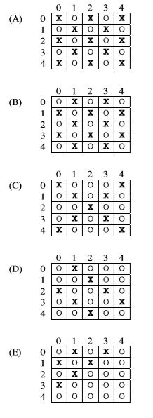

# 2\. AP计算机2015年考试：多项选择  
Consider the following incomplete method, which is intended to return the number of integers that evenly divide the integer `inputVal`. Assume that `inputVal` is greater than 0.  
  
```java  
public static int numDivisors(int inputVal)  
{  
    int count = 0;  
    for (int k = 1; k <=inputVal; k++)  
    {  
        if ( /* condition */ )  
        {  
            count++;  
        }  
    }  
    return count;  
}  
  
```  
Which of the following can be used to replace /\* condition \*/ so that `numDivisors` will work as intended?    
  
  
  
```java  
inputVal % k == 0  
```  
```java  
k % inputVal == 0  
```  
```java  
inputVal % k != 0  
```  
```java  
inputVal / k == 0  
```  
```java  
k / inputVal > 0  
```  
---  
Consider the following code segment.  
  
```java  
for (int r = 3; r > 0; r--)  
{  
    int c;  
  
    for (c = 1; c < r; c++)  
    {  
        System.out.print("-");  
    }  
    for (c = r; c <= 3; c++)  
    {  
        System.out.print("*");  
    }  
    System.out.println();  
}  
  
```  
What is printed as a result of executing the code segment?    
  
  
  
`--*   -**   ***`  
  
  
  
`*--   **-   ***`  
  
  
  
`***   -**   --*`  
  
  
  
`***   **-   *--`  
  
  
  
`--*   ***   --*`  
  
---  
Consider the following two classes.  
  
```java  
public class A  
{  
    public void show()  
    {  
        System.out.print("A");  
    }  
}  
public class B extends A  
{  
    public void show()  
    {  
        System.out.print("B");  
    }  
}  
  
```  
What is printed as a result of executing the following code segment?  
  
```java  
A obj = new B();  
obj.show();  
  
```  
```java  
A  
```  
```java  
B  
```  
```java  
AB  
```  
```java  
BA  
```  
 The code results in a runtime error.  
  
---  
Consider the following instance variable and method.  
  
```java  
private int[] arr;  
  
/** Precondition: arr.length > 0  
 *  @return the largest value in array arr  
 */  
public int findMax()  
{  
    int maxVal = 0;  
  
    for (int val : arr)  
    {  
        if (val > maxVal)  
        {  
            maxVal = val;  
        }  
    }  
  
    return maxVal;  
}  
  
```  
Method `findMax` is intended to return the largest value in the array `arr`. Which of the following best describes the conditions under which the method `findMax` will **not** work as intended?    
  
 The largest value in `arr` occurs only once and is in `arr[0]`.  
  
 The largest value in `arr` occurs only once and is in `arr[arr.length - 1]`.  
  
 The largest value in `arr` is negative.  
  
 The largest value in `arr` is zero.  
  
 The largest value in `arr` occurs more than once.  
  
---  
Assume that `x` and `y` are `boolean` variables and have been properly initialized.  
  
```java  
(x || y) && x  
```  
Which of the following always evaluates to the same value as the expression above?    
  
  
  
```java  
x  
```  
```java  
y  
```  
```java  
x && y  
```  
```java  
x || y  
```  
```java  
x != y  
```  
---  
Consider the following method, which is intended to return `true` if at least one of the three strings `s1`, `s2`, or `s3` contains the substring `art`. Otherwise, the method should return `false`.  
  
```java  
public static boolean containsArt(String s1, String s2, String s3)  
{  
    String all = s1 + s2 + s3;  
  
    return (all.indexOf("art") != -1);  
}  
  
```  
Which of the following method calls demonstrates that the method does **not** work as intended?    
  
  
  
```java  
containsArt("rattrap", "similar", "today")  
```  
```java  
containsArt("start", "article", "Bart")  
```  
```java  
containsArt("harm", "chortle", "crowbar")  
```  
```java  
containsArt("matriculate", "carat", "arbitrary")  
```  
```java  
containsArt("darkroom", "cartoon", "articulate")  
```  
---  
Consider the following code segment.  
  
```java  
for (int outer = 1; outer <= 6; outer ++)  
{  
    for (int inner = outer; inner <=6; inner ++)  
    {  
        if (inner % 2 == 0)  
        {  
            System.out.print(inner + " ");  
        }  
    }  
    System.out.println();  
}  
  
```  
What will be printed as a result of executing the code segment?    
  
```java  
2 4 6     
4 6     
6  
```  
```java  
2 4 6     
2 4 6     
2 4 6  
```  
```java  
2 4 6     
2 4 6     
4 6     
4 6     
6     
6  
```  
```java  
2 4 6     
2 4 6     
2 4 6     
2 4 6     
2 4 6     
2 4 6  
```  
```java  
2 4     
2 4     
4     
4  
```  
---  
Consider the following method.  
  
```java  
public static int[] operation(int[][] matrix, int r, int c)  
{  
    int[] result = new int[matrix.length];  
  
    for (int j = 0; j < matrix.length; j++)  
    {  
        result[j] = matrix[r][j] * matrix[j][c];  
    }  
    return result;  
}  
  
```  
The following code segment appears in another method in the same class.  
  
```java  
int[][] mat = { {3, 2, 1, 4},  
                {1, 2, 3, 4},  
                {2, 2, 1, 3},  
                {1, 1, 1, 1} };  
  
int[] arr = operation(mat, 1, 2);  
  
```  
Which of the following represents the contents of `arr` as a result of executing the code segment?    
  
  
  
```java  
{6, 4, 2, 4}  
```  
```java  
{1, 6, 3, 4}  
```  
```java  
{4, 3, 6, 1}  
```  
```java  
{4, 4, 2, 2}  
```  
```java  
{2, 2, 4, 4}  
```  
---  
A pair of number cubes is used in a game of chance. Each number cube has six sides, numbered from 1 to 6, inclusive, and there is an equal probability for each of the numbers to appear on the top side (indicating the cube’s value) when the number cube is rolled. The following incomplete statement appears in a program that computes the sum of the values produced by rolling two number cubes.  
  
```java  
int sum = /* missing code */;  
```  
Which of the following replacements for /\* missing code \*/ would best simulate the value produced as a result of rolling two number cubes?    
  
  
  
```java  
2 * (int) (Math.random() * 6)  
```  
```java  
2 * (int) (Math.random() * 7)  
```  
```java  
(int) (Math.random() * 6) + (int) (Math.random() * 6)  
```  
```java  
(int) (Math.random() * 13)  
```  
```java  
2 + (int) (Math.random() * 6) + (int) (Math.random() * 6)  
```  
---  
Consider the following interface and class declarations.  
  
```java  
public interface Student  
{ /* implementation not shown */ }  
  
public class Athlete  
{ /* implementation not shown */ }  
  
public class TennisPlayer extends Athlete implements Student  
{ /* implementation not shown */ }  
  
```  
Assume that each class has a zero-parameter constructor. Which of the following is **not** a valid declaration?    
  
  
  
```java  
Student a = new TennisPlayer()  
```  
```java  
TennisPlayer b = new TennisPlayer()  
```  
```java  
Athlete c = new TennisPlayer()  
```  
```java  
Student d = new Athlete();  
```  
```java  
Athlete e = new Athlete();  
```  
---  
Consider the following method.  
  
```java  
public static boolean mystery(String str)  
{  
    String temp = "";  
  
    for (int k = str.length(); k > 0; k--)  
    {  
        temp = temp + str.substring(k - 1, k);  
    }  
  
    return temp.equals(str);  
}  
  
```  
Which of the following calls to `mystery` will return `true`?    
  
  
  
```java  
mystery("no")  
```  
```java  
mystery("on")  
```  
```java  
mystery("nnoo")  
```  
```java  
mystery("nono")  
```  
```java  
mystery("noon")  
```  
---  
Assume that `x` and `y` are `boolean` variables and have been properly initialized.  
  
```java  
(x && y) && !(x || y)  
```  
Which of the following best describes the result of evaluating the expression above?  
  
 `true` always  
  
 `false` always  
  
 `true` only when `x` is `true` and `y` is `true`  
  
 `true` only when `x` and `y` have the same value  
  
 `true` only when `x` and `y` have different values  
  
---  
Consider the following instance variable and method.  
  
```java  
private int[] numbers;  
  
public void mystery(int x)  
{  
    for (int k = 1; k < numbers.length; k = k + x)  
    {  
        numbers[k] = numbers[k - 1] + x;  
    }  
}  
  
```  
Assume that `numbers` has been initialized with the following values.  
  
```java  
{17, 34, 21, 42, 15, 69, 48, 25, 39}  
```  
Which of the following represents the order of the values in `numbers` as a result of the call `mystery(3)`?  
  
  
  
```java  
{17, 20, 21, 42, 45, 69, 48, 51, 39}  
```  
```java  
{17, 20, 23, 26, 29, 32, 35, 38, 41}  
```  
```java  
{17, 37, 21, 42, 18, 69, 48, 28, 39}  
```  
```java  
{20, 23, 21, 42, 45, 69, 51, 54, 39}  
```  
```java  
{20, 34, 21, 45, 15, 69, 51, 25, 39}  
```  
---  
Consider the following method, `biggest`, which is intended to return the greatest of three integers. It does not always work as intended.  
  
```java  
public static int biggest(int a, int b, int c)  
{  
    if ((a > b) && （a > c))  
    {  
        return a;  
    }  
    else if ((b > a) && （b > c))  
    {  
        return b;  
    }  
    else  
    {  
        return c;  
    }  
}  
  
```  
Which of the following best describes the error in the method?  
  
 `biggest` always returns the value of `a`.  
  
 `biggest` may not work correctly when `c` has the greatest value.  
  
 `biggest` may not work correctly when `a` and `b` have equal values.  
  
 `biggest` may not work correctly when `a` and `c` have equal values.  
  
 `biggest` may not work correctly when `b` and `c` have equal values.  
  
---  
Consider the following method.  
  
```java  
public static void showMe(int arg)  
{  
    if (arg < 10)  
    {  
        showMe(arg+1);  
    }  
    else  
    {  
        System.out.print(arg + " ");  
    }  
}  
  
```  
What will be printed as a result of the call `showMe(0)`?  
  
  
  
```java  
10  
```  
```java  
11  
```  
```java  
0 1 2 3 4 5 6 7 8 9  
```  
```java  
9 8 7 6 5 4 3 2 1 0  
```  
```java  
0 1 2 3 4 5 6 7 8 9 10  
```  
---  
Consider the following method.  
  
```java  
/** Precondition: values has at least one row */  
public static int calculate(int [][] values)  
{  
    int found =  values[0][0];  
    int result = 0;  
    for (int[] row : values)  
    {  
        for (int y = 0; y < row.length; y++)  
        {  
            if (row[y] > found)  
            {  
                found = row[y];  
                result = y;  
            }  
        }  
    }  
    return result;  
}  
  
```  
Which of the following best describes what is returned by the `calculate` method?  
  
 The largest value in the two-dimensional array  
  
 The smallest value in the two-dimensional array  
  
 The row index of an element with the largest value in the two-dimensional array  
  
 The row index of an element with the smallest value in the two-dimensional array  
  
 The column index of an element with the largest value in the two-dimensional array  
  
---  
Consider the following method.  
  
```java  
/** Precondition: num > 0 */  
public static int doWhat(int num)  
{  
    int var = 0;  
  
    for (int loop = 1; loop <= num; loop = loop + 2)  
    {  
        var += loop;  
    }  
    return var;  
}  
  
```  
Which of the following best describes the value returned from a call to `doWhat`?  
  
  
  
```java  
num  
```  
 The sum of all integers between `1` and `num`, inclusive  
  
 The sum of all even integers between `1` and `num`, inclusive  
  
 The sum of all odd integers between `1` and `num`, inclusive  
  
 No value is returned because of an infinite loop.  
  
---  
What is printed as a result of executing the following statement?  
  
```java  
System.out.println(404 / 10 * 10 + 1);  
```  
```java  
4  
```  
```java  
5  
```  
```java  
41  
```  
```java  
401  
```  
```java  
405  
```  
---  
Consider the following code segment.  
  
```java  
int x = 1;  
while ( /* condition */ )  
{  
    if (x % 2 == 0)  
    {  
        System.out.print(x + " ");  
    }  
    x = x + 2;  
}  
  
```  
The following conditions have been proposed to replace /\* condition /\* in the code segment.  
  
I. `x<0`  
II. `x<=1`  
III. `x<10`  
  
For which of the conditions will nothing be printed?  
  
 I only  
  
 II only  
  
 I and II only  
  
 I and III only  
  
 I, II, and III  
  
---  
Consider the following method.  
  
```java  
/** Precondition: arr.length > 0 */  
public static int mystery(int[] arr)  
{  
    int index = 0;  
    int count = 0;  
    int m = -1;  
  
    for (int outer = 0; outer < arr.length; outer++)  
    {  
        count = 0;  
        for (int inner = outer + 1; inner < arr.length; inner++)  
        {  
           if (arr[outer] == arr[inner])  
            {  
                count++;  
            }  
        }  
  
        if (count > m)  
        {  
            index = outer;  
            m = count;  
        }  
    }  
  
    return index;  
}  
  
```  
Assume that `nums` has been declared and initialized as an array of integer values. Which of the following best describes the value returned by the call `mystery(nums)`?  
  
 The maximum value that occurs in `nums`  
  
 An index of the maximum value that occurs in `nums`  
  
 The numbers of times that the maximum value occurs in `nums`  
  
 A value that occurs most often in `nums`  
  
 An index of a value that occurs most often in `nums`  
  
---  
Consider the following recursive method.  
  
```java  
public static void whatsItDo(String str)  
{  
    int len = str.length();  
    if (len > 1)  
    {  
        String temp = str.substring(0, len - 1);  
        System.out.println(temp);  
        whatsItDo(temp);  
    }  
}  
  
```  
What is printed as a result of the call `whatsItDo("WATCH")`?  
  
  
  
```java  
H  
```  
```java  
WATC  
```  
```java  
ATCH     
ATC     
AT     
A  
```  
```java  
WATC     
WAT     
WA     
W  
```  
```java  
WATCH     
WATC     
WAT     
WA  
```  
---  
Consider the following definition.  
  
```java  
int[][] numbers = { {1, 2, 3},  
                    {4, 5, 6} };  
  
```  
Which of the following code segments produces the output `123456`?  
  
  
  
```java  
for (int[] row : numbers)  
{  
    for (int n : row)  
    {  
        System.out.print(n);  
    }  
}  
```  
```java  
for (int[] row : numbers)  
{  
    for (int n : row)  
    {  
        System.out.print(row[n]);  
    }  
}  
```  
```java  
for (int rc = 0; rc < numbers.length; rc++)  
{  
    System.out.print(numbers[rc]);  
}  
```  
```java  
for (int r = 0; r < numbers[0].length; r++)  
{  
    for (int c = 0; c < numbers.length; c++)  
    {  
        System.out.print(numbers[r][c]);  
    }  
}  
```  
```java  
for (int c = 0; r < numbers[0].length; r++)  
{  
    for (int r = 0; c < numbers.length; c++)  
    {  
        System.out.print(numbers[r][c]);  
    }  
}  
```  
---  
Consider the following code segment from an insertion sort program.  
  
```java  
for (int j = 1; j < arr.length; j++)  
{  
    int insertItem = arr[j];   
    int k = j - 1;  
  
    while(k >= 0 && insertItem < arr[k])  
    {  
        arr[k+1] = arr[k];  
        k--;  
    }  
  
    arr[k + 1] = insertItem;  
  
    /* end of for loop */  
}  
```  
Assume that array `arr` has been defined and initialized with the values `{5, 4, 3, 2, 1}`. What are the values in array `arr` after two passes of the `for` loop(i.e., when j = 2 at the point indicated by /\* end of for loop \*/)?  
  
  
  
```java  
{2, 3, 4, 5, 1}  
```  
```java  
{3, 2, 1, 4, 5}  
```  
```java  
{3, 4, 5, 2, 1}  
```  
```java  
{3, 5, 2, 3, 1}  
```  
```java  
{5, 3, 4, 2, 1}  
```  
---  
Consider the following class.  
  
```java  
public class SomeMethods  
{  
    public void one(int first)  
    { /* implementation not shown */ }  
  
    public void one(int first, int second)  
    { /* implementation not shown */ }  
  
    public void one(int first, String second)  
    { /* implementation not shown */ }  
}  
  
```  
Which of the following methods can be added to the `SomeMethods` class without causing a compile-time error?  
  
I. `public void one(int value)`  
II. `public void one(String first, int second)`  
III. `public void one(int first, int second, int thrid)`  
  
 I only  
  
 I and II only  
  
 I and III only  
  
 II and III only  
  
 I, II, and III  
  
---  
Consider the following code segment.  
  
```java  
int count = 0;  
  
for (int x = 0; x < 4; x++)  
{  
    for (int y = x; y < 4; y++)  
    {  
        count++;  
    }  
}  
System.out.println(count);  
  
```  
What is printed as a result of executing the code segment.  
  
  
  
```java  
4  
```  
```java  
8  
```  
```java  
10  
```  
```java  
16  
```  
```java  
20  
```  
---  
Consider the following two methods, which appear within a single class.  
  
```java  
public static void changeIt(int[] arr, int val, String word)  
{  
    arr = new int[5];  
    val = 0;  
    word = word.substring(0, 5);  
  
    for (int k = 0; k < arr.length; k++)  
    {  
        arr[k] = 0;  
    }  
}  
  
public static void start()  
{  
    int[] nums = {1, 2, 3, 4, 5};  
    int value = 6;  
    String name = "blackboard";  
  
    changeIt(nums, value, name);  
  
    for (int k = 0; k < nums.length; k++)  
    {  
        System.out.print(nums[k]+ " ");  
    }  
  
    System.out.print(value + " ");  
    System.out.print(name);  
}  
  
```  
What is printed as a result of the call `start()`?  
  
  
  
```java  
0 0 0 0 0 0 black  
```  
```java  
0 0 0 0 0 6 blackboard  
```  
```java  
1 2 3 4 5 6 black  
```  
```java  
1 2 3 4 5 0 black  
```  
```java  
1 2 3 4 5 6 blackboard  
```  
---  
Consider the following `sort` method. This method correctly sorts the elements of array `data` into increasing order.  
  
```java  
public static void sort(int[] data)  
{  
    for (int j = 0; j < data.length - 1; j++)  
    {  
        int m = j;  
        for (int k = j + 1; k < data.length; k++)  
        {  
            if (data[k] < data [m])        /* Compare values */  
            {  
                m = k;  
            }  
        }  
        int temp = data[m];            /* Assign to temp */  
        data[m] = data[j];  
        data[j] = temp;  
  
        /* End of outer loop */  
    }  
}  
  
```  
Assume that `sort` is called with the array `{6 ,3, 2, 5, 4, 1}`. What will the value of `data` be after three passes of the outer loop (i.e., when `j = 2` at the point indicated by /\* End of outer loop \*/)?  
  
  
  
```java  
{1, 2, 3, 4, 5, 6}  
```  
```java  
{1, 2, 3, 5, 4, 6}  
```  
```java  
{1, 2, 3, 6, 5, 4}  
```  
```java  
{1, 3, 2, 4, 5, 6}  
```  
```java  
{1, 3, 2, 5, 4, 6}  
```  
---  
Assume that `sort` is called with the array `{1, 2, 3, 4, 5, 6}`. How many times will the expression indicated by /\* Compare value \*/ and the statement indicated by /\* Assign to temp \*/ execute?  
  
 15 0  
  
 15 5  
  
 15 6  
  
 21 5  
  
 21 6  
  
---  
Consider the following recursive method.  
  
```java  
/** Precondition: num>=0 */  
public static int what(int num)  
{  
    if (num > 10)  
    {  
        return 1;  
    }      
    else  
    {  
        return 1 + what(num / 10);  
    }  
}  
  
```  
Assume that `int val` has been declared and initialized with a value that satisfies the precondition of the method. Which of the following best describes the value returned by the call `what(val)`?  
  
 The number of digits in the decimal representation of `val` is returned.  
  
 The sum of the digits in the decimal representation of `val` is returned.  
  
 Nothing is returned. A run-time error occurs because of infinite recursion.  
  
 The value `1` is returned.  
  
 The value `val/10` is returned.  
  
---  
The price per box of ink pens advertised in an office supply catalog is based on the number of boxes ordered. The following table shows the pricing.  
  
|Number of Boxes|Price per Box|  
| ----- | ----- |  
|1 up to but not including 5|\$5.00|  
|5 up to but not including 10|\$3.00|  
|10 or more|\$1.50|  
  
The following incomplete method is intended to return the total cost of an order based on the value of the parameter `numBoxes`.  
  
```java  
/** Precondition: numBoxes>0 */  
public static double getCost(int numBoxes)  
{  
    double totalCost = 0.0;  
  
    /* missing code */  
  
    return totalCost;  
}  
  
```  
Which of the following code segments can be used to replace /\* missing code \*/ so that method `getCost` will work as intended?  
  
I.  
  
```java  
if (numBoxes >= 10)  
{  
    totalCost = numBoxes * 1.50;  
}  
if (numBoxes >= 5)  
{  
    totalCost = numBoxes * 3.00;  
}  
if (numBoxes > 0)  
{  
    totalCost = numBoxes * 5.00;  
}  
  
```  
II.  
  
```java  
if (numBoxes >= 10)  
{  
    totalCost = numBoxes * 1.50;  
}  
else if (numBoxes >= 5)  
{  
    totalCost = numBoxes * 3.00;  
}  
else  
{  
    totalCost = numBoxes * 5.00;  
}  
  
```  
III.  
  
```java  
if (numBoxes > 0)  
{  
    totalCost = numBoxes * 5.00;  
}  
else if (numBoxes >= 5)  
{  
    totalCost = numBoxes * 3.00;  
}  
else if (numBoxes >= 10)  
{  
    totalCost = numBoxes * 1.50;  
}  
  
```  
 I only  
  
 II only  
  
 III only  
  
 I and II  
  
 II and III  
  
---  
Consider the following code segment.  
  
```java  
String[][] board = new String[5][5];  
for (int row = 0; raw < 5; row++)  
{  
    for (int col = 0; col < 5; col++)  
    {  
        board[row][col] = "O";  
    }  
}  
  
for (int val = 0; val < 5; val++)  
{  
    if (val % 2 == 1)  
    {  
        int row = val;  
        int col = 0;  
        while (col < 5 && row >= 0)  
        {  
            board[row][col] = "X";  
            col++;  
            row--;  
        }  
    }  
}  
  
```  
Which of the following represents `board` after this code segment is executed?  
  
  
  
 A  
  
 B  
  
 C  
  
 D  
  
 E  
  
---  
Consider the following class declaration.  
  
```java  
public class StudentInfo  
{  
    private String major;  
    private int age;  
  
    public String getMajor()  
    {    return major;    }  
  
    public String getAge()  
    {    return age;    }  
  
    // There may be instance variables, constructors, and methods that are not shown.  
}  
  
```  
The following instance variable and method appear in another class.  
  
```java  
private List students;  
  
/** @return the average age of students with the given major;  
 *                 -1.0 if no such students exist  
 */  
public double averageAgeinMajor(String theMajor)  
{  
    double sum = 0.0;  
    int count = 0;  
    for (StudentInfo k : students)  
    {  
        /* missing code */  
    }  
  
    if (count > 0)  
    {  
        return sum / count;  
    }  
    else  
    {  
        return -1.0;  
    }  
}  
  
```  
Which of the following could be used to replace /\* missing code \*/ so that `averageAgeInMajor` will compile without error?  
  
  
  
```java  
if (theMajor.equals(k.major))  
{  
    sum += k.age;  
    count++  
}  
```  
```java  
if (theMajor.equals(k.getMajor()))  
{  
    sum += k.getAge();  
    count++  
}  
```  
```java  
if (theMajor.equals(k.major))  
{  
    sum += k.getAge();  
    count++  
}  
```  
```java  
if (theMajor.equals(students[k].getMajor()))  
{  
    sum += students[k].getAge();  
    count++  
}  
```  
```java  
if (theMajor.equals(getMajor(k)))  
{  
    sum += getAge(k);  
    count++  
}  
```  
---  
Which of the following statements regarding interfaces is FALSE?  
  
 All methods in an interface are public.  
  
 An interface cannot be instantiated.  
  
 An interface can declare an instance variable.  
  
 A non-abstract class can implement an interface.  
  
 An abstract class can implement an interface.  
  
---  
Consider the problem of finding the maximum value in an array of integers. The following code segments are proposed solutions to the problem. Assume that the variable `arr` has been defined as an array of `int` values and has been initialized with one or more values.  
  
I.  
  
```java  
int max = Integer.MIN_VALUE;  
for (int value : arr)  
{  
    if (max < value)  
    {  
        max = value;  
    }  
}  
```  
II.  
  
```java  
int max = 0;  
boolean first = true;  
for (int value : arr)  
{  
    if (first)  
    {  
        max = value;  
        first = false;  
    }  
    else if (max < value)  
    {  
        max = value;  
    }  
}  
```  
III.  
  
```java  
int max = arr[0];  
for (int k = 1; k <  arr.length; k++)  
{  
    if (max < arr[k])  
    {  
        max = arr[k];  
    }  
}  
```  
Which of the code segments will always correctly assign the maximum element of the array to the variable `max`?  
  
 I only  
  
 II only  
  
 III only  
  
 II and III only  
  
 I, II, and III  
  
---  
Consider the following instance variable and method. Method `wordsWithCommas` is intended to return a string containing all the words in `listOfWords` contains `["one", "two", "three"]`, the string returned by the call `wordsWithCommas()` should be `"{one, two, three}"`.  
  
```java  
private List listOfWords;  
  
public String wordsWithCommas()  
{  
    String result = "{";  
  
    int sizeOfList = /* expression */;  
  
    for (int k=0; k <  sizeOfList; k++)  
    {  
        result = result + listOfWords.get(k);  
  
        if ( /* condition */ )  
        {  
            result = result + ", ";  
        }  
    }  
  
    result = result + "}";  
    return result;  
}  
  
```  
Which of the following can be used to replace /\* expression \*/ and /\* condition \*/ so that `wordsWithCommas` will work as intended?  
  
 `listOfWords.size() - 1` `k != 0`  
  
 `listOfWords.size()` `k != 0`  
  
 `listOfWords.size() - 1` `k != sizeOfList - 1`  
  
 `listOfWords.size()` `k != sizeOfList - 1`  
  
 `result.length()` `k != 0`  
  
---  
Consider the following `binarySearch` method. The method correctly performs a binary search.  
  
```java  
/** Precondition: data is sorted in increasing order. */  
public static int binarySearch(int[] data, int target)  
{  
    int start = 0;  
    int end = data.length - 1;  
    while (start <= end)  
    {  
        int mid = (start + end) / 2;  
        if (target  data[mid])  
        {  
            start = mid + 1;  
        }  
        else  
        {  
            return mid;  
        }  
    }  
    return -1;  
}  
  
```  
Consider the following code segment.  
  
`int[] values = {1, 2, 3, 4, 5, 8, 8, 8};`  
`int target = 8;`  
  
What value is returned by the call `binarySearch(values, target)`?  
  
  
  
```java  
-1  
```  
```java  
3  
```  
```java  
5  
```  
```java  
6  
```  
```java  
8  
```  
---  
Suppose the `binarySearch` method is called with an array containing 2,000 elements sorted in increasing order. What is the maximum number of times that the statement indicated by /\* Calculated midpoint \*/ could execute?  
  
 2,000  
  
 1,000  
  
 20  
  
 11  
  
 1  
  
---  
Consider the following incomplete method that is intended to return a string formed by concatenating elements from the parameter `words`. The elements to be concatenated start with `startIndex` and continue through the last element of `words` and should appear in reverse order in the resulting string.  
  
```java  
/** Precondition: words. length > 0;  
 *        startIndex >= 0  
 */  
public static String concatWords(String[] words, int startIndex)  
{  
    String result = "";  
  
    /* missing code */  
  
    return result;  
}  
  
```  
For example, the following code segment uses a call to the `concatWords` method.  
  
`String[] things = {"Bear, "Apple", "Gorilla", "House", "Car"};`  
`System.out.println(concatWords(things, 2));`  
  
When the code segment is executed, the string `"CarHouseGorilla"` is printed.  
  
The following three code segments have been proposed as replacements for /\* missing code \*/.  
  
I.  
  
```java  
for (int k = startIndex; k < words.length; k++)  
{  
    result += words[k] + words[words.length - k - 1];  
}  
  
```  
II.  
  
```java  
int k = words.length - 1;  
while (k >= startIndex)  
{  
    result += words[k];  
    k--;  
}  
  
```  
III.  
  
```java  
String[] temp = new String[words.length];  
for (int k = 0; k <= words.length / 2; k++)  
{  
    temp[k] = words[words.length - k - 1];  
    temp[words.length - k - 1] = words[k];  
}  
  
for (int k = 0; k <  temp.length - startIndex; k++)  
{  
    result += temp[k];  
}  
  
```  
Which of these code segments can be used to replace /\* missing code \*/ so that `concatWords` will work as intended?  
  
 I only  
  
 II only  
  
 III only  
  
 I and II  
  
 II and III  
  
---  
Consider the following method.  
  
```java  
/** Precondition: 0 < numVals <= nums.length */  
public static int mystery(int[] nums, int v, int numVals)  
{  
    int k = 0;  
  
    if (v == nums[numVals - 1])  
    {  
        k = 1;  
    }  
  
    if (numVals == 1)  
    {  
        return k;  
    }  
    else  
    {  
        return k + mystery(nums, v, numVals - 1);  
    }  
}  
  
```  
Which of the following best describes what the call `mystery(numbers, val, number.length)` does? You may assume that variables `numbers` and `val` have been declared and initialized.  
  
 Returns `1` if the last element in `numbers` is equal to `val`; otherwise, returns 0  
  
 Returns the index of the last element in `numbers` that is equal to `val`  
  
 Returns the number of elements in `numbers` that are equal to `val`  
  
 Returns the number of elements in `numbers` that are not equal to `val`  
  
 Returns the maximum number of adjacent elements that are not equal to `val`  
  
---  
Consider the following code segment.  
  
```java  
List students = new ArrayList();  
  
students.add("Alex");  
students.add("Bob");  
students.add("Carl");  
  
for (int k = 0; k < students.size(); k++)  
{  
    System.out.print(students.set(k, "Alex") + " ");  
}  
  
System.out.println();  
  
for (String str : students)  
{  
    System.out.print(str + " ");  
}  
  
```  
What is printed as a result of executing the code segment?  
  
  
  
`Alex Alex Alex   Alex Alex Alex`  
  
  
  
`Alex Alex Alex   Alex Bob Carl`  
  
  
  
`Alex Bob Carl   Alex Alex Alex`  
  
  
  
`Alex Bob Carl   Alex Bob Carl`  
  
 Nothing is printed because the first print statement will cause a runtime exception to be thrown.  
  
```java  
  
```  
