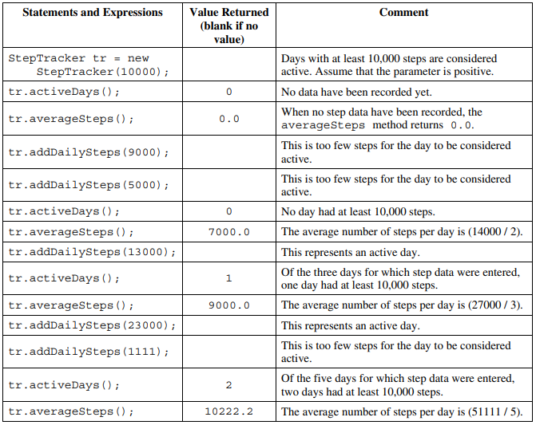
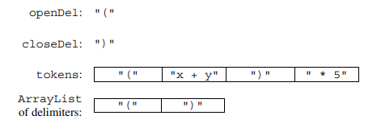
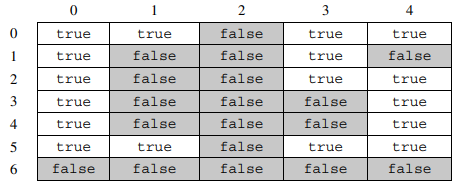

# 6\. AP计算机2019年考试：主观题  
I. The `APCalendar` class contains methods used to calculate information about a calendar. You will write two methods of the class.  
  
```java  
public class APCalendar  
{  
    /** Returns true if year is a leap year and false otherwise. */  
    private static boolean isLeapYear(int year)  
    { /* implementation not shown */ }  
  
    /** Returns the number of leap years between year1 and year2, inclusive.  
     * Precondition: 0 <= year1 <= year2  
     */  
    public static int numberOfLeapYears(int year1, int year2)  
    { /* to be implemented in part (a) */ }  
  
    /** Returns the value representing the day of the week for the first day of year,  
     * where 0 denotes Sunday, 1 denotes Monday, ..., and 6 denotes Saturday.  
     */  
    private static int firstDayOfYear(int year)  
    { /* implementation not shown */ }  
  
    /** Returns n, where month, day, and year specify the nth day of the year.  
     * Returns 1 for January 1 (month = 1, day = 1) of any year.  
     * Precondition: The date represented by month, day, year is a valid date.  
     */  
    private static int dayOfYear(int month, int day, int year)  
    { /* implementation not shown */ }  
  
    /** Returns the value representing the day of the week for the given date  
     * (month, day, year), where 0 denotes Sunday, 1 denotes Monday, ...,  
     * and 6 denotes Saturday.  
     * Precondition: The date represented by month, day, year is a valid date.  
     */  
    public static int dayOfWeek(int month, int day, int year)  
    { /* to be implemented in part (b) */ }  
  
    // There may be instance variables, constructors, and other methods not shown.  
}  
```  
(a) Write the static method `numberOfLeapYears`, which returns the number of leap years between `year1` and `year2`, inclusive.  
  
In order to calculate this value, a helper method is provided for you.  
  
* `isLeapYear(year)` returns `true` if `year` is a leap year and `false` otherwise.  
  
Complete method `numberOfLeapYears` below. You must use `isLeapYear` appropriately to receive full credit.  
  
```java  
/** Returns the number of leap years between year1 and year2, inclusive.  
 * Precondition: 0 <= year1 <= year2  
 */  
public static int numberOfLeapYears(int year1, int year2)  
```  
(b) Write the static method `dayOfWeek`, which returns the integer value representing the day of the week for the given date (`month`, `day`, `year`), where `0` denotes Sunday, `1` denotes Monday, …, and `6` denotes Saturday. For example, 2019 began on a Tuesday, and January 5 is the fifth day of 2019. As a result, January 5, 2019, fell on a Saturday, and the method call `dayOfWeek(1, 5, 2019)` returns `6`.  
  
As another example, January 10 is the tenth day of 2019. As a result, January 10, 2019, fell on a Thursday, and the method call `dayOfWeek(1, 10, 2019)` returns `4`.  
  
In order to calculate this value, two helper methods are provided for you.  
  
* `firstDayOfYear(year)` returns the integer value representing the day of the week for the first day of `year`, where `0` denotes Sunday, `1` denotes Monday, …, and `6` denotes Saturday. For example, since 2019 began on a Tuesday, `firstDayOfYear(2019)` returns `2`.  
* `dayOfYear(month, day, year)` returns `n`, where `month`, `day`, and `year` specify the `n`th day of the year. For the first day of the year, January 1 (`month = 1`, `day = 1`), the value `1` is returned. This method accounts for whether year is a leap year. For example, `dayOfYear(3, 1, 2017)` returns `60`, since 2017 is not a leap year, while `dayOfYear(3, 1, 2016)` returns `61`, since 2016 is a leap year.  
  
  
  
Complete method `dayOfWeek` below. You must use `firstDayOfYear` and `dayOfYear` appropriately to receive full credit.  
  
```java  
/** Returns the value representing the day of the week for the given date  
 * (month, day, year), where 0 denotes Sunday, 1 denotes Monday, ...,  
 * and 6 denotes Saturday.  
 * Precondition: The date represented by month, day, year is a valid date.  
 */  
public static int dayOfWeek(int month, int day, int year)  
```  
II. This question involves the implementation of a fitness tracking system that is represented by the `StepTracker` class. A `StepTracker` object is created with a parameter that defines the minimum number of steps that must be taken for a day to be considered *active*.  
  
The `StepTracker` class provides a constructor and the following methods.  
  
* `addDailySteps`, which accumulates information about steps, in readings taken once per day  
* `activeDays`, which returns the number of active days  
* `averageSteps`, which returns the average number of steps per day, calculated by dividing the total number of steps taken by the number of days tracked  
  
The following table contains a sample code execution sequence and the corresponding results.  
  
  
  
Write the complete `StepTracker` class, including the constructor and any required instance variables and methods. Your implementation must meet all specifications and conform to the example.  
  
III. Many encoded strings contain *delimiters*. A delimiter is a non-empty string that acts as a boundary between different parts of a larger string. The delimiters involved in this question occur in pairs that must be *balanced*, with each pair having an open delimiter and a close delimiter. There will be only one type of delimiter for each string. The following are examples of delimiters.  
  
Example 1  
  
Expressions in mathematics use open parentheses `"("` and close parentheses `")"` as delimiters. For each open parenthesis, there must be a matching close parenthesis.  
  
  
  
Example 2  
  
HTML uses `<B>` and `</B>` as delimiters. For each open delimiter `<B>`, there must be a matching close delimiter `</B>`.  
  
  
  
In this question, you will write two methods in the following `Delimiters` class.  
  
```java  
public class Delimiters  
{  
  
    /** The open and close delimiters. */  
    private String openDel;  
    private String closeDel;  
  
    /** Constructs a Delimiters object where open is the open delimiter and close is the  
     * close delimiter.  
     * Precondition: open and close are non-empty strings.  
     */  
    public Delimiters(String open, String close)  
    {  
        openDel = open;  
        closeDel = close;  
    }  
  
    /** Returns an ArrayList of delimiters from the array tokens, as described in part (a). */  
    public ArrayList<String> getDelimitersList(String[] tokens)  
    { /* to be implemented in part (a) */ }  
  
    /** Returns true if the delimiters are balanced and false otherwise, as described in part (b).  
     * Precondition: delimiters contains only valid open and close delimiters.  
     */  
    public boolean isBalanced(ArrayList<String> delimiters)  
    { /* to be implemented in part (b) */ }  
  
    // There may be instance variables, constructors, and methods that are not shown.  
}   
```  
(a) A string containing text and possibly delimiters has been split into *tokens* and stored in `String[] tokens`. Each token is either an open delimiter, a close delimiter, or a substring that is not a delimiter. You will write the method `getDelimitersList`, which returns an `ArrayList` containing all the open and close delimiters found in `tokens` in their original order.  
  
The following examples show the contents of an `ArrayList` returned by `getDelimitersList` for different open and close delimiters and different `tokens` arrays.  
  
Example 1  
  
  
  
Example 2  
  
  
  
  
  
Complete method `getDelimitersList` below.  
  
```java  
/** Returns an ArrayList of delimiters from the array tokens, as described in part (a). */  
public ArrayList<String> getDelimitersList(String[] tokens)   
```  
(b) Write the method `isBalanced`, which returns `true` when the delimiters are balanced and returns `false` otherwise. The delimiters are balanced when both of the following conditions are satisfied; otherwise, they are not balanced.  
  
1. When traversing the `ArrayList` from the first element to the last element, there is no point at which there are more close delimiters than open delimiters at or before that point.  
2. The total number of open delimiters is equal to the total number of close delimiters.  
  
Consider a `Delimiters` object for which `openDel` is `"<sup>"` and `closeDel` is `"</sup>"`. The examples below show different `ArrayList` objects that could be returned by calls to `getDelimitersList` and the value that would be returned by a call to `isBalanced`.  
  
Example 1  
  
The following example shows an `ArrayList` for which `isBalanced` returns `true`. As tokens are examined from first to last, the number of open delimiters is always greater than or equal to the number of close delimiters. After examining all tokens, there are an equal number of open and close delimiters.  
  
  
  
Example 2  
  
The following example shows an `ArrayList` for which `isBalanced` returns `false`.  
  
  
  
Example 3  
  
The following example shows an `ArrayList` for which `isBalanced` returns `false`.  
  
  
  
Example 4  
  
The following example shows an `ArrayList` for which `isBalanced` returns `false` because the second condition is violated. After examining all tokens, there are not an equal number of open and close delimiters.  
  
  
  
  
  
Complete method `isBalanced` below.  
  
```java  
/** Returns true if the delimiters are balanced and false otherwise, as described in part (b).  
 * Precondition: delimiters contains only valid open and close delimiters.  
 */  
public boolean isBalanced(ArrayList<String> delimiters)  
```  
IV. The `LightBoard` class models a two-dimensional display of lights, where each light is either on or off, as represented by a Boolean value. You will implement a constructor to initialize the display and a method to evaluate a light.  
  
```java  
public class LightBoard  
{  
    /** The lights on the board, where true represents on and false represents off.  
     */  
    private boolean[][] lights;  
  
    /** Constructs a LightBoard object having numRows rows and numCols columns.  
     * Precondition: numRows > 0, numCols > 0  
     * Postcondition: each light has a 40% probability of being set to on.  
     */  
    public LightBoard(int numRows, int numCols)  
    { /* to be implemented in part (a) */ }  
  
    /** Evaluates a light in row index row and column index col and returns a status  
     * as described in part (b).  
     * Precondition: row and col are valid indexes in lights.  
     */  
    public boolean evaluateLight(int row, int col)  
    { /* to be implemented in part (b) */ }  
  
    // There may be additional instance variables, constructors, and methods not shown.  
}  
```  
(a) Write the constructor for the `LightBoard` class, which initializes `lights` so that each light is set to on with a 40% probability. The notation `lights[r][c]` represents the array element at row `r` and column `c`.  
  
Complete the `LightBoard` constructor below.  
  
```java  
/** Constructs a LightBoard object having numRows rows and numCols columns.  
 * Precondition: numRows > 0, numCols > 0  
 * Postcondition: each light has a 40% probability of being set to on.  
 */  
public LightBoard(int numRows, int numCols)  
```  
(b) Write the method `evaluateLight`, which computes and returns the status of a light at a given row and column based on the following rules.  
  
1. If the light is on, return `false` if the number of lights in its column that are on is even, including the current light.  
2. If the light is off, return `true` if the number of lights in its column that are on is divisible by three.  
3. Otherwise, return the light’s current status.  
  
For example, suppose that `LightBoard sim = new LightBoard(7, 5)` creates a light board with the initial state shown below, where `true` represents a light that is on and `false` represents a light that is off. Lights that are off are shaded.  
  
```java  
lights  
```  
  
  
Sample calls to `evaluateLight` are shown below.  
  
  
  
  
  
Complete the `evaluateLight` method below.  
  
```java  
/** Evaluates a light in row index row and column index col and returns a status  
 * as described in part (b).  
 * Precondition: row and col are valid indexes in lights.  
 */  
public boolean evaluateLight(int row, int col)  
```  
