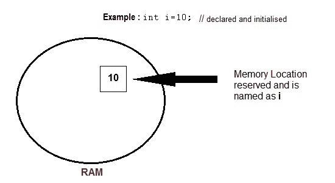

# C++ 中的变量

> 原文：<https://www.studytonight.com/cpp/variables-scope-details.php>

变量在 C++ 中使用，在 c++ 中，我们需要存储任何值，这些值将在程序中改变。变量可以用多种方式声明，每种方式都有不同的内存需求和功能。变量是编译器根据变量的数据类型分配的内存位置的名称。



* * *

### 变量的基本类型

每个变量 while 声明必须给定一个[数据类型](datatypes-and-modifiers-in-cpp.php)，分配给该变量的内存依赖于该数据类型。以下是变量的基本类型，

| `bool` | 用于存储布尔值的变量(真或假) |
| `char` | 用于存储字符类型的变量。 |
| `int` | 对于整数值变量 |
| `float`和`double`也是具有大浮点值的变量类型 |

* * *

### 声明和初始化

变量必须在使用前声明。通常最好在程序开始时声明它们，但是在 C++ 中，它们也可以在程序中间声明，但是必须在使用它们之前完成。

例如:

```cpp
int i;      // declared but not initialised
char c; 
int i, j, k;  // Multiple declaration 
```

初始化意味着给已经声明的变量赋值，

```cpp
int i;   // declaration
i = 10;  // initialization 
```

初始化和声明也可以在一个步骤中完成，

```cpp
int i=10;         //initialization and declaration in same step
int i=10, j=11; 
```

如果一个变量被声明并且没有被默认初始化，那么它将保存一个垃圾值。此外，如果一个变量被声明了一次，如果我们试图再次声明它，我们会得到一个编译时错误。

```cpp
int i,j;
i=10;
j=20;
int j=i+j;   //compile time error, cannot redeclare a variable in same scope 
```

* * *

### 变量的范围

所有的变量都有它们的作用区域，在这个边界之外，它们不保持它们的值，这个边界被称为变量的范围。在大多数情况下，它在花括号之间，在花括号中，变量被声明为变量存在，而不是在它之外。我们将在后面研究存储类，但是到目前为止，我们可以将变量大致分为两种主要类型，

*   全局变量
*   局部变量

* * *

### 全局变量

全局变量是那些一旦声明就可以被任何类或函数在程序的整个生命周期中使用的变量。它们必须在`main()`函数之外声明。如果只声明，它们可以在程序生命周期的不同时间被赋予不同的值。但是，即使它们在 main()函数之外同时被声明和初始化，它们也可以在程序的任何点被赋值。

例如:仅声明，未初始化

```cpp
include <iostream>
using namespace std;
int x;                // Global variable declared
int main()
{
    x=10;                 // Initialized once
    cout <
```

* * *

### 局部变量

局部变量是只存在于花括号之间的变量，它在花括号中声明。除此之外，它们不可用并导致编译时错误。

*例*:

```cpp
include <iostream>
using namespace std;
int main()
{
    int i=10;
    if(i<20)        // if condition scope starts
    {
        int n=100;   // Local variable declared and initialized
    }              // if condition scope ends
    cout << n;      // Compile time error, n not available here
}
```

* * *

### 一些特殊类型的变量

还有一些特殊的关键字，赋予程序中的变量独特的特征。下面两个是最常用的，我们以后再详细讨论。

1.  **最终** -一旦初始化，其值不能改变。
2.  **[【静态】](static-keyword.php)** -这些变量在函数调用之间保持它们的值。

*例*:

```cpp
#include <iostream.h>
using namespace std;
int main()
{
    final int i=10;
    static int y=20;
}
```

* * *

* * *