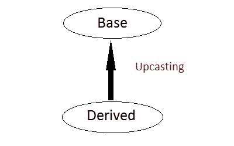

# C++ 中的向上转换

> 原文：<https://www.studytonight.com/cpp/upcasting.php>

向上转换是使用超类的引用或指针来引用子类的对象。或者我们可以说，将子类的引用或指针转换为其超类的引用或指针的行为称为向上转换。



```cpp
class Super
{ 
    int x;
    public:
    void funBase() 
    { 
        cout << "Super function"; 
    }
};

class Sub:public Super
{ 
    int y;
};

int main()
{
    Super* ptr;    // Super class pointer
    Sub obj;
    ptr = &obj;

    Super &ref;    // Super class's reference    
    ref=obj;
} 
```

向上转换的反面是**向下转换**，其中我们将 Super 类的引用或[指针](/c/pointers-in-c.php)转换为派生类的引用或指针。稍后我们将学习更多关于向下预测的内容

* * *

## 从不继承的函数

*   [构造器和析构器](constructors-and-destructors-in-cpp.php)永远不会被继承，因此永远不会被覆盖。(我们将在下一个教程中学习[函数覆盖](function-overriding.php)的概念)
*   此外，赋值运算符`=`永远不会被继承。它可以重载，但不能被子类继承。

* * *

## C++ 中的继承和静态函数

1.  它们被继承到派生类中。
2.  如果在派生类中重新定义静态成员函数，基类中的所有其他重载函数都将被隐藏。
3.  静态成员函数永远不能是虚拟的。我们将在未来的主题中研究虚拟。

* * *

## C++ 中的混合继承和虚拟类

在多重继承中，派生类从多个基类继承。因此，在多重继承中有很多模糊的机会。

```cpp
class A
{ 
    void show(); 
};

class B:public A 
{
    // class definition
};

class C:public A 
{
    // class defintion
};

class D:public B, public C 
{
    // class definition
};

int main()
{
    D obj;
    obj.show();
} 
```

在这种情况下，B 类和 C 类都从 a 类继承了函数`show()`，因此 D 类有两个继承的函数`show()`。在 main()函数中，当我们调用函数`show()`时，就会出现歧义，因为编译器不知道该调用哪个`show()`函数。因此我们在继承类时使用**虚拟**关键字。

```cpp
class B : virtual public A 
{
    // class definition
};

class C : virtual public A 
{
    // class definition
};

class D : public B, public C 
{
    // class definition
}; 
```

现在通过添加虚拟关键字，我们告诉编译器调用两个`show()`函数中的任何一个。

* * *

### 混合继承和构造器调用

众所周知，每当派生类对象被实例化时，基类构造器总是被调用。但是在混合继承的情况下，如上例所述，如果我们创建一个类 D 的实例，那么将调用以下构造器:

*   在 D 类的构造器之前，将调用其超类的构造器，因此将调用 B 类、C 类和 A 类的构造器。
*   当 B 类和 C 类的构造器被调用时，它们将再次调用它们的超类的构造器。

这将导致对类 A 的构造器的多次调用，这是不可取的。由于有一个虚拟基类的实例被继承它的多个类共享，因此基类的构造器只被具体类的构造器调用一次，在我们的例子中是类 d

如果在 B 类或 C 类中有任何初始化 A 类构造器的调用，而在创建 D 类对象时，所有这样的调用都将被跳过。

* * *

* * *