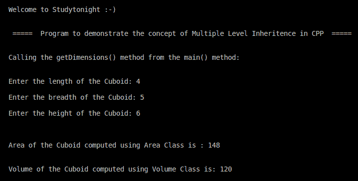

# C++ 程序：多级继承

> 原文：<https://www.studytonight.com/cpp-programs/cpp-multi-level-inheritance-program>

大家好！

在本教程中，我们将学习如何用 C++ 编程语言**演示多级继承**的概念。

要了解 CPP 中多级继承的概念，我们将推荐您访问这里: [C++ 类型的继承](https://www.studytonight.com/cpp/types-of-inheritance.php)，我们已经从头开始解释了。

**代号:**

```cpp
#include <iostream>

using namespace std;

//Class Volume to compute the Volume of the Cuboid
class Volume {
    public:
        float volume(float l, float b, float h) {
            return (l * b * h);
        }
};

//Class Area to compute the Volume of the Cuboid
class Area {
    public:
        float area(float l, float b, float h) {
            return (2 * (l * b + l * h + b * h));
        }
};

//Cuboid class inherites or is derived from two different classes Volume and Area.
class Cuboid: private Volume, private Area {
    private: float length,
    breadth,
    height;

    //Default Constructor of the Cuboid Class
    public: Cuboid(): length(0.0),
    breadth(0.0),
    height(0.0) {}

    void getDimensions() {
        cout << "\nEnter the length of the Cuboid: ";
        cin >> length;

        cout << "\nEnter the breadth of the Cuboid: ";
        cin >> breadth;

        cout << "\nEnter the height of the Cuboid: ";
        cin >> height;
    }

    //Method to Calculate the area of the Cuboid by using the Area Class
    float volume() {
        //Calls the volume() method of class Volume and returns it.
        return Volume::volume(length, breadth, height);
    }

    //Method to Calculate the area of the Cuboid by using the Area Class
    float area() {
        //Calls the area() method of class Area and returns it.
        return Area::area(length, breadth, height);
    }
};

//Defining the main method to access the members of the class
int main() {

    cout << "\n\nWelcome to Studytonight :-)\n\n\n";
    cout << " =====  Program to demonstrate the concept of Multiple Level Inheritence in CPP  ===== \n\n";

    //Declaring the Class objects to access the class members
    Cuboid cuboid;

    cout << "\nCalling the getDimensions() method from the main() method:\n\n";

    cuboid.getDimensions();
    cout << "\n\n";

    cout << "\nArea of the Cuboid computed using Area Class is : " << cuboid.area() << "\n\n\n";
    cout << "Volume of the Cuboid computed using Volume Class is: " << cuboid.volume();

    cout << "\n\n\n";

    return 0;
}
```

**输出:**



我们希望这篇文章能帮助你更好地理解 C++ 中多级继承的概念。如有任何疑问，请随时通过下面的评论区联系我们。

**继续学习:**

* * *

* * *