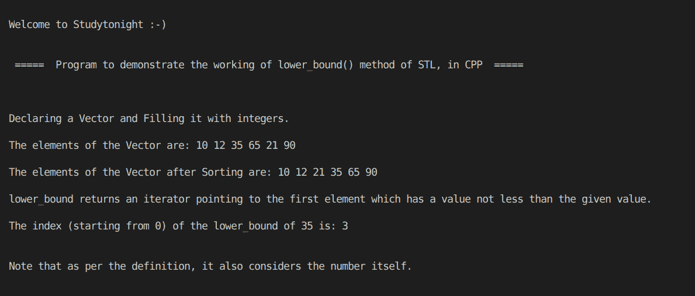

# C++ 程序：在 STL 向量中使用`lower_bound()`方法

> 原文：<https://www.studytonight.com/cpp-programs/cpp-program-using-lower_bound-method-in-vector-stl>

大家好！

在本教程中，我们将学习 STL 中 `lower_bound()` **方法的**工作原理，以及它在 C++ 编程语言中使用矢量**的实现。**

## 什么是向量？

向量与动态数组相同，能够在插入或删除元素时自动调整自身大小。这使得它们比固定大小且本质上是静态的普通数组更有优势。

要了解更多关于 CPP 中的向量，我们将推荐您访问 [C++ STL 向量](https://www.studytonight.com/cpp/stl/stl-container-vector)

### `lower_bound()`方法:

`lower_bound()`方法返回一个指向第一个元素的迭代器，该元素的值**不小于给定值**。

为了更好地理解，请参考下面给出的注释良好的 C++ 代码。

**代号:**

```cpp
#include <iostream>
#include <bits/stdc++.h>

using namespace std;

int main()
{
    cout << "\n\nWelcome to Studytonight :-)\n\n\n";
    cout << " =====  Program to demonstrate the working of lower_bound() method of STL, in CPP  ===== \n\n";

    cout << "\n\nDeclaring a Vector and Filling it with integers.\n\n";

    //create an empty vector
    vector<int> v;

    //insert elements into the vector
    v.push_back(10);
    v.push_back(12);
    v.push_back(35);
    v.push_back(65);
    v.push_back(21);
    v.push_back(90);

    //prining the vector
    cout << "The elements of the Vector are: ";

    //Another way of printing the elements using the for loop
    for (int i : v)
    {
        cout << i << " ";
    }

    //Sorting the vector in ascending order
    sort(v.begin(), v.end());

    //prining the Sorted vector
    cout << "\n\nThe elements of the Vector after Sorting are: ";

    for (int i : v)
    {
        cout << i << " ";
    }

    vector<int>::iterator low;

    low = lower_bound(v.begin(), v.end(), 35);

    cout << "\n\nlower_bound returns an iterator pointing to the first element which has a value not less than the given value.";

    cout << "\n\nThe index (starting from 0) of the lower_bound of 35 is: " << (low - v.begin()) << '\n';

    cout << "\n\nNote that as per the definition, it also considers the number itself.\n";

    cout << "\n\n\n";

    return 0;
} 
```

**输出:**



我们希望这篇文章能帮助您更好地理解下界()方法的概念及其在 CPP 中的实现。如有任何疑问，请随时通过下面的评论区联系我们。

**继续学习:**

* * *

* * *