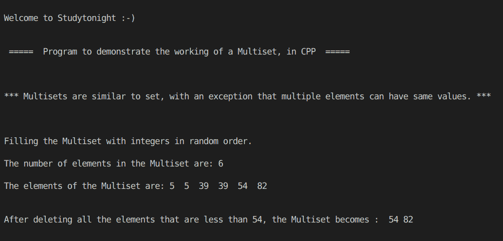

# C++ 程序：使用 STL 多重集合

> 原文：<https://www.studytonight.com/cpp-programs/cpp-using-stl-multiset-program>

大家好！

在本教程中，我们将学习 STL 中多重集合的**工作方式及其在 C++ 编程语言中的实现**。

## 什么是集合？

在编程中，集合用于存储列表的唯一值，并自动为其元素提供排序。默认情况下，排序为升序。

使用`insert()`方法插入元素。如果同一个值被插入多次，集合会自动删除重复项，并且只存储该元素的单个副本。

使用`erase()` 方法删除集合的元素。

`erase(s.begin(),s.find(x))`方法从开始到小于 x 删除集合的所有元素。

## 什么是多重集合？

多重集合类似于集合，除了多个元素可以有相同的值(重复的被保留)。

为了更好地理解它的实现，请参考下面给出的注释良好的 C++ 代码。

**代号:**

```cpp
#include <iostream>
#include <bits/stdc++.h>

using namespace std;

//Function to print the elements of the multiset using an iterator
void show(multiset<int> s)
{
    //declaring an iterator to iterate through the multiset
    multiset<int>::iterator i;

    for (i = s.begin(); i != s.end(); i++)
    {
        cout << *i << "  "; //accessing the elements of the multiset using * as i stores the address to each element
    }

    cout << endl;
}

int main()
{
    cout << "\n\nWelcome to Studytonight :-)\n\n\n";
    cout << " =====  Program to demonstrate the working of a Multiset, in CPP  ===== \n\n\n\n";

    cout << "*** Multisets are similar to set, with an exception that multiple elements can have same values. *** \n\n";

    //Set declaration (Set of integers)
    multiset<int> s;

    //Filling the elements by using the insert() method.
    cout << "\n\nFilling the Multiset with integers in random order."; //Multiset automatically stores them in order

    s.insert(5);
    s.insert(39);
    s.insert(5);
    s.insert(82);
    s.insert(39);
    s.insert(54);

    cout << "\n\nThe number of elements in the Multiset are: " << s.size();

    cout << "\n\nThe elements of the Multiset are: ";
    show(s);

    multiset<int>::iterator it;

    //Deleting all the elements of the set that are less than 54
    s.erase(s.begin(), s.find(54));

    cout << "\n\nAfter deleting all the elements that are less than 54, the Multiset becomes : ";

    for (it = s.begin(); it != s.end(); it++)
    {
        cout << " " << *it;
    }

    cout << "\n\n\n";

    return 0;
} 
```

**输出:**



我们希望这篇文章能帮助你更好地理解 STL 中多重集合的概念及其在 C++ 中的实现。如有任何疑问，请随时通过下面的评论区联系我们。

**继续学习:**

* * *

* * *