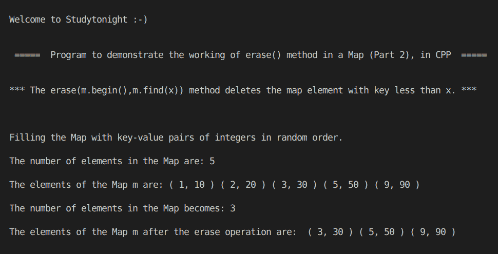

# C++ 程序：在 STL 映射中使用`erase()`方法（第二部分）

> 原文：<https://www.studytonight.com/cpp-programs/cpp-using-erase-method-in-stl-map-part-2>

大家好！

在本教程中，我们将学习 erase() **方法的**工作原理，在 C++ 编程语言的 STL** 中删除映射中的一系列元素。**

要了解 STL 中**映射容器**的基本功能，我们将推荐您访问 [C++ STL 映射容器](https://www.studytonight.com/cpp/stl/stl-container-map)，我们已经从头开始详细解释了这个概念。

在映射中，`erase(m.begin(), m.find(x))`方法删除所有键小于键`x`的元素。

为了更好地理解它的实现，请参考下面给出的注释良好的 C++ 代码。

**代号:**

```cpp
#include <iostream>
#include <bits/stdc++.h>

using namespace std;

int main()
{
    cout << "\n\nWelcome to Studytonight :-)\n\n\n";
    cout << " =====  Program to demonstrate the working of erase() method in a Map (Part 2), in CPP  ===== \n\n\n";

    cout << "*** The erase(m.begin(),m.find(x)) method deletes the map element with key less than x. *** \n\n";

    //Map declaration (Map with key and value both as integers)
    map<int, int> m;

    //Filling the elements by using the insert() method.
    cout << "\n\nFilling the Map with key-value pairs of integers in random order."; //Map automatically stores them in increasing order of keys

    //make_pair() is used to insert a key value pair into the map
    m.insert(make_pair(3, 30));
    m.insert(make_pair(2, 20));
    m.insert(make_pair(5, 50));
    m.insert(make_pair(9, 90));
    m.insert(make_pair(1, 10));

    cout << "\n\nThe number of elements in the Map are: " << m.size();

    cout << "\n\nThe elements of the Map m are: ";

    map<int, int>::iterator i;
    int j = 0;

    for (i = m.begin(); i != m.end(); i++)
    {
        cout << "( " << i->first << ", " << i->second << " ) ";
    }

    //Deleting the map elements with key less than 3
    m.erase(m.begin(), m.find(3));

    cout << "\n\nThe number of elements in the Map becomes: " << m.size();

    cout << "\n\nThe elements of the Map m after the erase operation are:  ";

    for (i = m.begin(); i != m.end(); i++)
    {
        cout << "( " << i->first << ", " << i->second << " ) ";
    }

    cout << "\n\n\n";

    return 0;
} 
```

**输出:**



我们希望这篇文章能帮助你更好地理解`erase()`方法的概念，该方法在 STL 中删除映射容器中的一系列元素，并在 C++ 中实现。如有任何疑问，请随时通过下面的评论区联系我们。

**继续学习:**

* * *

* * *