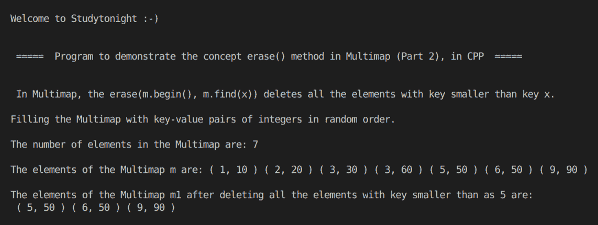

# C++ 程序：在 STL 多重映射中使用`erase()`方法（第二部分）

> 原文：<https://www.studytonight.com/cpp-programs/cpp-using-erase-method-in-stl-multimap-part-2>

大家好！

在本教程中，我们将学习在 C++ 编程语言的 STL(第 2 部分)中的映射中使用**方法。**

要了解 STL 中**映射容器**的基本功能，我们将推荐您访问[https://www.studytonight.com/cpp/stl/stl-container-map](https://www.studytonight.com/cpp/stl/stl-container-map)，我们已经从头开始详细解释了这个概念。

## 什么是 Multimap？

**多重映射**类似于映射，具有两个附加功能:

1.  多个元素可以有相同或重复的键。

2.  多个元素可以有相同或重复的键值对。

在多重映射中，`erase(m.begin(), m.find(x))`删除所有键小于键`x`的元素。

为了更好地理解它的实现，请参考下面给出的注释良好的 C++ 代码。

**代号:**

```cpp
#include <iostream>
#include <bits/stdc++.h>

using namespace std;

int main()
{
    cout << "\n\nWelcome to Studytonight :-)\n\n\n";
    cout << " =====  Program to demonstrate the concept erase() method in Multimap (Part 2), in CPP  ===== \n\n\n";

    cout << " In Multimap, erase(m.begin(), m.find(x)) deletes all the elements with key smaller than key x.\n\n";

    //Multimap declaration (Multimap with key and value both as integers)
    multimap<int, int> m;

    //Filling the elements by using the insert() method.
    cout << "Filling the Multimap with key-value pairs of integers in random order."; //Multimap automatically stores them in increasing order of keys

    //make_pair() is used to insert a key value pair into the Multimap
    m.insert(make_pair(3, 30));
    m.insert(make_pair(2, 20));
    m.insert(make_pair(5, 50));
    m.insert(make_pair(9, 90));
    m.insert(make_pair(1, 10));
    m.insert(make_pair(6, 50));
    m.insert(make_pair(3, 60));

    cout << "\n\nThe number of elements in the Multimap are: " << m.size();

    cout << "\n\nThe elements of the Multimap m are: ";

    multimap<int, int>::iterator i;

    for (i = m.begin(); i != m.end(); i++)
    {
        cout << "( " << i->first << ", " << i->second << " ) ";
    }

    //Copying one multimap into another
    multimap<int, int> m1(m.begin(), m.end());

    //Deleting all the elements with key smaller than 5
    m1.erase(m1.begin(), m1.find(5));

    cout << "\n\nThe elements of the Multimap m1 after deleting all the elements with key smaller than as 5 are:\n ";

    for (i = m1.begin(); i != m1.end(); i++)
    {
        cout << "( " << i->first << ", " << i->second << " ) ";
    }

    cout << "\n\n\n";

    return 0;
} 
```

**输出:**



我们希望这篇文章能帮助你更好地理解 STL 中多重映射容器中`erase()`方法的概念及其在 C++ 中的实现。如有任何疑问，请随时通过下面的评论区联系我们。

**继续学习:**

* * *

* * *