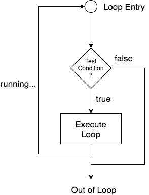
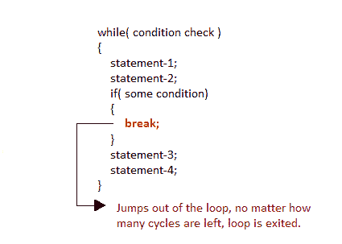
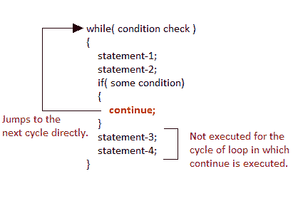

# C 语言中的循环

> 原文：<https://www.studytonight.com/c/loops-in-c.php>

在包括 C 语言在内的任何编程语言中，循环用于重复执行一组语句，直到满足特定条件。

* * *

## 它是如何工作的

下图描述了循环执行，



根据上图，如果测试条件为真，则执行循环，如果为假，则执行脱离循环。循环成功执行后，再次从循环条目开始执行，并再次检查测试条件，并继续重复。

要执行的语句序列被保存在花括号`{ }`中，花括号被称为**循环体**。每次执行循环体后，验证**条件**，如果发现为**真**，则再次执行循环体。当条件检查返回**假**时，不执行循环体，执行脱离循环。

* * *

## 循环的类型

C 语言中有 3 种类型的循环，即:

1.  `while`循环
2.  `for`循环
3.  `do while`循环

* * *

### `while`循环

`while`循环可以作为**入口控制**循环来处理。它分三步完成。

*   变量初始化。(例如`int x = 0;`)
*   条件(例如`while(x <= 10)`)
*   可变增量或减量(`x++`或`x--`或`x = x + 2`

**语法:**

```cpp
variable initialization;
while(condition)
{
    statements;
    variable increment or decrement; 
}
```

#### 示例:打印前 10 个自然数的程序

```cpp
#include<stdio.h>

void main( )
{
    int x;
    x = 1;
    while(x <= 10)
    {
        printf("%d\t", x);
        /* below statement means, do x = x+1, increment x by 1*/
        x++;
    }
}
```

1 2 3 4 5 6 7 8 9 10

* * *

### `for`循环

`for`循环用于重复执行一组语句，直到满足特定条件。我们可以说它是一个**开环。**。一般格式是，

```cpp
for(initialization; condition; increment/decrement)
{
    statement-block;
}
```

在`for`循环中，我们正好有两个分号，一个在初始化之后，第二个在条件之后。在这个循环中，我们可以有多个初始化或增量/减量，用逗号运算符分隔。但是它只能有一个**条件**。

`for`循环执行如下:

1.  它首先评估初始化代码。
2.  然后检查条件表达式。
3.  如果为**真**，则执行 for 循环体。
4.  然后，它评估增量/减量条件，并再次从步骤 2 开始。
5.  当条件表达式变为**假**时，退出循环。

#### 示例:打印前 10 个自然数的程序

```cpp
#include<stdio.h>

void main( )
{
    int x;
    for(x = 1; x <= 10; x++)
    {
        printf("%d\t", x);
    }
}
```

1 2 3 4 5 6 7 8 9 10

* * *

### 嵌套`for`循环

我们也可以有嵌套的`for`循环，即一个`for`循环在另一个`for`循环内。基本语法是，

```cpp
for(initialization; condition; increment/decrement)
{
    for(initialization; condition; increment/decrement)
    {
        statement ;
    }
}
```

#### 示例:打印半个数字金字塔的程序

```cpp
#include<stdio.h>

void main( )
{
    int i, j;
    /* first for loop */
    for(i = 1; i < 5; i++)
    {
        printf("\n");
        /* second for loop inside the first */
        for(j = i; j > 0; j--)
        {
            printf("%d", j);
        }
    }
}
```

1 21 321 4321 54321

* * *

### `do while`循环

在某些情况下，有必要在测试条件之前执行循环体。这种情况可以借助`do-while`循环来处理。`do`语句首先评估循环体，最后使用`while`语句检查条件。这意味着循环体将至少执行一次，即使`while`内的起始条件被初始化为**假**。一般语法是，

```cpp
do
{
    .....
    .....
}
while(condition)
```

#### 示例:打印前 10 个 5 的倍数的程序。

```cpp
#include<stdio.h>

void main()
{
    int a, i;
    a = 5;
    i = 1;
    do
    {
        printf("%d\t", a*i);
        i++;
    } 
    while(i <= 10);
}
```

5 10 15 20 25 30 35 40 45 50

* * *

### 跳出循环

有时，在执行循环时，一旦某个条件变为**真**，就需要跳过循环的一部分或离开循环。这就是所谓的跳出循环。

#### 1)`break`语句

当在循环中遇到`break`语句时，循环立即退出，程序继续执行紧接着循环的语句。



#### 2)继续语句

它使控件直接进入测试条件，然后继续循环过程。遇到`continue`时，光标离开当前循环，从下一个循环开始。



* * *

* * *