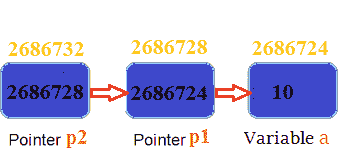

# C 语言中的指向指针的指针（双指针）

> 原文：<https://www.studytonight.com/c/pointer-to-pointer.php>

[指针](pointers-in-c.php)用于存储类似[数据类型](datatype-in-c.php)的其他变量的地址。但是如果你想存储指针变量的地址，那么你又需要一个指针来存储它。因此，当一个指针变量存储另一个指针变量的地址时，它被称为**指针指向指针**变量或**双指针**。

**语法:**

```cpp
int **p1;
```

这里，我们使用了两个间接运算符(`*`)来存储和指向指针变量的地址，即`int *`。如果我们想存储这个(双指针)变量`p1`的地址，那么语法将变成:

```cpp
int ***p2
```

* * *

### 表示指针指针的简单程序

```cpp
#include <stdio.h>

int main() {

    int  a = 10;
    int  *p1;       //this can store the address of variable a
    int  **p2; 
    /*
        this can store the address of pointer variable p1 only. 
        It cannot store the address of variable 'a' 
    */

    p1 = &a;
    p2 = &p1;

    printf("Address of a = %u\n", &a);
    printf("Address of p1 = %u\n", &p1);
    printf("Address of p2 = %u\n\n", &p2);

    // below print statement will give the address of 'a'
    printf("Value at the address stored by p2 = %u\n", *p2);

    printf("Value at the address stored by p1 = %d\n\n", *p1);

    printf("Value of **p2 = %d\n", **p2); //read this *(*p2)

    /*
        This is not allowed, it will give a compile time error-
        p2 = &a;
        printf("%u", p2);
    */
    return 0;
}
```

a 的地址= 2686724 P1 的地址= 2686728 的地址= 2686732 存储的地址值= 2686724 P1 存储的地址值= 10 * * p2 = 10

### 上述程序的说明



*   `p1`指针变量只能保存变量`a`的地址(即间接运算符的个数(*)-1 变量)。同样，`p2`变量只能保存变量`p1`的地址。它不能保存变量`a`的地址。
*   `*p2`给出了`p2`指针存储的地址值。`p2`存储`p1`指针的地址，`p1`地址的值是变量`a`的地址。因此，`*p2`打印`a`的地址。
*   `**p2`可以读作`*(*p2)`。因此，它给出了存储在地址`*p2`的值。从上面的陈述中，你知道`*p2`是指变量 a 的地址。因此，地址`*p2`的值是 10。因此，`**p2`打印`10`。

* * *

* * *