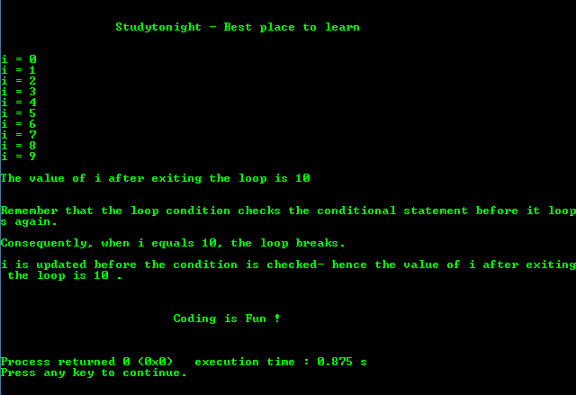

# C 程序：`for`循环的基础

> 原文：<https://www.studytonight.com/c/programs/loop/for-loop>

每个循环由序列中的三个部分组成

1.  **初始化**:用于初始化循环变量。
2.  **条件**:每次迭代后检查，作为循环的入口点。
3.  **更新**:增加循环变量，最终终止不满足循环条件的循环。

请记住，循环条件会在条件语句再次循环之前检查它。

**语法:**

```cpp
for(initialization, condition, incrementation)
{ 
    code statements;
}
```

下面是一个关于`for`循环的简单程序。

这是 C 语言教程，解释了中循环的`for`循环→

```cpp
#include<stdio.h>

int main()
{
    printf("\n\n\t\tStudytonight - Best place to learn\n\n\n");

    /* 
        Always declare the variables before using them 
    */
    int i = 0;  // declaration and initialization at the same time

    for(i = 0; i < 10; i++)
    {
        printf("i = %d\n", i);

        /*
            consequently, when i equals 10, the loop breaks.
            i is updated before the condition is checked-
            hence the value of i after exiting the loop is 10 
        */
     }

    printf("\n\The value of i after exiting the loop is %d\n\n", i);

    printf("\nRemember that the loop condition checks the conditional statement before it loops again.\n\n");

    printf("Consequently, when i equals 10, the loop breaks.\n\n");

    printf("i is updated before the condition is checked- hence the value of i after exiting the loop is 10 .\n\n");

    printf("\n\n\t\t\tCoding is Fun !\n\n\n");
    return 0;
}
```

### 输出:



* * *

* * *