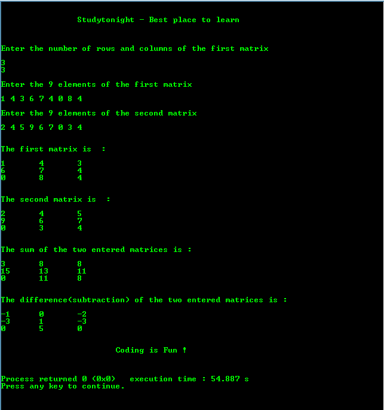

# C 程序：执行矩阵加减

> 原文：<https://www.studytonight.com/c/programs/array/addition-and-subtraction-of-matrices>

下面是一个对两个矩阵进行加减运算的程序。

`\n`用于将控件带到下一行。

`\t`用于控制前方 5 个空格(tab)。

```cpp
#include<stdio.h>

int main()
{
    printf("\n\n\t\tStudytonight - Best place to learn\n\n\n");

    int n, m, c, d, first[10][10], second[10][10], sum[10][10], diff[10][10];
    printf("\nEnter the number of rows and columns of the first matrix \n\n");
    scanf("%d%d", &m, &n);

    printf("\nEnter the %d elements of the first matrix \n\n", m*n);
    for(c = 0; c < m; c++)   // to iterate the rows
        for(d = 0; d < n; d++)   // to iterate the columns
            scanf("%d", &first[c][d]);

    printf("\nEnter the %d elements of the second matrix \n\n", m*n);
    for(c = 0; c < m; c++)   // to iterate the rows
        for(d = 0; d < n; d++)   // to iterate the columns
            scanf("%d", &second[c][d]);

    /*
        printing the first matrix
    */
    printf("\n\nThe first matrix is: \n\n");
    for(c = 0; c < m; c++)   // to iterate the rows
    {
        for(d = 0; d < n; d++)   // to iterate the columns
        {
            printf("%d\t", first[c][d]);
        }
    printf("\n");
    }

    /* 
        printing the second matrix
    */
    printf("\n\nThe second matrix is: \n\n");
    for(c = 0; c < m; c++)   // to iterate the rows
    {
        for(d = 0; d < n; d++)   // to iterate the columns
        {
            printf("%d\t", second[c][d]);
        }
    printf("\n");
    }

    /* 
        finding the SUM of the two matrices 
        and storing in another matrix sum of the same size
    */
    for(c = 0; c < m; c++)
        for(d = 0; d < n; d++)
            sum[c][d] = first[c][d] + second[c][d];

    // printing the elements of the sum matrix
    printf("\n\nThe sum of the two entered matrices is: \n\n");
    for(c = 0; c < m; c++)
    {
        for(d = 0; d < n; d++)
        {
            printf("%d\t", sum[c][d]);
        }
        printf("\n");
    }

    /*
        finding the DIFFERENCE of the two matrices 
        and storing in another matrix difference of the same size
    */
    for(c = 0; c < m; c++)
        for(d = 0; d < n; d++)
            diff[c][d] = first[c][d] - second[c][d];

    // printing the elements of the diff matrix
    printf("\n\nThe difference(subtraction) of the two entered matrices is: \n\n");
    for(c = 0; c < m; c++)
    {
        for(d = 0; d < n; d++)
        {
            printf("%d\t", diff[c][d]);
        }
        printf("\n");
    }

    printf("\n\n\t\t\tCoding is Fun !\n\n\n");
    return 0;
}
```

### 输出:



* * *

* * *