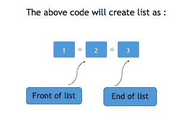
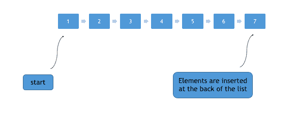

# STL 中的列表容器

> 原文：<https://www.studytonight.com/cpp/stl/stl-container-list>

数组和向量是连续的容器，即它们将数据存储在连续的内存中，因此向量/数组中间的插入操作非常昂贵(就操作数量和处理时间而言)，因为我们必须移动所有元素，链表克服了这个问题。链表可以通过使用列表容器来实现。

使用列表模板创建新链接列表的语法为:

```cpp
#include <iostream>
#include <list>

int main()
{
    std::**list**<int> l;
}
/* Creates a new empty linked list l */ 
```

类似于向量和数组，列表也可以用参数初始化，

```cpp
#include <iostream>
#include <list>

using namespace std;

int main()
{
    std::**list**<int> l{1,2,3};
}
/* Creates a new linked list l */ 
```



以下是我们初始化列表的更多方法:

```cpp
#include <iostream>
#include <list>

int main()
{
    **list**<int> myList{1,2,3};
    /* creates list with 1,2,3 in it */

    **list**<int> myNewList = 1;
    /*  create list myNewList of integer 
        and copies value of 1 into it*/
} 
```

* * *

## 列表容器的成员函数

### `insert`功能

顾名思义，这个方法在列表中的特定位置插入一个元素。insert()有三种变体，如下所示:

*   `insert(iterator, element)`:在列表中**迭代器**指向的位置之前插入**元素**。
*   `insert(iterator, count, element)`:在列表中**迭代器**指向的位置前插入**元素**，计数次。
*   `insert(iterator, start_iterator, end_iterator)`:在**迭代器**指向的位置之前，将 **start_iterator** 指向的元素插入 **end_iterator** 指向的元素

```cpp
#include <iostream>
#include <list>

using namespace std;

int main()
{
    **list**<int> l = {1,2,3,4,5};
    **list**<int>::iterator it = l.begin();           

    l.**insert** (it+1, 100);    // insert 100 before 2 position
    /* now the list is 1 100 2 3 4 5 */

    **list**<int> new_l = {10,20,30,40};   // new list

    new_l.**insert** (new_l.**begin()**, l.**begin()**, l.**end()**);
    /* 
        insert elements from beginning of list l to end of list l 
        before 1 position in list new_l */

    /* now the list new_l is 1 100 2 3 4 5 10 20 30 40 */

    l.**insert**(l.**begin()**, 5, 10);  // insert 10 before beginning 5 times
    /* now l is 10 10 10 10 10 1 100 2 3 4 5 */

    return 0;
}
```

### `push_back`和`push_front`功能

`push_back(element)`方法用于将元素从后面推入列表。



`push_front(element)`方法用于将元素从前面推入列表。


```cpp
#include <iostream>
#include <list>

using namespace std;

int main()
{
    **list**<int> l{1,2,3,4,5};

    l.**push_back**(6);
    l.**push_back**(7);
    */* now the list becomes 1,2,3,4,5,6,7 */*

    l.**push_front**(8);
    l.**push_front**(9);
    */* now the list becomes 9,8,1,2,3,4,5,6,7 */*

}
```

### `pop_back`和`pop_front`功能

`pop_front()`从列表开始处移除第一个元素。而`pop_back()`从列表末尾移除第一个元素。

```cpp
#include <iostream>
#include <list>

using namespace std;

int main()
{
    **list**<int> l{1,2,3,4,5};

    l.**pop_back()**();
    */* now the list becomes 1,2,3,4 */*

    l.**pop_front()**();
    */* now the list becomes 2,3,4 */*
} 
```

### `empty`功能

如果列表为空，此方法返回 true，否则返回 false。

### `size`功能

此方法可用于查找列表中存在的元质数量。

### `front and back`功能

`front()`用于从开始获取列表的第一个元素，而`back()`用于从后面获取列表的第一个元素。

### `swap`功能

交换两个列表，如果在交换任何元素时有异常抛出，`swap()`抛出异常。要交换的两个列表必须是相同的类型，即不能用字符串列表交换整数列表。

### `reverse`功能

此方法可用于完全反转列表。

```cpp
#include <iostream>
#include <list>

using namespace std;

int main()
{
    **list**<int> l{1,2,3,4,5};

    l.**reverse**();
    */* now the list becomes 5,4,3,2,1 */*
} 
```

### `sort`功能

`sort()`方法对给定列表进行排序。它不会创建新的排序列表，但会更改现有列表中元素的位置以对其进行排序。这种方法有两种变体:

*   `sort()`:对列表中的元素进行升序排序，对于此功能，列表中的元素应该是数字。
*   `sort(compare_function)`:这种排序()是在我们不得不改变排序方式的时候使用的。它对非数字元素非常有帮助。我们可以定义如何在 compare _ funtion 中对列表元素进行排序。例如，字符串列表可以按字符串的长度排序，也可以按降序排序。

```cpp
#include <iostream>
#include <list>

using namespace std;

bool compare_function( string& s1 , string& s2 )
{
    return ( s1.length() > s2.length() );
}

int main()
{
    **list**<int> list1 = {2,4,5,6,1,3};
    **list**<string> list2 = {"h", "hhh", "hh"};

    list1.**sort**();
    */* list1 is now 1 2 3 4 5 6 */*

    list2.**sort**(compare_function);
    */* list2 is now h hh hhh */* 
}
```

### `splice`功能

`splice()`方法将元素从一个列表转移到另一个列表。拼接有三种版本:

*   `splice(iterator, list_name)`:在**迭代器**指向的位置传送完整的列表**列表名**。
*   `splice(iterator, list_name, iterator_pos)`:将**迭代器 _pos** 指向的元素从**列表 _ 名称**转移到**迭代器**指向的位置。
*   `splice(iterator, list_name, itr_start, itr_end)`:从**列表名称**中**迭代器**指向的位置开始， **itr_start** 和 **itr_end** 指定的传送范围。

```cpp
#include <iostream>
#include <list>

using namespace std;

int main ()
{
    **list**<int> list1 = {1,2,3,4};
    **list**<int> list2 = {5,6,7,8};
    **list**<int>::iterator it;

    it = list1.**begin**();
    ++it;   *//pointing to second position*           

    list1.**splice**(it, list2);
    */* transfer all elements of list2 at position 2 in list1 */
    /* now list1 is 1 5 6 7 8 2 3 4 and list2 is empty */*

    list2.**splice**(list2.**begin**(), list1, it);
    */* transfer element pointed by it in list1 to the beginning of list2 */
    /* list2 is now 5 and list1 is 1 6 7 8 2 3 4*/*

    return 0;
}
```

### `merge`功能

合并两个排序列表。必须首先对这两个列表进行排序。`merge()`合并两个列表，使得每个元素都被放置在结果列表中的适当位置。合并的语法是`list1.merge(list2)`。

作为参数传递的列表不会被删除，调用 merge()的列表将成为合并列表

```cpp
#include <iostream>
#include <list>

using namespace std;

int main ()
{
    **list**<int> list1 = {1,3,5,7,9};
    **list**<int> list2 = {2,4,6,8,10};

    */* both the lists are sorted. In case they are not , 
    first they should be sorted by sort function() */*

    list1.**merge**(list2);

    */* list list1 is now 1,2,3,4,5,6,7,8,9,10  */*

    cout << list1.**size**() << endl;    *// prints 10* 
}
```

* * *

## 词典式比较列表

由于列表是元素的集合，因此它们没有自己的标准值。因此，为了比较列表或向量，我们按照字典顺序比较它们的元素。

例如，让 list1 = { 1，2，3}和 list2 = { 1，3，2 }，现在，如果我们想检查 list1 是否大于 list2，我们只需按照列表中出现的顺序检查每个列表的元素。因为列表 1 中的 1 等于列表 2 中的 1，我们继续，现在列表 1 中的 2 比列表 2 中的 3 小，因此列表 2 在词典上大于列表 1。

运算符`==`、`>`、`<` 、`<=`、`>=`可用于按字典顺序比较列表。

* * *

* * *