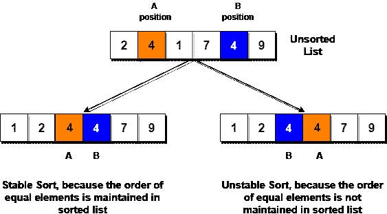
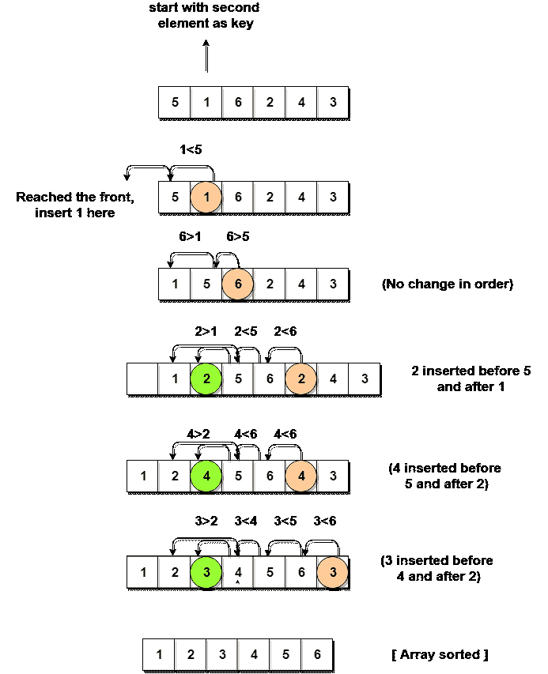

# 插入排序算法

> 原文：<https://www.studytonight.com/data-structures/insertion-sorting>

假设你手里有一副牌中的 10 张。它们被排序，或者按照数字的升序排列。

如果我再给你一张牌，让你**把**的牌插在刚刚好的位置，这样你手里的牌还能排序。你会怎么做？

嗯，你必须从头到尾检查每张卡，找到新卡的正确位置，将它的价值与每张卡进行比较。一旦你找到正确的位置，你将**插入**卡片在那里。

同样，如果有更多的新卡提供给你，你可以很容易地重复同样的过程，插入新卡，并保持卡片分类。

这正是**插入排序**的工作原理。它从索引`1`(不是`0`)开始，从索引`1`开始的每个索引就像一张新卡，你必须把它放在左边排序的子数组的右边位置。

以下是插入排序的一些重要特征:

1.  它对于较小的数据集是有效的，但是对于较大的列表非常低效。
2.  插入排序是自适应的，这意味着如果提供部分排序的数组作为输入，它将减少总的步骤数，从而提高效率。
3.  它优于选择排序和冒泡排序算法。
4.  其空间复杂度较小。像冒泡排序一样，插入排序也需要一个额外的内存空间。
5.  这是一种**稳定的**排序技术，因为它不会改变相等元素的相对顺序。



* * *

## 插入排序是如何工作的？

以下是插入排序中涉及的步骤:

1.  我们首先制作给定数组的第二个元素，即索引`1`处的元素，即`key`。这里的`key`元素是我们需要添加到我们现有的分类卡片集中的新卡(记住上面的卡片例子)。
2.  我们将`key`元素与其之前的元素进行比较，在本例中，索引`0`处的元素:
    *   如果`key`元素小于第一个元素，我们在第一个元素之前插入`key`元素。
    *   如果`key`元素大于第一个元素，那么我们把它插在第一个元素之后。
3.  然后，我们将数组的第三个元素设为`key`，并将它与它左边的元素进行比较，并将其插入右边的位置。
4.  我们继续重复这个过程，直到数组被排序。

让我们考虑一个有值的数组`{5, 1, 6, 2, 4, 3}`

下面，我们有一个泡泡排序如何排序给定数组的图示。



如上图所示，在选择一个`key`后，我们开始迭代`key`左边的元素。

如果元素大于`key`元素，我们继续向左移动，当我们找到小于`key`元素的元素时，我们停止。

并且，在小于`key`元素的元素后插入`key`元素。

* * *

## 实现插入排序算法

下面我们有一个 C++ 语言中插入排序的简单实现。

```cpp
 #include <stdlib.h>
#include <iostream>

using namespace std;

//member functions declaration
void insertionSort(int arr[], int length);
void printArray(int array[], int size);

// main function
int main() 
{
	int array[5] = {5, 1, 6, 2, 4, 3};
	// calling insertion sort function to sort the array
	insertionSort(array, 6);
	return 0;
}

void insertionSort(int arr[], int length) 
{
	int i, j, key;
	for (i = 1; i < length; i++) 
	{
		j = i;
 		while (j > 0 && arr[j - 1] > arr[j]) 
 		{
 			key = arr[j];
 			arr[j] = arr[j - 1];
 			arr[j - 1] = key;
 			j--;
 		}
	}
	cout << "Sorted Array: ";
	// print the sorted array
	printArray(arr, length);
}

// function to print the given array 
void printArray(int array[], int size)
{ 
 	int j;
	for (j = 0; j < size; j++)
	{
 		cout <
```

排序数组:1 2 3 4 5 6

现在让我们试着理解上面简单的插入排序算法。

我们取了一个带有 **6** 整数的数组。我们取了一个变量`key`，在每次传递过程中，我们将数组的每个元素放入其中，从**第二个**元素开始，也就是`a[1]`。

然后使用`while`循环，我们迭代，直到`j`变得等于**零**或者我们找到一个大于`key`的元素，然后我们**在那个位置插入**`key`。

我们继续这样做，直到`j`变得等于**零**，或者我们遇到比`key`小的元素，然后我们停止。当前的`key`现在处于正确的位置。

然后我们将下一个元素设为`key`，然后重复同样的过程。

在上面的数组中，首先我们选取 **1** 作为`key`，我们将其与 **5** (元素在 1 之前) **1** 比 **5** 小，我们在 **5** 之前插入 **1** 。然后我们挑 **6** 作为`key`，与 **5** 和 **1** 进行对比，这次没有换挡到位。然后 **2** 变成`key`与 **6** 和 **5** 比较，然后 **2** 插在 **1** 之后。这一直持续到整个数组被排序。

* * *

### 插入排序的复杂度分析

如上所述，插入排序是一种高效的排序算法，因为它不使用`for`循环在预设条件下运行，而是使用一个`while`循环，这避免了数组排序后的额外步骤。

尽管插入排序是有效的，但是如果我们为插入排序算法提供一个已经排序的数组，它仍然会执行外部的`for`循环，从而需要`n`步来对已经排序的`n`元质数组进行排序，这使得它的**最佳情况时间复杂度**是`n`的线性函数。

最坏情况时间复杂度【大 O】:**O(n<sup>2</sup>)**

最佳案例时间复杂度[大ω]:**O(n)**

平均时间复杂度【大θ】:**O(n<sup>2</sup>)**

空间复杂度: **O(1)**

* * *

* * *