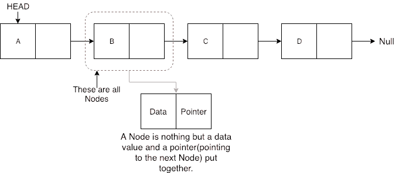

# 线性链表

> 原文：<https://www.studytonight.com/data-structures/linear-linked-list>

线性链表是默认的链表和线性数据结构，其中数据不存储在连续的内存位置，但是每个数据节点通过指针连接到下一个数据节点，因此形成一个链。

这种链表中的元素可以通过两种方式插入:

*   在列表开头插入。
*   在列表末尾插入。

因此，在编写链表的代码时，我们将在链表的开头和末尾包含向链表插入或添加新数据元素的方法。

我们还将添加一些其他有用的方法，例如:

*   检查链表是否为空。
*   搜索链表中的任何数据元素
*   从列表中删除特定节点(数据元素)

在学习我们如何插入数据和创建链表之前，我们必须了解形成链表的组件，主要组件是**节点**。

* * *

## 什么是节点？

链表中的节点保存数据值和指向链表中下一个节点位置的指针。



在上图中，我们有一个链表，包含 4 个节点，每个节点都有一些数据(A、B、C 和 D)和一个存储下一个节点位置的指针。

你一定想知道**为什么我们需要存储下一个节点**的位置。因为分配给这些节点的内存位置不是连续的，所以每个节点应该知道下一个节点存储在哪里。

由于节点是多个信息的组合，因此我们将为`Node`定义一个类，该类将有一个变量来存储**数据**和另一个变量来存储**指针**。在 C 语言中，我们使用`struct`关键字创建一个结构。

```cpp
class Node 
{
    public:
    // our linked list will only hold int data
    int data;
    //pointer to the next node
    node* next;

    // default constructor
    Node() 
    {
        data = 0;
        next = NULL;
    }

    // parameterised constructor
    Node(int x) 
    {
        data = x;
        next = NULL;
    }
} 
```

我们也可以将`Node`类属性`data`和`next`设为**私有**，那样的话我们就需要添加 getter 和 setter 方法来访问它们(不知道 getter 和 setter 方法是什么:[c++ 中的 Inline Functions](https://www.studytonight.com/cpp/inline-functions.php))。您可以向`Node`类添加 getter 和 setter 函数，如下所示:

```cpp
class Node 
{
    // our linked list will only hold int data
    int data;
    //pointer to the next node
    node* next;

    // default constructor same as above

    // parameterised constructor same as above

    /* getters and setters */
    // get the value of data
    int getData() 
    {
        return data;
    }

    // to set the value for data
    void setData(int x) 
    {
        this.data = x;
    }
    // get the value of next pointer
    node* getNext() 
    {
        return next;
    }
    // to set the value for pointer
    void setNext(node *n) 
    {
        this.next = n;
    }
}
```

`Node`类基本上为要包含在链表中的数据创建一个节点。一旦类`Node`的对象被创建，我们使用各种函数将该节点放入链表。

* * *

## 链表类

由于我们遵循完整的 OOPS 方法，因此我们将为**链表**创建一个单独的类，它将拥有所有的方法，如插入、搜索、删除等。此外，链表类将有一个名为`head`的指针来存储将被添加到链表中的第一个节点的位置。

```cpp
 class LinkedList 
{
    public:
    node *head;
    //declaring the functions

    //function to add Node at front
    int addAtFront(node *n);
    //function to check whether Linked list is empty
    int isEmpty();
    //function to add Node at the End of list
    int addAtEnd(node *n);
    //function to search a value
    node* search(int k);
    //function to delete any Node
    node* deleteNode(int x);

    LinkedList() 
    {
        head = NULL;
    }
}
```

* * *

#### 在开头插入

在开头插入节点的步骤:

1.  第一个节点是任何链表的头部。
2.  当一个新的链表被实例化时，它只有头，为空。
3.  否则，头部持有指向列表第一个节点的指针。
4.  当我们想在前面添加任何节点时，我们必须使头部指向它。
5.  新添加节点的下一个指针必须指向前一个头，无论它是空的(在新列表的情况下)还是指向列表第一个节点的指针。
6.  前一个头节点现在是链表的第二个节点，因为新节点被添加在前面。

```cpp
 int LinkedList :: **addAtFront**(node *n) {
  int i = 0;
  *//making the next of the new Node point to Head*
  n**->**next = head;
  *//making the new Node as Head*
  head = n;
  i++;
  *//returning the position where Node is added*
  return i;
} 
```

* * *

#### 在末尾插入

在末尾插入节点的步骤:

1.  如果链表是空的，那么我们只需添加新的节点作为链表的头。
2.  如果链表不是空的，那么我们找到最后一个节点，并使它紧挨着新节点，从而使新节点成为最后一个节点。

```cpp
 int LinkedList :: **addAtEnd**(node *n) {
  *//If list is empty*
  if(head == NULL) {
    *//making the new Node as Head*
    head = n;
    *//making the next pointe of the new Node as Null*
    n**->**next = NULL;
  }
  else {
    *//getting the last node*
    node *n2 = **getLastNode**();
    n2**->**next = n;
  } 
}

node* LinkedList :: **getLastNode**() {
  *//creating a pointer pointing to Head*
  node* ptr = head;
  *//Iterating over the list till the node whose Next pointer points to null*
  *//Return that node, because that will be the last node.*
  while(ptr**->**next!=NULL) {
    *//if Next is not Null, take the pointer one step forward*
    ptr = ptr**->**next;
  }
  return ptr;
} 
```

* * *

#### 在列表中搜索元素

在搜索中，我们不需要做太多，我们只需要像获取最后一个节点一样遍历，在这种情况下，我们还将比较节点的**数据**。如果我们得到具有相同数据的节点，我们将返回它，否则我们将使我们的指针指向下一个节点，以此类推。

```cpp
 node* LinkedList :: **search**(int x) {
  node *ptr = head;
  while(ptr != NULL && ptr**->**data != x) {
    *//until we reach the end or we find a Node with data x, we keep moving*
    ptr = ptr**->**next;
  }
  return ptr;
} 
```

* * *

#### 从列表中删除节点

删除一个节点可以有很多种方式，比如我们先用**数据**搜索想要删除的节点，然后再删除。在我们的方法中，我们将定义一种方法，该方法将以要删除的**数据**作为参数，将使用搜索方法来定位它，然后将节点从列表中移除。

要从列表中删除任何节点，我们需要执行以下操作:

*   如果要删除的节点是第一个节点，那么只需将 Head 的 Next 指针设置为指向要删除的节点的下一个元素。
*   如果节点在中间的某个地方，那么找到它前面的节点，并使它前面的节点指向它旁边的节点。

```cpp
 node* LinkedList :: **deleteNode**(int x) {
  *//searching the Node with data x*
  node *n = **search**(x);
  node *ptr = head;
  if(ptr == n) {
    ptr**->**next = n**->**next;
    return n;
  }
  else {
    while(ptr**->**next != n) {
      ptr = ptr**->**next;
    }
    ptr**->**next = n**->**next;
    return n;
  }
} 
```

* * *

#### 检查列表是否为空

我们只需要检查列表的**头**是否为`NULL`。

```cpp
 int LinkedList :: **isEmpty**() {
  if(head == NULL) {
    return **1**;
  }
  else { return **0**; }
} 
```

现在你知道了很多关于如何处理列表，如何遍历它，如何搜索一个元素。你可以自己尝试围绕列表编写新方法。

如果你还在想，如何调用所有这些方法，那么下面就是你的`main()`方法会是什么样子。由于我们遵循了面向对象的标准，我们将创建**链接列表**类的对象来初始化我们的列表，然后每当我们想要向列表添加任何新节点时，我们将创建**节点**类的对象。

```cpp
 int main() {
  LinkedList L;
  *//We will ask value from user, read the value and add the value to our Node*
  int x;
  cout << "Please enter an integer value : ";
  cin >> x;
  Node *n1;
  *//Creating a new node with data as x*
  n1 = new Node(x);
  *//Adding the node to the list*
  L.addAtFront(n1);
} 
```

同样，您可以调用 LinkedList 类的任何函数，向列表中添加任意数量的节点。

* * *

* * *