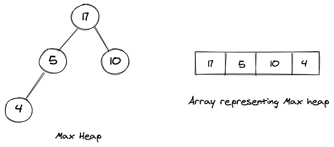

# 实现堆

> 原文：<https://www.studytonight.com/advanced-data-structures/implementing-heaps>

在上一篇文章中，我们了解了堆的所有知识。现在是实施它们的时候了。数组是实现堆的首选，因为堆有完整的二叉树属性，我们可以确信不会浪费数组位置。

让我们考虑如下所示的二进制堆，这个堆可以用一个数组来表示，如下图所示。



## 实现堆

让我们看看如何实现一个堆数据结构。

### 1.堆的结构

我们需要一个数组来存储堆的元素，此外，我们还需要一个变量来表示堆的大小。考虑下面的代码片段:

```cpp
private int[] items = new int[10];
private int size;
```

初始容量也可以是动态的，但这里我选择了 10 的固定长度来表示相同的容量。

### 2.插入到堆中

当我们想要将一个项目插入到堆中时，我们将简单地将它插入到数组中，然后如果它不满足任何堆属性，就执行`bubbleUp()`操作。代码如下所示:

```cpp
private void insert(int item){
        if(isFull()){
            throw new IllegalStateException();
        }
        items[size++] = item;
        bubbleUp();
}
```

一个案例可能会到达堆已满的地方，然后如果我们试图向其中插入更多的项目，它应该会返回一个异常。`isFull()`方法是这样的:

```cpp
private boolean isFull(){ return size == items.length; }
```

在这个`isFull()`调用返回 false 之后，我们向前移动，将项目插入到我们的堆中，并增加数组的大小。现在，最重要的部分是纠正我们在堆中插入的这个元素的位置。我们用`bubbleUp()`方法来做。`bubbleUp()`方法代码如下:

```cpp
private void bubbleUp(){
        int index = size - 1;
        while(index > 0 && items[index] > items[parent(index)]){
            swap(index,parent(index));
            index = parent(index);
        }
}
```

在上面的方法中，我们获取刚刚插入的元素的索引，然后在这个元素比父元素大的情况下用父元素交换它，同时我们更新索引，这样我们就不会选择错误的元素。`swap()`方法是这样的:

```cpp
private void swap(int left,int right){
        int temp = items[left];
        items[left] = items[right];
        items[right] = temp;
}
```

还需要注意的是，我们在`bubbleUp()`方法中调用的是一个父方法，该父方法返回给我们一个当前索引的父。该方法的代码如下所示:

```cpp
private int parent(int index){ return (index - 1)/2; }
```

以上方法是我们将元素插入二进制堆所需的全部方法。

#### 3.从堆中移除

与插入堆相比，从堆中移除元素是一个有点棘手的过程，因为在这个例子中，我们需要`bubbleDown()`，这个向下冒泡的过程包括检查父元素的有效性，以及尽可能向左插入树以保持完整的二叉树属性的方法。

`remove()`方法是这样的:

```cpp
private void remove(){
        if(isEmpty()){
            throw new IllegalStateException();
        }
        items[0] = items[--size];
        bubbleDown();
}
```

第一个检查是确保我们没有试图从空堆中移除任何东西。然后我们在开始处插入元素，然后`bubbleDown()`将元素放到它的正确位置。`bubbleDown()`方法是这样的:

```cpp
private void bubbleDown(){
        int index = 0;
        while(index <= size && !isValidParent(index)){
            int largerChildIndex = largerChildIndex(index);
            swap(index,largerChildIndex);
            index = largerChildIndex;
        }
}
```

我们正在检查我们拥有的索引应该小于大小，并确保父节点不应该是有效的(应该小于子值和其他检查)。`largerChildIndex()`方法返回给我们子项目，我们将在向下冒泡时用它替换当前项目。`largerChildIndex()`的代码是这样的:

```cpp
private int largerChildIndex(int index){
        if(!hasLeftChild(index)) return index;
        if(!hasRightChild(index)) return leftChildIndex(index);
        return (leftChild(index) > rightChild(index)) ? leftChildIndex(index) : rightChildIndex(index);
}
```

`isValidParent()`方法代码如下:

```cpp
private boolean isValidParent(int index){
        if(!hasLeftChild(index)) return true;
        var isValid = items[index] >= leftChild(index);
        if(hasRightChild(index)){
            isValid &= items[index] >= rightChild(index);
        }
        return isValid;
}
```

在上面的代码片段中，我们只是确保父级是有效的，并且如果左边的子级是 null，那么我们返回 true。`leftChild()`、`rightChild()`、`hasLeftChild()`、`hasRightChild()`的方法是这样的:

```cpp
private int leftChild(int index){
        return items[leftChildIndex(index)];
}

private int rightChild(int index){
        return items[rightChildIndex(index)];
}

private boolean hasLeftChild(int index){
        return leftChildIndex(index) <= size;
}

private boolean hasRightChild(int index){
        return rightChildIndex(index) <= size;
}
```

上面的方法调用方法来获取二进制堆元素的左右子元素，它们是:

```cpp
private int leftChildIndex(int index){
        return 2*index + 1;
}

private int rightChildIndex(int index){
        return 2*index + 2;
}
```

现在，我们已经完成了从堆中插入或删除元素所需的所有方法。完整的代码如下:

```cpp
public class Heap {

    private int[] items = new int[10];
    private int size;

    private void insert(int item){
        if(isFull()){
            throw new IllegalStateException();
        }
        items[size++] = item;
        bubbleUp();
    }

    private void remove(){
        if(isEmpty()){
            throw new IllegalStateException();
        }
        items[0] = items[--size];
        bubbleDown();
    }

    private int largerChildIndex(int index){
        if(!hasLeftChild(index)) return index;
        if(!hasRightChild(index)) return leftChildIndex(index);
        return (leftChild(index) > rightChild(index)) ? leftChildIndex(index) : rightChildIndex(index);
    }

    private boolean isValidParent(int index){
        if(!hasLeftChild(index)) return true;
        var isValid = items[index] >= leftChild(index);
        if(hasRightChild(index)){
            isValid &= items[index] >= rightChild(index);
        }
        return isValid;
    }

    private int leftChild(int index){
        return items[leftChildIndex(index)];
    }

    private int rightChild(int index){
        return items[rightChildIndex(index)];
    }

    private int leftChildIndex(int index){
        return 2*index + 1;
    }

    private int rightChildIndex(int index){
        return 2*index + 2;
    }

    private boolean hasLeftChild(int index){
        return leftChildIndex(index) <= size;
    }

    private boolean hasRightChild(int index){
        return rightChildIndex(index) <= size;
    }

    private boolean isFull(){
        return size == items.length;
    }

    private boolean isEmpty(){
        return size == 0;
    }

    private void bubbleUp(){
        int index = size - 1;
        while(index > 0 && items[index] > items[parent(index)]){
            swap(index,parent(index));
            index = parent(index);
        }
    }

    private void bubbleDown(){
        int index = 0;
        while(index <= size && !isValidParent(index)){
            int largerChildIndex = largerChildIndex(index);
            swap(index,largerChildIndex);
            index = largerChildIndex;
        }
    }

    private int parent(int index){
        return (index - 1)/2;
    }

    private void swap(int left,int right){
        int temp = items[left];
        items[left] = items[right];
        items[right] = temp;
    }

    private int getMax(){
        return items[0];
    }

    public static void main(String[] args) {
        Heap heap = new Heap();
        heap.insert(10);
        heap.insert(5);
        heap.insert(17);
        heap.insert(4);
        heap.insert(22);
       /// heap.remove();
        System.out.println("Done!");
    }
} 
```

## 结论

*   我们学习了如何实现堆，主要是 **bubbleUp()** 和 **bubbleDown()** 方法。

* * *

* * *