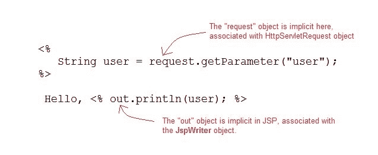

# JSP 中的隐式对象

> 原文：<https://www.studytonight.com/jsp/implicit-object-in-jsp.php>

JSP 提供了对一些隐式对象访问，这些对象代表了 JSP 页面开发人员可能需要使用的 servlets 的一些常用对象。例如，您可以通过使用 **request** 变量来检索 HTML 表单参数数据，该变量表示**httpersvletrequest**对象。

* * *

#### 以下是 JSP 隐式对象

| 隐式对象 | 描述 |
| **请求** | 与请求相关联的 **HttpServletRequest** 对象。 |
| **回应** | 与发送回浏览器的响应相关联的对象。 |
| **出** | 与响应的输出流相关联的 **JspWriter** 对象。 |
| **会话** | 与给定请求用户的会话相关联的对象。 |
| **应用** | 网络应用的 **ServletContext** 对象。 |
| **配置** | 与当前 JSP 页面的 servlet 相关联的 **ServletConfig** 对象。 |
| **pageContext** | 封装当前 JSP 页面的单个请求的环境的**页面上下文**对象 |
| 页 | **页面**变量相当于**这个**变量的 Java 编程语言。 |
| 例外 | **异常**对象表示由其他 JSP 页面抛出的**可抛出**对象。 |

所有这些都非常有用，你会慢慢了解它们，因为你会在你的职业生涯中从事直播项目。例如:当你要创建一个必须在用户会话中创建的应用时`session`将出现，当你在应用中提交表单时使用`request`等。

稍后我们将详细了解这些内容。

* * *

* * *