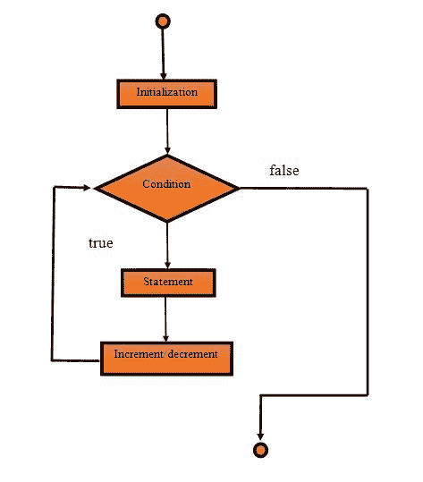
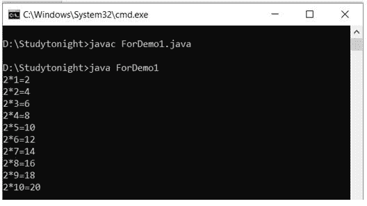
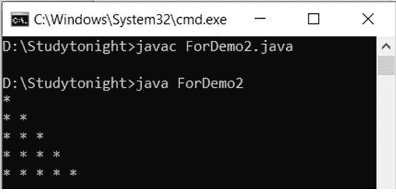
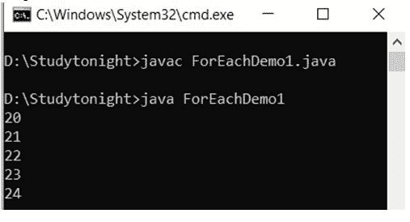
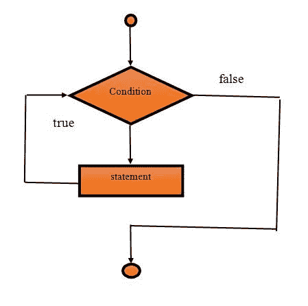
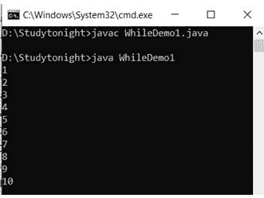
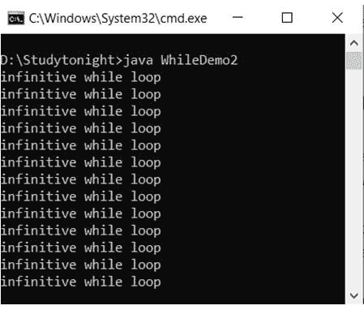
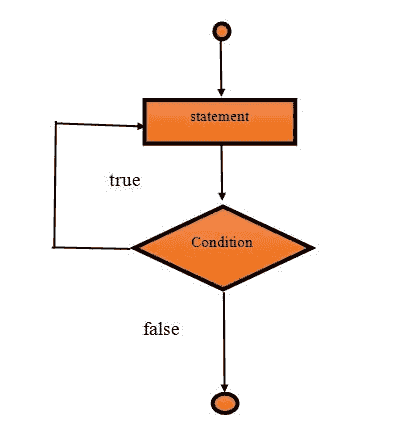
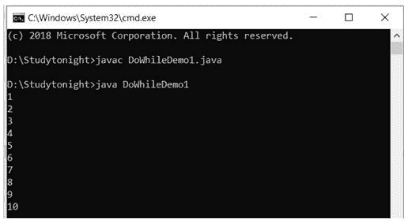
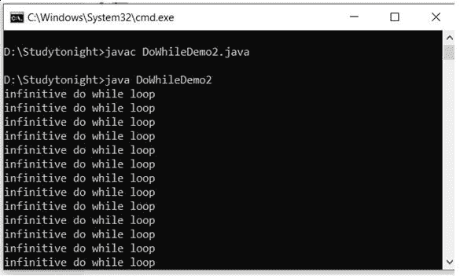

# Java 循环

> 原文：<https://www.studytonight.com/java/loops-in-java.php>

循环是编程的一个重要概念，它允许遍历语句序列。

循环被设计为执行特定的代码块，直到指定的条件为真或者集合的所有元素(数组、列表等)都被完全遍历。

loop 最常见的用途是执行重复的任务。例如，如果我们想打印一个数字的表格，那么我们需要写 10 次 print 语句。但是，我们可以通过使用循环对单个 print 语句执行同样的操作。

循环被设计为执行其块，直到指定的条件为真。

基于循环结构，Java 主要提供了三个循环。

1.  for 循环
2.  while 循环
3.  边循环边做

我们将在下面详细解释每个循环。

### 用于循环

for 循环用于重复执行部分程序**。当执行次数固定时，建议使用 for 循环。For 循环可以分为两种类型。**

 **1.  for 循环
2.  loop 每个循环

**对于循环语法:**

下面是在 Java 中声明 for 循环的语法。

```java
	 for(initialization;condition;increment/decrement)
{  
//statement 
} 

```

### 对于循环参数:

要创建 for 循环，我们需要设置以下参数。

#### **1)初始化**

这是初始部分，我们为循环设置初始值。它在循环开始时只执行一次。如果我们不想设置初始值，它是可选的。

#### **2)条件**

它用于在每次执行时测试条件。继续执行，直到条件为假。它是可选的，如果我们不指定，循环将是无限的。

#### **3)声明**

它是循环体，每次都执行，直到条件为假。

#### **4)递增/递减**

它用于设置循环的增量或减量。

#### **for 循环的数据流图**

这个流程图显示了循环的流程。这里我们可以理解循环的流程。



**循环示例**

在本例中，循环的初始值被设置为 1，并将其增加 1，直到条件为真并执行 10 次。

```java
	 public class ForDemo1
{  
public static void main(String[] args) 
	{  
		int n, i;
		n=2;
		for(i=1;i<=10;i++)
		{  
			System.out.println(n+"*"+i+"="+n*i);  
		}  
}  	
} 

```



**循环嵌套示例**

循环可以嵌套，在另一个循环内创建的循环**称为嵌套循环。有时根据需求，我们必须创建嵌套循环。**

通常，嵌套循环用于**迭代表格数据**。

```java
	 public class ForDemo2
{  
public static void main(String[] args) 
{  
for(inti=1;i<=5;i++)
{  
for(int j=1;j<=i;j++)
{  
				System.out.print("* ");  
}  
System.out.println(); 
}  
}  
} 

```



### 每个循环

在 Java 中，for 循环用于遍历数组或集合元素。在这个循环中，不需要递增或递减运算符。

for-每个循环语法

下面是在 Java 中为每个循环声明的语法。

```java
	 for(Type var:array)
{  
//code for execution
} 

```

**示例:**

在这个例子中，我们使用 for-each 循环遍历数组元素。for-当数组对象中没有元素时，每个**循环自动终止。**

```java
	 public class ForEachDemo1
{  
public static void main(String[] args) 
		{    
			inta[]={20,21,22,23,24};   
			for(int i:a)
{  
				System.out.println(i);  
			}  
}  
} 

```



## 当循环

像 for 循环一样，while 循环也用于重复执行代码。控制语句。它用于多次迭代程序的一部分。当迭代次数不固定时，则使用 while 循环。

**语法:**

```java
	 while(condition)
{  
//code for execution
} 

```

#### **While 模块的数据流图**



**示例:**

在本例中，我们使用 while 循环打印 1 到 10 个值。在第一步中，我们设置条件变量，然后测试条件，如果条件为真，执行循环体，并将变量增加 1。

```java
	 public class WhileDemo1
{  
	public static void main(String[] args) 
	{  
		inti=1;  
		while(i<=10)
		{  
			System.out.println(i);  
			i++;  
		}  
	}  
} 

```



**无限循环示例**

条件表达式**总是返回真值**的 while 循环称为无限 while 循环。我们也可以通过在循环中传递**真**文字来创建无限循环。

创建无限循环时要小心，因为它会引发内存溢出问题。

```java
	 public class WhileDemo2 
{  
	public static void main(String[] args) 
	{  
		while(true)
		{  
		System.out.println("infinitive while loop");  
		}  
	}  
} 

```



## 边做边循环

在 Java 中，do-while 循环用于一次又一次地执行语句。该循环**至少执行一次**，因为该循环是在检查条件之前执行的。表示执行循环体的后循环**条件评估。**

while 和 do-while 循环的主要区别是，在 do while 循环中，条件在执行循环后评估。

**语法:**

下面是在 Java 中声明 do-while 循环的语法。

```java
	 do
{  
//code for execution 
}
while(condition); 

```

#### **边做边块数据流图**



**示例:**

在本例中，我们使用 do while 循环打印从 1 到 10 的值。

```java
	 public class DoWhileDemo1 
{  
public static void main(String[] args) 
{  
inti=1;  
do
{  
System.out.println(i);  
i++;  
}while(i<=10);  
        }  
} 

```



**无限边做边循环的例子**

像无限 while 循环一样，我们也可以创建无限 do while 循环。要创建无限 do while 循环，只需**通过始终为真的条件。**

```java
	 public class DoWhileDemo2 
{  
public static void main(String[] args) 
{  
        do
{  
System.out.println("infinitive do while loop");  
}while(true);  
}  
} 

```



* * *

* * ***