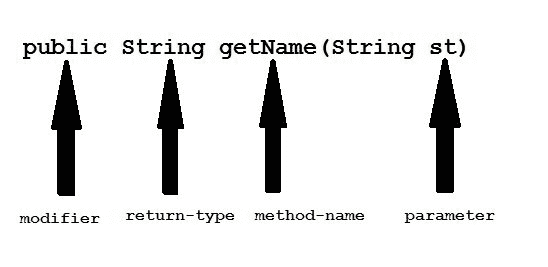
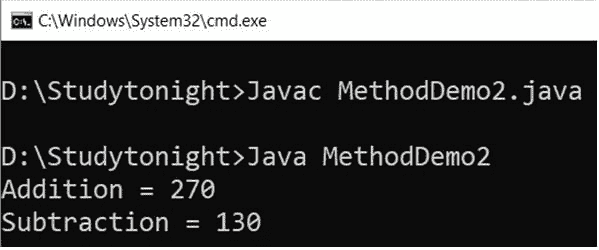
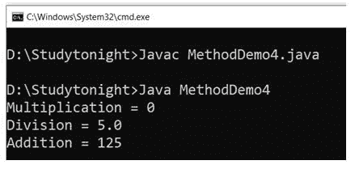
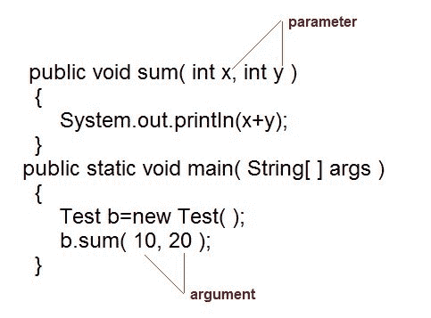

# Java 中的方法

> 原文：<https://www.studytonight.com/java/methods-in-java.php>

方法类似于其他编程语言中定义的函数。方法描述对象的**行为。方法是组合在一起执行操作的语句的集合。**

例如，如果我们有一个类 Human，那么这个类应该有像吃饭()，走路()，说话()等描述对象行为的方法。

声明方法类似于函数。请参见用 Java 声明该方法的语法。

* * *

```java
return-type methodName(parameter-list)
{
 //body of method
}
```

**返回类型**是指方法返回的值的类型。

**方法名**是一个有效的有意义的名称，代表一个方法的名称。

**参数列表**代表该方法接受的参数列表。

方法可能有一个可选的 return 语句，用于向调用方函数返回值。

* * *

#### 方法示例:

让我们通过一个简单的例子来理解这个方法，这个例子接受一个参数并返回一个字符串值。

```java
public String getName(String st)
{
 String name="StudyTonight";
 name=name+st;
 return name;
}
```



**修饰语:**修饰语是方法的访问类型。我们稍后会详细讨论。

**返回类型:**方法可以返回值。方法返回值的数据类型在方法标题中声明。

**方法名称:**方法的实际名称。

**参数:**传递给方法的值。

**方法体:**定义方法做什么的语句集合。

* * *

### 调用方法

调用方法来执行其中实现的功能。我们可以通过名称调用方法，并将返回值存储到变量中。

```java
String val = GetName(".com")
```

在追加方法调用期间传递的参数后，它将返回一个值**studytonight.com**。

* * *

### 返回多个值

在 Java 中，我们可以使用数组从一个方法中返回多个值。我们将所有的值存储到一个想要返回的数组中，然后将其返回给调用者方法。我们**必须在创建数组时将返回类型指定为数组**。让我们看一个例子。

**示例:**

下面是一个例子，我们返回一个包含多个值的数组。

```java
  class MethodDemo2{ 
    static int[] total(int a, int b) 
    { 
int[] s = new int[2]; 
s[0] = a + b; 
s[1] = a - b; 
        return s; 
    } 

    public static void main(String[] args) 
    { 
int[] s = total(200, 70); 
System.out.println("Addition = " + s[0]); 
System.out.println("Subtraction = " + s[1]); 
    } 
} 

```



* * *

### 从方法返回对象

在某些情况下，可能需要将类的对象返回给调用者函数。在这种情况下，我们**必须在方法定义中指定类名**。

下面是一个例子，我们从方法调用中获取一个对象。它也可以用来返回数据集合。

**示例:**

在这个例子中，我们创建了一个方法 **get()** 返回**演示**类的对象。

```java
  class Demo{
int a; 
    double b; 
int c; 
Demo(int m, double d, int a) 
    { 
        a = m; 
        b = d; 
        c = a; 
    } 
} 
class MethodDemo4{ 
    static Demo get(int x, int y) 
    { 
        return new Demo(x * y, (double)x / y, (x + y)); 
    } 
    public static void main(String[] args) 
    { 
        Demo ans = get(25, 5); 
System.out.println("Multiplication = " + ans.a); 
System.out.println("Division = " + ans.b); 
System.out.println("Addition = " + ans.c); 
    } 
} 

```



* * *

## 方法中的参数与参数

说到方法，重要的是要知道两个术语**参数**和**参数**的区别。

**参数**是一个方法定义的变量，在调用该方法时接收值。参数始终是方法的本地参数，它们在方法之外没有作用域。而**参数**是调用方法时传递给方法的值。

你可以通过下面的图片来理解它，这个图片用一个程序例子来解释参数和参数。



* * *

#### `call-by-value`和`call-by-reference`

有两种方法可以将参数传递给方法

1.  **按值调用:**在这种方法中，参数值的副本被传递给一个方法。对方法内部参数值所做的更改不会影响参数。
2.  **按引用调用:**在这种引用中，参数被传递给方法。在方法内部所做的任何更改都将影响 agrument 值。

**注意:**然而在 Java 中并没有引用调用的概念。Java 只支持按值调用。

* * *

### `call-by-value`示例

让我们看一个例子，在这个例子中，我们将参数传递给一个方法并修改它的值。

```java
public class Test
{
    public void callByValue(int x)
    {
        x=100;
    }
    public static void main(String[] args)
    {
       int x=50;
        Test t = new Test();
        t.callByValue(x);	<font color="green">//function call</font>
        System.out.println(x);
    }

}
```

Fifty

看，在上例中，传递给方法的**值即使在方法中修改后也不会改变**。它显示对该值所做的**更改是局部的**，并且参数作为值调用传递。

* * *

* * *