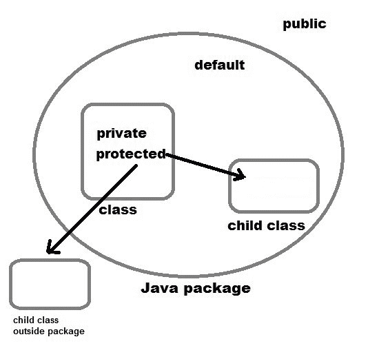

# Java 中的访问修饰符

> 原文：<https://www.studytonight.com/java/modifier-in-java.php>

访问修饰符是 Java 中用于设置可访问性的关键字。访问修饰符限制另一个类中的类、构造器、数据成员和方法的访问。

Java 语言有四个访问修饰符来控制类及其成员的访问级别。

*   **默认:**默认只在同一个包内有作用域
*   **Public:** Public 具有随处可见的范围
*   **受保护:**受保护在包和所有子类中都有作用域
*   **Private:** Private 只在类内有作用域

Java 还支持很多非访问修饰符，比如**静态、抽象、同步、原生、易变、瞬态**等。我们将在其他教程中介绍这些内容。



* * *

### 默认访问修饰符

如果我们没有指定任何访问修饰符，那么它将被视为默认的修饰符。它用于设置包内的可访问性。这意味着我们不能从包外访问它的方法或类。它也被称为包可访问性修饰符。

#### 示例:

在本例中，我们在**包 1** 中创建了一个**演示类**，并通过另一个类**测试**来访问演示类的 show()方法。我们没有提到 show()方法的访问修饰符，这就是它不可访问并在编译时报告错误的原因。

Demo.java

```java
  package package1;

public class Demo {

  int a = 10;
  // default access modifier
  void show() {
    System.out.println(a);
  }

} 

```

Test.java

```java
  import package1.Demo;
public class Test {

  public static void main(String[] args) {
    Demo demo = new Demo();
    demo.show(); // compile error
  }
} 

```

演示类型中的 show()方法不可见

### 公共访问修饰符

public access 修饰符用于设置变量、方法或类的公共可访问性。任何声明为公共的变量或方法都可以从应用的任何地方访问。

#### 示例:

这里，我们有两个位于两个不同包中的类演示和测试。现在我们想从测试类访问演示类的显示方法。该方法具有公共可访问性，因此运行良好。见下面的例子。

Demo.java

```java
  package package1;

public class Demo {

  int a = 10;
  // public access modifier
  public void show() {
    System.out.println(a);
  }

} 

```

Test.java

```java
  package package2;
import package1.Demo;
public class Test {

  public static void main(String[] args) {
    Demo demo = new Demo();
    demo.show();
  }
} 

```

Ten

### 受保护的访问修饰符

Protected 修饰符保护变量、方法不被类外部访问。它可以在类内访问，并且在子类(继承)中，无论子级是位于**同一个包**中的**还是某个**其他包**中的**。

#### 示例:

在本例中，Test 类由 Demo 扩展，并被称为受保护的方法 show()，由于继承，现在可以访问该方法。

Demo.java

```java
  package package1;

public class Demo {

  int a = 10;
  // public access modifier
  protected void show() {
    System.out.println(a);
  }

} 

```

Test.java

```java
  package package2;
import package1.Demo;
public class Test extends Demo{

  public static void main(String[] args) {
    Test test = new Test();
    test.show();
  }
} 

```

Ten

### 私有访问修饰符

私有修饰符是最受限制的修饰符，只允许在同一个类中访问。我们可以将这个修饰符设置为任何变量、方法甚至构造器。

#### 示例:

在本例中，我们将私有修饰符设置为 show()方法，并尝试从类外部访问该方法。Java 不允许从类外部访问它。

Demo.java

```java
  class Demo {

  int a = 10;
  private void show() {
    System.out.println(a);
  }

} 

```

Test.java

```java
  public class Test {

  public static void main(String[] args) {
    Demo demo = new Demo();
    demo.show(); // compile error
  }
} 

```

演示类型中的 show()方法不可见

### 修改非访问权限

除了访问修饰符，Java 还提供了非访问修饰符。这些修饰符**用于为变量或方法设置特殊属性**。

非访问修饰符不会改变变量或方法的可访问性，但会为它们提供特殊的属性。Java 提供了以下非访问修饰符。

1.  最后的
2.  静态
3.  短暂的
4.  同步的
5.  不稳定的

### 最终修改

最终修改器可以与**变量、方法**和类一起使用。如果**变量**被声明为**最终**，那么我们**不能更改**它的值。如果**方法**被声明**最终**那么它**不能被**覆盖，如果一个**类**被声明**最终**那么我们**不能继承它**。

### 静态修改器

静态修饰符用于使字段静态。我们可以用它来声明静态变量、方法、类等。静态可以用来声明类级变量。如果一个方法被声明为静态的，那么我们不需要对象来访问它。我们可以使用静态创建嵌套类。

### 瞬态修改器

当一个实例变量被声明为瞬态变量时，它的值在对象被序列化时不会持续存在

### 同步修改器

当一个方法被同步时，它一次只能被一个线程访问。我们将在线程中详细讨论它。

### 挥发性改性剂

Volatile 修饰符告诉编译器，volatile 变量可能会被程序的其他部分意外更改。可变变量用于多线程程序。 **volatile** 关键字不能与方法或类一起使用。它只能与变量一起使用。

* * *

* * *