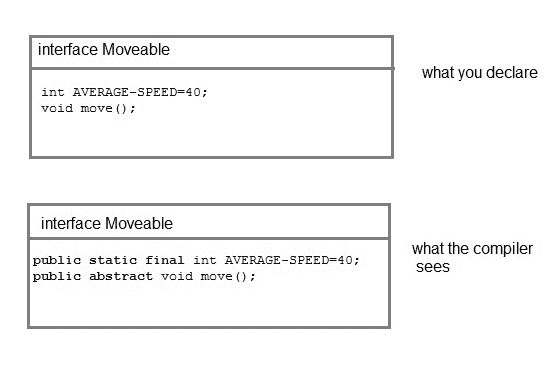

# Java 接口

> 原文：<https://www.studytonight.com/java/java-interface.php>

接口是 Java 中用来实现抽象的概念。这是我们实现完全抽象的唯一方法。接口在语法上类似于类，但是您不能创建**接口**的实例，并且它们的方法是在没有任何主体的情况下声明的。当你创建一个接口时，它定义了一个类可以做什么，而没有说明这个类将如何做。

它只能有抽象方法和静态字段。但是从 **Java 8** 开始，接口可以有**默认**和**静态方法**，从 **Java 9** 开始，也可以有**私有方法**。

当一个接口继承另一个接口时**扩展使用**关键字，而类使用**实现**关键字继承一个接口。

### 界面的优势

*   它支持多重继承
*   它有助于实现抽象
*   它可以用来实现松耦合。

**语法:**

```java
interface interface_name {  
// fields
// abstract/private/default methods
} 
```

### 界面要点

*   接口内部的方法不能是静态的、最终的、本机的或严格的。
*   接口内部声明的所有变量都是隐式公共的、静态的和最终的。
*   在接口内部声明的所有方法都是隐式公共和抽象的，即使您没有使用 public 或 abstract 关键字。
*   接口可以扩展一个或多个其他接口。
*   接口无法实现类。
*   接口可以嵌套在另一个接口中。

## 是时候举个例子了！

让我们举一个简单的代码示例，了解什么是接口:

```java
interface Moveable
{
 	int AVERAGE-SPEED = 40;
 	void move();
}
```



**注意:**编译器自动将 Interface 的方法转换为公共的、抽象的，数据成员默认为公共的、静态的、最终的。

### 接口实现示例

在这个例子中，我们创建了一个接口，并使用一个类来实现。让我们看看如何实现接口。

```java
interface Moveable
{
 	int AVG-SPEED = 40;
 	void move();
}

class Vehicle implements Moveable
{
 	public void move()
 	{
  		System .out. print in ("Average speed is"+AVG-SPEED");
 	}
 	public static void main (String[] arg)
 	{
  		Vehicle vc = new Vehicle();
  		vc.move();
 	}
}
```

平均速度是 40。

* * *

### 接口支持多重继承

虽然 Java 中的类不支持多重继承，但是一个类可以实现多个接口。

在这个例子中，两个接口由一个显示多重继承实现的类实现。

```java
interface Moveable
{
 	boolean isMoveable();
}

interface Rollable
{
 	boolean isRollable
}

class Tyre implements Moveable, Rollable
{
 	int width;

 	boolean isMoveable()
 	{
  		return true;
 	}

 	boolean isRollable()
 	{
  		return true;
 	}

 	public static void main(String args[])
 	{
  		Tyre tr = new Tyre();
  		System.out.println(tr.isMoveable());
  		System.out.println(tr.isRollable());
 	}
}
```

真实真实

* * *

### 接口扩展了其他接口

接口可以通过使用 extends 关键字继承到另一个接口。但在这种情况下，接口只是继承，并不提供实现。实现只能由类提供。

```java
interface NewsPaper
{
 	news();
}

interface Magazine extends NewsPaper
{
 	colorful();
}
```

### 接口和抽象类的区别？

接口和抽象类都用于实现抽象，但也有一些不同。下面列出了一些差异。

| 抽象类 | 连接 |
| --- | --- |
| 抽象类是一个包含一个或多个抽象方法的类，必须由它的子类来实现。 | 接口是一个包含方法声明但没有实现的 Java 对象。实现接口的类必须为所有方法提供方法定义。 |
| 抽象类是一个类前缀，后跟一个抽象关键字和类定义。 | 接口是一个纯抽象类，以 Interface 关键字开头。 |
| 抽象类也可以包含具体的方法。 | 而接口包含所有抽象方法和最终变量声明。 |
| 抽象类在应该实现一些通用方法并且应该由子类实现专门化行为的情况下是有用的。 | 在应该实现所有属性的情况下，接口很有用。 |

### 接口中的默认方法–Java 8

在 Java 8 版本中，接口增加了一个新特性，这是默认方法。默认方法是可以有其主体的方法。这意味着默认方法不是抽象方法，它用于为接口设置一些默认功能。

Java 提供默认关键字来创建默认方法。让我们看一个例子:

```java
interface Abc{  
    // Default method   
    default void msg(){  
        System.out.println("This is default method");  
    }  
    // Abstract method  
    void greet(String msg);  
}  
public class Demo implements Abc{  
    public void greet(String msg){        // implementing abstract method   
        System.out.println(msg);  
    }  
    public static void main(String[] args) {  
    	Demo d = new Demo();  
        d.msg();   // calling default method  
        d.greet("Say Hi");  // calling abstract method  

    }  
} 
```

这是默认方法说嗨

### 接口中的静态方法——Java 8

从 Java 8 开始，Java 允许将静态方法声明到接口中。静态方法的目的是向接口中添加实用方法。在下面的例子中，我们创建了一个包含静态方法和抽象方法的接口 Abc。见下面的例子。

```java
interface Abc{  
    // static method   
    static void msg(){  
        System.out.println("This is static method");  
    }  
    // Abstract method  
    void greet(String msg);

}  
public class Demo implements Abc{  
    public void greet(String msg){        // implementing abstract method   
        System.out.println(msg);  
    }  
    public static void main(String[] args) {  
    	Demo d = new Demo();  
        Abc.msg();   // calling static method  
        d.greet("Say Hi");  // calling abstract method  

    }  
} 
```

这是静态方法说嗨

### 私有方法–Java 9

在 Java 9 版本中，增加了一个新特性，允许我们在接口内部声明私有方法。私有方法的目的只是在接口的非抽象方法之间共享一些任务。

在这个例子中，我们创建了一个有默认方法和私有方法的接口 Abc。因为接口外部无法访问私有方法。所以，我们从默认方法调用它。见下面的例子。

```java
interface Abc{  
    // Default method   
    default void msg(){  
         greet();
    }  
    // Private method  
    private void greet() {
    	System.out.println("This is private method"); 
    }

}  
public class Demo implements Abc{    
    public static void main(String[] args) {  
    	Demo d = new Demo();  
        d.msg();   // calling default method  

    }  
} 
```

这是私人方法

* * *