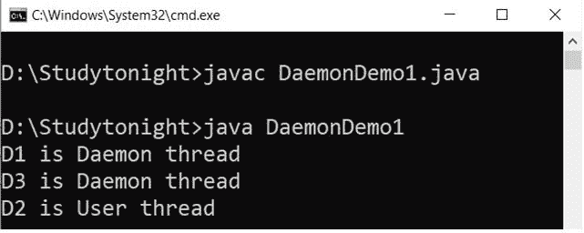

# Java 守护线程

> 原文：<https://www.studytonight.com/java/daemon-thread-in-java.php>

守护线程是一个低优先级线程，为用户线程提供支持。这些线程可以是用户定义的，也可以是系统定义的。垃圾收集线程是系统生成的后台运行的守护线程之一。这些线程在后台运行，执行垃圾收集等任务。守护线程不允许 JVM 存在，直到所有线程完成它们的执行。当一个 JVM 发现守护线程时，它会终止线程，然后关闭自己，它不关心守护线程是否在运行。


### 以下是守护线程中的方法

**1 . void set daemon(boolean status)**

在 Java 中，此方法用于将当前线程创建为守护线程或用户线程。如果有一个用户线程作为 obj1，那么 obj1.setDaemon(true)将使它成为 Daemon 线程，如果有一个 Daemon 线程 obj2，那么调用 obj2.setDaemon(false)将使它成为用户线程。

**语法:**

```java
public final void setDaemon(boolean on)
```

**2 .boolean isDaemon()**

在 Java 中，这个方法用来检查当前线程是否是守护进程。如果线程是守护进程，则返回真，否则返回假。

**语法:**

```java
public final booleanisDaemon()
```

### 示例:

让我们创建一个创建守护进程和用户线程的示例。要创建守护线程，请使用 setdaemon()方法。它接受真或假的布尔值。

```java
	 public class DaemonDemo1 extends Thread 
{ 
    public DaemonDemo1(String name1)
    { 
        super(name1); 
    } 
    public void run() 
    {  
        if(Thread.currentThread().isDaemon()) 
        {  
            System.out.println(getName() + " is Daemon thread");  
        }  
        else
        {  
            System.out.println(getName() + " is User thread");  
        }  
    }  
    public static void main(String[] args) 
    {  
        DaemonDemo1 D1 = new DaemonDemo1("D1"); 
        DaemonDemo1 D2 = new DaemonDemo1("D2"); 
        DaemonDemo1 D3 = new DaemonDemo1("D3"); 

        D1.setDaemon(true);      
        D1.start();  
        D2.start(); 
        D3.setDaemon(true);  
        D3.start();         
    }  
} 

```



### 示例:守护线程优先级

因为守护线程是低级线程，所以让我们检查这些线程的优先级。我们得到的优先级是由 JVM 设置的。

```java
    public class DaemonDemo1 extends Thread 
{ 
    public DaemonDemo1(String name1)
    { 
        super(name1); 
    } 
    public void run() 
    {  
        if(Thread.currentThread().isDaemon()) 
        {  
            System.out.println(getName() + " is Daemon thread");

        }  
        else
        {  
            System.out.println(getName() + " is User thread");  
        }
        System.out.println(getName()+" priority "+Thread.currentThread().getPriority());
    }  
    public static void main(String[] args) 
    {  
        DaemonDemo1 D1 = new DaemonDemo1("D1"); 
        DaemonDemo1 D2 = new DaemonDemo1("D2"); 
        DaemonDemo1 D3 = new DaemonDemo1("D3"); 

        D1.setDaemon(true);   
        D1.start();  
        D2.start(); 
        D3.setDaemon(true);  
        D3.start();         
    }  
} 

```

D1 是守护线程 D1 优先级 5 D2 是用户线程 D3 是守护线程 D2 优先级 5 D3 优先级 5

### 例子

创建守护线程时，确保在线程启动前调用 `setDaemon()。在线程启动后调用它将引发异常并终止程序执行。`

 ```java`
    public class DaemonDemo1 extends Thread 
{ 
    public DaemonDemo1(String name1)
    { 
        super(name1); 
    } 
    public void run() 
    {  
        if(Thread.currentThread().isDaemon()) 
        {  
            System.out.println(getName() + " is Daemon thread");

        }  
        else
        {  
            System.out.println(getName() + " is User thread");  
        }
        System.out.println(getName()+" priority "+Thread.currentThread().getPriority());
    }  
    public static void main(String[] args) 
    {  
        DaemonDemo1 D1 = new DaemonDemo1("D1"); 
        DaemonDemo1 D2 = new DaemonDemo1("D2"); 
        DaemonDemo1 D3 = new DaemonDemo1("D3"); 

        D1.setDaemon(true);   
        D1.start();  
        D2.start();
        D3.start();
        D3.setDaemon(true);  

    }  
} 

```

D1 是线程“main”中的 Daemon threadException D1 优先级 5 D3 是用户线程 D2 是用户线程 D2 优先级 5 Java . lang . illegalthreadstatexception D3 优先级 5 在 Java . base/Java . lang . thread . setdaemon(thread . Java:1410)在 myjavaproject。daemondemo 1 . main(daemondemo 1 . Java:32)

* * *`