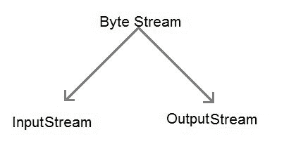
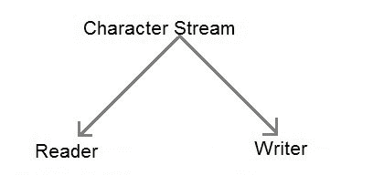
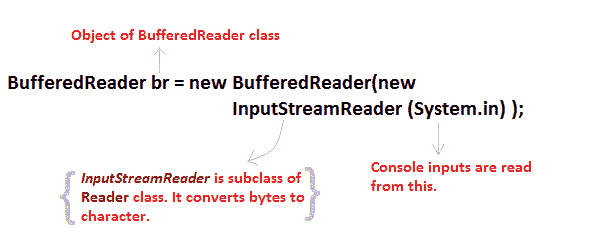

# Java 输入输出流

> 原文：<https://www.studytonight.com/java/java-io-stream.php>

Java 通过**流**执行输入输出。java 输入输出系统将一个流链接到一个物理层，用 java 进行输入输出操作。一般来说，流意味着连续的数据流。流是处理输入/输出的干净方式，不需要你的代码的每个部分都理解物理的。

Java 在 **java.io** 包下封装 Stream。Java 定义了两种类型的流。他们是，

1.  **字节流:**它提供了一种处理字节输入输出的便捷手段。
2.  **字符流:**它为处理字符的输入和输出提供了方便的手段。字符流使用 Unicode，因此可以国际化。

* * *

## Java 字节流类

字节流是通过在层次结构的顶部使用两个抽象类来定义的，它们是 InputStream 和 OutputStream。



这两个抽象类有几个具体的类来处理各种设备，如磁盘文件、网络连接等。

* * *

#### 一些重要的字节流类。

| 流类 | 描述 |
| **buffer edinpertstream** | 用于缓冲输入流。 |
| **缓冲器 utputStream** | 用于缓冲输出流。 |
| datainputstream | 包含读取 java 标准数据类型的方法 |
| **DataOutputStream** | 包含编写 java 标准数据类型方法的输出流 |
| fileinputstream | 从文件中读取的输入流 |
| 档案输出流 | 写入文件的输出流。 |
| **InputStream** | 描述流输入的抽象类。 |
| 输出流 | 描述流输出的抽象类。 |
| `PrintStream` | 包含`print()`和`println()`方法的输出流 |

这些类定义了几个关键方法。两个最重要的是

1.  `read()`:读取字节数据。
2.  `write()`:写入字节数据。

* * *

## Java 字符流类

字符流也是通过在层次结构的顶部使用两个抽象类来定义的，它们是 Reader 和 Writer。



这两个抽象类有几个处理 unicode 字符的具体类。

* * *

### 一些重要的字符流类

| 流类 | 描述 |
| 缓冲器 | 处理缓冲的输入流。 |
| **BufferedWriter** | 处理缓冲输出流。 |
| 档案管理员 | 从文件读取的输入流。 |
| **档案作者** | 写入文件的输出流。 |
| `InputStreamReader` | 将字节转换为字符的输入流 |
| **输出流读取器** | 将字符转换为字节的输出流。 |
| **PrintWriter** | 包含`print()`和`println()`方法的输出流。 |
| **读取器** | 定义字符流输入的抽象类 |
| **作家** | 定义字符流输出的抽象类 |

* * *

### 读取控制台输入

我们使用 BufferedReader 类的对象从键盘获取输入。



#### 阅读字符

`read()`方法与 BufferedReader 对象一起使用来读取字符。由于这个函数返回的是整型值，我们需要使用类型转换将它转换成**字符**类型。

```java
*int* **read()** throws **IOException**
```

下面是一个解释字符输入的简单例子。

```java
class CharRead
{
  public static void main( String args[])
  {
    BufferedReader br = new Bufferedreader(new InputstreamReader(System.in));
    char c = (char)br.read();   //Reading character
  }
}
```

### 在 Java 中读取字符串

要读取字符串，我们必须使用`readLine()`函数和 BufferedReader 类的对象。

```java
String readLine() throws IOException
```

* * *

<h43>Program to take String input from Keyboard in Java

```java
import java.io.*;
class MyInput
{
  public static void main(String[] args)
  {
    String text;
    InputStreamReader isr = new InputStreamReader(System.in);
    BufferedReader br = new BufferedReader(isr);
    text = br.readLine();    //Reading String
    System.out.println(text);
  }
}
```

* * *

### Java 程序：使用`BufferedReader`类类读取文件

```java
import java. Io *;
class ReadTest
{
  public static void main(String[] args)
  {
    try
    {
      File fl = new File("d:/myfile.txt");
      BufferedReader br = new BufferedReader(new FileReader(fl)) ;
      String str;
      while ((str=br.readLine())!=null)
      {
        System.out.println(str);
      }
      br.close();
      fl.close();
    }
    catch(IOException  e) { 
      e.printStackTrace(); 
    }
  }
}
```

* * *

### Java 程序：使用`FileWriter`类写入文件

```java
import java. Io *;
class WriteTest
{
 public static void main(String[] args)
 {
  try
  {
   File fl = new File("d:/myfile.txt");
   String str="Write this string to my file";
   FileWriter fw = new FileWriter(fl) ;
   fw.write(str);
   fw.close();
   fl.close();
  }
  catch (IOException  e)
  { e.printStackTrace(); }
 }
}
```

* * *

* * *</h43>