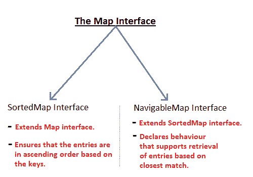

# Java 集合`Map`接口

> 原文：<https://www.studytonight.com/java/map-interface-in-java.php>

映射将数据存储在键和值关联中。键和值都是对象。密钥必须唯一，但值可以重复。尽管映射是集合框架的一部分，但由于它们所具有的某些属性，它们实际上不能被称为集合。然而，我们可以获得映射的**集合视图**。

它提供了各种类: **HashMap、TreeMap、LinkedHashMap** 用于映射实现。所有这些类都实现了映射接口，以向集合提供映射属性。

### 映射接口及其子接口

| 连接 | 描述 |
| **映射** | 将唯一键映射到值。 |
| **映射。入口** | 描述映射中键和值对中的元素。入口是映射的子界面。 |
| **航海图** | 扩展 SortedMap 以处理基于最接近匹配搜索的条目检索 |
| **排序映射** | 扩展映射，以便以升序维护键。 |



### 映射接口方法

这些是映射接口定义的常用方法

*   布尔**包含键**(对象 *k* ):如果映射包含 *k* 作为键，则返回真。否则为假。
*   对象**获取**(对象 *k* ):返回与键 *k* 关联的值。
*   对象**放**(对象 *k* ，对象 *v* ):在映射中存储一个条目。
*   对象**放置所有**(映射 *m* ):将所有来自 *m* 的条目放置在此映射中。
*   设置**键集**():返回包含映射中键的**设置**。
*   设置 **entrySet** ():返回包含映射条目的**设置**。

### HashMap 类

1.  HashMap 类扩展了**抽象映射**并实现了**映射**接口。
2.  它使用一个**`HashMap`**来存储映射。这使得`get()`和`put()`的执行时间保持不变。
3.  HashMap 不维护其元素的顺序。

### HashMap 有四个构造器。

```java
HashMap()
HashMap(Map< ? extends k, ? extends V> m)
HashMap(int capacity)
HashMap(int capacity, float fillratio)
```

### `HashMap`示例

让我们举一个例子来创建 hashmap 并将值存储在键和值对中。注意插入元素，我们使用`put()`方法是因为映射使用 put 来插入元素，而不是我们在列表界面使用的`add()`方法。

```java
import java.util.*;

class Demo
{
  public static void main(String args[])
  {
    HashMap< String,Integer> hm = new HashMap< String,Integer>();
    hm.put("a",100);
    hm.put("b",200);
    hm.put("c",300);
    hm.put("d",400);

    Set<Map.Entry<String,Integer>> st = hm.entrySet();  //returns Set view
    for(Map.Entry<String,Integer> me:st)
    {
      System.out.print(me.getKey()+":");
      System.out.println(me.getValue());
    }
  }
} 
```

a:100 b:200 c:300 d:400

### `TreeMap`类

1.  TreeMap 类扩展了**抽象映射**，实现了**导航映射**界面。
2.  它创建映射，存储在树结构中。
3.  一个**`TreeMap`**提供了一个有效的方法来有效地存储键/值对。
4.  它以排序顺序提供键/值对，并允许快速检索。

### 示例:

在这个例子中，我们正在创建`TreeMap`来存储数据。它使用树来存储数据，并且数据总是按照排序的顺序。见下面的例子。

```java
import java.util.*;

class Demo
{
  public static void main(String args[])
  {
    TreeMap<String,Integer> tm = new TreeMap<String,Integer>();
    tm.put("a",100);
    tm.put("b",200);
    tm.put("c",300);
    tm.put("d",400);

    Set<Map.Entry<String,Integer>> st = tm.entrySet();
    for(Map.Entry<String,Integer> me:st)
    {
      System.out.print(me.getKey()+":");
      System.out.println(me.getValue());
    }
  }
} 
```

a:100 b:200 c:300 d:400

### LinkedHashMap 类

1.  **链接 HashMap** 扩展 **HashMap** 类。
2.  它按照条目插入的顺序维护映射中条目的`LinkedList`。
3.  **链接`HashMap`**定义以下构造器

    ```java
    LinkedHashMap()

    LinkedHashMap(Map< ? extends k, ? extends V> m)

    LinkedHashMap(int capacity)

    LinkedHashMap(int capacity, float fillratio)

    LinkedHashMap(int capacity, float fillratio, boolean order)
    ```

4.  它增加了一个新方法`removeEldestEntry()`。该方法由`put()`和`putAll()`调用，默认情况下，该方法不执行任何操作。

### 示例:

这里我们使用 linkedhashmap 来存储数据。它按照插入顺序存储数据，并在内部使用`LinkedList`。见下面的例子。

```java
  import java.util.*;

class Demo
{
  public static void main(String args[])
  {
    LinkedHashMap<String,Integer> tm = new LinkedHashMap<String,Integer>();
    tm.put("a",100);
    tm.put("b",200);
    tm.put("c",300);
    tm.put("d",400);

    Set<Map.Entry<String,Integer>> st = tm.entrySet();
    for(Map.Entry<String,Integer> me:st)
    {
      System.out.print(me.getKey()+":");
      System.out.println(me.getValue());
    }
  }
} 

```

a:100 b:200 c:300 d:400

* * *