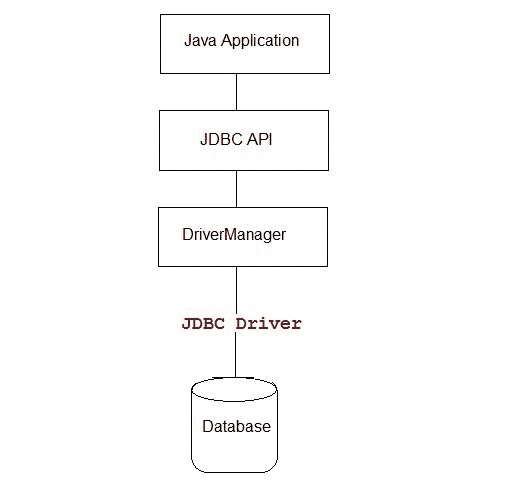
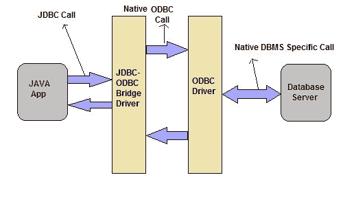
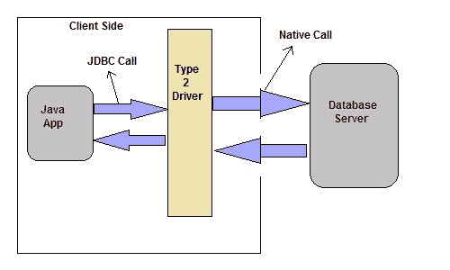
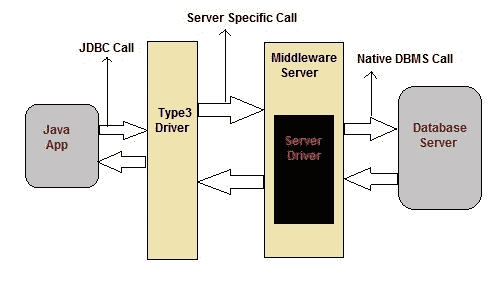
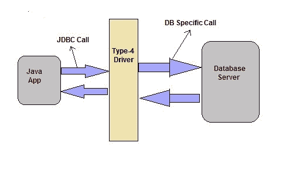

# JDBC 简介

> 原文：<https://www.studytonight.com/java/introduction-to-jdbc.php>

**Java 数据库连接(JDBC)** 是一个**应用编程接口(API)** ，用于连接 Java 应用和数据库。JDBC 用于与各种类型的数据库交互，如甲骨文、微软 Access、我的 SQL 和 SQL Server。JDBC 也可以定义为关系数据库和 Java 编程之间的独立于平台的接口。它允许 java 程序执行 SQL 语句并从数据库中检索结果。

JDBC API 由用于执行各种操作的类和方法组成，如:连接、读取、写入和在数据库中存储数据。在本教程中，我们将通过例子学习 JDBC。

您可以通过下图了解 JDBC 如何将 Java 应用连接到数据库。

### JDBC 4.0 有什么新功能

Java 引入了 **JDBC 4.0** ，这是 JDBC 的高级规范的新版本。它提供了以下高级功能

*   连接管理
*   驱动界面的自动加载。
*   更好的异常处理
*   支持大型对象
*   SQL 查询中的注释。

### JDBC 4.1

JDBC 4.1 版本是随 Java SE 7 一起推出的，包括以下功能:

*   允许使用**资源试用**语句自动关闭**连接、结果集**等类型的资源。
*   引入了**行集工厂**接口和**行集提供程序**类来创建您的 JDBC 驱动支持的所有类型的行集。

### JDBC 4.2

版本与 Java SE 8 一起推出，包括以下功能:

*   REF_CURSOR 支持。
*   增加了一个界面**Java . SQL . drive traction**
*   增加了一个接口 **java.sql.SQLType**
*   增加了一个枚举 **java.sql.JDBCType**
*   添加对大量更新计数的支持
*   改进现有接口:**驱动、驱动管理、数据库元数据**。
*   为 RowSet1.2 增强的接口和类:

### JDBC 4.3

*   增加了对查询文字和简单标识符的语句的支持
*   增加了分片支持
*   增强的连接能够向驱动提供一个请求(一个独立的工作单元)开始或结束的提示
*   增强的数据库元数据，用于确定是否支持分片
*   向驱动管理器添加了方法驱动，以返回当前已加载且可用的 JDBC 驱动流

### JDBC 司机

需要 JDBC 驱动来建立应用和数据库之间的连接。它还有助于处理 SQL 请求和生成结果。以下是 JDBC 提供的不同类型的驱动，应用根据应用的场景和类型使用这些驱动。

*   **1 型驱动**或 **JDBC-ODBC 桥**
*   **类型 2 驱动**或**本地 API 部分 Java 驱动**
*   **3 类驱动**或**网络协议驱动**
*   **4 型驱动器**或**薄型驱动器**

### JDBC-ODBC 桥

**Type-1 驱动**充当 JDBC 和其他数据库连接机制(ODBC)之间的桥梁。该驱动将 JDBC 调用转换为 ODBC 调用，并将请求重定向到 ODBC 驱动。

**注**:在 Java 8 中，JDBC-ODBC 桥已经移除。

**优势**

*   使用方便
*   允许轻松连接到 ODBC 驱动支持的所有数据库。

**劣势**

*   执行时间慢
*   依赖于 ODBC 驱动。
*   使用 Java 本地接口(JNI)进行 ODBC 调用。

### 本机 API 驱动

这种类型的驱动利用了数据库特定的本地客户端 API 上的 Java 本地接口(JNI)调用。这些本地客户端 API 通常用 C 和 C++编写。

**优势**

*   与**1 型驱动器**相比速度更快
*   包含附加功能。

**劣势**

*   需要本机库
*   应用成本增加

### 网络协议驱动

该驱动将 JDBC 调用转换为独立于数据库服务器和中间件服务器特定的调用。中间件服务器进一步将 JDBC 调用转换为数据库特定的调用。

**优势**

*   不需要安装任何本机库。
*   数据库独立性。
*   提供从一个数据库切换到另一个数据库的功能。

**劣势**

*   由于网络呼叫数量增加，速度变慢。

### 瘦驱动

这个驱动被称为纯 Java 驱动，因为。这个驱动直接与数据库交互。它不需要任何本机数据库库，这就是它也被称为瘦驱动的原因。

**优势**

*   不需要任何本机库。
*   不需要任何中间件服务器。
*   性能优于其他驱动。

**劣势**

*   由于网络呼叫数量增加，速度变慢。

### 驱动管理器类

In Java, the DriverManager class it an interface between the User and the Driver. This class is used to have a watch on driver which is been used for establishing the connection between a database and a driver. The DriverManager class have a list of Driver class which are registered and are called as `DriverManager.registerDriver()`.

| 没有。 | 方法 | 描述 |
| one | 公共静态无效注册表驱动(驱动驱动) | 它用于向驱动管理器注册驱动。 |
| Two | 公共静态无效注销驱动 | 它用于使用驱动管理器注销驱动。 |
| three | 公共静态连接 getConnection(字符串 Url) | 它用于建立与给定网址的连接。 |
| four | 公共静态连接获取连接(字符串网址、字符串用户名、字符串密码) | 它用于建立与给定网址、用户名和密码的连接。 |

### 连接接口

在 Java 中，连接接口用于创建应用和数据库之间的会话。该接口包含语句、准备好的语句和数据库元数据。连接对象用于语句和**数据库元数据。提交()、回滚()**等..是连接接口的一些方法。

| 没有。 | 方法 | 描述 |
| one | 公共语句 createStatement() | 它用于创建执行 SQL 查询的语句对象。 |
| Two | 公共语句创建状态(intresultSetType，intresultSetConcurrency) | 它用于根据给定的类型和并发性为结果集创建对象。 |
| three | 公共 void setAutoCommit(布尔状态) | 它用于设置提交状态。默认情况下，它总是正确的。 |
| four | 公共无效提交() | 它用于永久保存已提交或回滚的更改 |
| five | 公共 void 回滚() | 它用于永久删除已提交或回滚的更改 |
| six | 公共无效关闭() | 它用于永久删除已提交或回滚的更改 |

### 语句接口

在 Java 中，语句接口用于使用数据库执行查询。这个接口是结果集的工厂。用于获取结果集的对象。下面给出了这个接口的方法。

| 没有。 | 方法 | 描述 |
| one | public result setexecutequery(SQL 字符串) | 它用于执行选择查询 |
| Two | public inteexec update(SQL 字符串) | 它用于执行任何指定的查询 |
| three | 公共布尔执行(字符串 sql) | 当需要多个结果时使用。 |
| four | public int[] executeBatch() | 它用于执行该批命令。 |

### 结果集接口

在 Java 中，结果集接口用于维护指向表的一行的指针。在开始时，指针在第一行之前。在 createStatement(int，int)中，可以使用类型 _ 滚动 _ 不敏感或类型 _ 滚动 _ 敏感来向前和向后移动对象。下面给出了这个接口的方法。

| 没有。 | 方法 | 描述 |
| one | 公共布尔 next() | 它用于将光标从当前位置移动到下一个位置。 |
| Two | 公共布尔值上一个() | 它用于将光标从当前位置移动到上一个位置。 |
| three | 公共布尔优先() | 它用于将光标从当前位置移动到第一个位置。 |
| four | public booleanlast() | 它用于将光标从当前位置移动到最后一个位置。 |
| five | 公共 booleanalash(int row) | 它用于将光标从当前位置移动到指定位置。 |
| six | 公共 booleanrelative(int row) | 它用于将光标从当前位置移动到相对行号。 |
| seven | public(非列索引) | 它用于从指定位置获取数据。 |
| eight | public intent(string column name) | 它用于从当前行的指定列名中获取数据。 |
| nine | public string string(int column index) | 它用于从当前行的指定列名中获取整数形式的数据。 |
| Ten | public string string(string column index) | 它用于以字符串的形式从当前行的指定列名中获取数据。 |

### PreparedStatement 接口

在 Java 中，PreparedStatement 接口是语句的子接口。它主要用于参数化查询。一个问号(？)传递给值。该问号的值将由 PreparedStatement 设置。下面给出了这个接口的方法。

| 没有。 | 方法 | 描述 |
| one | public void setInt(intparamIndex，int value) | 它用于设置给定参数索引的整数值。 |
| Two | public void setstring(int param index，String value) | 它用于设置给定参数索引的字符串值。 |
| three | 公共 void setFloat(intparamIndex，Float 值) | 它用于设置给定参数索引的浮点值。 |
| four | public void set double(int param index，double value) | 它用于为给定的参数索引设置双精度值。 |
| five | public intexecuteupdate() | 它用于执行查询。 |
| six | public ResultSetexecuteQuery() | 它用于执行选择查询。 |

### 结果集元数据接口

结果集元数据接口用于从结果集对象获取元数据。元数据是关于数据的数据。下面给出了这个接口的方法。

| 没有。 | 方法 | 描述 |
| one | public intgetColumnCount()引发 SQLException | 它用于获取列的总数。 |
| Two | 公共字符串 getColumnName(int 索引)引发 SQLException | 它用于获取指定列索引的列名。 |
| three | public stringetcolumntypename(int index)引发 SQLException | 它用于获取指定索引的列名。 |
| four | public StringgetTableName(int index)引发 SQLException | 它用于从指定的列索引中获取表的名称 |

* * *