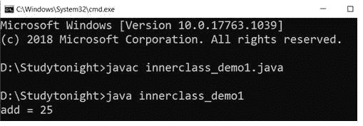

# Java 内部类

> 原文：<https://www.studytonight.com/java/inner-class.php>

* * *

在 Java 中，内部类也称为嵌套类。内部类是嵌套类的一部分。当在嵌套类中定义非静态类时，它被称为内部类。它是在类或接口中定义的。内部类主要用于在一个地方对所有的类和接口进行逻辑分组，这使得代码更加易读和易于管理。内部类可以访问外部类的成员，包括所有私有数据成员和方法。

**语法:**

```java
	 class OuterClass
{  
 //code  
 		class InnerClass
{  
  			//code  
 		}  
} 

```

### 嵌套类的类型

1.  非静态嵌套类
    1.  成员内部类
    2.  匿名内部类
    3.  本地内部类
2.  本地内部类

**以下是可以定义内部类的例子**

### 1.带有静态方法的静态内部类

**示例:**

```java
	 class outer
{
	static class inner
	{
		public static void add(intx,int y)
		{
			int z = x + y;
			System.out.println("add = " + z);
		}
	}
}
class innerclass_demo1
{
	public static void main(String args[])
	{
		outer.inner.add(15,10);
	}
} 

```



### 2.使用非静态方法的静态内部类

**示例:**

```java
	 class outer
{
	static class inner
	{
		public void add(intx,int y)
		{
			int z = x + y;
			System.out.println("add = " + z);
		}
	}
}

class innerclass_demo2
{
	public static void main(String args[])
	{
		outer.innerob = new outer.inner();
		ob.add(12,13);
	}
} 

```


### 3.具有非静态方法的非静态内部类

**示例:**

```java
	 class outer
{
	class inner
	{
		public void add(intx,int y)
		{
			int z = x + y;
			System.out.println("add = " + z);
		}
	}
}

class innerclass_demo3
{
	public static void main(String args[])
	{
		outer ot = new outer();
		outer.inner in = ot.new inner();
		in.add(34,56);
	}
} 

```


### 4.带有静态方法的非静态内部类

**`Note: it is an illegal combination. Only static variables are allowed and should be final.`**

**示例:**

```java
	 class outer
{
	class inner
	{
		/* Illegal combination */
		/*public static void add(intx,int y)
		{
			int z = x + y;
			System.out.println("add = " + z);
		}*/
		public static final int a = 45;
	}
}

class innerclass_demo4
{
	public static void main(String args[])
	{
		outer ot = new outer();
		outer.inner in = ot.new inner();
		System.out.println("Value of a = "+in.a);
	}
} 

```


### 5.局部方法中的嵌套内部类

**示例:**

```java
	 class outer
{
	public void display(intx,int y)
	{
		class inner
		{
			public void add(intx,int y)
			{
				int z = x + y;
				System.out.println("add = " + z);
			}
		}

		inner in = new inner();
		in.add(x,y);
	}	
}

class innerclass_demo5
{
	public static void main(String args[])
	{
		outer ob = new outer();
		ob.display(23,56);
	}
} 

```


* * *

* * *