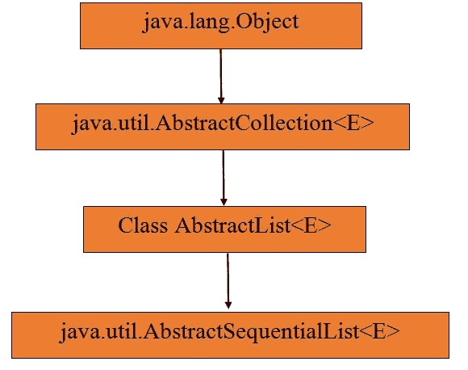
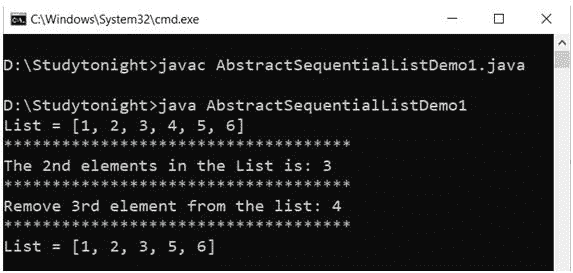

# Java `AbstractSequentialList`

> 原文：<https://www.studytonight.com/java/abstract-sequential-list.php>

* * *

在 Java 中，抽象序列列表类是 Java 集合框架的一部分。`AbstractSequentialList`由集合接口和抽象集合类实现。当列表无法修改时使用。为了实现这个`AbstractList`类，使用了 **get()** 和 **size()** 方法。

* * *

### 下面是类层次结构



**语法:**

```java
	 public abstract class AbstractSequentialList<E>extends AbstractList<E> 

```

* * *

#### **下面是抽象序列列表类**的方法

* * *

| 没有。 | 方法 | 描述 |
| one | 加法(整数索引，E 元素) | 它用于在列表的指定位置添加元素。 |
| Two | 整数索引，集合 c | 它用于在列表的指定位置的指定集合中添加元素。 |
| three | get(int 索引) | 它用于从列表中的指定位置获取元素。 |
| four | 迭代器() | 它返回列表中的所有元素。使用迭代器。 |
| five | 列表迭代器() | 它用于以适当的顺序获取迭代列表。 |
| six | 移除(整数索引) | 它用于从列表中移除指定的元素。 |
| seven | 集合(整数索引，E 元素) | 它用于替换指定元素中的元素。 |

**示例:**

```java
	 import java.util.*; 
public class AbstractSequentialListDemo1 { 
    public static void main(String[] args) 
    { 
AbstractSequentialList<Integer> a = new LinkedList<>(); 
a.add(1); 
a.add(2); 
a.add(3); 
a.add(4);         
a.add(5); 
a.add(6); 
System.out.println("List = "+a); 
	System.out.println("************************************");
	System.out.println("The 2nd elements in the List is: "+ a.get(2)); 
	System.out.println("************************************");
	System.out.println("Remove 3rd element from the list: "+a.remove(3));    
	System.out.println("************************************");
	System.out.println("List = "+a); 
    } 
} 

```



* * *