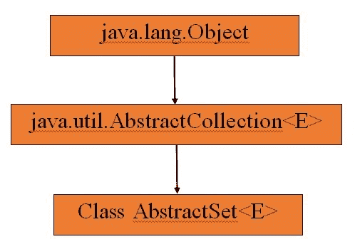
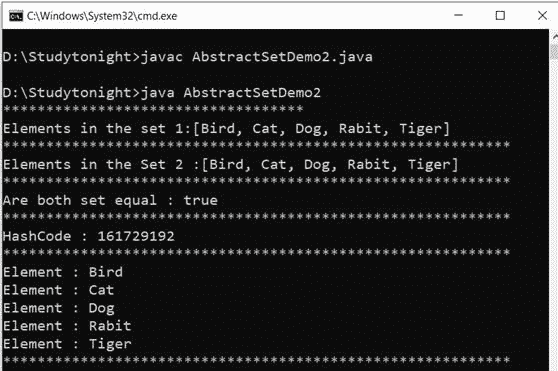

# Java `AbstractSet`

> 原文：<https://www.studytonight.com/java/abstract-set.php>

* * *

在 Java 中，`AbstractSet`类是 Java 集合框架的一部分。`AbstractList`由集合接口和抽象集合类实现。抽象集合类不覆盖抽象集合类，但是可以实现`equals()`和`hashCode()`方法。

* * *

#### **下面是班级层级**



* * *

**语法:**

```java
	 public abstract class AbstractSet<E> extends AbstractCollection<E>implements Set<E> 

```

**示例:**

```java
	 import java.util.*; 
public class AbstractSetDemo1{ 
    public static void main(String[] args) throws Exception 
    { 
        try { 
AbstractSet<string>obj = new TreeSet<string>(); 
obj.add("Red"); 
obj.add("Green"); 
obj.add("Blue"); 
obj.add("Black"); 
obj.add("Orange"); 
System.out.println("AbstractSet: "+ obj); 
            } 
        catch (Exception e) 
	{ 
System.out.println(e); 
        } 
    } 
}</string></string> 

```


* * *

| 没有。 | 方法 | 描述 |
| one | 添加(英、法) | 它用于将元素添加到集合的末尾。 |
| Two | 清除() | 它用于从集合中移除所有元素。 |
| three | 等于(对象 0) | 它用于比较集合中另一个元素的元素。 |
| four | hashCode() | 它用于从集合中获取哈希代码。 |
| five | 迭代器() | 它返回集合中的所有元素。使用迭代器。 |
| six | 列表迭代器() | 它用于以适当的顺序获得迭代集。 |
| seven | 移除(整数索引) | 它用于从集合中移除指定的元素。 |

* * *

**示例:**

```java
	 import java.util.*; 

public class AbstractSetDemo2 { 
    public static void main(String args[]) 
    { 
AbstractSet<String> set = new TreeSet<String>(); 
set.add("Dog"); 
set.add("Cat"); 
set.add("Bird"); 
set.add("Tiger"); 
set.add("Rabit"); 

	System.out.println("***********************************");
System.out.println("Elements in the set 1:" + set);
	AbstractSet<String> set1 = new TreeSet<String>();
	set1.add("Dog"); 
        set1.add("Cat"); 
        set1.add("Bird"); 
        set1.add("Tiger"); 
        set1.add("Rabit"); 
	System.out.println("***********************************************************");
System.out.println("Elements in the Set 2 :" + set1);
	System.out.println("***********************************************************");
	boolean a = set.equals(set1); 
	System.out.println("Are both set equal : "+ a); 
	System.out.println("***********************************************************");	
	int c= set.hashCode();
System.out.println("HashCode : " + c); 
	System.out.println("***********************************************************");
	Iterator e = set.iterator(); 
            while (e.hasNext()) 
		{ 
System.out.println("Element : "+ e.next()); 
		}
	System.out.println("***********************************************************");
	 } 
} 

```



* * *

* * *