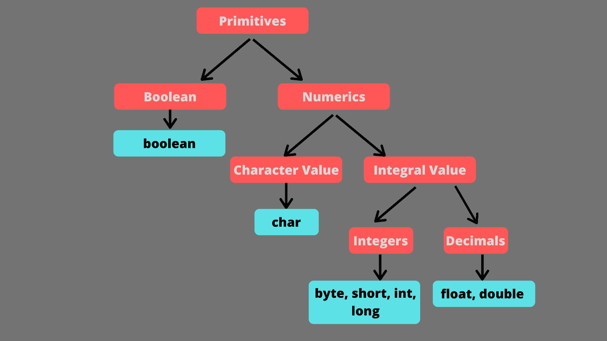

# Java 原始类型

> 原文：<https://www.studytonight.com/java-examples/java-primitives>

基本数据类型是由编程语言提供的基本数据类型。 [Java](https://www.studytonight.com/java/overview-of-java.php) 包含八个原始类型数据。与对象不同，原始类型类型直接**存储在栈内存**中，而不是堆内存中。下图说明了原始数据类型是如何分类的。



## Java 内部原始类型数据类型

int 数据类型(整数的缩写)用于存储整数值。它使用 **32 位**内存，因此值的范围可以从 **-2，147，483，648 (-2^31)到 2，147，483，647 (2^31-1)** 。

对 int 数据类型执行不同的算术运算。请记住，如果我们对小数执行算术运算并将其存储在整型变量中，那么结果的小数部分将丢失。如果没有赋值，int 数据类型采用**默认值 0。**

```java
int i = 5;
```

## Java 字节原始类型数据类型

字节数据类型也用于存储整数，但只能占用 **8 位**的空间(因此得名字节)。数值范围从 **-128 到+127，默认值为零**。

```java
byte b = 5;
```

## Java 短原始类型数据类型

short 也是整数数据类型，使用 **16 位**内存存储整数。这些值的范围可以从 **-32,768(-2^15 到 32,767(2^15–1)**。你可能已经猜到了，**的缺省值也是零**。

```java
short s = 5;
```

## Java 长原始类型数据类型

如果我们需要更多的空间，那么长数据类型是完美的。它使用内存的 **64 位**来存储内存。数值范围从-2^63 到 2^63 - 1 。就像其他整数数据类型一样，其**默认值为零**。它可以与所有标准算术运算符一起工作。

```java
long l = 5;
```

## Java 浮点基本数据类型

浮点数据类型用于存储和处理十进制数值。Float 是单精度数据类型。这意味着在小数点后六位后，数值变得不太精确。

如果精度有问题，建议使用其他十进制类，如`BIgDecimal`。它使用 **32 位**内存。数值范围从 **1.40239846 x 10^-45 到 3.40282347 x 10^38** 。这个范围可以是正的，也可以是负的。**其默认值为 0.0** 。我们需要**在给浮点数据类型变量赋值时指定字母‘f’**。我们需要这样做，因为双精度是小数的默认类型。

```java
float f = 5.0f;
```

## Java 双原始类型数据类型

double 类型用于存储小数，就像 float 一样。但是它使用的是 **64 位**内存，而不是 32 位。与 float 不同，double 使用双精度，因此精度没有限制。这些值的范围从 **4.9406564584124654 x 10^-324 到 1.79793148623157 x 10^308**。这个范围可以是正的，也可以是负的。其**默认值为 0.0** 。

```java
double d = 5.0;
```

## Java 布尔原始数据类型

布尔数据类型属于不同的类别。它只用来存储两个值，**真或假**。只需要一个位来存储这些值，但是 Java 填充该值并将其存储为一个字节。它的默认值是 false。这种类型在控制流语句中非常常用。

```java
boolean t = true;
boolean f = false;
```

## Java 字符基本数据类型

字符数据类型使用 **16 位**内存来存储 Unicode 字符。它的值可以**在 0 到 65535** 之间。在 Unicode 中，这个范围是从 10000 到 5000 的**。char 数据类型的**默认值为 0 或\u0000** 。**

```java
public static void main(String[] args)
{
	char c1 = 67;
	char c2 = 'C';
	System.out.println(c1);
	System.out.println(c2);
	System.out.println(c1 + c2);
}
```

C
C
134

## 基元类型中的上溢和下溢

当值超过其最大定义范围值时，就会发生溢出。同样，如果该值大于指定的最低范围值，则会发生下溢。

在 Java 中，如果我们分配的值不在其范围内，整数和小数可能会溢出或下溢。

对于整数，当溢出发生时，该值将滚动到最小值，计数将从该值开始。

```java
public static void main(String[] args)
{
	int i = Integer.MAX_VALUE;
	System.out.println(i);
	i = i + 1;
	System.out.println(i);
}
```

2147483647
-2147483648

类似地，当整数的下溢发生时，该值翻转到正极端。

```java
public static void main(String[] args)
{
	int i = Integer.MIN_VALUE;
	System.out.println(i);
	i = i - 1;
	System.out.println(i);
}
```

-2147483648
2147483647

## Java 中的自动分类

Java 对每种基本类型都有一个包装类。这些包装类通常与泛型一起使用。我们不需要做任何特殊的事情来将原始类型转换为包装类的对象。Java 自动处理这种转换，这就是所谓的自动装箱。

```java
public static void main(String[] args)
{
	Integer i = 5;
	Byte b = 5;
	Short s = 5;
	Long l = 5L;//Letter L is used as the default type for numbers is int
	Character c = 'C';
	Double d = 5.0;
	Float f = 5.0f;
	Boolean bool = true;
}
```

## 摘要

在本教程中，我们讨论了 Java 中存在的八种基本的原始数据类型。下表总结了讨论的要点。

| **原始类型** | **大小(位)** | **范围** | **默认** |
| （同 Internationalorganizations）国际组织 | Thirty-two | -2^31 至(2^31)-1 | Zero |
| 字节 | eight | -2^7 至(2^7)-1 | Zero |
| 短的 | Sixteen | -2^15 至(2^15)-1 | Zero |
| 长的 | Sixty-four | -2^63 至(2^63)-1 | Zero |
| 漂浮物 | Thirty-two | 最多 7 位小数 | 0.0f |
| 两倍 | Sixty-four | 最多 16 位小数 | Zero |
| 布尔 | one | 对还是错 | 错误的 |
| 茶 | Sixteen | 0 至(2^16)-1 | \u0000 |

* * *

* * *