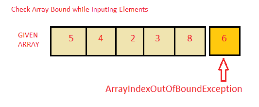

# Java 程序：在数组中输入元素时检查数组边界

> 原文：<https://www.studytonight.com/java-programs/java-program-to-check-array-bounds-while-inputting-elements-into-an-array>

在本教程中，我们将学习如何在向数组中输入元素时检查数组边界。但是在继续之前，如果您不熟悉数组的概念，那么请务必查看 Java 中的文章[数组](https://www.studytonight.com/java/array.php)。



**输入:**

输入数组大小:5

输入数组元素:4 6 2 3 7 8

**输出:**超出数组界限...

## 程序 1:在数组中输入元素时检查数组边界

在这种方法中，我们将看到如何在使用 try catch 块输入数组元素时检查数组边界。使用这种方法背后的逻辑是，首先我们声明一个大小为 n 的数组。然后，我们要求用户给出输入。这里，我们使用一个 try 块进行输入。但是我们要求用户给出的输入大于数组的大小，也就是说，我们要求用户输入 n+1 个元素。因为我们已经声明了大小为 n 的数组，但是我们给出了 n+1 个元素作为输入，所以抛出了 ArrayIndexOutOfBoundsException。这个异常现在由 catch 块处理。因此，用户现在将获得一个输出，声明的元素数量大于数组大小。所以再试一次。

### 算法

1.  开始吧。
2.  声明数组大小。
3.  要求用户初始化数组大小。
4.  声明数组。
5.  采取试捕块。
6.  在尝试块中，要求用户初始化数组元素。
7.  输入大于指定大小的元素。
8.  这将引发 ArrayIndexOutOfBoundsException。
9.  现在捕获块将打印消息“超出数组界限”...再试一次。
10.  停止

下面是相同的代码。

下面的程序演示了如何在使用 Try Catch Block 向数组中输入元素时检查数组边界。

```java
/*Java Program to Check Array Bounds while Inputing elements into an Array*/
import java.util.*; 

public class Main 
{ 
    // Main driver method 
    public static void main(String args[]) 
        throws ArrayIndexOutOfBoundsException 
    { 

        // Taking input from user 
        Scanner sc = new Scanner(System.in); 

        //Ask the user to enter the Array Size
        int n;
        System.out.println("Enter the Array Size ");
        n=sc.nextInt();

        // Storing user input elements in an array 
        int arr[] = new int[n]; 

        System.out.println("Enter more number of elements than the mentioned size ");

        // Try block to check exception 
        try { 
            // Forcefully iteration loop no of times 

            for (int i = 0; i <= n; i++) 
            { 
                arr[i] = sc.nextInt(); 
            } 
        } 
        catch (ArrayIndexOutOfBoundsException e) 
        { 
            // Print message when any exception occurs 
            System.out.println("Array Bounds Exceeded..."); 
            System.out.println("Try Again"); 
        } 
    } 
}
```

输入数组大小 3
输入比所述大小更多的元素数量
3 5 2 1
超出数组界限...
再试一次

## 程序 2:在数组中输入元素时检查数组边界

在这种方法中，我们将使用 while 循环来限制输入的数量。这是在接受用户输入时检查数组边界的最简单方法。使用这种方法背后的逻辑是，我们使用 while 循环来限制用户给出的输入数量。一旦循环变量与数组大小匹配，循环将停止接受输入并显示数组。

### 算法

1.  开始
2.  声明数组大小。
3.  要求用户初始化数组大小。
4.  声明数组。
5.  要求用户初始化数组元素。
6.  走一条试捕道。
7.  在 try 块中，要求用户初始化数组元素。
8.  使用 while 循环进行同样的操作。
9.  输入大于指定大小的元素。
10.  这将引发 ArrayIndexOutOfBoundsException。
11.  现在捕获块将打印消息“超出数组界限”...再试一次。
12.  停止

下面是相同的代码。

下面的程序演示了如何在向数组输入元素时检查数组边界，方法是使用 while 循环限制输入。

```java
/*Java Program to Check Array Bounds while Inputing elements into an Array*/
import java.util.*; 

public class Main 
{ 
    // Main driver method 
    public static void main(String args[]) 
    { 

        // Taking input from user 
        Scanner sc = new Scanner(System.in); 

        //Ask the user to enter the Array Size
        int n;
        System.out.println("Enter the Array Size ");
        n=sc.nextInt();

        // Storing user input elements in an array 
        int arr[] = new int[n]; 

        int i = 0; 

        System.out.println("Enter the Array elements : "); 
        try{
        // Condition check 
            while (true) 
            { 
                if (i == n+1) 

                    // Statement to throw an exception 
                    throw new ArrayIndexOutOfBoundsException(); 
                arr[i++] = sc.nextInt(); 
            } 

        }

        catch (ArrayIndexOutOfBoundsException e) 
        { 
            // Print message when any exception occurs 
            System.out.println("Array Bounds Exceeded..."); 
            System.out.println("Try Again"); 
        } 

    } 
}
```

输入数组大小 5
输入数组元素:7 9 5 6 4 3
超出数组界限...
再试一次

* * *

* * *