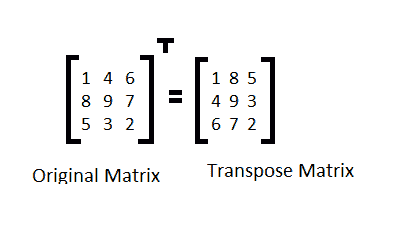

# Java 程序：显示矩阵转置

> 原文：<https://www.studytonight.com/java-programs/java-program-to-display-the-transpose-of-a-matrix>

在本教程中，我们将学习如何显示矩阵的转置。但是在继续之前，如果您不熟悉数组的概念，那么请务必查看 Java 中的文章[数组](https://www.studytonight.com/java/array.php)。



**输入:**输入矩阵元素:

1 2 3

4 5 3

9 3 2

**输出:**转置矩阵为:

1 4 3

2 5 3

3 3 2

## 程序 1:显示矩阵的转置

在这个程序中，我们将使用一个单独的矩阵来存储转置元素。

### 算法

1.  开始
2.  为矩阵行和列声明变量。
3.  要求用户初始化行和列。
4.  声明一个矩阵。
5.  要求用户初始化矩阵元素。
6.  打印原始矩阵。
7.  声明另一个将存储转置矩阵元素的矩阵。
8.  通过改变原始矩阵的行和列来存储转置矩阵中的元素。
9.  显示转置矩阵。
10.  停下来。

下面是相同的代码。

下面的程序演示了如何找到矩阵的转置。

```java
/*JAVA PROGRAM TO DISPLAY THE TRANSPOSE OF A MATRIX*/
import java.util.*;

public class Main
{
     public static void main(String []args)
     {
         ///Take input from the user
         Scanner sc=new Scanner(System.in);

         int m,n;                 //Matrix Size Declaration

         System.out.println("Enter the number of rows: \n");
         m=sc.nextInt();  //Matrix Size Initialization

         System.out.println("Enter the number of column: \n");
         n=sc.nextInt();  //Matrix Size Initialization

         int arr[][]=new int[10][10];        //Matrix Size Declaration
         System.out.println("Enter the elements of the matrix: ");
         for(int i=0;i<m;i++)    //Matrix Initialization
         {
            for(int j=0;j<n;j++)
            {
                 arr[i][j]=sc.nextInt();
            }
         }

         //Print the original Matrix
         System.out.println("The elements in the original matrix are: ");
         for(int i=0;i<m;i++)     //Print the matrix
         {
             for(int j=0;j<n;j++)
             {
                  System.out.print(arr[i][j]+" ");
             }
            System.out.println("");
        }

        int brr[][]=new int[10][10];        //Transpose Matrix Declaration
        for(int i=0;i<m;i++)     //Transpose Matrix initialization
        {
             for(int j=0;j<n;j++)
             {
                 brr[j][i]=arr[i][j];     //Store elements in the transpose matrix
             }
        }

        System.out.println("After transposing the elements are...");
        for(int i=0;i<m;i++)      //Print the transpose matrix
        {
             for(int j=0;j<n;j++)
             {
                 System.out.print(brr[i][j]+" ");
             }
            System.out.println("");
        }

     }
} 
```

输入行数:3
输入列数:3
输入矩阵元素:5 4 3 1 2 6 9 8 7
原矩阵中的元素为:
5 4 3
1 2 6
9 8 7
转置后的元素为...
5 1 9
4 2 8
3 6 7

## 程序 2:显示矩阵的转置

在这个程序中，我们将使用相同的矩阵，但在打印时，我们将改变元素的位置。

### 算法

1.  开始
2.  为矩阵行和列声明变量。
3.  要求用户初始化行和列。
4.  声明一个矩阵。
5.  要求用户初始化矩阵元素。
6.  打印原始矩阵。
7.  要打印转置矩阵，请更改行和列的位置。
8.  显示矩阵。
9.  停止

下面是相同的代码。

下面的程序演示了如何在不使用任何其他数组的情况下显示矩阵的转置。

```java
/*JAVA PROGRAM TO DISPLAY THE TRANSPOSE OF A MATRIX*/
import java.util.*;

public class Main
{
     public static void main(String []args)
     {
         ///Take input from the user
         Scanner sc=new Scanner(System.in);

         int m,n;                 //Matrix Size Declaration

         System.out.println("Enter the number of rows: \n");
         m=sc.nextInt();  //Matrix Size Initialization

         System.out.println("Enter the number of column: \n");
         n=sc.nextInt();  //Matrix Size Initialization

         int arr[][]=new int[10][10];        //Matrix Size Declaration

         System.out.println("Enter the elements of the matrix: ");
         for(int i=0;i<m;i++)    //Matrix Initialization
         {
            for(int j=0;j<n;j++)
            {
                 arr[i][j]=sc.nextInt();
            }
         }

         //Print the original Matrix
         System.out.println("The elements in the original matrix are: ");
         for(int i=0;i<m;i++)     //Print the matrix
         {
             for(int j=0;j<n;j++)
             {
                  System.out.print(arr[i][j]+" ");
             }
            System.out.println("");
        }

        //Print the transpose matrix without creating any new matrix
        System.out.println("After transposing the elements are...");
        for(int i=0;i<m;i++)      
        {
             for(int j=0;j<n;j++)
             {
                 System.out.print(arr[j][i]+" ");
             }
            System.out.println("");
        }

     }
} 
```

输入行数:3
输入列数:3
输入矩阵元素:9 8 7 6 7 2 3 1 3
原矩阵中的元素为:
9 8 7
6 7 2
3 1 3
转置后的元素为...
9 6 3
8 7 1
7 2 3

* * *

* * *