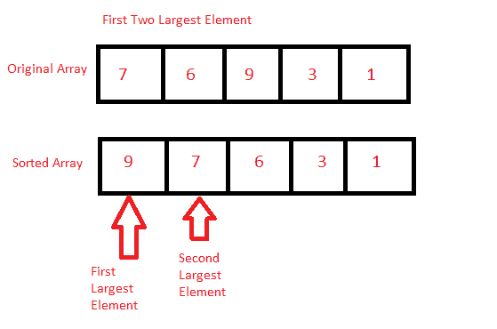

# Java 程序：寻找给定数组中最大的两个数字

> 原文：<https://www.studytonight.com/java-programs/java-program-to-find-the-largest-two-numbers-in-a-given-array>

在本教程中，我们将学习如何找到数组中最大的两个元素。找到两个最大元素的最简单方法是首先对元素进行排序，然后返回存储在第 0 个和第一个索引中的元素。但是在继续之前，如果您不熟悉数组的概念，那么请务必查看 Java 中的文章[数组](https://www.studytonight.com/java/array.php)。



**输入:**输入数组元素:7 6 9 2 4 1 3 6 9

**输出:**第一大= 9

第二大= 7

## 程序 1:寻找数组中最大的两个元素

在这种方法中，我们将在主方法本身中直接找到数组中最大和第二大的元素。

### 算法

1.  开始
2.  声明一个数组。
3.  初始化数组。
4.  在同一个主方法中，检查最大和第二大元素。
5.  声明两个最大的变量，并用数组的第一个和第二个元素初始化它们。
6.  然后通过交换和比较，我们找到最大和第二大元素。
7.  我们再次检查元素以避免重复元素。
8.  显示结果。
9.  停止

下面是相同的代码。

下面的程序演示了如何在不使用函数的情况下找到数组中最大的两个数字。在这个程序中，我们首先声明并初始化数组。然后在主方法本身中，我们声明两个变量，并将前两个元素指定为最大和第二大元素。然后，通过交换和比较，我们找到元素并显示输出。

```java
/*Java Program to directly find the two largest elements in an array*/
import java.util.Scanner;

public class LargestElement
{

     public static void main(String []args)
     {
         Scanner sc=new Scanner(System.in);
         int n;     //Declare array size
         System.out.println("Enter the size of the array");
         n=sc.nextInt();   //Initialize array size

         int arr[]=new int[n];   //Declare array 
        System.out.println("Enter the array");  
        for(int i=0;i<n;i++)     //Initialize array
        {
            arr[i]=sc.nextInt();
        }

        int lar1=arr[0];   //Initialize the first largest element
        int lar2=arr[1];   //Initialize the second largest element

         //Check by swapping elements

               if(lar1<lar2)
                {
                    int temp=lar1;
                    lar1=lar2;
                    lar2=temp;
                }

        for(int i=2;i<n;i++)
        {
            if (arr[i] > lar1)
			{
				lar2 = lar1;
				lar1 = arr[i];
			}
			else if (arr[i] > lar2 && arr[i] != lar1)
			{
				lar2 = arr[i];
			}
        }
        System.out.println("First Largest"+lar1);    //Display the first largest
        System.out.println("Second Largest "+lar2);  //Display the second largest

    }
}
```

输入数组 7 的大小
输入数组 1 5 6 2 3 4 6 6
第一大 6
第二大 5

## 程序 2:寻找数组中最大的两个元素

在这种方法中，我们将使用单独的方法，使用`Arrays.sort()`方法找到数组中最大和第二大的元素。

### 算法

1.  开始
2.  声明一个数组。
3.  初始化数组。
4.  调用一个单独的方法，该方法将显示数组中最大的前两个元素。
5.  声明两个最大的变量，并用数组的第一个和第二个元素初始化它们。
6.  然后通过使用`Array.sort()`首先对数组的元素进行排序。
7.  检查最大和第二大元素。
8.  再次检查重复的元素。
9.  显示结果。
10.  停止

下面是相同的代码。

下面的程序演示了如何使用不同的方法找到数组中最大的两个数字。在这个程序中，我们首先声明并初始化数组。然后我们调用一个方法，声明两个变量，并将前两个元素指定为最大和第二大元素。然后，通过使用`Arrays.sort()`首先对数组进行排序，然后找到两个最大的元素并显示输出。

```java
/*Java Program to find the two largest elements in an array using separate methods*/
import java.util.Scanner;
import java.util.*;

public class LargestElement
{

     static void findLargest(int arr[], int n)      //Method to find the two largest element
     {
        int lar1=arr[0];     //Initialize the first largest
        int lar2=arr[1];     //Initialize the second largest

        //Sort the elements of the array using Array.sort()
               Arrays.sort(arr);
        for(int i=2;i<n;i++)
        {
            if (arr[i] > lar1)
			{
				lar2 = lar1;
				lar1 = arr[i];
			}
			else if (arr[i] > lar2 && arr[i] != lar1)
			{
				lar2 = arr[i];
			}
        }
        System.out.println("First Largest"+lar1);    //Display First Largest
        System.out.println("Second Largest "+lar2);  //Display Second  Largest

     }
     public static void main(String []args)
     {
         Scanner sc=new Scanner(System.in);
         int n;     //Declare array size
         System.out.println("Enter the size of the array");
         n=sc.nextInt();   //Initialize array size

         int arr[]=new int[n];   //Declare array 
        System.out.println("Enter the array");  
        for(int i=0;i<n;i++)     //Initialize array
        {
            arr[i]=sc.nextInt();
        }

        findLargest(arr,n);     

    }
}
```

输入数组 10 的大小
输入数组 4 6 1 2 3 98 6 2 98 1 2
第一大 98
第二大 12

* * *

* * *