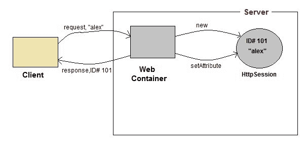
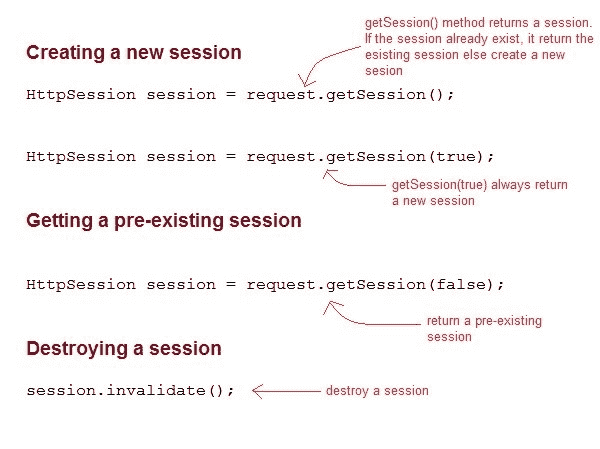

# Servlet：什么是`HttpSession`？

> 原文：<https://www.studytonight.com/servlet/httpsession.php>

**HttpSession** 对象用于存储与特定客户端的整个会话。我们可以存储，检索和删除**对象的属性。任何 servlet 都可以通过**HttpServRequest**对象的`getSession()`方法访问 **HttpSession** 对象。**

* * *

## servlet:HttpSession 如何工作



1.  根据客户端的第一个请求，**网络容器**生成一个唯一的会话标识，并将其作为响应返回给客户端。这是由 web 容器创建的临时会话。
2.  客户端随每个请求发回会话标识。使得 web 容器更容易识别请求来自哪里。
3.  **网络容器**使用该标识，找到与该标识匹配的会话，并将该会话与请求相关联。

* * *

## Servlet: HttpSession 接口



* * *

### Servlet HttpSession 的一些重要方法

| 方法 | 描述 |
| 长`getCreationTime()` | 返回会话创建的时间，以毫秒为单位，自 1970 年 1 月 1 日午夜开始计算。 |
| 弦`getId()` | 返回包含分配给会话的唯一标识符的字符串。 |
| 长`getLastAccessedTime()` | 返回客户端上次发送与会话相关联的请求的时间 |
| int `getMaxInactiveInterval()` | 返回最大时间间隔，以秒为单位。 |
| 作废`invalidate()` | 破坏会话 |
| 布尔值 `isNew()` | 如果会话是新的，则返回 true 否则返回 false |
| 作废`setMaxInactiveInterval(int interval)` | 指定 servlet 容器将使会话无效的时间，以秒为单位。 |

* * *

### 演示 HttpSession 用法的完整示例

下面提到的所有文件都是示例所必需的。

**index.html**

```java
<form method="post" action="Validate">
    User: <input type="text" name="user" /><br/>
    Password: <input type="text" name="pass" ><br/>
    <input type="submit" value="submit">
</form>
```

**web.xml**

```java
 <web-app..>

    <servlet>
        <servlet-name>Validate</servlet-name>
        <servlet-class>Validate</servlet-class>
    </servlet>
    <servlet>
        <servlet-name>Welcome</servlet-name>
        <servlet-class>Welcome</servlet-class>
    </servlet>

    <servlet-mapping>
        <servlet-name>Validate</servlet-name>
        <url-pattern>/Validate</url-pattern>
    </servlet-mapping>
    <servlet-mapping>
        <servlet-name>Welcome</servlet-name>
        <url-pattern>/Welcome</url-pattern>
    </servlet-mapping>

    <welcome-file-list>
        <welcome-file>index.html</welcome-file>
    </welcome-file-list>

</web-app>
```

**Validate.java**

```java
import java.io.*;
import javax.servlet.*;
import javax.servlet.http.*;

public class Validate extends HttpServlet {

    protected void doPost(HttpServletRequest request, HttpServletResponse response)
            throws ServletException, IOException {
        response.setContentType("text/html;charset=UTF-8");

        String name = request.getParameter("user");
        String pass = request.getParameter("pass");

        if(pass.equals("1234"))
        {
            //creating a session
            HttpSession session = request.getSession();
            session.setAttribute("user", name);
            response.sendRedirect("Welcome");
        }
    }
} 
```

**Welcome.java**

```java
import java.io.*;
import javax.servlet.*;
import javax.servlet.http.*;

public class Welcome extends HttpServlet {

    protected void doGet(HttpServletRequest request, HttpServletResponse response)
            throws ServletException, IOException {
        response.setContentType("text/html;charset=UTF-8");
        PrintWriter out = response.getWriter();
        HttpSession session = request.getSession();
        String user = (String)session.getAttribute("user");
        out.println("Hello "+user);
    }
} 
```

* * *

* * *