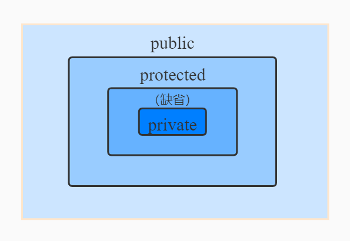

# Java面向对象（上）

## 1. 类和对象的创建

### 1.1 相关概念

属性 = 成员变量 = filed = 域 = 字段

方法 = 成员方法 = 函数 = method

创建类的对象 = 类的实例化 = 实例化类

### 1.2 创建类和对象

（1）创建类

```Java
class 类名 {
  	// 定义属性和成员方法
}
```

（2）创建对象（类的实例化）

```Java
类名 对象名 = new 类名();
```

### 1.3 类和对象的使用

1. 创建类，设计类成员
2. 创建类的对象
3. 通过 `对象.属性` 或 `对象.方法` 调用类结构

**注意**

1. 如果创建了一个类的多个对象，则每个对象都独立的拥有一套类的属性。（非static的）意味着，修改一个对象的属性a，不影响其他对象的a

2. 将p1变量保存的对象:地址值赋给p3,导致p1和p3指向了堆空间中的同一个对象实体。

   ```Java
   Person p3=p1;
   ```

### 1.4 属性(成员变量) vs 局部变量

```Java
class User {
    //成员变量
    String name;
    int age;
    boolean isMale;

    // 局部变量
    public void talk(String language) {
        System.out.println("我们使用" + language + "进行交流");
    }
    public void eat() {
        String food = "烙饼";
        System.out.println("北方人喜欢吃" + food);
    }    
}
```

**相同点**

- 定义变量的格式: 数据类型变量名=变量值
- 先声明，后使用
- 变量都有其对应的作用域

**不同点**

- 在类中声明的位置的不同

  （1）属性:直接定义在类的一对得内

  （2）局部变量：声明在方法内、方法形参、代码块内、构造器形参、构造器内部的变量

- 权限修饰符

  属性：可以在声明属性时，指明其权限，使用权限修饰符

  常用的权限修饰符：`private`、`public`、缺省、`protected`

- 默认初始化值的情况

  （1）属性：类的属性，根据其类型，都具有初始化值。

  - 整型（byte、short、int、long）: `0`
  - 浮点型（float、double）: `0.0`
  - 字符型（char）：`0` 或 `'\u0000'`
  - 布尔型（boolean）：`false`
  - 引用数据类型（类、数组、接口）：`null`

  （2）局部变量：没有默认初始化值，这意味着在调用局部变量之前，一定要显示赋值。特别的，形参在调用时，赋值即可。

- 二者在内存中加载的位置不同

  （1）属性加载到堆空间

  （2）局部变量加载到栈空间

## 2. 类中方法

### 2.1 类中方法的声明和使用

方法：描述类应该具有的功能

比如 `Array`：`sort()`、`binarySearch()`、`toString()`、`equals()`

声明格式

```Java
权限修饰符 返回值类型 方法名(形参列表) {
		方法体
};
```

> static、final、abstract来修饰的方法，后面再讲

```Java
public void eat() {}
public void sleep(int hour) {}
public String getName() {}
public String getNation(String nation) {}
```

### 2.2. 方法声明的说明

1. 关于权限修饰符

   Java规定的4种权限修饰符：`private`、`public`、`缺省`、`protected`

   （封装性再说）

   目前默认方法的权限修饰符为 `public`。
   
2. 返回值类型

   - 有返回值

     方法中必须 `return`

   - 无返回值：`void`

     不能返回。一定要返回，只能 `reutrn;`

3. 方法名：标识符，见名识义。

4. 形参：单个或多个。

5. 方法体：功能。

### 2.3 方法的使用

1. 方法的使用中，可以调用当前类的属性或方法。
2. 方法中不能定义方法。

### 2.4 方法的重载

Overload：在一个类中，允许同名方法的存在，只要其参数的个数或类型不同。

判断是否重载：和方法的权限修饰符、返回值类型、形参名无关，只与参数个数和类型有关。

### 2.5 代码块

代码块在类中声明,类似一个没有名称的方法体。

代码块分为 **实例块** 和 **静态块**。

（1）实例块：每次创建对象时自动调用。

```Java
{
		// 任何符合语法的 Java 代码
}
```

（2）静态块：类加载时自动调用，仅一次，与是否创建对象无关。

```Java
static {
  	// 任何符合语法的 Java 代码
}
```

示例

```Java
public class T2 {
    public static void main(String[] args) {
        Demo d = new Demo();
        System.out.println("-----");
        System.out.println(Demo.num);
        System.out.println("-----");
        Demo d1 = new Demo();

    }
}

class Demo {
    public static int num = 10;
    {
        System.out.println("实例块1");
    }

    {
        System.out.println("实例块2");

    }

    static {
        System.out.println("静态块1");
    }

    static {
        System.out.println("静态块2");
    }
}
```

## 3. 面向对象思想

### 3.1 对象是类的实例化

### 3.2 面向对象编程内容三大主线

① 类及类成员；属性、方法、构造器；代码块、内部类

② 面向对象三大特征：封装、继承、多态

③ 其他关键字：this、super、abstract、interface、final、import、pakage

### 3.3 创建对象三大步

1. 创建类
2. 类的实例化
3. 使用对象

### 3.4 匿名对象

所创建的对象没有赋给变量，而是直接拿来调用。

使用场景：在一个方法或者对象里面暂时性的需要使用该对象。

```Java
PhoneMall mall = new PhoneMall();
mall.show(new Phone());
```

### 3.5 对象数组

当我们需要多个有序的对象时，一个一个去创建太麻烦了，使用 **对象数组** 可以很好解决问题。  
使用步骤：
1. 声明对象数组
2. 循环创建数组中每一个对象

举例：

声明 ObjArray 对象

```Java
class ObjArray {
    private String name;
    private int age;
    ObjArray() {}
    public String getName() {
        return this.name;
    }
    public int getAge() {
        return this.age;
    }
}
```

定义并创建对象数组 

```Java
public class ObjArrayTest {
    public static void main(String[] args) {
        ObjArray[] objs = new ObjArray[10];
        for (int i=0;i<objs.length;i++)
            objs[i] = new ObjArray();
        System.out.println(objs[0].getName()); //null
        System.out.println(objs[1].getAge()); //0
    }
}
```

### 3.6 可变个数形参

方法中可以接收同一类型的多个实参，可变形参形式为：

```
func(数据类型 ... 形参名)
```

类似于：（两者不属于重载关系，不共存）

```Java
func(数据类型[] 形参名)
// 形参为数组
```

可变形参必须放在参数列表末尾。

## 4. 值传递机制

### 4.1 变量的赋值

若变量为基本数据类型，此时赋值的是变量所保存的 **数据值**。

若变量是引用数据类型，此时赋值的是变量所保存的 **地址值**。

### 4.2 值传递机制

方法形参的传递机制：值传递

形参：方法定义时，声明的小括号里的参数

实参：方法调用时，实际传递给形参的数据

值传递机制：

+ 若参数为基本数据类型，则形参接收的实参为实参真实存储的数据值
+ 若变量是引用数据类型，此时形参接收的是实参所保存的 **地址值**。

## 5. 面向对象特征之一：封装与隐藏

### 5.1 问题引入

隐藏对象内部的复杂性，只对外公开简单的接口。便于外界调用，从而提高系统的可扩展性、可维护性。  
通俗的说，**把该隐藏的隐藏起来，该暴露的暴露出来。这就是封装性的设计思想。**

当我们创建一个类的对象以后，我们可以通过 "对象.属性" 的方式对对象的属性进行赋值。这里的赋值操作要受到属性的数据类型和存储范围的制约。除此之外，没有其他制约条件。**但是，在实际问题中，需要给属性添加额外的限制条件，这个条件不能在属性声明时体现，我们只能通过方法进行限制条件的添加。**  
同时，避免用户直接使用 "对象.属性"，即设置 `private`

### 5.2 封装性体现

1. 将类的属性 `xxx` 私有化（`private`），同时，提供公共（`public`）的方法（`getXxx`）来获取和设置（`setXxx`）属性。
2. 不对外暴露私有的方法
3. 单例模式

### 5.3 四种权限修饰符

1. Java规定的四种权限修饰符：`private`、缺省、protected、`public`
2. 4 种权限可以用来修饰类的内部结构：属性、方法、构造器、内部类
3. 修饰类：缺省、public

|修饰符|类内部|同一个包|不同包的子类|同一个工程|
|-|-|-|-|-|
|private|yes||||
|（缺省）|yes|yes|||
|protected|yes|yes|yes||
|public|yes|yes|yes|yes|

图示如下：



## 6. 构造器（构造方法、constructor）

### 6.1 构造器的作用

1. 创建对象
2. 初始化对象的值

### 6.2 说明

1. **如果没有显式的定义类的构造器的话，则系统默认提供一个空参 的构造器**
2. 定义构造器的格式: 权限修饰符类名(形参列表){}
3. 一个类中定义的多个构造器，彼此构成重载
4. 一旦我们显式的定义了类的构造器之后，系统就不在提供默认的空参构造器

### 6.3 JavaBean

- JavaBean 是一种Java语言写成的可重用组件
- 所谓 JavaBean，是指符合如下标准的类：
    - 类是公共的
    - 有一个无参构造器
    - 有属性，属性有对应的get、set方法

### 6.4 UML 类图

1. +表示 public 类型，-表示 private 类型，#表示 protected 类型
2. 方法的写法:  
    方法的类型(+、-)方法名(参数名:参数类型): 返回值类型
3. 若方法有下划线表示为构造器

## 7. 关键字——this 

### 7.1 this 的使用

`this` 理解为当前对象或当前正在创建的对象。  

1. this 可以用来修饰属性、方法、构造器
2. this 修饰属性和方法  
    - 在类的方法中，我们可以使用 `this.属性` 或 `this.方法` 的方式，**调用当前对象属性或方法**。但是，通常情况下，我们都选择省略 `this.`。特殊情况下，如果方法的形参和类的属性同名时，我们必须显式的使用 `this.变量` 的方式，表明此变量是属性，而非形参。  
    - 在类的方法中，我们可以使用 `this.属性` 或 `this.方法` 的方式，**调用当前正在创建对象属性或方法**。但是，通常 情况下，我们都选择省略 `this.`。特殊情况下，如果方法的形参和类的属性同名时，我们必须显式的使用 `this.变量` 的方式，表明此变量是属性，而非形参。
3. this 调用构造器      
    构造器中可以调用构造器，使用 `this()` 实现。  
    当构造器中有些操作与其他构造器中的一些内容有重复的是时候，就可以在构造器中调用其他构造器，防止冗余。
4. 如果一个类中有 n 个构造器，则最多有 n - 1 构造器中使用 了"this (形参列表)'
5. 规定: **"this (形参列表) "必须声明在当前构造器的首行**

## 8. pakage 关键字

1. 为了更好的 **实现项目中类的管理，提供包的概念**
2. 使用 pakage 声明类或接口所属的包，声明在源文件的首行。
3. 包，属于标识符，遵循一定规范，见名知意。
4. 每出现一次 `.`，则代表一层文件目录。
5. 同一个包下，不允许命名同名接口、类。  
    不同包下可以。

## 9. import 关键字

1. 在源文件中显示的使用 `import` 结构导入指定包下的类、接口。
2. 声明在包的声明和类的声明之间。
3. 若导入多个结构，则并列写出即可。
4. 使用 `xxx.*` 的格式，表示导入该包下所有类。
5. 若使用的类、接口是在 `Java.lang` 包下的，则不需要导入包。
6. 使用的类是本包下定义的，则无需导入。
7. 若源文件中，使用了不同包下的同名类，则必须有一个类需要以全类名（包含包名）的形式定义。
8. 使用 `xxx.*` 的方式表明可以调用 xxx 包下的所有结构。但是如果使用的是 xxx 子包下的结构，则仍需要显
使用 `xxx.*` 方式表明可以调用 xxx 包下的所有结构。**但是如果使用的是 xxx 子包下的结构，则仍需要显式导入。**
9. `import static` 导入指定类或接口中的静态结构: 属性或方法。
```Java
import static Java.lang.System.*;
out.println(123);
```
