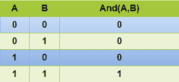

# NumPy `bitwise_and()`函数

> 原文：<https://www.studytonight.com/numpy/numpy-bitwise_and-function>

在本教程中，我们将介绍 Numpy 库中的`bitwise_and`二进制运算。

在 Numpy 中，`bitwise_and()`功能主要用于执行`bitwise_and`操作。

*   该函数将按元素计算两个数组的位与。

*   `bitwise_and()`函数计算输入数组中整数的底层二进制表示的**位“与”。**

让我们来看看“与”运算的**真值表:**

如果且仅当两个位都为 1，则两个位的“与”结果的输出为 1，否则为 0。



### `bitwise_and()`的语法:

使用该函数所需的语法如下:

```py
numpy.bitwise_and(x1, x2, /, out, *, where=True, casting='same_kind', order='K', dtype,subok=True[, signature, extobj]) = <ufunc 'bitwise_and'>
```

**参数:**

现在让我们看看这个函数的参数:

*   **x1，x2**
    这两个是输入数组，这个函数只处理整数和布尔类型。如果`x1.shape != x2.shape`，那么它们必须可宽铸为一个共同的形状(并且这个形状将成为输出的形状)。

*   **out**
    该参数主要表示结果存储的位置。如果提供了此参数，它必须具有输入广播到的形状。如果未提供该参数或该参数为**无**，则返回新分配的数组。

*   **其中**
    该参数用于指示通过输入广播的条件。在条件为**真**的位置，*输出*数组将被设置为 b 结果，否则输出数组将保留其原始值。

**返回值:**

如果 **x1** 和 **x2** 都是标量，该函数将返回一个标量。

## 例 1:

在下面的例子中，我们将说明`bitwise_and()`函数的用法:

```py
import numpy as np

num1 = 15
num2 = 20

print ("The Input  number1 is :", num1)
print ("The Input  number2 is :", num2) 

output = np.bitwise_and(num1, num2) 
print ("The bitwise_and of 15 and 20 is: ", output) 
```

输入数字 1 是:15
输入数字 2 是:20
15 和 20 的位“与”是:4

## 例 2:

在下面的例子中，我们将对两个数组应用`bitwise_and()`函数:

```py
import numpy as np

ar1 = [2, 8, 135]
ar2 = [3, 5, 115]

print ("The Input array1 is : ", ar1) 
print ("The Input array2 is : ", ar2)

output_arr = np.bitwise_and(ar1, ar2) 
print ("The Output array after bitwise_and: ", output_arr)
```

输入数组 1 为:[2，8，135]
输入数组 2 为:[3，5，115]
按位“与”后的输出数组:[2 0 3]

## 摘要

在本教程中，我们介绍了 NumPy 库的`bitwise_and()`功能。我们介绍了它的基本语法和参数，然后介绍了这个函数返回的值以及这个函数的一些例子。

* * *

* * *