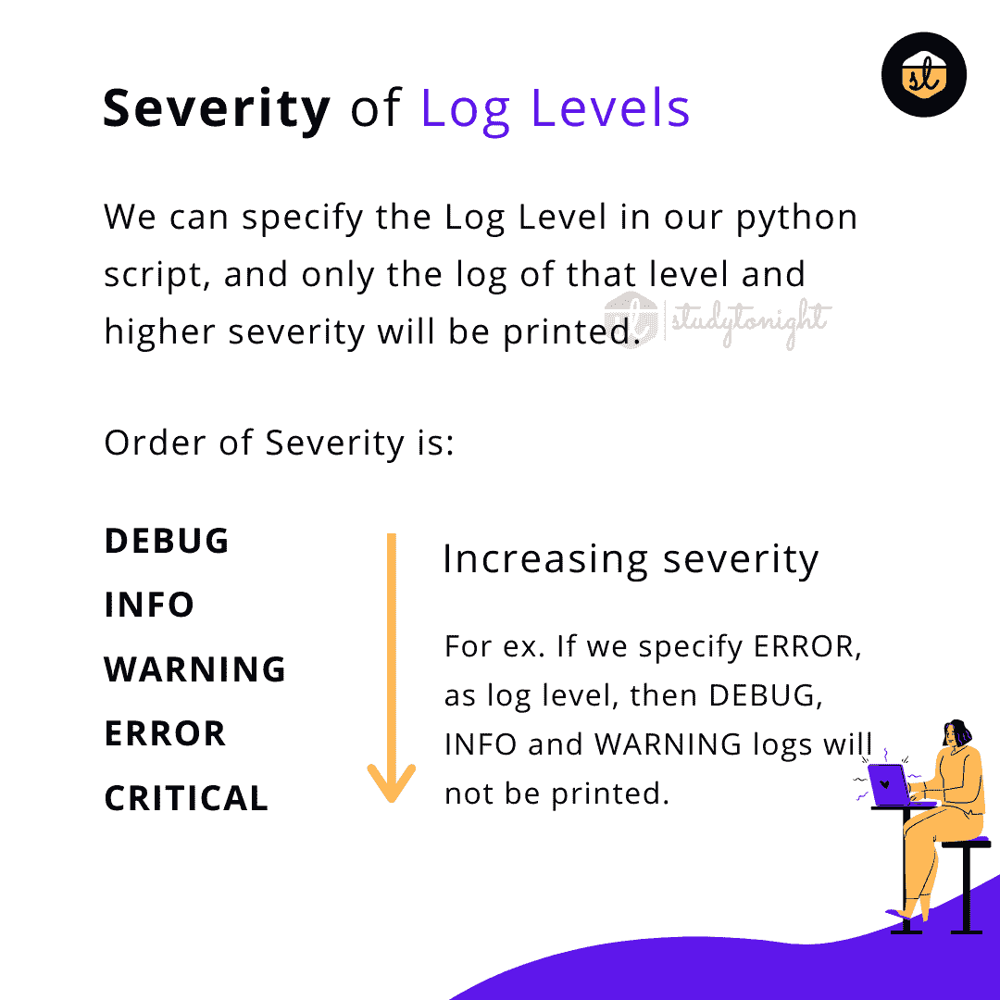

# 在 Python `logging`模块中打印日志

> 原文：<https://www.studytonight.com/python/python-logging>

在本教程中，我们将学习**什么是日志记录？**(日志记录基础知识)，如何在 python 中打印日志以及打印日志时应该使用的**不同日志级别**。

首先，让我们讨论什么是日志。

## 什么是日志记录？

日志基本上是任何程序/脚本运行时**跟踪事件(正在发生什么)的一种方式。软件开发人员在他们的软件中添加了日志调用，以在软件代码执行期间**打印有用的步骤**以及一些信息，这些信息可以在以后用于跟踪代码执行。**

*   适当的日志记录可以帮助**你更好地理解程序的流程**，并且它非常有助于**发现那些你在开发过程中可能没有想到的场景**。

*   日志在**调试**问题中非常重要。

*   在日志的帮助下，开发人员有了一双额外的眼睛来观察应用的流程。日志可以存储信息，比如哪个**用户 ID 或者哪个 IP** 正在访问应用。

*   通过在软件应用中记录有用的数据和**度量**，您不仅可以轻松调试错误，还可以使用**数据分析应用的性能**来计划扩展。

*   一个**事件**被描述为一个**描述性消息**，它可以**可选地包含可变数据**(即，对于事件的每次发生，数据主要是不同的)。

*   打印的事件或日志也有一个**重要性**也称为**日志级别**，我们将在本教程的后面部分介绍。

许多初学者在 python 代码中使用`print()`方法来打印语句和变量，调试代码。

使用日志来做到这一点是正确的方法。

## Python `logging`模块

**`logging`模块**是 Python 中的一个**内置模块**，功能强大，随时可以使用。该模块**允许将日志**写入**文件或控制台**或任何其他输出流。

这个模块被很多**第三方 Python 库**使用。因此，如果您的 python 项目使用许多第三方库，那么您可以使用`logging`模块，这样日志处理在您的项目和您正在使用的第三方库中可以是相同的。

要使用本模块，您只需编写以下内容:

```py
import logging
```

导入`logging`模块后，可以使用`logging`模块提供的各种方法打印日志。

## 不同级别的日志消息

在`logging`模块中，默认有 5 个标准级别，主要指示事件的**严重性。此外，日志记录函数以级别命名。**

这些级别按严重程度的递增顺序如下所示:



让我们在下表中逐一讨论每个级别的含义:

| **级** | **使用时间** |
| 调试 | 该级别主要用于提供**详细信息**，一般只有在**调试问题**时才有兴趣。 |
| 信息 | 这个级别用来确认事情是否按预期进行。只是平常的信息。 |
| 警告 | 这个级别告诉**发生了意想不到的事情**但不要太严重，可能会影响程序/软件的正常运行。 |
| 错误 | 这应该用于记录更严重的问题**，如导致**功能被破坏的错误或异常**。** |
| 批评的 | 该级别表示**超级严重错误**，如**应用未启动**或**数据库不可用**建立连接等。 |

您可以在 python 代码中使用所有类型的日志级别来记录不同的信息。

但是将打印什么日志，取决于日志配置。

需要注意的是**默认级别**为`WARNING`，这意味着只跟踪该级别及以上的事件，分别为:**警告**、**错误**和**严重**。

## Python 日志记录方法

对于简单的日志使用，有一些方便的功能，如`debug()`、`info()`、`warning()`、`error()`和`critical()`。让我们一个接一个地讨论它们:

| **如何登录？** | **要执行的任务** |
| `print()`方法 | 如果您想在控制台上显示用户信息的正常消息。 |
| `warning.warn()`和`logging.warn()` | 记录关于特定运行时事件的警告。如果**问题是可避免的**，并且必须进行更改以消除警告，则在 python 代码中使用`warning.warn()`方法。`logging.warning()`方法用于出现一些小问题/错误的情况，这些小问题/错误对代码的运行没有任何**直接影响，但必须进行跟踪，因为它可能会在以后导致问题。比如模块版本不匹配等。** |
| [引发错误/异常](/python/introduction-to-error-exception-python) | 以便报告关于特定运行时事件的错误。 |
| `logging.error()`或`logging.critical()` | 如果您想在不引发异常的情况下报告错误。如果你已经在 python 中做了正确的[异常处理，但是你仍然必须记录处理的异常，以便以后可以发现和修复它。](/python/exception-handling-python)`logging.critical()`可用于程序启动失败或数据库连接失败等关键错误。 |
| `logging.info()`或`logging.debug()` | `logging.info()`方法可用于报告程序正常运行期间发生的事件(例如，用于状态监控或故障调查)。`logging.debug()`专门用于诊断目的的非常详细的输出。 |

## Python 日志记录基本示例

让我们举一个基本的例子，我们将打印对应于不同日志级别的日志消息:

```py
import logging

logging.debug('It is a debug message')	# it will not be printed
logging.info('It is an info message')	# not printed
logging.warning('OOPs!!! It is a warning')	# it will be print because it is default level
logging.error('Oops !! an error message')	# will be printed 
logging.critical('Oh!!!! it is a critical message')	# will be printed
```

警告:根:哎呀！！！这是一个警告错误:根:哎呀！！错误消息 CRITICAL:root:哦！！！！这是一个重要的信息

上面的输出显示了每个**消息**之前的严重级别以及`root`，这是日志记录模块给其**默认日志记录程序**的名称。

上面的输出格式显示了**级别、名称和消息**，并用冒号(`:`)隔开，是**日志的默认格式**(我们可以更改格式)。

需要注意的是`debug()`和`info()`消息**没有被记录**。这是因为，默认情况下，日志记录模块记录的消息具有**严重级别****警告**或以上，正如我们已经提到的。

如果您愿意，也可以通过配置`logging`模块来记录所有级别的事件来改变这一点。

* * *

* * *