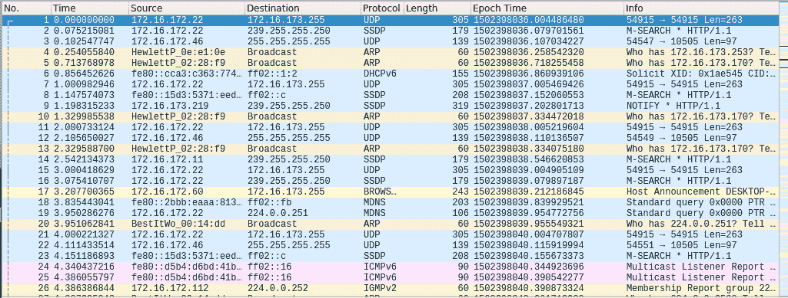

# Wireshark 网络流量分析

> 原文：<https://www.studytonight.com/network-programming-in-python/introduction-to-wireshark>

在开始讨论 Wireshark 之前，让我们先了解一下什么是网络流量，以及如何计算网络流量。

* * *

## 什么是网络流量？

**网络流量**或**网络数据**是在任何给定时间点通过网络传输的数据(数据包)量。

> `Traffic volume = Traffic Intensity * Time`

那么，网络流量是怎样的:

上面是一张截图，显示了网络上随数据包一起发送的所有信息。它包括以下几个信息:

*   **时间**:捕获数据包的时间。
*   **来源**:数据包来源。
*   **目的地**:数据包最终到达的接收器。
*   **协议**:数据包在途中遵循的互联网协议(或规则集)类型，如:`TCP`、`UDP`、`SMTP`、`ARP`等。
*   **信息**:数据包包含的信息。一般来说，信息被加密的原因很明显。但在某些情况下，它也是未加密的，但这是罕见的。

* * *

## 什么是 Wireshark？

根据维基百科*“Wireshark 是一个免费的开源数据包分析器。它用于网络故障排除、分析、软件和通信协议开发以及教育。”*

基本上，Wireshark 是一个分析网络流量的开源工具，或者简单地说，Wireshark 从局域网线路、实时网络连接或从已经捕获的数据包文件中读取数据。实时数据可以从不同类型的网络中读取，包括以太网、IEEE 802.11、PPP 和环回。

我们可以为捕获的流量创建一个`tcpdump`文件。Wireshark 允许您以多种扩展名保存文件，但出于我们的目的，我们将使用`.pcap`扩展名。这是最广泛使用的格式。

**使用 Wireshark 捕获的网络流量**

* * *

* * *