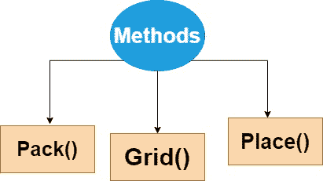
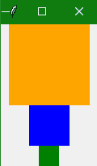
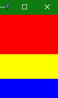
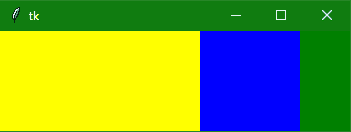
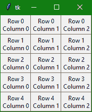
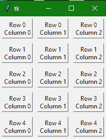
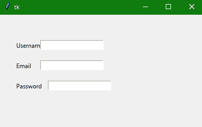

# Tkinter 几何管理器

> 原文：<https://www.studytonight.com/tkinter/python-tkinter-geometry-manager>

在本教程中，我们将学习如何在 Tkinter **几何管理器**的帮助下控制应用的**布局。**

## 控制 Tkinter 应用布局

为了**组织或排列或放置父窗口中的所有小部件**，Tkinter 为我们提供了小部件的**几何配置**。图形用户界面应用布局主要由 Tkinter 的几何管理器控制。

这里需要注意的是，应用中的每个窗口和`Frame`只能使用一个几何管理器。此外，**不同的框架**可以使用不同的几何图形管理器，即使它们已经使用另一个几何图形管理器分配给一个框架或窗口。

几何管理器中主要有三种方法:



让我们逐一详细讨论每种方法。

## 1.Tkinter `pack()`几何图形管理器

`pack()`方法主要使用**打包算法**，以便按照指定的顺序在`Frame`或窗口中放置小部件。

这种方法主要用于**将小部件组织在一个块**中。

### 打包算法:

打包算法的步骤如下:

*   首先，该算法将**计算一个矩形区域**，称为**包裹**，该区域足够高(或宽)以容纳小部件，然后它将使用**空白空间**填充窗口中的剩余宽度(或高度)。

*   它将使小部件居中，直到指定了任何不同的位置。

这种方法很强大，但很难想象。

以下是使用`pack()`函数的**语法**:

```py
widget.pack(options) 
```

下面给出了作为该方法参数的可能选项:

*   **fill**

    该选项的默认值设置为**无**。此外，我们可以将其设置为 **X 或 Y** ，以确定**小部件是否包含任何额外空间**。

*   **side**

    该选项指定将小部件包装在的哪一侧。如果要垂直打包**小部件**，使用 **TOP** ，这是默认值。如果要水平打包**小部件**，使用**左键**。

*   **expand**

    该选项用于**指定是否应该扩展小部件以填充几何主图形中的任何额外空间**。其默认值为`false`。如果是`false`，则**小部件不展开**，否则小部件会展开以填充额外的空间。

### Tkinter `pack()`几何图形管理器示例:

让我们讨论一个例子，在这个例子中，我们将看到当您将三个彩色的小部件(这里是 [Tkinter Frame 小部件](https://www.studytonight.com/tkinter/python-tkinter-frame))放入一个窗口时会发生什么:

```py
import tkinter as tk

win = tk.Tk()

# add an orange frame
frame1 = tk.Frame(master=win, width=100, height=100, bg="orange")
frame1.pack()

# add blue frame
frame2 = tk.Frame(master=win, width=50, height=50, bg="blue")
frame2.pack()

# add green frame
frame3 = tk.Frame(master=win, width=25, height=25, bg="green")
frame3.pack()

window.mainloop()
```



根据上面代码的输出，`pack()`方法只是默认将每个`Frame`放置在**前面的**下面，按照它们被分配到窗口的相同**顺序。**

### 带参数的 Tkinter `pack()`

让我们再举几个使用此函数参数的代码示例，如`fill`、`side`和`expand`。

您可以设置 **`fill`** 参数，以指定您希望帧填充的**方向。如果要填充**水平**方向，则选项为`tk.X`，反之，`tk.Y` 用于**垂直填充**，双向填充`tk.BOTH`。**

让我们举另一个例子，我们将堆叠三个框架，使每个框架水平填充整个窗口:

```py
import tkinter as tk

win= tk.Tk()

frame1 = tk.Frame(master=win, height=80, bg="red")
# adding the fill argument with 
# horizontal fill value
frame1.pack(fill=tk.X)

frame2 = tk.Frame(master=win, height=50, bg="yellow")
frame2.pack(fill=tk.X)

frame3 = tk.Frame(master=win, height=40, bg="blue")
frame3.pack(fill=tk.X)

win.mainloop()
```



在上面的输出中，您可以看到帧填满了应用窗口的整个宽度，因为我们使用了`fill`参数的`tk.X`值。

现在让我们举另一个代码示例，我们将使用所有选项，即`fill`、`side`和`pack()`方法的`expand`选项:

```py
import tkinter as tk

win = tk.Tk()

frame1 = tk.Frame(master=win, width=200, height=100, bg="Yellow")
# setting fill, side and expand
frame1.pack(fill=tk.BOTH, side=tk.LEFT, expand=True)

frame2 = tk.Frame(master=win, width=100, bg="blue")
frame2.pack(fill=tk.BOTH, side=tk.LEFT, expand=True)

frame3 = tk.Frame(master=win, width=50, bg="green")
frame3.pack(fill=tk.BOTH, side=tk.LEFT, expand=True)

win.mainloop()
```



如果您将在系统中运行上面的代码，那么您可以看到这个输出能够双向扩展。

## 2.Tkinter `grid()`几何图形管理器

最常用的几何管理器是`grid()`，因为它提供了`pack()`功能的所有功能，但方式更简单、更易维护。

`grid()`几何管理器主要用于将窗口或框架拆分为行和列。

*   只需调用`grid()`函数，并将**行**和**列索引**分别传递给`row`和`column`关键字参数，即可**轻松指定小部件**的位置。

*   行和列的索引都从`0`开始，所以 **2** 的行索引和 **2** 的列索引告诉`grid()`函数在第三行的**第三列放置一个小部件(0 表示第一，1 表示第二，2 表示第三)。**

以下是`grid()`函数的**语法**:

```py
widget.grid(options) 
```

下面给出了作为该方法参数的可能选项:

*   **栏**

    此选项指定要放置小部件的列号。**最左侧**列的索引为 **0** 。

*   **行**

    此选项指定要放置小部件的行号。最上面的**行由 **0** 表示。**

*   **柱跨**

    此选项指定小部件的宽度。它主要表示列扩展到的列数。

*   **行跨度**

    此选项指定小部件的高度。它主要表示行扩展到的行数。

*   **帕德克斯，帕德**

    该选项主要表示要添加到小部件边框外的**小部件的填充像素数量。**

*   **ipad，ipad**

    该选项主要用于表示小部件边框内要添加到小部件**的填充像素数量。**

*   **粘性**

    如果任意单元格大于一个小部件，那么粘性主要是**用来指定小部件在单元格内的位置。**基本上是代表小部件位置的粘性字母的串联。可能是北、东、西、南、东北、西北、南北、东西、东南。

### Tkinter `grid()`几何图形管理器示例:

下面的代码脚本将帮助您创建一个由框架组成的 **5 × 3 网格**，其中包含`Label`小部件:

```py
import tkinter as tk

win = tk.Tk()

for i in range(5):
    for j in range(3):
        frame = tk.Frame(
            master = win,
            relief = tk.RAISED,
            borderwidth = 1
        )
        frame.grid(row=i, column=j)
        label = tk.Label(master=frame, text=f"Row {i}\nColumn {j}")
        label.pack()

win.mainloop()
```



如果您想要**添加一些填充**，那么您可以使用以下代码片段来完成:

```py
import tkinter as tk

win = tk.Tk()

for i in range(5):
    for j in range(3):
        frame = tk.Frame(
            master=win,
            relief=tk.RAISED,
            borderwidth=1
        )
        frame.grid(row=i, column=j, padx=5, pady=5)
        label = tk.Label(master=frame, text=f"Row {i}\nColumn {j}")
        label.pack()

win.mainloop()
```



正如您在上面的代码示例中看到的，我们使用了`padx`和`pady`参数，因为这些参数在小部件外部应用了填充。要在框架小部件中添加填充，请在代码中使用参数`ipadx`和`ipady`。

同样，也要尝试为`grid()`几何图形管理器使用其他参数。

## 3.韦小宝`place()`几何经理

`place()`几何管理器组织小部件，按照程序员的指示将它们放置在特定位置。

*   这个方法基本上是**按照其 **x 和 y 坐标**来组织小部件**。x 和 y 坐标都以**像素**为单位。

*   因此原点(其中`x`和`y`都是`0`)是`Frame`的**左上角**或者窗口。

*   因此，`y`参数指定了距离窗口顶部的空间的**像素数，以放置小部件，`x`参数指定了距离窗口左侧**的**像素数。**

以下是`place()`方法的**语法**:

```py
widget.place(options)
```

下面给出了作为该方法参数的可能选项:

*   **x，y**

    该选项以像素为单位指示**水平和垂直**偏移。

*   **高、宽**

    该选项以像素为单位表示小部件的**高度和重量**。

*   **锚**

    该选项主要表示小部件在容器内的**精确位置**。默认值(方向)是**西北**即(左上角)。

*   **妓院模式**

    该选项表示边框类型的**默认值为`INSIDE`，也是指忽略边框内的父元素。另一种选择是`OUTSIDE`。**

*   **relx，依靠**

    该选项用于表示 0.0 到 1.0 之间的浮动，是水平和垂直方向上的**偏移量。**

*   继电器高度，继电器宽度

    该选项用于表示 0.0 到 1.0 之间的浮点值，表示**父代的高度和宽度**的分数。

### Tkinter `place()`几何图形管理器示例:

下面给出了这方面的代码片段:

```py
from tkinter import *
top = Tk()  
top.geometry("400x250")  
Username = Label(top, text = "Username").place(x = 30,y = 50)  
email = Label(top, text = "Email").place(x = 30, y = 90)  
password = Label(top, text = "Password").place(x = 30, y = 130)  
e1 = Entry(top).place(x = 80, y = 50)  
e2 = Entry(top).place(x = 80, y = 90)  
e3 = Entry(top).place(x = 95, y = 130)  
top.mainloop() 
```



在上面的代码示例中，我们使用了 [Tkinter 标签](http://studytonight.com/tkinter/python-tkinter-label)和 [Tkinter 输入小部件](http://studytonight.com/tkinter/python-tkinter-entry)，我们将在接下来的教程中详细介绍它们。

## 总结:

在本教程中，我们学习了如何在图形用户界面应用的框架或窗口中定位小部件。我们了解了三个 Tkinter 几何管理器，即 pack()，grid()和 place()。

从下一个教程开始，我们将开始介绍不同的 Tkinter 小部件。

* * *

* * *